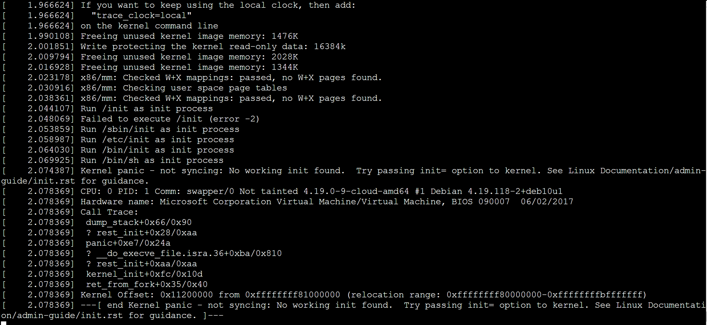
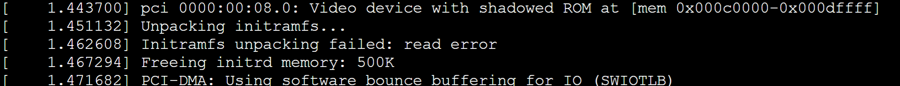

# Use Azure Linux Auto Repair (ALAR) to fix a Linux VM

**Applies to:** :heavy_check_mark: Linux VMs

The next time that you have to run a repair on your Azure Linux virtual machine (VM), you can automate the job by putting the Azure Linux Auto Repair (ALAR) scripts to work for you. You no longer have to run the job manually. These scripts simplify the recovery process and enable even inexperienced users to recover their Linux VM easily.

ALAR utilizes the VM repair extension that's described in [Repair a Linux VM by using the Azure Virtual Machine repair commands](./repair-linux-vm-using-azure-virtual-machine-repair-commands.md).

ALAR covers the following repair scenarios:

- Malformed /etc/fstab
    syntax error
    missing disk
- Damaged initrd or missing initrd line in the /boot/grub/grub.cfg
- Last installed kernel isn't bootable
- Serial console and GRUB serial are incorrectly configured or are missing
- GRUB/EFI installation or configuration damaged

## The ALAR actions

### fstab

This action strips off any lines in the */etc/fstab* file that aren't needed to boot a system. First, a copy of the original file is made for reference. When the OS starts, the administrator can edit the fstab to correct any errors that didn't allow a reboot of the system before.

For more information about issues with a malformed */etc/fstab* file, see [Troubleshoot Linux VM starting issues because fstab errors](./linux-virtual-machine-cannot-start-fstab-errors.md).

### kernel

This action changes the default kernel. The script replaces the broken kernel with the previously installed version.

For more information about messages that might be logged on the serial console for kernel-related startup events, see [How to recover an Azure Linux virtual machine from kernel-related boot issues](kernel-related-boot-issues.md).

### initrd

This action can be used to fix an initrd or initramfs that is either corrupted or incorrectly created.

To get the initrd or initramfs created correctly, add the modules `hv_vmbus`, `hv_netvsc`, and `hv_storvsc` to the image.

Initrd-related startup problems can appear as the following logged symptoms.




In both cases, the following information is logged before the error entries are logged.



### serialconsole

This action corrects an incorrect or malformed serial console configuration for the Linux kernel or GRUB. We recommend that you run this action in the following cases:

- No GRUB menu is displayed at VM startup.
- No operating system related information is written to the serial console.

### grubfix

This action can be used to reinstall GRUB and regenerate the *grub.cfg* file.

### efifix

This action can be used to reinstall the required software to boot from a GEN2 VM. The *grub.cfg* file is also regenerated.

### auditd

If your VM shuts down immediately upon startup due to the audit daemon configuration, use this action. This action modifies the audit daemon configuration (in the */etc/audit/auditd.conf* file) by changing the `HALT` value configured for any `action` parameters to `SYSLOG`, which doesn't force the system to shut down. In a Logical Volume Manager (LVM) environment, if the logical volume that contains the audit logs is full and there's available space in the volume group, the logical volume will also be extended by 10% of the current size. However, if you're not using an LVM environment or there's no available space, only the configuration file is altered.

> [!IMPORTANT]
> This action will change the VM's security posture by altering the audit daemon configuration so that the VM shutdown issue can be resolved. Once the VM is running and accessible, you need to revert the audit daemon configuration to the original state. For this purpose, a backup of the *auditd.conf* file is created in */etc/audit* by the ALAR action.

## How to use ALAR

The ALAR scripts use the repair extension `run` command and its `--run-id` option. The value of the `--run-id` option for the automated recovery is `linux-alar2`. To fix a Linux VM by using an ALAR script, follow these steps:

> [!IMPORTANT]
> The VM Contributor role doesn't provide enough permissions to run the scripts, as they require permissions to read, write, and delete resources in the resource group that includes the target VM. Therefore roles such as Contributor or Owner at that resource group level are required.

1. Create a rescue VM:

    ```azurecli-interactive
    az vm repair create --verbose -g RG-NAME -n VM-NAME --repair-username RESCUE-UID --repair-password RESCUE-PASS --copy-disk-name DISK-COPY
    ```
2. Run a script with one of the ALAR actions on the rescue VM:

    ```azurecli-interactive
    az vm repair run --verbose -g RG-NAME -n VM-NAME --run-id linux-alar2 --parameters ACTION --run-on-repair
    ```
3. Swap the OS disks and delete the temporary resources:

    ```azurecli-interactive
    az vm repair restore --verbose -g RG-NAME -n VM-NAME 
    ```
    
    > [!NOTE]
    > The original and new disks won't be deleted.

Here are explanations for the parameters in the commands above:

- `RG-NAME`: The name of the resource group containing the broken VM.
- `VM-NAME`: The name of the broken VM.
- `RESCUE-UID`: The user created on the repair VM for login. It's the equivalent of the user created on a new VM in the Azure portal.
- `RESCUE-PASS`: The password for `RESCUE-UID`, enclosed in single quotes. For example: `'password!234'`.
- `DISK-COPY`: The name of the OS disk copy that will be created from the broken VM.
- `ACTION`: A scripted task to run, such as `initrd` or `fstab`.
    You can pass over single or multiple recovery operations. For multiple operations, delineate them using commas without spaces, such as `fstab,initrd`.

## Limitation

Classic VMs aren't supported.

## Next steps

If you experience a bug or want to request an enhancement to the ALAR tool, post a comment on [GitHub](https://github.com/Azure/ALAR/issues).

You can also find the latest information about the ALAR tool on [GitHub](https://github.com/Azure/ALAR).

[!INCLUDE [Azure Help Support](../../../includes/azure-help-support.md)]
