# Troubleshoot memory performance issues in Linux

**Applies to:** :heavy_check_mark: Linux VMs

This article discusses how to troubleshoot memory performance issues that occur on Linux virtual machines (VMs) in Microsoft Azure. 

The first step in working on memory-related issues is to evaluate the following items:
- How memory is used by the applications that are hosted on the system
- The appropriate level of available memory on the system

You can begin by analyzing workload patterns to determine whether the system is configured correctly. Next, you might have to consider scaling the VM or choosing between a NUMA (Non-Uniform Memory Access) and UMA (Uniform Memory Access) architecture. Also, it's worthwhile to consider whether the application performance would benefit from Transparent HugePages (THP). The best approach is to collaborate with the application vendor to understand the recommended memory requirements.

## Key areas affected by memory

- **Process Memory Allocation** - Memory is a necessary resource for every process, including the kernel. The amount of memory that's required depends on the process design and purpose. Memory is usually assigned to either the stack or the heap. For example, in-memory databases such as SAP HANA rely heavily on memory to store and process data efficiently.

- **Page Cache Usage** - Memory can also be consumed indirectly through an increase of the page cache. The page cache is an in-memory representation of a file that was previously read from a disk. This cache helps avoid repeated disk reads. The best example of this process is a file server that benefits from this underlying kernel functionality.

- **Memory Architecture** - It's important to know which application or applications are running on the same VM, and whether they might compete for available memory. You might also have to check whether the VM is configured to use the NUMA or UMA architecture. Depending on the memory requirements of a process, the UMA architecture might be preferable so that the complete RAM can be addressed without penalty. On the other hand, for high-performance computing (HPC) that involves many small processes or processes that fit into one of the NUMA nodes, you can benefit from CPU cache locality. 

- **Memory Overcommitment** - It's also important to determine whether the kernel allows memory overcommitment. Depending on the configuration, every memory request is fulfilled until the requested amount is no longer available.

- **Swap Space** Enabling swap improves overall system stability by providing a buffer during low-memory conditions. This buffer helps the system remain resilient under pressure. For more information, see [this Linux Kernel article](https://docs.kernel.org/admin-guide/mm/concepts.html#concepts-overview).

## Understand the memory troubleshooting tools

You can use the following command line tools to troubleshoot.

### free

To view the amount of available and used memory on a system, use the `free` command.


This command generates a summary of reserved and available memory, including total and used swap space.

### pidstat and vmstat

For a more detailed view of memory usage by individual processes, use the `pidstat -r` command.

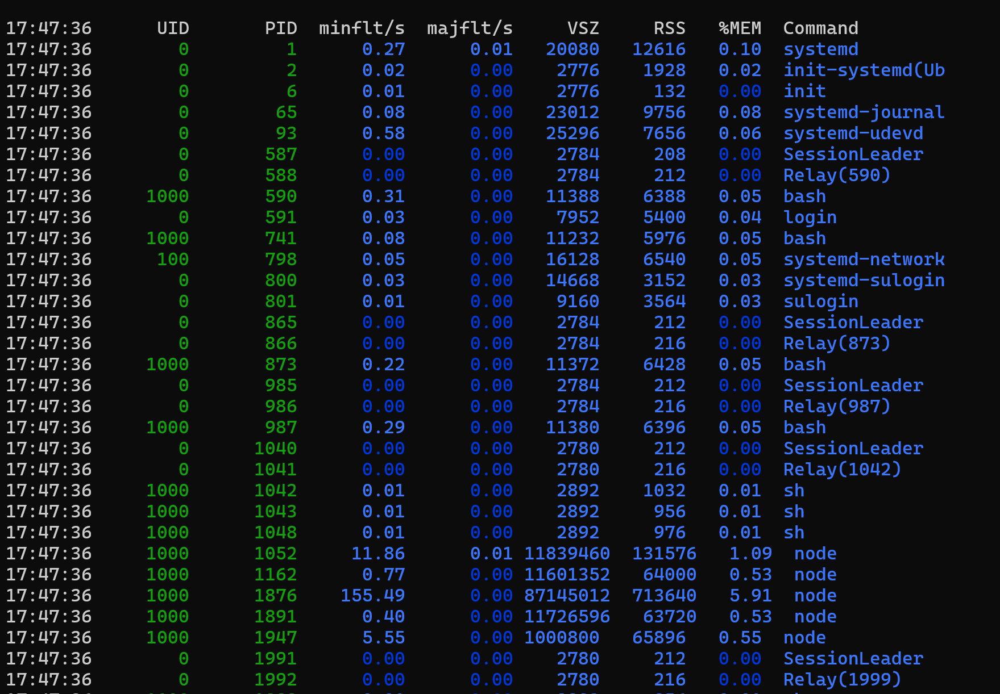

When you analyze memory usage reports, two important columns to observe are `VSZ` and `RSS`:

- VSZ (Virtual Set Size) shows the total amount of virtual memory (in kilobytes) that a process reserves.
- RSS (Resident Set Size) indicates how much virtual memory is currently held in RAM (for example, committed memory).
  
Another useful metric is `majflt/s` (the number of major page faults per second). This number measures how often a memory page has to be read from a swap device. If you have concerns about high usage of swap memory, verify the amount by using the `vmstat` tool to monitor the page-in and page-out statistics over time.

**Sample vmstat output**
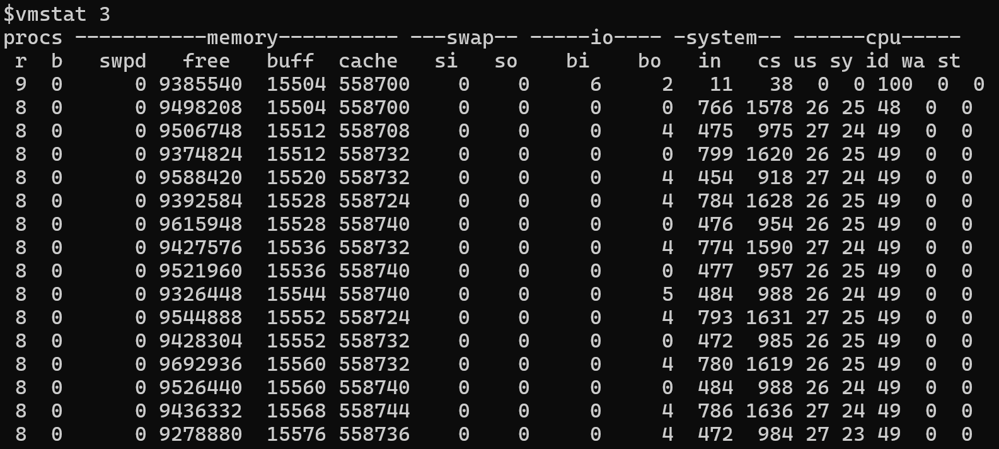

In this sample, you might observe that many memory pages are read from or written to swap. These high values typically indicate that the system is running low on available memory. This condition might occur because multiple processes are competing for memory, or because most of the applications can't use available memory. 

A common reason for unavailable memory is the use of HugePages. HugePages are reserved memory. Not all applications can use reserved memory. In some situations, you might have to evaluate whether your applications need HugePages or would work more effectively by using Transparent HugePages (THP). THP allow the kernel to manage large memory pages dynamically. For example, the Java Virtual Machine (JVM) can take advantage of THP by enabling the following flag:

`-XX:+UseTransparentHugePages`

For more information about THP, see [Transparent HugePage Support](https://docs.kernel.org/admin-guide/mm/transhuge.html).

For more information about HugePages, see [HugeTLB Pages](https://docs.kernel.org/admin-guide/mm/hugetlbpage.html).

### Testing THP usage in a sample program

To observe how THP is used by the system, you can run a small C program that allocates approximately 256 MB of RAM. The program uses the `madvise` system call to inform the kernel that the allocated memory should be treated as a single, contiguous, region-enabling THP, where supported.

```C
#include <stdio.h>
#include <string.h>
#include <stdlib.h>
#include <sys/mman.h>
#include <unistd.h>

#define LARGE_MEMORY_SIZE (256 * 1024 * 1024) // 256MB

int main() {
    char str[2];

    // Allocate a large memory area
    void *addr = mmap(NULL, LARGE_MEMORY_SIZE, PROT_READ | PROT_WRITE, MAP_PRIVATE | MAP_ANONYMOUS, -1, 0);


    if (addr == MAP_FAILED) {
        perror("mmap");
        return 1;
    }


    // Use madvise to give advice about the memory usage
    if (madvise(addr, LARGE_MEMORY_SIZE, MADV_HUGEPAGE) != 0) {
        perror("madvise");
        munmap(addr, LARGE_MEMORY_SIZE);
        return 1;
    }

    // Initialize the memory
    int *array = (int *)addr;
    for (int i = 0; i < LARGE_MEMORY_SIZE / sizeof(int); i++) {
        array[i] = i;
    }

    memset(addr, 0, LARGE_MEMORY_SIZE);

    printf("Press Enter to continue\n");
    fgets(str,2,stdin);

    // Clean up
    if (munmap(addr, LARGE_MEMORY_SIZE) == -1) {
        perror("munmap");
        return 1;
    }

    return 0;
}
```

If you the program, it isn't directly visible whether THP is used by the program.

You can verify overall THP usage on the system by examining the `/proc/meminfo` file. Check the `AnonHugePages` field to determine the amount of memory that's using THP. This file provides only system-wide statistics. 

To learn whether a process uses THP, you have to inspect the `smaps` file in the `/proc` directory of the process in question. For example, in `/proc/2275/smaps`, search for a line that contains the word `heap` (shown here at the far right).

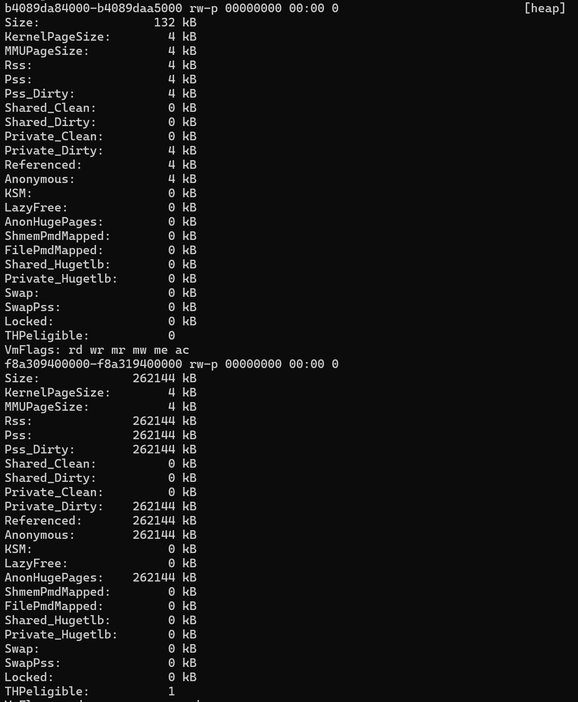

This example shows that a large memory segment was allocated and marked as `THPeligible`(THP are in use). By using `madvice syscall`, the allocation of this memory block is much more efficient, as one could do with HugePages. Depending on the size of the allocation, the kernel might assign either standard 4 KB pages or larger contiguous blocks. This optimization can improve performance for memory-intensive applications.

For more information, see [Transparent Hugepage Support](https://www.kernel.org/doc/html/latest/admin-guide/mm/transhuge.html).

### NUMA

If the applications are running on a NUMA system that has multiple nodes, it's important to know the memory capacity of each node. All nodes can access the system's total memory. However, you get optimum performance if the processes that run on a particular NUMA node operate on the memory that's under direct control of that node. If the local node can't fulfill a memory request, the system allocates memory from another node. However, accessing memory across nodes introduces latency and can cause performance penalties. Therefore, you should monitor memory locality to make sure that workloads are aligned with the memory resources of their assigned NUMA nodes. 

The following screenshot shows a sample of the system's NUMA configuration.

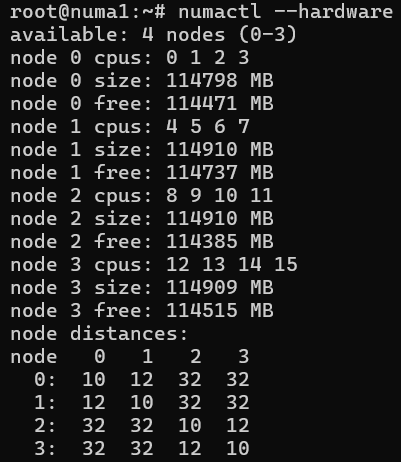

This configuration shows that accessing memory within the same node has a distance level of 10. If you want to access memory on `Node 1` from `Node 0`, this process has a high distance value of 12 but is still manageable. However, if you want to access memory on `NODE 3` from `NODE 0`, the distance level becomes 32. This process is still doable but is also three times slower. It's valuable to consider these differences when you diagnose performance issues or optimize memory-bound workloads. For more information, see [this Linux Kernel article](https://www.kernel.org/doc/html/latest/admin-guide/mm/numaperf.html). For a description of the `numactl` tool, see [numactl(8)](https://man7.org/linux/man-pages/man8/migratepages.8.html).

To determine whether a realignment of processes exists and a different node would be required, use the `numastat` tool. The documentation for this tool is available at [numastat(8)](https://man7.org/linux/man-pages/man8/numastat.8.html). The `migratepages` tool [migratepages(8)](https://man7.org/linux/man-pages/man8/migratepages.8.html) can help you to move the memory pages to the correct node.

### Overcommitment and OOM killer

Overcommitment is an important design choice that can seriously affect system performance and stability. The Linux kernel supports three modes:

- 'Heuristic'
- 'Always overcommit'
- 'Don't overcommit'
  
By default, the `Heuristic` scheme is used. This mode offers a balanced trade-off between always allowing memory overcommitment and strictly denying it. For more information, see the [kernel documentation](https://www.kernel.org/doc/Documentation/vm/overcommit-accounting).

An incorrect Overcommitment setting might prevent memory pages from allocating memory. Potentially, this condition could hinder new process creation or prevent internal kernel structures from acquiring sufficient memory.

If you verify that the issue is related to memory allocation, the most likely cause of this issue is insufficient resources left for the kernel. In this kind of situation, the OOM (Out-Of-Memory) killer might be invoked. Its job is to free up some memory pages for use by kernel tasks or other applications. By invoking the OOM killer, the system is warning you that it reached its resource limits. If you can eliminate the possibility of a memory leak, the cause of this condition could be that too many processes are running, or that processes that are consuming lots of memory. To resolve the issue, consider increasing the VM size or moving some applications to another server.

#### System logs generated during OOM Events

This section introduces a technique to identify the moment when the OOM Killer is triggered and to learn what information is logged by the system.

The following simple C program tests how much memory can be allocated dynamically on a system before it fails.

```C
#include <stdio.h>
#include <stdlib.h>
#include <string.h>
#define ONEGB (1 << 30)
int main() {
        int count = 0;
        while (1) {
                int *p = malloc(ONEGB);
              if (p == NULL) {
                printf("malloc refused after %d GB\n", count);
                return 0;
               }
        memset(p,1,ONEGB);
        printf("got %d GB\n", ++count);
     }
}
```

This program indicates that memory allocation fails after around 3 GB.

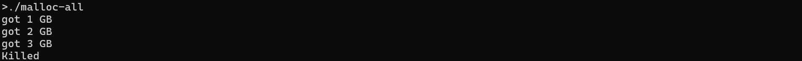

When the system runs out of memory, the OOM killer is invoked. You can view the related logs by using the `dmesg` command. The log entries typically begin as shown in the following screenshot.

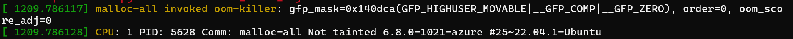

The entries typically end in a summary of the memory state.

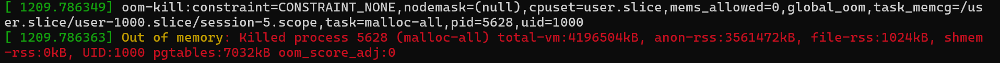

Between those entries, you can find detailed information about memory usage and the process that was selected for termination.

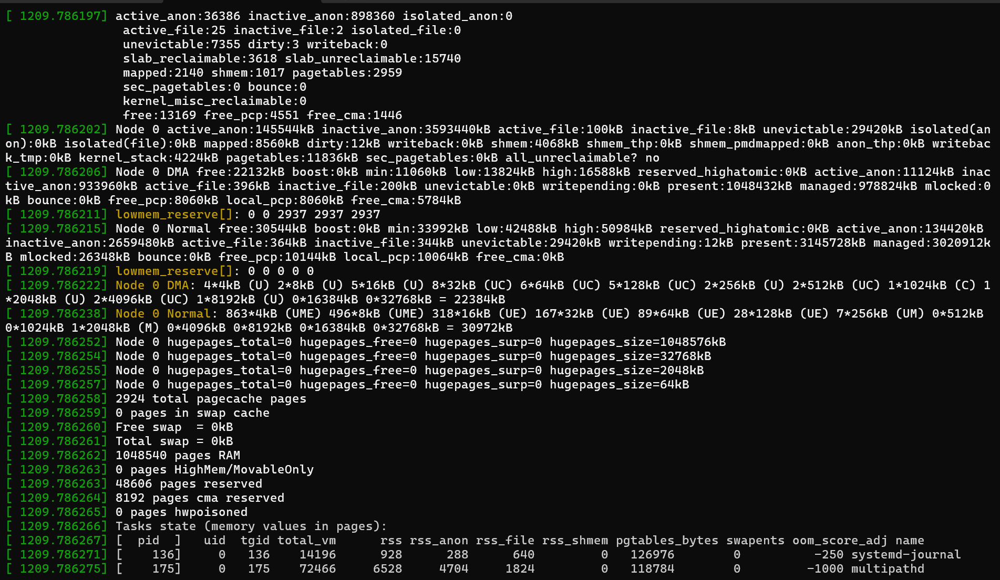
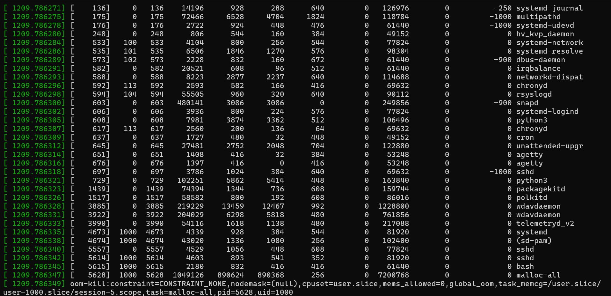

From this information, you can extract the following insights:

```
4194160 kBytes physical memory 
No swap space
3829648 kBytes are in use
```

In the following log example, the malloc process requested a single 4 KB page (order=0). Although 4 KB page is small, the system was already under pressure. The log shows that memory was being allocated from the "Normal Zone."

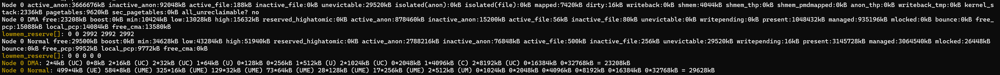

The available memory (`free`) is 29,500 KB. However, the minimum watermark (`min`) is 34,628 KB. Because the system is below this threshold, only the kernel can use the remaining memory，and user-space applications are denied. The OOM killer is invoked at this point. It selects the process that has the highest `oom_score` and memory usage ('RSS'). In this example, the malloc process had an `oom_score` of 0 but also has the highest `RSS` (917760). Therefore, it's selected as the target for termination.

### Monitor gradual memory growth

OOM events are easy to detect because related messages are logged to the console and system logs. However, gradual increases in memory usage that don’t cause an OOM event can be harder to detect.

To monitor memory usage over time, use the `sar` tool from the `sysstat` package. To focus on the memory details, use the "r" option (for example, "sar -r"). 

**Example output**

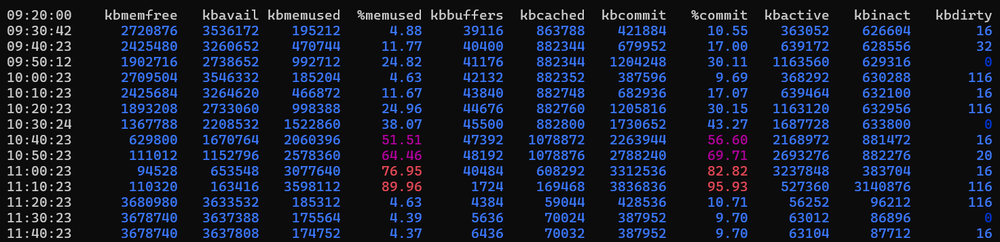

In this case, memory usage does grow for about two hours. Then, it drops back to four percent. This behavior might be expected, such as during peak login hours or resource-intensive reporting tasks. To determine whether this behavior is normal, you might have to monitor usage over several days, and then correlate it with application activity. High memory usage is not necessarily a problem. It depends on the workload and how the applications are designed to use memory.

To find which processes are consuming the most memory, use `pidstat`. 

**Example output**

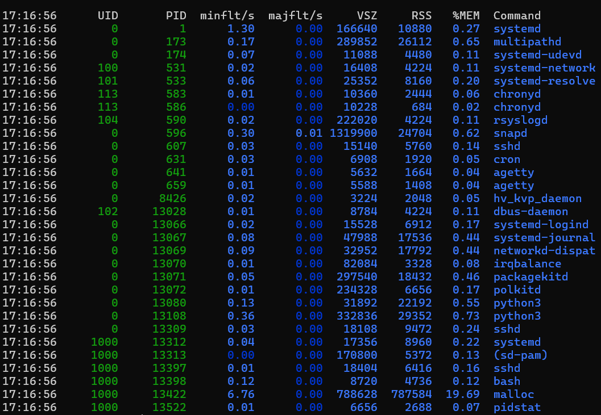

This output displays all running processes and their statistics. Another approach is to use the 'ps' tool to get similar results:

    `ps aux --sort=-rss | head -n 10`

**Example output**

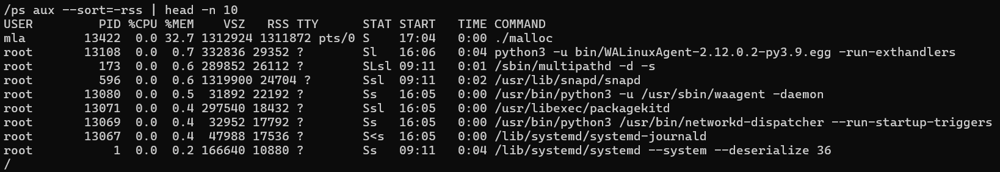

#### Why sort by RSS?

Resident Set Size (RSS) is the portion of process memory that's held in RAM (non-swapped physical memory). In contrast, Virtual Set Size（VSZ）represents the total amount of memory that the process reserves, including memory that isn’t committed. `Committed memory` refers to pages that are actually written to physical memory. If you're trying to identify which processes are using the most physical memory (including swap), focus on the `RSS` column. In the example output, the `snapd` process appears to use lots of memory, but its `RSS` value is low. The `malloc` process has similar `VSZ` and `RSS` values that indicate that it’s actively using more than 1.3 GB of memory.

[!INCLUDE [Third-party disclaimer](../../includes/third-party-contact-disclaimer.md)]
