# Troubleshoot Memory performance issues in Linux

**Applies to:** :heavy_check_mark: Linux VMs


##5 Things Memory might influence
Memory is a resource which every process, including the kernel, does require.
How much memory is required for each process does depend on its design and for what purpose the program got developed for. In short, based on the design more or less memory is allocated either at the Heap or on the Stack. Think of an in memory database like SAP HANA. 

Though, memory can also indirectly be consumed via an increase of the page cache. What is the page cache? The page cache is an in memory representation of a file which got read from a disk before. With the help of the page cache an extra read from the disk can be avoided therefore. The best example is a file server which does benefit from this underlying kernel functionality.


We therefore need always be aware of what application or applications are running on the same virtual machine and whether they might compete about the available memory. Also of interest is to know whether the VM is running on a NUMA or on an UMA architecture. Depending on the memory requirements of a process, it might be to prefer an UMA architecture. Where the complete RAM can be address without a penalty, on the other hand, for HPC with many small processes or processes fitting in one of the NUMA-Nodes you can benefit from the CPU cache-locality. 

Another point to keep in mind is whether memory overcommitment is allowed by the kernel or not. Depending on its configuration, every memory request is fulfilled. Or it's denied if the amount of memory requested isn't available.


Another part related to memory is the availability of swap space. Even, if we have nowadays plenty of RAM available it's still recommended to configure SWAP space. With the help of enabling swap, the overall system stability is increased by keeping it more resilient if there are low memory conditions. 
For more information about these concepts, see the [kernel doc](https://docs.kernel.org/admin-guide/mm/concepts.html#concepts-overview)


##What tools are available or what information are provided via the proc or the sys filesystem to understand the utilization of the available memory?

The standard command to see what amount of memory is available or occupied is the `free` command
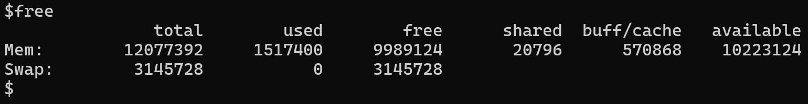
It summarizes the reserved memory and what memory is still available including total and used swap space.
If a detailed view is required for each process, the `pidstat -r` command can be used.
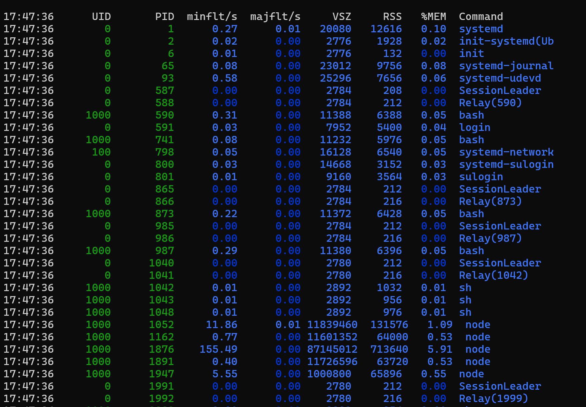


Of particular interest are the columns 'VSZ' and 'RSS' VSZ. They display the amount of memory, in kilo bytes,  reserved by a process and the committed memory usage with the help of the RSS column. 
Furthermore, via the column 'majflt/s' one gets an overview how often a memory page has to be read from a swap device. If there are concerns about high usage of swap, it's recommended to use the tool `vmstat` to monitor the page-in and page-out statistics over a period of time.

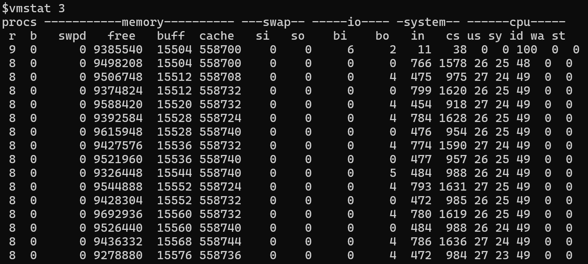

In case you see high number of pages be read or written from the SWAP these high numbers are usually a hint that memory is getting low. Either by too many processes competing about this resource or that the available RAM can't be used. HugePages, for instance,  might be enabled. HugePages are reserved memory. Only applications capable of utilizing HugePages can use this type of memory. For any other process, this memory isn't useable. In situations you're low on memory reconsider whether you require HugePages for your applications or whether they can also work with Transparent Huge Pages (THP). An example of an application which is able to use THP is the JAVA JVM with the help of the flag 
`-XX:+UseTransparentHugePages`. More details about THP and how it can be controlled is documented at [Transparent HugePage Support](https://docs.kernel.org/admin-guide/mm/transhuge.html)
For information about HugePages consult this part of the kernel documentation [HugeTLB Pages](https://docs.kernel.org/admin-guide/mm/hugetlbpage.html)


In order, to see how THP is used by the system, we use the following small C program to allocate about 256 MByte of RAM via THP. The `madvise` system call is used to let the kernel know that we would like to have one contiguous area or memory.

```C
#include <stdio.h>
#include <string.h>
#include <stdlib.h>
#include <sys/mman.h>
#include <unistd.h>

#define LARGE_MEMORY_SIZE (256 * 1024 * 1024) // 256MB

int main() {
    char str[2];

    // Allocate a large memory area
    void *addr = mmap(NULL, LARGE_MEMORY_SIZE, PROT_READ | PROT_WRITE, MAP_PRIVATE | MAP_ANONYMOUS, -1, 0);


    if (addr == MAP_FAILED) {
        perror("mmap");
        return 1;
    }


    // Use madvise to give advice about the memory usage
    if (madvise(addr, LARGE_MEMORY_SIZE, MADV_HUGEPAGE) != 0) {
        perror("madvise");
        munmap(addr, LARGE_MEMORY_SIZE);
        return 1;
    }

    // Initialize the memory
    int *array = (int *)addr;
    for (int i = 0; i < LARGE_MEMORY_SIZE / sizeof(int); i++) {
        array[i] = i;
    }

    memset(addr, 0, LARGE_MEMORY_SIZE);

    printf("Press Enter to continue\n");
    fgets(str,2,stdin);

    // Clean up
    if (munmap(addr, LARGE_MEMORY_SIZE) == -1) {
        perror("munmap");
        return 1;
    }

    return 0;
}
```

If we run the program, it isn't directly visible whether THP is used by the program or not.
With the help of `/proc/meminfo`, it's possible figure out whether THP is used on the system but it can't tell you which of the processes do. Look for the `AnonHugePage` property in this file. 

To find out whether a process does use THP, you have to inspect the `smaps` file in the `/proc` directory of the process in question, for instance, `/proc/2275/smaps` and search for a line containing the word `heap`
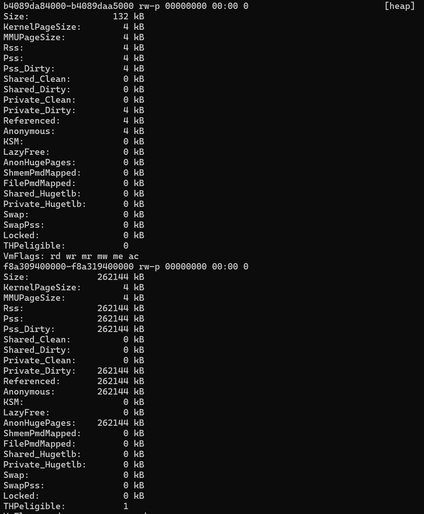

Here we can see that our large memory segment is allocated and `THPeligible` is enabled as part of a THP allocation. With the help of the madvice syscall the memory allocation is much more efficient to allocate this memory block, as one could do with HugePages. Depending on the size, either the kernel allocates just a small 4k page or the kernel is going to allocate a larger contiguous block. 
For more information, see the kernel doc at [Transparent Hugepage Support](https://www.kernel.org/doc/html/latest/admin-guide/mm/transhuge.html).

## NUMA

If you run on a NUMA system with more than one NODE available, it's also important to know what is the memory size each NODE does have. The complete available memory to the system can be addressed by each of the available nodes. Though, the best performance you get if the processes running on a particular NUMA NODE operate on the memory which is under direct control of this NODE. If, for example, a new memory request can't be fulfilled on the current node the memory is taken from another node. But operations on this part of the newly requested memory do imply a performance penalty. 

Look at the following image
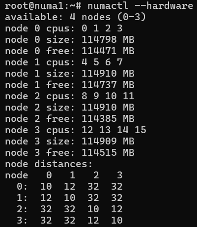


The matrix tells you that the accessing memory belonging to the same NODE does have distance level of 10.
On the other hand, if you want to access memory on NODE1, has a distance level of 12. The difference in the distance between `NODE 0` and `NODE 1` are still manageable. But if you want to access memory belonging to `NODE 3` from `NODE 0` it's doable, though there's a distance level of 32. Which means it's about three times slower to operate on memory. This kind of difference one needs to be aware off if working on a performance issue
Consult this [document](https://www.kernel.org/doc/html/latest/admin-guide/mm/numaperf.html) for further details. For a description of the numactl tool, consult the man page: [numactl(8)](https://man7.org/linux/man-pages/man8/migratepages.8.html)

To figure out whether there's a realignment of processes and a different Node required use the `numastat` tool. Its doc is located at [numastat(8)](https://man7.org/linux/man-pages/man8/numastat.8.html). With the help of `migratepages` tool [migratepages(8)](https://man7.org/linux/man-pages/man8/migratepages.8.html) one can then try to move the memory pages to the right NODE.

Independent of NUMA is the question whether any memory request has to be fulfilled? The answer to this question is [memory overcommitment]( https://en.wikipedia.org/wiki/Memory_overcommitment ). Overcommitment is a crucial design decision and has a drastic effect on the functionality of the system performance or its stability. The Linux kernel supports three modes:
- 'Heuristic'
- 'Always overcommit'
- 'Don't overcommit'
  
By default the Heuristic scheme is set It provides a good trade-off  between always overcommit and don't overcommit. The other two depend on the application design. For more information, see the [kernel documentation](https://www.kernel.org/doc/Documentation/vm/overcommit-accounting) for further details.
An incorrect setting could be therefore the explanation why a new memory page or pages can't be allocated. Affecting the creation of new processes or that internal kernel structures don't get enough memory either.

If it comes to memory allocation issues, it can happen that there aren't enough resources left for the kernel. In such a situation the OOM killer might kick in to free some of the pages to make them available to kernel tasks or requests from other applications which would like to write a page or more. If there are signs of OOM killer activities, it's actually a signal to the administrator that the system is already on its limits. This means there are too many processes running or some have high memory requirements - if a memory leak can be excluded. The VM size needs to be increased or some of the applications needs to be hosted on a different server.

What information are logged if the OOM had to intervene? Given is the following simple C program to allocate memory and set  default value

```C
#include <stdio.h>
#include <stdlib.h>
#include <string.h>
#define ONEGB (1 << 30)
int main() {
        int count = 0;
        while (1) {
                int *p = malloc(ONEGB);
              if (p == NULL) {
                printf("malloc refused after %d GB\n", count);
                return 0;
               }
        memset(p,1,ONEGB);
        printf("got %d GB\n", ++count);
     }
}
```

The program is utilizing too much of the available memory. It isn't possible to allocate more than 3G of  memory
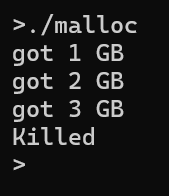

The information from the OOM we find on the console or simply with the command `dmesg`
It starts with this detail at the beginning of the trace
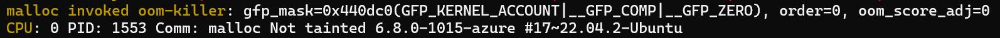
:::image type="content" source="media/mallo-invoked-oom-killer.png" alt-text="OOM killer got invoked" border="false" lightbox="media/mallo-invoked-oom-killer.png":::
And ends with the following lines

:::image type="content" source="media/out-of-memory.png" alt-text="Error: Out of memory, raised" border="false" lightbox="media/out-of-memory.png":::

In between, the following content is displayed
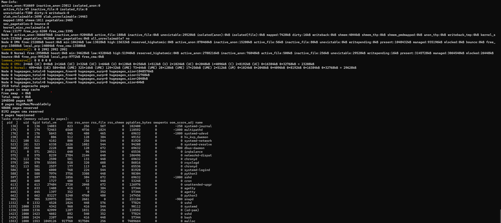
:::image type="content" source="media/memory-in-between.png" alt-text="OOM full detail" border="false" lightbox="media/memory-in-between.png":::


The important information we get from it are the following
```
4194160 kBytes physical memory 
No swap space
3829648 kBytes are in use
```

The malloc process requested a single page (4 KB) --> order=0, one single page sounds not much, when we look at the following lines there should be plenty of memory available
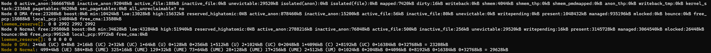


On the first glimpse, there should be enough pages left. Let us further examine the situation. Memory is taken from the Normal Zone. Available memory is 29,500 kB, though the min value is 34628 kB. We are below the min-watermark, in that case only the kernel would be able to use the memory for any internal data structure. A user-space application isn't entitled to get the pages. At this point, the OOM gets involved finding a process which has the highest oom_score and also is utilizing most of the memory. The identified process is the one which gets scarified then. In the picture above you see that the oom_score for the malloc process is 0 and the RSS size is 917760. 
Among all the other processes, it has the highest RSS size.


Spotting an OOM issue is easy as the relevant information are printed on the console or in the system log. Allowing the administrator to reason about why the OOM did happen. 
But what about a steady increase  of memory usage, which don't turn into an OOM? What can be used to make the administrator aware of it?
A good tool to see how the memory does grow over a period of time is the 'sar' tool from the sysstat package. To focus on the memory details only, use the option 'r' --> 'sar -r'
Look at this example
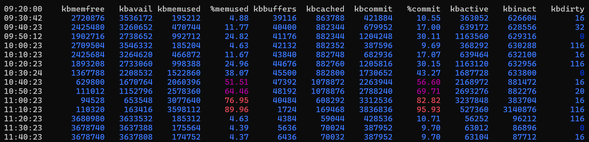

Here we see that memory usage does grow for about 2h. After, it suddenly returns to just 4% of memory utilization. It could be a normal application behavior and it should be investigated over some days when those spikes do occur. Maybe in the morning many users sign in to a specific application. Or there's a cron job running at this time per day or week. Another reason could be a reporting engine which requires much resources when reports are scheduled. In short, memory utilization isn't a bad thing by itself, instead it depends on the application or the applications running on this VM. Without this knowledge, it isn't possible to do a proper RCA in order to explain a high memory consumption.

If we would like to find out more about which process is responsible eating up all your available memory the 'pidstat' tool could be of help.
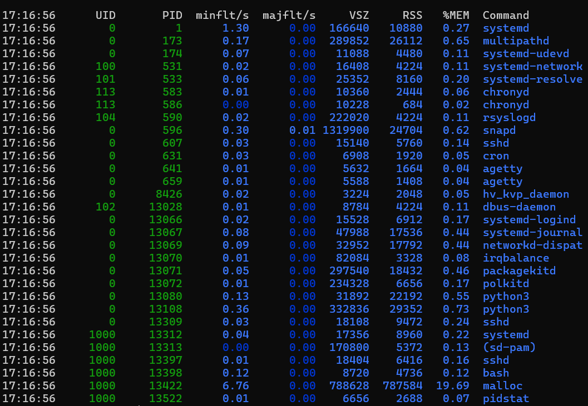

It prints all running processes and their statistics. Another approach is to use the 'ps' tool to get similar  `ps aux --sort=-rss | head -n 10`
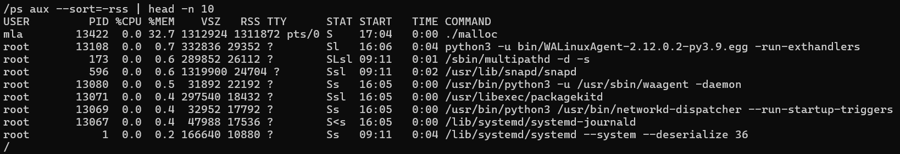


Why do we sort on rss? RSS stands for 'Resident Set Size' the nonswapped physical memory that a task does use. VSZ is the 'Virtual Set Size' which contains the amount of memory the process reserved but not committed. Committed means that a page is written to the physical memory. So if we're interested which of the processes are occupying most of the available memory (physical + swap) we have to have a look at the RSS size of a process. In the screenshot above it looks like that 'snapd' does occupy much memory, though if we look at the RSS column we see that the process isn't that significant. On the other hand, there's a process named 'malloc' which has the same size of VSZ and RSS. So this one is indeed utilizing over 1.3G of memory. 

Summary
========
Working on a memory related issue requires first to get a better picture of the memory usage of the applications hosted on the system. Thier work patterns as well the right configuration of the system. All of it takes its time to understand whether the available memory on the system is sufficient. Or whether one has to reason about to enlarge the VM size, use a NUMA or an UMA system instead. Also it's worth to think about whether the application performance would benefit from utilizing THP. The best is therefore to work together with the application vendor what requirements they suggest. Plus verify your application on a test-system with a similar utilization you expect on a production system. 
