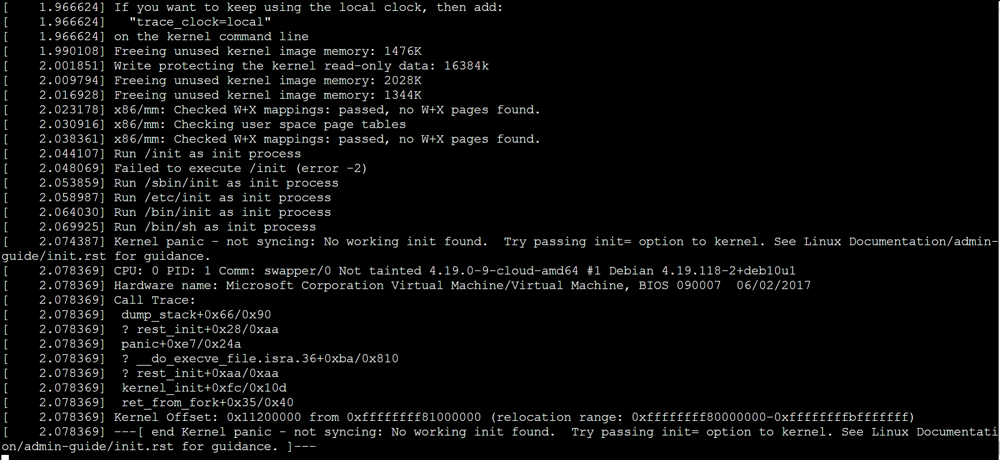

# Auto Repair a Linux VM by using Azure Linux Auto Repair (ALAR)

With the help of the ALAR scripts for Linux, you to get your Virtual Machine automatically recovered. 
You don't need to do any manual steps. These scripts simplify the recovery procedure and allow even 
unexperienced users getting a VM recovered.

ALAR is part of the vm repair extension [Repair a Linux VM by using the Azure Virtual Machine repair commands](./repair-linux-vm-using-azure-virtual-machine-repair-commands.md). 

The repair scenarios covered by ALAR are
- malformed /etc/fstab
   syntax error
   missing disk
- damaged initrd or missing initrd line in the /boot/grub/grub.cfg
- Boot problematic because of a corrupt kernel image

## The ALAR Scripts

**fstab**
This script does strip off any lines in the /etc/fstab file, which the system doesn't need to start the system successful. It makes a copy of the original file first.
After the system got rebooted, the file `/etc/fstab`can be altered to add any lines with the correct mount options.

Consult also this page [Troubleshoot Linux VM starting issues because fstab errors](./linux-virtual-machine-cannot-start-fstab-errors.md) to better understand the scenarios that can arise if the information in the file `/etc/fstab` isn't correct.

**kernel**
This script does change the default kernel. The script does replace the broken kernel with the previous version installed.

Consult also this page [How to recover an Azure Linux virtual machine from kernel-related boot issues](https://docs.microsoft.com/en-gb/troubleshoot/azure/virtual-machines/kernel-related-boot-issues). To understand what messages might be logged on the serial-console. In case you see a kernel-related boot issue.

**initrd**
This script corrects two issues that can happen when a new kernel gets installed.

The grub.cfg file is missing an `initrd` line or the initrd image is missing at all. So it either fixes the grub.cfg file and creates a new initrd image if the image is missing.

Initrd related boot issues may show up in the following ways.


In both cases the following information is logged before.


## How to use ALAR
The ALAR scripts, with the help of the Azure Virtual Machine repair extension, use the command `run` and its option `--run-id`. The script-id for the automated recovery is: **linux-alar-fki** 
For instance

```azurecli-interactive
az vm repair create --verbose -g centos7 -n cent7 --repair-username rescue --repair-password 'password!234’
 ```

```azurecli-interactive
az vm repair run --verbose -g centos7 -n cent7 --run-id linux-alar-fki --parameters initrd --run-on-repair
 ```

```azurecli-interactive
az vm repair restore --verbose -g centos7 -n cent7
 ```

With the above steps, a repair VM is created. In the next step, we use the script `initrd` to get an initrd boot issue fixed. In the last step, the restore operation is executed.

  [!NOTE]
> You can pass over either a single recover-operation or multiple operations, i.e.,
> fstab; ‘fstab,initrd’. 
> Separate the recover operation with a comma – no spaces allowed!


## Limitations
- encrypted images aren't supported.
- Classic VMs aren't supported.
- EFI based images aren't supported.


## Feedback

If you come across any bug or would like to see an enhancement on the script base of Azure Linux Auto Recover, report them on [GitHub](https://github.com/Azure/repair-script-library/issues).