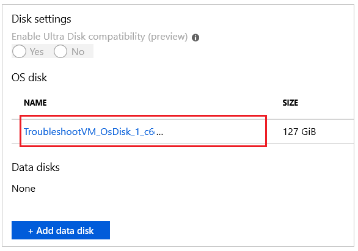
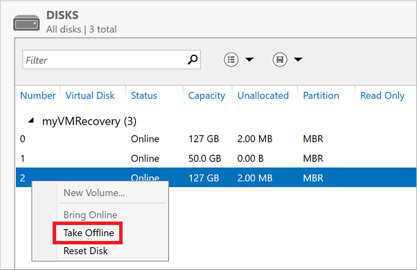

# Troubleshoot a Windows VM by attaching the OS disk to a recovery VM through the Azure portal
If your Windows virtual machine (VM) in Azure encounters a startup or disk error, you might need to perform troubleshooting steps on the virtual hard disk (VHD). A common example is a failed application update that prevents the VM from starting successfully. This article details how to use the Azure portal to connect your virtual hard disk to another Windows VM to fix any errors, and then re-create your original VM. 

## Recovery process overview
The troubleshooting process is as follows:

1. Stop the affected VM.
1. Create a snapshot for the OS disk of the VM.
1. Create a virtual hard disk from the snapshot.
1. Attach and mount the virtual hard disk to another Windows VM for troubleshooting purposes.
1. Connect to the troubleshooting VM. Edit files or run any tools to fix problems on the original virtual hard disk.
1. Unmount and detach the virtual hard disk from the troubleshooting VM.
1. Swap the OS disk for the VM.

> [!NOTE]
> This article does not apply to VMs that have unmanaged disks.

## Take a snapshot of the OS disk
A snapshot is a full, read-only copy of a virtual hard disk. We recommend that you cleanly shut down the VM before taking a snapshot, to clear out any processes that are in progress. To take a snapshot of an OS disk, follow these steps:

1. Go to the [Azure portal](https://portal.azure.com). Select **Virtual machines** from the sidebar, and then select the VM that has the problem.
1. On the left pane, select **Disks**, and then select the name of the OS disk.
    
1. On the **Overview** page of the OS disk, select **Create snapshot**.
1. Create a snapshot in the same location as the OS disk.

## Create a disk from the snapshot
To create a disk from the snapshot, follow these steps:

1. Select **Cloud Shell** from the Azure portal.

    
1. Run the following PowerShell commands to create a managed disk from the snapshot. Replace the example names with the appropriate names.

    ```powershell
    #Provide the name of your resource group.
    $resourceGroupName ='myResourceGroup'
    
    #Provide the name of the snapshot that will be used to create managed disks.
    $snapshotName = 'mySnapshot' 
    
    #Provide the name of the managed disk.
    $diskName = 'newOSDisk'
    
    #Provide the size of the disks in gigabytes. It should be greater than the VHD file size. In this example, the size of the snapshot is 127 GB. So we set the disk size to 128 GB.
    $diskSize = '128'
    
    #Provide the storage type for the managed disk: Premium_LRS or Standard_LRS.
    $storageType = 'Standard_LRS'
    
    #Provide the Azure region (for example, westus) where the managed disks will be located.
    #This location should be the same as the snapshot location.
    #Get all the Azure locations by using this command:
    #Get-AzLocation
    $location = 'westus'
    
    $snapshot = Get-AzSnapshot -ResourceGroupName $resourceGroupName -SnapshotName $snapshotName 
     
    $diskConfig = New-AzDiskConfig -AccountType $storageType -Location $location -CreateOption Copy -SourceResourceId $snapshot.Id
     
    New-AzDisk -Disk $diskConfig -ResourceGroupName $resourceGroupName -DiskName $diskName
    ```
3. If the commands run successfully, you'll see the new disk in the resource group that you provided.

## Attach the disk to another VM
For the next few steps, you use another VM for troubleshooting purposes. After you attach the disk to the troubleshooting VM, you can browse and edit the disk's content. This process allows you to correct any configuration errors or review additional application or system log files. To attach the disk to another VM, follow these steps:

1. Select your resource group from the portal, and then select your troubleshooting VM. Select **Disks** > **Edit** > **Add data disk**.

    

2. In the **Data disks** list, select the OS disk of the VM that you identified. If you don't see the OS disk, make sure that the troubleshooting VM and the OS disk are in the same region (location). 
3. Select **Save** to apply the changes.

## Mount the attached data disk to the VM

1. Open a Remote Desktop connection to the troubleshooting VM. 
2. In the troubleshooting VM, open **Server Manager**, and then select **File and Storage Services**. 

    

3. The data disk is automatically detected and attached. To see a list of the connected disks, select **Disks**. You can select your data disk to view volume information, including the drive letter. The following example shows the data disk attached and using drive **F**.

    

## Fix problems on the original virtual hard disk
With the existing virtual hard disk mounted, you can now perform any maintenance and troubleshooting steps as needed. After you've resolved all errors, continue with the following steps.

## Unmount and detach the original virtual hard disk
Detach the existing virtual hard disk from your troubleshooting VM. You can't use your virtual hard disk with any other VM until the lease that attaches the virtual hard disk to the troubleshooting VM is released.

1. From the Remote Desktop session to your VM, open **Server Manager**, and then select **File and Storage Services**.

    

2. Select **Disks**, right-click your data disk, and then select **Take Offline**.

    

3. Detach the virtual hard disk from the VM. Select your VM in the Azure portal, and then select **Disks**. 
4. Select **Edit**, select the OS disk that you attached, and then select **Detach**.

    

    Before you continue, wait until the data disk is successfully detached from the VM.

## Swap the OS disk for the VM

Azure portal now supports changing the OS disk of the VM. To do this, follow these steps:

1. Go to the [Azure portal](https://portal.azure.com). Select **Virtual machines** from the sidebar, and then select the VM that has the problem.
1. On the left pane, select **Disks**, and then select **Swap OS Disk**.
   
    

1. Choose the new disk that you repaired, and then enter the name of the VM to confirm the change. If you don't see the disk in the list, wait 10 to 15 minutes after you detach the disk from the troubleshooting VM. Also make sure that the disk is in the same location as the VM.
1. Select **OK**.

## Next steps
If you're having problems connecting to your VM, see [Troubleshoot Remote Desktop connections to an Azure VM](troubleshoot-rdp-connection.md). For problems with accessing applications running on your VM, see [Troubleshoot application connectivity issues on a Windows VM](troubleshoot-app-connection.md).

For more information about using Azure Resource Manager, see the [Azure Resource Manager overview](/azure/azure-resource-manager/management/overview).


