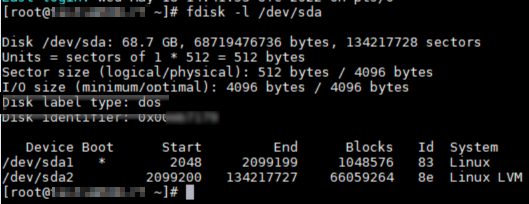
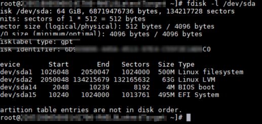

# Linux VM boots to GRUB Rescue

This article discusses multiple conditions that can lead to a GRUB rescue and provides troubleshooting guidance.

During the boot process, the boot loader will attempt to locate the Linux kernel and hand off the boot control. If this handoff cannot be performed, the VM will enter a GRUB rescue console. The GRUB rescue console prompt will typically not be shown in the azure serial console log, but can be seen in the [Azure boot diagnostics screenshot](https://docs.microsoft.com/azure/virtual-machines/boot-diagnostics#boot-diagnostics-view).

## How to identify a GRUB rescue issue?

Use the Azure portal to [view a screenshot](https://docs.microsoft.com/azure/virtual-machines/boot-diagnostics#boot-diagnostics-view) of your VM using the boot diagnostics blade. This will help to diagnose the issue and determine if a similar boot error is the cause.

A GRUB rescue issue looks similar to the output below:

```output
error: file '/boot/grub2/i386-pc/normal.mod' not found.
    Entering rescue mode...
    grub rescue>
```

## Offline troubleshooting and recovery

To be able to troubleshoot and fix this error, a rescue/repair VM will be required.

1. Use the [**Repair VM** command](repair-linux-vm-using-azure-virtual-machine-repair-commands.md) to create a repair VM that has a copy of the affected VM's OS disk attached. Then use [chroot](chroot-environment-linux.md) to mount the copy of the OS file systems in the repair VM.

    > [!NOTE]
    > In case the Repair VM command is not an option, follow _[Troubleshoot a Linux VM by attaching the OS disk to a recovery VM using the Azure portal](troubleshoot-recovery-disks-portal-linux)_ to get a rescue VM manually created.

2. [Identify](#how-to-identify-a-grub-rescue-issue) the specific grub rescue error and follow the instructions that fit that specific error:

    * [Error - Unknown filesystem](#error---unknown-filesystem)
    * [Error - Error 15: File not found](#error---error-15-file-not-found)
    * [Error - error: file '/boot/grub2/i386-pc/normal.mod' not found](#error---error-file-bootgrub2i386-pcnormalmod-not-found)
    * [Error - No such partition](#error---no-such-partition)
    * [Other GRUB rescue errors](#other-grub-rescue-errors)

3. Once the corresponding GRUB rescue action plan has been followed, proceed to get the copy of the file systems unmounted from the rescue/repair VM, and use the restore option as documented in [**Repair VM** command](repair-linux-vm-using-azure-virtual-machine-repair-commands.md#repair-process-example) article, step 5, to get the OS disk swapped using the copy disk from the rescue/repair VM and validate if the VM is able to boot up fine by taking a look at the Azure serial console or trying to connect to the VM.

4. In case the entire /boot partition or other important contents are missing and they are unable to be recovered, a [restore from backup](https://docs.microsoft.com/azure/backup/backup-azure-arm-restore-vms) will be the recommended option left.

### Error - Unknown filesystem


* This error might be associated with one of the following issues:
  * /boot file system corruption.
    * Follow the instructions in  [Fixing the /boot file system corruption](#fixing-the-boot-file-system-corruption).
  * GRUB Boot loader pointing to an invalid disk or partition.
    * Follow the instructions in [Reinstalling GRUB and regenerating the GRUB configuration file](#reinstalling-grub-and-regenerating-the-grub-configuration-file) to regenerate the GRUB configuration file with the proper settings and values.
  * OS disk partition table issues caused by a human error.
    * Follow the instructions in [Error - No such partition](#error---no-such-partition) with recommendations to recreate the /boot partition if missing or created incorrectly.

#### Fixing the /boot file system corruption

1. Make sure the [Offline troubleshooting and recovery](#offline-troubleshooting-and-recovery) step 1 has been followed and the rescue/repair VM has been created.
2. Follow the instructions in the [Troubleshoot file system corruption errors in Azure Linux](/azure/virtual-machines/linux-recovery-cannot-start-file-system-errors) to attempt to fix the corruption issues in the corresponding /boot partition.
3. Proceed with step 3 from section [Offline troubleshooting and recovery](#offline-troubleshooting-and-recovery) to swap the OS disk.

#### Reinstalling GRUB and regenerating the GRUB configuration file

1. Make sure the [Offline troubleshooting and recovery](#offline-troubleshooting-and-recovery) point 1 has been followed and the rescue/repair VM has been created, all the required file systems have been mounted (including / and /boot) and do chroot.
2. Reinstall GRUB and regenerate the corresponding GRUB configuration file:

    * **RHEL/CentOS/Oracle 7.x/8.x Linux VMs without UEFI (BIOS based - Gen1)**

    ```bash
    # grub2-install /dev/sdX
    # grub2-mkconfig -o /boot/grub2/grub.cfg
    # sed -i 's/hd2/hd0/g' /boot/grub2/grub.cfg
    ```

    > [!IMPORTANT]
    > In case the VM is running CentOS, replace redhat with centos in the grub.cfg file absolute path: /boot/efi/EFI/centos/grub.cfg

    * **RHEL/CentOS/Oracle 7.x/8.x Linux VMs with UEFI (Gen2)**

    ```bash
    # grub2-install /dev/sdX
    # grub2-mkconfig -o /boot/efi/EFI/redhat/grub.cfg
    # sed -i 's/hd2/hd0/g' /boot/efi/EFI/redhat/grub.cfg
    ```

    > [!IMPORTANT]
    > In case the VM is running CentOS, replace redhat with centos in the grub.cfg file absolute path: /boot/efi/EFI/centos/grub.cfg

    * **SLES 12/15 without EUFI (BIOS based - Gen1)**

    ```bash
    # grub2-install /dev/sdX
    # grub2-mkconfig -o /boot/grub2/grub.cfg
    # sed -i 's/hd2/hd0/g' /boot/grub2/grub.cfg
    ```

    * **SLES 12/15 with EUFI (Gen2)**

    ```bash
    # grub2-install /dev/sdX
    # grub2-mkconfig -o /boot/efi/EFI/BOOT/grub.cfg
    # sed -i 's/hd2/hd0/g' /boot/efi/EFI/BOOT/grub.cfg
    ```

    * **Ubuntu 18.04/20.04**

    ```bash
    # grub-install /dev/sdX
    # update-grub
    ```

  > [!NOTE]
  > Replace /dev/sdX with the corresponding Operating System (OS) disk device.
3. Proceed with step 3 from section [Offline troubleshooting and recovery](#offline-troubleshooting-and-recovery) to swap the OS disk.

### Error - Error 15: File not found


1. Make sure the [Offline troubleshooting and recovery](#offline-troubleshooting-and-recovery) point 1 has been followed and the rescue/repair VM has been created, all the required file systems have been mounted (including / and /boot) and do chroot.
2. Inspect the /boot file system contents and validate what's missing.
3. In case the GRUB configuration file is missing, follow  [Reinstalling GRUB and regenerating the GRUB configuration file](#reinstalling-grub-and-regenerating-the-grub-configuration-file) to regenerate the GRUB configuration file with the proper settings and values.
4. Validate the file permissions inside the /boot file system are fine. You can compare the permissions using another VM with the same Linux version.
5. In case the entire /boot partition or other important contents are missing and they are unable to be recovered, a [restore from backup](/azure/backup/backup-azure-arm-restore-vms) will be the recommended option left.
6. Once the issue has been addressed, proceed with step 3 from section [Offline troubleshooting and recovery](#offline-troubleshooting-and-recovery) to swap the OS disk.

### Error - error: file '/boot/grub2/i386-pc/normal.mod' not found


1. Make sure the [Offline troubleshooting and recovery](#offline-troubleshooting-and-recovery) point 1 has been followed and the rescue/repair VM has been created, all the required file systems have been mounted (including / and /boot) and do chroot.
2. In case you are unable to mount the /boot file system due to a corruption error, follow [Fixing the /boot file system corruption](#fixing-the-boot-file-system-corruption).
3. Once you are inside chroot, validate the contents inside /boot/grub2/i386-pc directory, if the contents are missing, then copy the contents from /usr/lib/grub/i386-pc

```bash
# ls -l /boot/grub2/i386-pc
# cp -rp /usr/lib/grub/i386-pc /boot/grub2
```

4. Proceed with step 3 from section [Offline troubleshooting and recovery](#offline-troubleshooting-and-recovery) to swap the OS disk.

### Error - No such partition


This scenario is applicable to RHEL based virtual machines (Red Hat, Oracle Linux, CentOS) where it has been manually identified the /boot partition was deleted by mistake. It is possible it was also attempted to be recreated with the wrong start and end sectors.

If the /boot partition is missing, you can recreate it using the following instructions:

1. Make sure the [Offline troubleshooting and recovery](#offline-troubleshooting-and-recovery) step 1 has been followed and the rescue/repair VM has been created.
2. Identify if the partition table was created as **dos** or **GPT** type using the following command

```bash
# fdisk -l /dev/sdX
```

* **Dos partition table**

    

 * **GPT partition table**

    

 > [!NOTE]
 > Replace /dev/sdX with the corresponding Operating System (OS) disk device.

3. If the partition table has **dos** as the partition table type, follow the instructions in [Recreating the /boot partition in dos systems](#recreating-the-boot-partition-in-dos-systems). If the partition table has **GPT** as the partition table type, follow the instructions in [Recreating the /boot partition in GPT systems](#recreating-the-boot-partition-in-gpt-systems)
4. Make sure the GRUB boot loader is installed using the proper disk. You can follow the instructions in [Reinstalling GRUB and regenerating the GRUB configuration file](#reinstalling-grub-and-regenerating-the-grub-configuration-file) to get it installed and configured the proper way.
5. Proceed with step 3 from section [Offline troubleshooting and recovery](#offline-troubleshooting-and-recovery) to swap the OS disk.

#### Recreating the /boot partition in dos systems

1. Recreate the /boot partition using the following command. Use the default values in **First** and **Last** sectors, as well as in **partition type** (83). Make sure the boot partition table is marked as bootable using the **a** option in **fdisk** as shown in the output below:

```bash
# fdisk /dev/sdX
```

```output
# fdisk /dev/sdc

The device presents a logical sector size that is smaller than
the physical sector size. Aligning to a physical sector (or optimal
I/O) size boundary is recommended, or performance may be impacted.
Welcome to fdisk (util-linux 2.23.2).

Changes will remain in memory only, until you decide to write them.
Be careful before using the write command.


Command (m for help): n
Partition type:
   p   primary (1 primary, 0 extended, 3 free)
   e   extended
Select (default p): p
Partition number (1,3,4, default 1): 1
First sector (2048-134217727, default 2048):
Using default value 2048
Last sector, +sectors or +size{K,M,G} (2048-2099199, default 2099199):
Using default value 2099199
Partition 1 of type Linux and of size 1 GiB is set

Command (m for help): t
Partition number (1,2, default 2): 1
Hex code (type L to list all codes): 83
Changed type of partition 'Linux' to 'Linux'

Command (m for help): a
Partition number (1,2, default 2): 1

Command (m for help): p

Disk /dev/sdc: 68.7 GB, 68719476736 bytes, 134217728 sectors
Units = sectors of 1 * 512 = 512 bytes
Sector size (logical/physical): 512 bytes / 4096 bytes
I/O size (minimum/optimal): 4096 bytes / 4096 bytes
Disk label type: dos
Disk identifier: 0x000b7179

   Device Boot      Start         End      Blocks   Id  System
/dev/sdc1   *        2048     2099199     1048576   83  Linux
/dev/sdc2         2099200   134217727    66059264   8e  Linux LVM

Command (m for help): w
The partition table has been altered!

Calling ioctl() to re-read partition table.
```
<!--Validate /boot partition mapping in different operating systems and add a mapping table here with partition number and start/end sectors-->
2. Validate if the /boot file system is detected by the system using the following command after properly recreating the missing /boot partition. You should be able to see an entry for /dev/sdX1 (the missing /boot partition)

```bash
# blkid /dev/sdX1
```

```output
# blkid /dev/sdc1
/dev/sdc1: UUID="d43acc81-83c1-446d-a69f-476aec11558b" TYPE="ext4"
```

3. In case the /boot file system is not visible in **blkid** after recreating the partition, it means the /boot data is no longer there. You will need to recreate it (using the same UUID and file system format than in /etc/fstab /boot entry) and [restore its contents from backup](https://docs.microsoft.com/azure/backup/backup-azure-arm-restore-vms)

 > [!NOTE]
 > Replace /dev/sdX with the corresponding Operating System (OS) disk device.

#### Recreating the /boot partition in GPT systems

1. Recreate the /boot partition using the following command. Use the default values in **First** and **Last** sectors, as well as in **partition type** (8300), as shown in the output below:

```bash
# gdisk /dev/sdX
```

```output
# gdisk /dev/sdc
GPT fdisk (gdisk) version 1.0.3

Partition table scan:
  MBR: protective
  BSD: not present
  APM: not present
  GPT: present

Found valid GPT with protective MBR; using GPT.

Command (? for help): n
Partition number (1-128, default 1): 1
First sector (34-134217694, default = 1026048) or {+-}size{KMGTP}:
Last sector (1026048-2050047, default = 2050047) or {+-}size{KMGTP}:
Current type is 'Linux filesystem'
Hex code or GUID (L to show codes, Enter = 8300):
Changed type of partition to 'Linux filesystem'

Command (? for help): p
Disk /dev/sdc: 134217728 sectors, 64.0 GiB
Model: Virtual Disk
Sector size (logical/physical): 512/4096 bytes
Disk identifier (GUID): 6D915856-445A-4513-97E4-C55F2E1AD6C0
Partition table holds up to 128 entries
Main partition table begins at sector 2 and ends at sector 33
First usable sector is 34, last usable sector is 134217694
Partitions will be aligned on 2048-sector boundaries
Total free space is 6076 sectors (3.0 MiB)

Number  Start (sector)    End (sector)  Size       Code  Name
   1         1026048         2050047   500.0 MiB   8300  Linux filesystem
   2         2050048       134215679   63.0 GiB    8E00
  14            2048           10239   4.0 MiB     EF02
  15           10240         1024000   495.0 MiB   EF00  EFI System Partition

Command (? for help): w

Final checks complete. About to write GPT data. THIS WILL OVERWRITE EXISTING
PARTITIONS!!

Do you want to proceed? (Y/N): Y
OK; writing new GUID partition table (GPT) to /dev/sdc.
Warning: The kernel is still using the old partition table.
The new table will be used at the next reboot or after you
run partprobe(8) or kpartx(8)
The operation has completed successfully.
```
<!--Validate /boot partition mapping in different operating systems and add a mapping table here with partition number and start/end sectors-->
2. Validate if the /boot file system is now detected by the system using the following command. You should be able to see an entry for /dev/sdX1 (the missing /boot partition)

```bash
# blkid /dev/sdX1
```

```output
# blkid /dev/sdc1
/dev/sdc1: UUID="2eca58fb-edd0-4f4e-be42-4fffccaacceb" BLOCK_SIZE="4096" TYPE="xfs" PARTLABEL="Linux filesystem" PARTUUID="71f642bb-742c-49a4-a660-19190f6e54ce"
```

3. In case the /boot file system is not visible after recreating the partition, it means the /boot data is no longer there. You will need to recreate the /boot file system (using the same UUID than in /etc/fstab /boot entry) and [restore its contents from backup](https://docs.microsoft.com/azure/backup/backup-azure-arm-restore-vms)

<!-- add here the command to recreate the /boot FS on top of the newly created partition-->
 > [!NOTE]
 > Replace /dev/sdX with the corresponding Operating System (OS) disk device.


### Other GRUB rescue errors


This kind of error will be triggered in case the GRUB configuration file is missing, in case the wrong GRUB configuration is in place or if the /boot partition or its contents are missing.

1. Make sure the [Offline troubleshooting and recovery](#offline-troubleshooting-and-recovery) point 1 has been followed and the rescue/repair VM has been created, all the required file systems have been mounted (including / and /boot) and do chroot.
2. Make sure the /etc/default/grub configuration file is properly configured. The [endorsed Azure Linux images](https://docs.microsoft.com/azure/virtual-machines/linux/endorsed-distros) already have the required configurations in place. You can refer to the below documentation for further details:

    * [GRUB access in RHEL](serial-console-grub-single-user-mode#grub-access-in-rhel)
    * [GRUB access in CentOS](serial-console-grub-single-user-mode#grub-access-in-centos)
    * [GRUB access in Ubuntu](serial-console-grub-single-user-mode#grub-access-in-ubuntu)
    * [GRUB access in SUSE SLES](serial-console-grub-single-user-mode#grub-access-in-suse-sles)
    * [GRUB access in Oracle Linux](serial-console-grub-single-user-mode#grub-access-in-oracle-linux)

3. Reinstall GRUB and regenerate the corresponding grub configuration file following the instructions in [Reinstalling GRUB and regenerating the GRUB configuration file](#reinstalling-grub-and-regenerating-the-grub-configuration-file).

    > [!NOTE]
    > If the missing file is `/boot/grub/menu.lst`, this error is for older OS versions (**RHEL 6.x**, **Centos 6.x** and **Ubuntu 14.04**) so the commands will differ, as GRUB version 1 is used in those systems instead. GRUB version 1 is not covered in this document.

4. In case the entire /boot partition is missing, follow the instructions in [Error - No such partition](#error---no-such-partition).
5. Once the issue has been resolved, proceed with step 3 from section [Offline troubleshooting and recovery](#offline-troubleshooting-and-recovery) to swap the OS disk.

## Next steps

In case the specific boot error is not a GRUB rescue issue, refer to the [Troubleshoot Azure Linux Virtual Machines boot errors](boot-error-troubleshoot-linux) for further troubleshooting options.

[!INCLUDE [Azure Help Support](../../includes/azure-help-support.md)]
