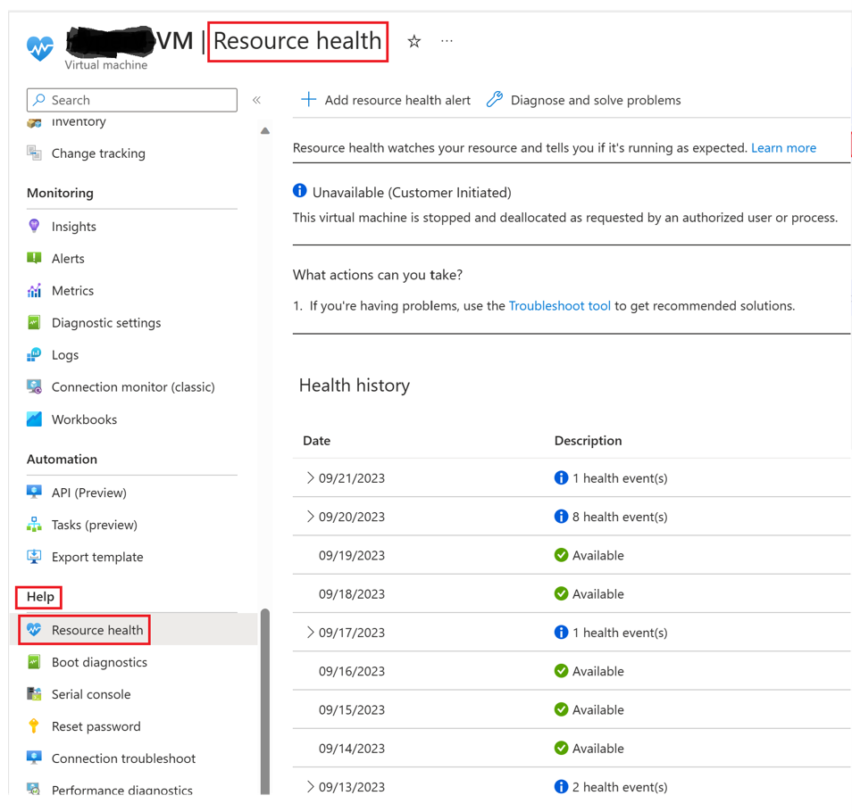
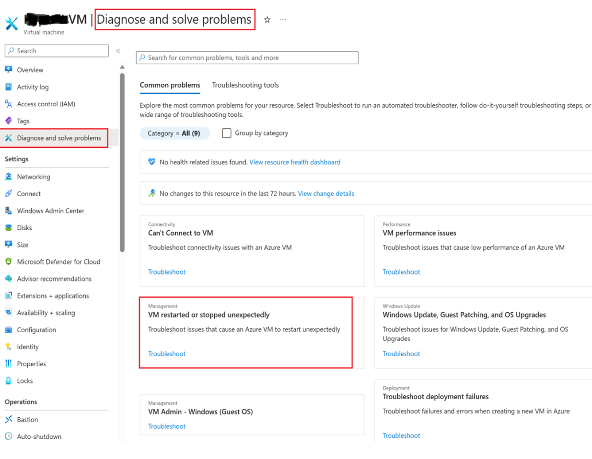
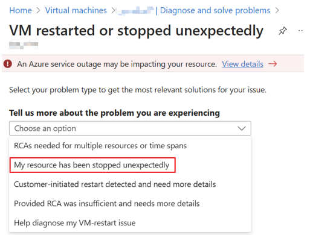
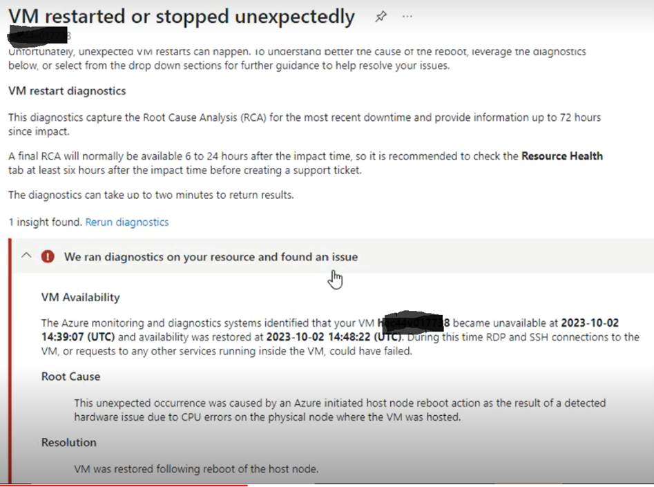

# Unexpected VM Reboot Root-Cause-Anaylsis

## Overview:
In the event of unexpected virtual machine (VM) reboots, Azure provides a straightforward method to access detailed Root Cause Analysis (RCA) information directly through the Azure Portal. 
This guide will walk you through the steps to check the RCA message in the Azure Portal, ensuring that you can quickly identify and address the cause of the unexpected VM reboot.

### How to check Unexpected VM reboot RCA message in the Azure Portal

**Method: 1**

1.	Navigate to the impacted VM blade in the Azure portal.
2.	Go to the **Help** section and then to **Resource Health**. Check for the health events for the unexpected VM reboot. It contains the RCA message.
    

**Method: 2**
1.	Navigate to the impacted Azure VM blade.
2.	Go to the **Diagnose and solve problems** section and select **VM Restarted or Stopped unexpectedly** as shown in below screenshot.
   

4.	Once you click on **VM restarted or stopped unexpectedly**, it will take you to below multiple options to select. Select **My resource has been stopped unexpectedly**.
    

6.	Once you select the option **My resource has been stopped unexpectedly**, a diagnostic will run in the backend to check the VM for any issue. And then provide the reboot RCA which customer can refer.
     
     

>[!Note]
>If Azure has further information about the root cause of a platform-initiated unavailability, that information may be posted in resource health up to 72 hours after the initial unavailability. This information is only available for virtual machines for now.
