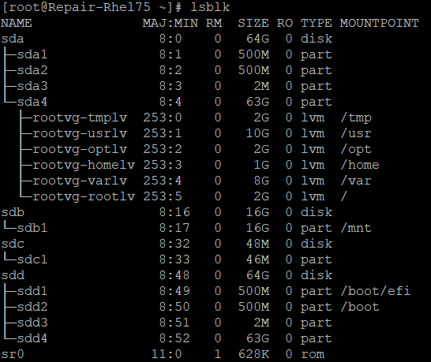
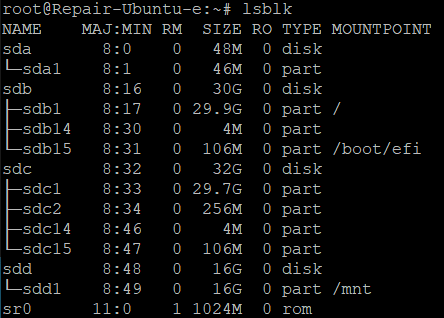

# Unlocking an encrypted Linux disk for offline repair 

This article describes how to unlock an encrypted OS disk for a Linux virtual machine (VM) for offline repair.

## Symptoms

If you are trying to repair the OS disk of a Linux VM offline, you might see error messages like the following examples after you try to mount the disk on a repair VM:  

   > mount: wrong fs type, bad option, bad superblock on /dev/sda2, missing codepage or helper program, or other error 
  
   > mount: unknown filesystem type 'LVM2_member'

In this case, Azure Disk Encryption (ADE) is enabled on the disk. You’ll be unable to mount the disk or perform any fixes on it from a repair VM until the disk is unlocked.  For more information, see [confirm that ADE is enabled on the disk](unlock-encrypted-disk-offline.md#confirm-that-ade-is-enabled-on-the-disk).

## Method 1: Unlock an encrypted disk automatically

This method relies on [az vm repair](/cli/azure/vm/repair?view=azure-cli-latest&preserve-view=true) commands to automatically create a repair VM, attach the failed Linux VM’s OS disk to that repair VM, and unlock the disk if it is encrypted. It requires use of a public IP address for the repair VM. This method unlocks the encrypted disk regardless of whether the ADE key is unwrapped or wrapped with a key encryption key (KEK).  

To repair the VM by using this automated method, see [Repair a Linux VM by using the Azure Virtual Machine repair commands](repair-linux-vm-using-azure-virtual-machine-repair-commands.md).

If you cannot repair the VM by using the `az vm repair` commands, try the following method to unlock the encrypted disk manually.

## Method 2: Unlock an encrypted disk

The method unlocks a managed Linux disk without requiring a public IP address for the repair VM.

There are only six steps to unlock and mount the encrypted disk:

1. [Create a new repair VM, and attach the encrypted disk to this VM during VM creation](#create-a-repair-vm).
   
   When you attach the encrypted disk at the time you create the repair VM, the system detects that the attached disk is encrypted. Then it fetches the ADE key from your Azure key vault and creates a new volume named "BEK VOLUME" to store the key file.

2. [Log in to the repair VM, then unmount any mounted partitions on the encrypted disk](#unmount-any-mounted-partitions-on-the-encrypted-disk).
3. [Identify the ADE key file in the BEK volume](#unmount-any-mounted-partitions-on-the-encrypted-disk).
4. [Identify the header file in the boot partition of the encrypted OS](#identify-the-header-file).
4. [Unlock the encrypted disk by using the ADE key file and the header file](#unlock-the-encrypted-disk).
5. Mount the partition: [LVM](#lvm), [RAW or non-LVM](#non-lvm).

### Create a Repair VM

1. Take a snapshot of the encrypted OS disk.
2. Create a disk from the snapshot. For the new disk, choose the same location and availability zone as the problem VM that you want to repair. 
3. Create a new VM based on the following specifications: 
   - In the Azure Marketplace, choose the same image for the repair VM that was used for the failed VM. (The OS version should be the same.)

   - Choose a size that allocates at least 8 GB of memory to the VM.  

   - Assign the VM to the same resource group, region, and availability settings that you used for the new disk that you created in the last step.

   On the Disks page of the "Create a Virtual Machine" wizard, attach as a data disk the new disk that you just created from the snapshot. 

> [!IMPORTANT]
> Make sure that you add the disk during the VM creation. It is only during VM creation that encryption settings are detected. This enables a volume that contains the BEK to be added automatically.

### Unmount any mounted partitions on the encrypted disk

1. After the repair VM is created, SSH to your repair VM and log in by using the appropriate credentials，and then elevate to root.

   ```

   sudo -s 
   ```
2. List the attached devices by using the `lsblk` command. In the output, you should see multiple attached disks. These disks include the active OS disk and the encrypted disk. They can appear in any order.

3. Identify the encrypted disk by using the following information:

   - The disk will have multiple partitions

   - The disk will not list the root directory ("/") as a mountpoint for any of its partitions.

   - The disk will match the size you noted when you created it from the snapshot.  

   In this first example that follows, the output indicates that **sdd** is the encrypted disk. It is the only disk with multiple partitions that does not list "/" as a mountpoint. (Also note that this VM uses logical volume management (LVM), which you can identify by the "rootvg" volume group on the partition sda4.)

   

   In the following example, sdc is the encrypted disk. Again, it is the only disk with multiple partitions that does not list "/" as a mountpoint. 

   


   In this final example that follows, sda is the encrypted disk.  
      
   

4. Unmount any partitions on the encrypted data disk that have been mounted in the file system. For example, in the first example above with LVM, you would need to unmount both **/boot/efi** and **/boot**. 

   ```
   umount /boot/efi 

   umount /boot 
   ```
   In the second example above, you would not need to unmount any partitions. But in the final example, you would need to unmount /boot directory.

### Identify the BEK key file

You need the key file and the header file to unlock the encrioty disk. The key file is stored in the BEK volume, and the header file is in the boot partition of the encrypted OS disk.

1. Determine which partition is the BEK volume.  

   ```
   lsblk -fs | grep -i bek 
   ```
   The following example output indicates that sdb1 is the BEK volume: 

   ```
   sdb1  vfat   BEK VOLUME      04A2-FE67 
   ```

   If no BEK volume is present, re-create the repair VM with the encrypted disk attached. If the BEK volume still does not attach automatically, use Resolution #3: Manual method to unlock an encrypted disk on a repair VM. 
2. Review the contents of the /mnt directory. 
   ```
   ls /mnt -l 
   ```
3. If a directory named azure_bek_disk doesn’t yet exist in the /mnt directory, create one now.  

   ```
   mkdir /mnt/azure_bek_disk 
   ```
4. Mount the BEK volume in the /mnt/azure_bek_disk directory. For example, if sdb1 is the BEK volume, you would type the following command: 
   ```
   mount /dev/sdb1 /mnt/azure_bek_disk 
   ```
5. List the available devices again. You will see that the partition you determined to be the BEK volume is now mounted in /mnt/azure_bek_disk.
   ```
   root@RepairVM:~$ lsblk 
   NAME    MAJ:MIN RM  SIZE RO TYPE MOUNTPOINT 
   sda       8:0    0   64G  0 disk 
   ├─sda1    8:1    0  500M  0 part 

   ├─sda2    8:2    0  500M  0 part 

   ├─sda3    8:3    0    2M  0 part 

   └─sda4    8:4    0   63G  0 part 

   sdb       8:16   0   48M  0 disk 

   └─sdb1    8:17   0   46M  0 part /mnt/azure_bek_disk 
   ```
6. List the contents of the /mnt/azure_bek_disk/ directory. 
   ```
   ls -l /mnt/azure_bek_disk
   ```
   You see the following files in the output: 

   ```
   total 1 

   -rwxr-xr-x 1 root root 148 Aug  4 01:04 CRITICAL_DATA_WARNING_README.txt 

   -r-xr-xr-x 1 root root 172 Aug  4 01:04 LinuxPassPhraseFileName 
   ```
   To unlock the encrypted disk, you will use the key file "LinuxPassPhraseFileName" displayed in this directory, along with the header file found in the boot partition of the encrypted disk. Next, you will mount this boot partition of the encrypted disk and finally unlock the disk.

### Identify the header file

The boot partition of the encrypted disk contains the header file. You use this file, together with the key file "LinuxPassPhraseFileName," to unlock the encrypted disk. 

1. Use the command lsblk -o NAME,SIZE,LABEL,PARTLABEL,MOUNTPOINT to show selected attributes of the available disks and partitions. 

   ```
   root@RepairVM:~# lsblk -o NAME,SIZE,LABEL,PARTLABEL,MOUNTPOINT 

   NAME     SIZE LABEL           PARTLABEL            MOUNTPOINT 

   sda       64G 

   ├─sda1   500M                 EFI System Partition 

   ├─sda2   500M 

   ├─sda3     2M 

   └─sda4    63G 

   sdb       48M 

   └─sdb1    46M BEK VOLUME                           /mnt/azure_bek_disk 

   sdc       30G 

   ├─sdc1  29.9G cloudimg-rootfs                      / 

   ├─sdc14    4M 

   └─sdc15  106M UEFI                                 /boot/efi 

   sdd       16G 

   └─sdd1    16G                                      /mnt 

   sr0      628K 
   ```
2. On the encrypted disk, identify the OS partition --the root partition. This is the largest partition on the encrypted disk. In this example output above, the root partition is sda4. This partition needs to be specified when the disk is unlocked. 
3. In the root directory ("/") of the file structure, create a directory into which to mount the root partition of the encrypted disk. (You will use this directory later, after the disk is unlocked.) To distinguish it from the active OS partition of the repair VM, give it the name "investigateroot".

   ```
   mkdir /investigateroot 
   ```
4. On the encrypted disk, identify the boot partition, which contains the header file. On the encrypted disk, the boot partition is the second largest partition that shows no value in the LABEL or PARTLABEL column. In the example output above, the encrypted disk’s boot partition is sda2. In the example output below, the encrypted disk’s boot partition is sdc2.

5. Mount the boot partition you identified in step 4 into the /investigateboot/ directory. In the following example, the boot partition of the encrypted disk is sda2, but the location on your system might differ.

   ```
   mount /dev/sda2 /investigateboot/ 
   ```
   If mounting the partition fails with an "wrong fs type, bad option, bad superblock" error, try again by using the mount -o nouuid command, as in the following example:

   ```
   mount -o nouuid /dev/sda1 /investigateboot/ 
   ```
6. List the files in the /investigateboot/ directory. The luks subdirectory contains the header file we need to unlock the disk.

   ```
   root@RepairVM:~# ls -l /investigateboot/ 

   total 43476 

   -rw-------. 1 root root  3409143 Mar 21  2018 System.map-3.10.0-862.el7.x86_64 

   -rw-r--r--. 1 root root   147819 Mar 21  2018 config-3.10.0-862.el7.x86_64 

   drwxr-xr-x. 2 root root        6 Jan 25  2021 efi 

   drwx------. 5 root root       79 Aug  2 16:47 grub2 

   -rw-------. 1 root root 21254204 Aug  2 16:48 initramfs-3.10.0-862.el7.x86_64.img 

   -rw-------. 1 root root 13003505 Aug  2 16:18 initramfs-3.10.0-862.el7.x86_64kdump.img 

   drwxr-xr-x. 2 root root       26 Aug  2 16:31 luks 

   -rw-r--r--. 1 root root   304926 Mar 21  2018 symvers-3.10.0-862.el7.x86_64.gz 

   -rwxr-xr-x. 1 root root  6381872 Mar 21  2018 vmlinuz-3.10.0-862.el7.x86_64
   ```
7. List the files in the /investigateboot/luks/ directory. The header file is named osluksheader. 

   ```
   root@RepairVM:~# ls -l /investigateboot/luks 

   total 32768 

   -rw-r--r--. 1 root root 33554432 Aug  2 16:31 osluksheader 
   ```

### Unlock the encrypted disk

1. Use the following command to unlock the root partition on the encrypted disk:

   ```
   cryptsetup luksOpen --key-file /mnt/azure_bek_disk/LinuxPassPhraseFileName --header /investigateboot/luks/osluksheader <path to root partition> <new name>
   ```
   For example, if the path to the root partition containing the encrypted OS is /dev/sda4, and you want to assign the unlocked partition the name "osencrypt," you would enter the following command:  

   ```
   cryptsetup luksOpen --key-file /mnt/azure_bek_disk/LinuxPassPhraseFileName --header /investigateboot/luks/osluksheader /dev/sda4 osencrypt 
   ```
1. Now that you have unlocked the disk, unmount the encrypted disk’s boot partition from the /investigateboot/ directory. You will need to mount this partition to another directory later.

      ```
      umount /investigateboot/ 
      ```
      The next step is to mount the partition you have just unlocked and assigned a new name. However, the method you use to mount this partition depends on whether the disk’s partitioning style is of the Logical Volume Manager (LVM) or RAW (non-LVM) type.

1. List the device information again along with the file system type.
      ```
      lsblk -o NAME,FSTYPE 
      ```
1. You will see a new unlocked partition with the name you assigned it. In our example, that name is "osencrypt".
      ```
      sblk -o NAME,FSTYPE 

      NAME          FSTYPE 

      fd0 

      sda 

      ├─sda1        xfs 

      └─sda2        xfs 

      sdb 

      └─sdb1        ext4 

      sdc 

      └─sdc1        vfat 

      sdd 

      ├─sdd1        xfs 

      └─sdd2 

      └─osencrypt xfs 
      ```
1. If the output does not refer to LVM for the FSTYPE of the new unlocked partition ("osencrypt"), as in the previous example, skip to [Mount the unlocked disk for chroot (RAW /non-LVM only)](#non-lvm)section.
1 If the output indicates that the FSTYPE of the unlocked partition as "LVM2_member," as in the following example, continue to the next procedure, Mount the unlocked partition for chroot (LVM only). 

      ```
      lsblk -o NAME,FSTYPE 

      NAME              FSTYPE 

      sda 

      ├─sda1            vfat 

      ├─sda2            xfs 

      ├─sda3 

      └─sda4            LVM2_member 

      ├─rootvg-tmplv  xfs 

      ├─rootvg-usrlv  xfs 

      ├─rootvg-optlv  xfs 

      ├─rootvg-homelv xfs 

      ├─rootvg-varlv  xfs 

      └─rootvg-rootlv xfs 

      sdb 

      ├─sdb1            vfat 

      ├─sdb2            xfs 

      ├─sdb3 

      └─sdb4 

      └─osencrypt     LVM2_member 

      sdc 

      └─sdc1            ext4 

      sdd 

      └─sdd1            vfat 

      sr0 
      ```

### <a name="lvm"></a> Mount the unlocked partition and enter the chroot environment (LVM only) 
If the disks use the LVM partitioning scheme, you need to take extra steps to mount the disk and enter the chroot environment. To use the chroot utility with the encrypted disk, the unlocked partition ("osencrypt") and its logical volumes must be recognized as the volume group named rootvg. However, by default, the repair VM’s OS partition and its logical volumes are already assigned to a volume group with the name rootvg. We first need to resolve this conflict. 

1. Use the pvs command to display the properties of the LVM physical volumes. You might see warning messages, as in the following example, that indicate that the unlocked partition ("/dev/mapper/osencrypt") and another device are using duplicate universally unique identifiers (UUIDs). Alternatively, you might see two partitions assigned to rootvg.

   ```
   root@RepairVM ~]# pvs 

   WARNING: Not using lvmetad because duplicate PVs were found. 

   WARNING: Use multipath or vgimportclone to resolve duplicate PVs? 

   WARNING: After duplicates are resolved, run "pvscan --cache" to enable lvmetad. 

   WARNING: PV Nv0rQb-DqIR-t7if-UghJ-Vz97-u48A-C3FCnb on /dev/mapper/osencrypt was already found on /dev/sda4. 

   WARNING: PV Nv0rQb-DqIR-t7if-UghJ-Vz97-u48A-C3FCnb prefers device /dev/sda4 because device is used by LV. 

   PV         VG     Fmt  Attr PSize   PFree 

   /dev/sda4  rootvg lvm2 a--  <63.02g <38.02g 
   ```
   You want only the unlocked partition ("osencrypt") to be assigned to the rootvg volume group so that you can access its logical volumes through the chroot utility. To fix this problem, you will temporarily import the partition into a different volume group and activate that volume group. Next, you will rename the current rootvg volume group. Only later, after you enter the chroot environment, will you rename the encrypted disk’s volume group as rootvg. 

2. Import the newly unlocked partition into a new volume group. In this example, we are temporarily naming the new volume group "rescuemevg." 
Import the newly unlocked partition into a new volume group. In this example, we are temporarily naming the new volume group "rescuemevg." 

3. Activate the new volume group. 

   ```
   vgchange -a y rescuemevg 

   6 logical volume(s) in volume group "rescuemevg" now active 
   ```
4. Rename the old rootvg volume group.  In this example, we will use the name "oldvg."

   ```
   vgrename rootvg oldvg 

   Volume group "rootvg" successfully renamed to "oldvg" 
   ```

5. Use the command `lsblk -o NAME,SIZE,LABEL,PARTLABEL,MOUNTPOINT` to review the available devices. You will now see both volume groups listed by the names you have assigned them. 

6. Mount the rescuemevg/rootlv logical volume to the /investigateroot/ directory without using the duplicate UUIDs. 

   ```
   mount -o nouuid /dev/rescuemevg/rootlv /investigateroot/ 
   ```

   With the root partition of the failed VM now unlocked and mounted, you can already perform troubleshooting that requires only file system access. For example, at this time you can edit the settings in investigateroot/etc/fstab or other configuration files to repair (for example) disk, SSH, or networking issues. For more information on offline fixes in the file system, see [Repair the VM offline](linux-recovery-cannot-start-file-system-errors.md#repair-the-vm-offline). 
### <a name="non-lvm"></a> Mount the unlocked disk and enter the chroot environment (RAW / non-LVM only)

1. Mount the newly unlocked partition ("osencrypt") to the /investigateroot/ directory. 

   ```
   mount /dev/mapper/osencrypt /investigateroot/ 
   ```

   If mounting the partition fails with an "wrong fs type, bad option, bad superblock" error, try again by using the mount -o nouuid command: 

   ```
   mount -o nouuid /dev/mapper/osencrypt /investigateroot/ 
   ```

2. Attempt to display the contents of the /investigateroot/ directory to verify that the mounted partition is now unlocked. 

   ```
   ls /investigateroot/ 

   1    boot  etc   lib    lost+found  mnt  proc  run   snap  sys  usr  vmlinuz 

   bin  dev   home  lib64  media       opt  root  sbin  srv   tmp  var  vmlinuz.old 
   ```

3. With the root partition of the failed VM now unlocked and mounted, you can already perform troubleshooting that only requires access to the file system. For example, at this time you can edit the settings in investigateroot/etc/fstab or other configuration files to repair (for example) disk, SSH, or networking issues. For more information on offline fixes in the file system, see Repair the VM offline. 

   However, if you want to use the chroot utility for troubleshooting, continue with the following steps: 

4. Use the command `lsblk -o NAME,SIZE,LABEL,PARTLABEL,MOUNTPOINT` to review the available devices. Identify the boot partition on the encrypted disk as the second largest partition that is assigned no label. 

5. Mount the boot partition on the encrypted disk to the /investigateroot/boot/ directory, as in the following example: 

   ```
   mount /dev/sdc2 /investigateroot/boot/ 
   ```

6. Change the active directory to the mounted root partition on the encrypted disk. 

   ```
   cd /investigateroot 
   ```

7. Enter the following commands to prepare the chroot environment: 

   ```
   mount -t proc proc proc 

   mount -t sysfs sys sys/ 

   mount -o bind /dev dev/ 

   mount -o bind /dev/pts dev/pts/ 

   mount -o bind /run run/ 
   ```

8. Enter the chroot environment:

   ```
   chroot /investigateroot/ 
   ```
### Troubleshoot in the chroot environment
 
1. Now that you can access the volume in the chroot environment, you can complete troubleshooting and mitigations as necessary. For example, you can read logs or run a script.  For more information, see Perform fixes in the chroot environment. 

2. After you have completed your repairs, use the umount command to unmount all the partitions on the encrypted disk that are mounted in the repair VM’s file structure. 

3. Stop (deallocate) the repair VM.

4. Use the following procedure to replace the source VM’s OS disk with the newly repaired disk.

## Method 3: Manual method to unlock an encrypted disk on a repair VM 

If you cannot find the BEK volume or other menthods don't work, try the following method to re-enable Disk encryption for the encrypted disk:  

1. If the source VM’s encrypted OS disk is a managed disk, follow the steps in Create the repair VM to attach a copy of the locked disk to a repair VM. 

   If the process of creating a new repair VM together with an attached encrypted disk hangs or fails, you can first create the VM without attaching the encrypted disk. After the repair VM is created, attach the encrypted disk to the VM through the Azure portal. 

1. In the Azure portal, navigate to the Disks blade for the repair VM. 

1. At the top menu, click Additional Settings. 

1. On the **Disk Settings** page, reapply **Azure Data Encryption** to the data disk only. Be sure to specify the same key vault, key, and version as those used to encrypt the disk the first time.  

   This procedure will trigger the VM to create and attach the BEK volume. 
1. Proceed to [Identify the ADE key file in the BEK volume](#identify-the-header-file) and from that point,  continue following the steps to unlock the disk.

## Next steps
If you're having problems connecting to your VM, see Troubleshoot Remote Desktop connections to an Azure VM. For problems accessing applications that run on your VM, see Troubleshoot application connectivity issues on virtual machines in Azure.
