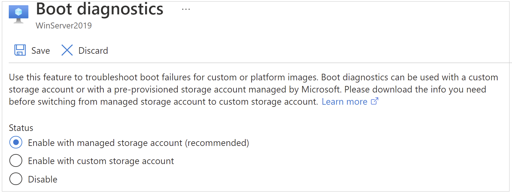

# How to use boot diagnostics to troubleshoot virtual machines in Azure

There can be many reasons that a virtual machine enters a non-bootable state. To address issues with your virtual machines created using Resource Manager deployment model, you can use the following debugging features: Console Output and Screenshot support for Azure virtual machines.

For Linux virtual machines, you can view the output of your console log from the Portal. For both Windows and Linux virtual machines, Azure enables you to see a screenshot of the VM from the hypervisor. Both features are supported for Azure virtual machines in all regions. Note, screenshots and output can take up to 10 minutes to appear in your storage account.

You can select the **Boot diagnostics** option to view the log and the screenshot.

:::image type="content" source="media/virtual-machines-common-boot-diagnostics/screenshot-tab.png" alt-text="Screenshot of the Screenshot tab in the Boot diagnostics page of Azure Portal.":::

## Common boot errors

- [0xC000000E](https://support.microsoft.com/help/4010129)
- [0xC000000F](https://support.microsoft.com/help/4010130)
- [0xC0000011](https://support.microsoft.com/help/4010134)
- [0xC0000034](https://support.microsoft.com/help/4010140)
- [0xC0000098](https://support.microsoft.com/help/4010137)
- [0xC00000BA](https://support.microsoft.com/help/4010136)
- [0xC000014C](https://support.microsoft.com/help/4010141)
- [0xC0000221](https://support.microsoft.com/help/4010132)
- [0xC0000225](https://support.microsoft.com/help/4010138)
- [0xC0000359](https://support.microsoft.com/help/4010135)
- [0xC0000605](https://support.microsoft.com/help/4010131)
- [An operating system wasn't found](https://support.microsoft.com/help/4010142)
- [Boot failure or INACCESSIBLE_BOOT_DEVICE](https://support.microsoft.com/help/4010143)

## Enable diagnostics on a virtual machine created using the Azure Portal

The following procedure is for a virtual machine created using the Resource Manager deployment model.

On the **Management** tab, in **Monitoring** section, make sure that **Boot diagnostics** is turned on. The default setting is to have boot diagnostics enabled using a managed storage account.

  

> [!NOTE]
> The Boot diagnostics feature does not support premium storage account or Zone Redundant Storage Account Types. If you use the premium storage account for Boot diagnostics, you might receive the StorageAccountTypeNotSupported error when you start the VM.
>

### Deploying from an Azure Resource Manager template

If you are deploying from an Azure Resource Manager template, navigate to your virtual machine resource and append the diagnostics profile section. Set the API version header to "2015-06-15" or later. The latest version is "2018-10-01".

```json
{
  "apiVersion": "2018-10-01",
  "type": "Microsoft.Compute/virtualMachines",
  … 
```

The diagnostics profile enables you to select the storage account where you want to put these logs.

```json
    "diagnosticsProfile": {
 "bootDiagnostics": {
 "enabled": true,
 "storageUri": "[concat('https://', parameters('newStorageAccountName'), '.blob.core.windows.net')]"
 }
    }
    }
}
```

For more information on deploying resources using templates, see [Quickstart: Create and deploy Azure Resource Manager templates by using the Azure portal](/azure/azure-resource-manager/templates/quickstart-create-templates-use-the-portal).

## Enable boot diagnostics on existing virtual machine

To enable Boot diagnostics on an existing virtual machine, follow these steps:

1. Sign in to the [Azure portal](https://portal.azure.com), and then select the virtual machine.
2. In the **Help** section, select **Boot diagnostics**, then select the **Settings** tab.
3. In **Boot diagnostics** settings, select the boot diagnostics with managed storage account or custom storage account.
    

1. Save the change.

### Enable boot diagnostics using the Azure CLI

You can use the Azure CLI to enable boot diagnostics on an existing Azure virtual machine. For more information, see [az vm boot-diagnostics](/cli/azure/vm/boot-diagnostics).

### Fix boot diagnostics screenshot not refreshing

If you notice the Boot Diagnostics screenshot for your Azure VM is stale in the Azure portal, first make sure the virtual display timeout is disabled in the guest operating system. For example, you may see the time shown on the logon screen is stale for a Windows VM.

#### For Windows, run the following command from elevated CMD

```console
powercfg /setacvalueindex SCHEME_CURRENT SUB_VIDEO VIDEOIDLE 0
```

#### For Linux, run the following command

```console
xset s off
```

For Windows VMs, the Azure provisioning agent is different than the VM agent. It runs the above command during provisioning for VMs created from a generalized image. You can see this event if you search for powercfg in C:\Windows\Panther\WaSetup.xml, which is the provisioning agent log. But since the provisioning agent does not need to run for VMs created from a specialized VHD, that is a scenario where you would need to run the powercfg command manually to disable the virtual display timeout. Also, it is possible to have a particularly old Azure VM created from generalized image that may not have it set because it was created before the provisioning agent was updated to disable the virtual display timeout.

[!INCLUDE [Azure Help Support](../../../includes/azure-help-support.md)]
