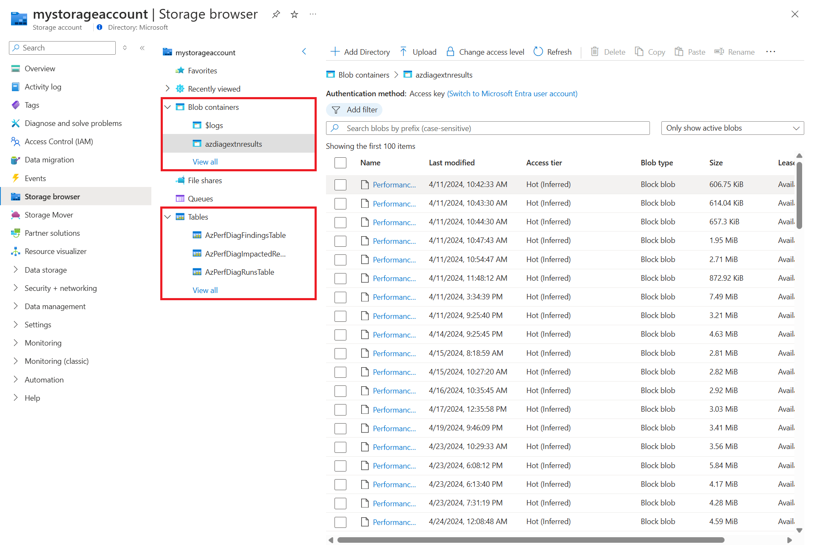

# Troubleshoot performance issues on Azure virtual machines using Performance Diagnostics

Use the Performance Diagnostics tool to identify and troubleshoot performance issues on your Azure virtual machine (VM) in one of two modes: 

- **Continuous diagnostics (preview)** collects data at five-second intervals and reports actionable insights about resource usage every five minutes. 
- **On-demand diagnostics** helps you troubleshoot an ongoing performance issue with more in-depth data, insights, and recommendations based on data collected at a single point in time. 

Performance Diagnostics stores all insights and reports in a storage account, which you can configure for short data retention to minimize costs. 

Run Performance Diagnostics directly from the Azure portal, where you can also review insights and a report on various logs, rich configuration, and diagnostics data. We recommend that you run Performance Diagnostics and review the insights and diagnostics data before you contact Microsoft Support.

This article explains how to use Performance Diagnostics and what the continuous and on-demand modes offer. 

> [!NOTE]
> Continuous diagnostics (preview) is being rolled out gradually and is currently supported only on Windows. If the preview feature is available for your machines, you'll see the option to enable both on-demand and continuous diagnostics, as described in [Install and run Performance Diagnostics on your VM](#install-and-run-performance-diagnostics-on-your-vm).

## Prerequisites

* To run continuous and on-demand diagnostics on Windows, you need [.NET SDK](/dotnet/core/install/windows) version 4.5 or a later. 

> [!NOTE]
> To run Performance Diagnostics on classic VMs, see [Azure Performance Diagnostics VM extension](performance-diagnostics-vm-extension.md).

## Permissions required

| Action | Permissions required |
|:-------|:---------------------|
| View Performance Diagnostics insights and reports | `Microsoft.Storage/storageAccounts/listKeys/action` permissions to the storage account, as provided by the built-in **Storage Account Contributor** role, for example. |

## Supported operating systems

### Windows

The following operating systems are currently supported for both on-demand and continuous diagnostics:

* Windows Server 2022
* Windows Server 2019
* Windows Server 2016
* Windows Server 2012 R2
* Windows Server 2012
* Windows 11
* Windows 10

### Linux

[!INCLUDE [CentOS End Of Life](../../../includes/centos-end-of-life-note.md)]

The following distributions are currently supported for on-demand diagnostics:

> [!NOTE]  
> Microsoft has only tested the versions that are listed in the table. If a version isn't listed in the table, then it isn't explicitly tested by Microsoft, but the version might still work.

| Distribution               | Version                                         |
|----------------------------|-------------------------------------------------|
| Oracle Linux Server        | 6.10 [`*`], 7.3, 7.5, 7.6, 7.7, 7.8, 7.9 |
| CentOS                     | 6.5 [`*`], 7.6, 7.7, 7.8, 7.9 |
| RHEL                       | 7.2, 7.5, 8.0 [`*`], 8.1, 8.2, 8.6, 8.8 |
| Ubuntu                     | 14.04, 16.04, 18.04, 20.04, 22.04 |
| Debian                     | 8, 9, 10, 11 [`*`] |
| SLES                       | 12 SP4 [`*`], 12 SP5 [`*`], 15 [`*`], 15 SP1 [`*`], 15 SP2 [`*`], 15 SP4 [`*`] |
| AlmaLinux                  | 8.4, 8.5 |
| Azure Linux                | 2.0 |

> [!NOTE]
> [`*`] See [Known issues](../linux/how-to-use-perfinsights-linux.md#known-issues)

## Install and run Performance Diagnostics on your VM

Performance Diagnostics installs a VM extension that runs a diagnostics tool, called PerfInsights. PerfInsights is available for both [Windows](how-to-use-perfinsights.md) and [Linux](../linux/how-to-use-perfinsights-linux.md). 

To install and run Performance Diagnostics:

1. In the [Azure portal](https://portal.azure.com), select **Virtual machines**.
1. From the list of VM names, select the VM that you want to run diagnostics on.
1. In the **Help** section, select **Performance Diagnostics**.

    :::image type="content" source="media/performance-diagnostics/open-performance-diagnostics.png" alt-text="Screenshot of Azure portal, with Install Performance Diagnostics button highlighted." lightbox="media/performance-diagnostics/open-performance-diagnostics.png":::

1. Select **Enable Performance Diagnostics**
1. Select the options to install and run for the tool.

    :::image type="content" source="media/performance-diagnostics/install-and-run-context-pane.png" alt-text="Screenshot of the Install and run Performance Diagnostics context pane. The Enable continuous diagnostics and Run on-demand diagnostics options are checked." lightbox="media/performance-diagnostics/install-and-run-context-pane.png":::

    This table describes the available options:

    | Option | Description |
    | ------ | ----------- |
    | Enable continuous diagnostics | Get continuous, actionable insights into high resource usage with data collected every 5 seconds and updates uploaded every 5 minutes to address performance issues promptly. Store insights in your preferred storage account, [customizing retention policies](/azure/storage/blobs/lifecycle-management-policy-configure) based on your needs. Disable this feature at any time. |
    | Run on-demand diagnostics | Get on-demand, actionable insights into high resource usage and various system configurations. Receive a downloadable report with comprehensive diagnostics data to address performance issues. Store insights and reports in your preferred storage account, [customizing retention policies](/azure/storage/blobs/lifecycle-management-policy-configure) based on your needs. Initiate this feature at any time for the specific analysis type you need: <ul><li>**Performance analysis** Includes all checks in the **Quick analysis** scenario, and monitors high resource consumption. Use this version to troubleshoot general performance issues, such as high CPU, memory, and disk usage. This analysis takes 30 seconds to 15 minutes, depending on the selected duration. Learn more [Windows](how-to-use-perfinsights.md) or [Linux](../linux/how-to-use-perfinsights-linux.md)</li><li>**Quick analysis** Checks for known issues, analyzes best practices, and collects diagnostics data. This analysis takes several minutes to run. Learn more [Windows](how-to-use-perfinsights.md) or [Linux](../linux/how-to-use-perfinsights-linux.md)</li><li>**Advanced performance analysis** [`*`] Includes all checks in the **Performance analysis** scenario, and collects one or more of the traces, as listed in the following sections. Use this scenario to troubleshoot complex issues that require more traces. Running this scenario for longer periods increases the overall size of diagnostics output, depending on the size of the VM and the trace options that are selected. This analysis takes 30 seconds to 15 minutes to run, depending on the selected duration. [Learn more](./how-to-use-perfinsights.md)</li><li>**Azure file analysis** [`*`] Includes all checks in the **Performance analysis** scenario, and captures a network trace and SMB counters. Use this scenario to troubleshoot the performance of Azure files. This analysis takes 30 seconds to 15 minutes to run, depending on the selected duration. [Learn more](./how-to-use-perfinsights.md)</li></ul> |
    | Storage account | Optionally, if you want to use a single storage account to store the Performance Diagnostics results for multiple VMs, you can select a storage account from the dropdown. If you don't specify a storage account, Performance Diagnostics uses the default diagnostics storage account or creates a new storage account. |

    > [!NOTE]
    > [`*`] These analysis scenarios are only supported on Windows.

1. Review the legal terms and privacy policy, and select the corresponding checkbox to acknowledge (required).

    To install and run Performance Diagnostics, you must agree to the legal terms and accept the privacy policy.

1. To share diagnostics information with Microsoft, select **I agree to share diagnostics information with Microsoft.**

    When you select this option, you share the diagnostics with customer support engineers automatically. For a complete list of all the collected diagnostics data, see **What kind of information is collected by PerfInsights?** on [Windows](how-to-use-perfinsights.md#what-kind-of-information-is-collected-by-perfinsights) or [Linux](../linux/how-to-use-perfinsights-linux.md#what-kind-of-information-is-collected-by-perfinsights).

1. Select **Apply** to apply the selected options and install the tool.

    A notification is displayed as Performance Diagnostics starts to install. After the installation is completed, you see a notification that indicates that the installation is successful. If the **Run on-demand diagnostics** option is selected, the selected performance analysis scenario is then run for the specified duration. 

## View insights and reports

This table compares the data provided by Continuous and On-demand Performance Diagnostics. For a complete list of all the collected diagnostics data, see **What kind of information is collected by PerfInsights?** on [Windows](how-to-use-perfinsights.md#what-kind-of-information-is-collected-by-perfinsights) or [Linux](../linux/how-to-use-perfinsights-linux.md#what-kind-of-information-is-collected-by-perfinsights).

|  | Continuous Performance Diagnostics | On-demand Performance Diagnostics |
|---------|------------------------------------|-----------------------------------|
| **Availability** | Currently supported only for Windows VMs | Supported for both Windows and Linux VMs |
| **Insights generated** | Continuous actionable insights into high resource usage, such as high CPU, high memory, and high disk usage | On-demand actionable insights into high resource usage and various system configurations |
| **Data collection frequency** | Collects data every 5 seconds, updates uploaded every 5 minutes | Collect data on demand for the selected duration of the on-demand run |
| **Reports generated** | Doesn't generate a report | Generates a report with comprehensive diagnostics data |

### View Performance Diagnostics insights

The **Performance Diagnostics insights** tab lists insights for the selected time period. Each row presents an insight, its impact level, category, and related recommendations. Select **Refresh** to view newly generated continuous diagnostics insights. 

:::image type="content" source="media/performance-diagnostics/insights-list-enabled-no-grouping.png" alt-text="Screenshot of the Insights tab on the Performance Diagnostics screen." lightbox="media/performance-diagnostics/insights-list-enabled-no-grouping.png":::

Select a row to view more details.

:::image type="content" source="media/performance-diagnostics/performance-diagnostics-insight-details.png" alt-text="Screenshot of Performance Diagnostics insight details screen." lightbox="media/performance-diagnostics/performance-diagnostics-insight-details.png" :::

Use filters to retrieve insights by timestamp, impact, category, or diagnostic type.

Use the grouping dropdown to group or ungroup insights. You can group on-demand and continuous insights by category, insight, or recommendation.

:::image type="content" source="media/performance-diagnostics/insights-list-enabled-grouping-insight.png" alt-text="Screenshot of the Insights tab on the Performance Diagnostics screen with results grouped by insight." lightbox="media/performance-diagnostics/insights-list-enabled-grouping-insight.png":::

View or download the Performance Diagnostics report for an on-demand insight in the list by selecting **View** or **Download**, respectively. For more information, see [Download and review the full Performance Diagnostics report](#download-and-review-the-full-performance-diagnostics-report).

### View Performance Diagnostics reports

The **Performance Diagnostics reports** tab list all of the on-demand diagnostics reports that were run. The list indicates the type of analysis that was run, insights that were found, and their impact levels. 

:::image type="content" source="media/performance-diagnostics/select-report.png" alt-text="Screenshot of selecting a diagnostics report from Performance Diagnostics screen." lightbox="media/performance-diagnostics/select-report.png":::

Select a row to view more details.

:::image type="content" source="media/performance-diagnostics/performance-diagnostics-report-overview.png" alt-text="Screenshot of Performance Diagnostics report overview screen." lightbox="media/performance-diagnostics/performance-diagnostics-report-overview.png":::

Each Performance Diagnostics report might contain several insights and indicate an impact level of High, Medium, or Low. Each insight also contains recommendations. Insights are grouped for easy filtering.

Impact levels represent the potential for performance issues, based on factors such as misconfiguration, known problems, or issues that are reported by other users. You might not yet be experiencing one or more of the listed issues. For example, you might have SQL log files and database files on the same data disk. This condition has a high potential for bottlenecks and other performance issues if the database usage is high, whereas you might not notice an issue if the usage is low.

### Download and review the full Performance Diagnostics report

Select the **Download report** button to download an HTML report that contains richer diagnostics information, such as storage and network configuration, performance counters, traces, list of processes, and logs. The content depends on the selected analysis. For advanced troubleshooting, the report might contain additional information and interactive charts that are related to high CPU usage, high disk usage, and processes that consume excessive memory. For more information about the Performance Diagnostics report, see [Windows](how-to-use-perfinsights.md#review-the-diagnostics-report) or [Linux](../linux/how-to-use-perfinsights-linux.md#review-the-diagnostics-report).

> [!NOTE]
> You can download Performance Diagnostics reports from the **Performance Diagnostics** screen within 30 days after you generate them. After 30 days, you might get an error when you download a report from the **Performance Diagnostics** screen. To get a report after 30 days, go to the storage account and download it from a binary large object (BLOB) container that's named *azdiagextnresults*. You can view the storage account information by using the **Settings** button on the toolbar.

## View and manage storage account and stored data

Performance Diagnostics stores all insights and reports in a storage account, which you can [configure for short data retention](/azure/storage/blobs/lifecycle-management-policy-configure) to minimize costs. 

You can use the same storage account for multiple VMs that use Performance Diagnostics. When you change the storage account, the old reports and insights aren't deleted. However, they'll no longer be displayed in the list of diagnostics reports.

> [!NOTE]
> Performance Diagnostics stores insights in Azure tables and stores reports in a binary large object (BLOB) container.
>
> If your storage account uses [private endpoints](/azure/storage/common/storage-private-endpoints), to make sure that Performance Diagnostics can store insights and reports in the storage account:
>
> 1. Create separate private endpoints for Table and BLOB.
> 1. Add DNS configuration to each separate private endpoint.

### View diagnostics data stored in your account

To view these files:

1. Navigate to your storage account.
1. Select **Storage browser**.

    

    Performance Diagnostics stores reports in a binary large object (BLOB) container, named **azdiagextnresults**, and insights in tables.

    Insights include:

    - All the insights and related information about the run.
    - An output compressed (.zip) file (named **PerformanceDiagnostics_yyyy-MM-dd_hh-mm-ss-fff.zip**) on Windows and a tar file (named **PerformanceDiagnostics_yyyy-MM-dd_hh-mm-ss-fff.tar.gz**) on Linux that contains log files.
    - An HTML report.
 
### Change storage accounts

To change storage accounts: 

1. Select the **Settings** toolbar button to change the storage account where the diagnostics insights and output are stored. 

    :::image type="content" source="media/performance-diagnostics/performance-diagnostics-settings.png" alt-text="Screenshot of the Performance Diagnostics screen toolbar with the Settings button highlighted." lightbox="media/performance-diagnostics/performance-diagnostics-settings.png":::

    This opens the **Performance diagnostic settings** screen. 

    :::image type="content" source="media/performance-diagnostics/change-storage-settings.png" alt-text="Screenshot of the Performance Diagnostics settings screen on which you can change storage accounts." lightbox="media/performance-diagnostics/change-storage-settings.png":::

1. Select **Change storage account** to select a different storage account.

## Uninstall Performance Diagnostics

Uninstalling Performance Diagnostics from a VM removes the VM extension but doesn't affect any diagnostics data in the storage account.

To uninstall Performance Diagnostics, select the **Uninstall** button on the toolbar.

:::image type="content" source="media/performance-diagnostics/uninstall-button.png" alt-text="Screenshot of the Performance Diagnostics screen toolbar with the Uninstall button highlighted." lightbox="media/performance-diagnostics/uninstall-button.png":::

## Frequently asked questions

### How do I share this data with Microsoft Customer Support?

There are multiple ways to share the diagnostics report with Microsoft.

**Option 1:** Automatically share the latest report  
When you open a support ticket with Microsoft, it's important to share the Performance Diagnostics report. If you opt to share this information with Microsoft while you run the diagnostics (by selecting the "**I agree to share diagnostics information with Microsoft**" check box), Microsoft can access the report from your storage account using a SAS link to the output zip file for up to 30 days from the run date. Only the latest report is available to the support engineer.

**Option 2:** Generate a Shared Access Signature for the diagnostics report compressed file  
To share a link to the reports compressed file by using Shared Access Signatures:

1. In the Azure portal, browse to the storage account in which the diagnostics data is stored.
1. Select **Containers** under the **Data Storage** section.".
1. Select the **azdiagextnresults** container.
1. Select the Performance Diagnostics output compressed file that you want to share.
1. On the **Generate SAS** tab, select the criteria for sharing.
1. Select **Generate blob SAS token and URL**.
1. Copy the **Blob SAS URL**, and share it with the support engineer.

**Option 3:** Download the report from the storage account

You can also locate the Performance Diagnostics report compressed file by using steps 1–4 in Option 2. Select to download the file, and then share it through email or ask the support engineer for instructions to upload the file.  

### How do I capture diagnostics data at the correct time?

We recommend you run Continuous Performance Diagnostics, which captures VM diagnostics data on an ongoing basis.

The On-demand Performance Diagnostics run has two stages:

1. Install or update the Performance Diagnostics VM extension.
1. Run the diagnostics for the specified duration.

Currently there's no easy way to know exactly when the VM extension installation is complete. Generally it takes about 45 seconds to 1 minute to install the VM extension. After the VM extension is installed, you can run your repro steps to have the On-deman Performance Diagnostics capture the correct set of data for troubleshooting.

### Will Performance Diagnostics continue to work when I move my Azure VM across regions?

Azure VMs, and related network and storage resources, can be moved across regions by using Azure Resource Mover. However, moving VM extensions across regions isn't supported. For example, moving the Azure Performance Diagnostics VM extension across regions isn't supported. You have to install it manually on the VM in the target region after the VM is moved. For more information, see [Support matrix for moving Azure VMs between Azure regions](/azure/resource-mover/support-matrix-move-region-azure-vm).

[!INCLUDE [Azure Help Support](../../../includes/azure-help-support.md)]
