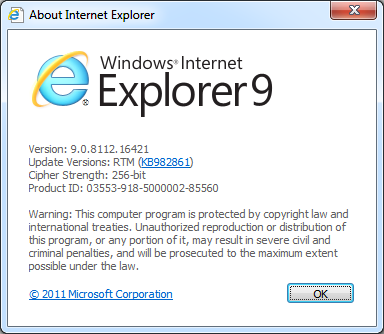
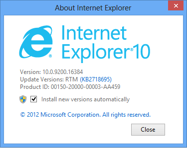
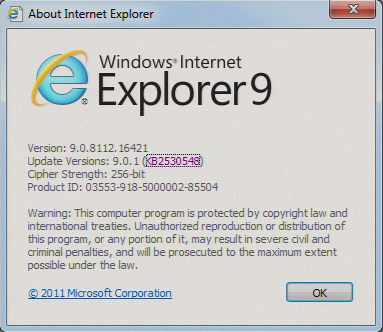

# Information about Internet Explorer versions

This article contains version information about Internet Explorer. This article also discusses how to determine which version of Internet Explorer is installed on your computer.

_Original product version:_ &nbsp; Internet Explorer 9 and later versions  
_Original KB number:_ &nbsp; 969393

## Summary

### Release versions of Internet Explorer for Windows

Internet Explorer version numbers for Windows 95, Windows NT 4.0, Windows 98, Windows 98 Second Edition, Windows Millennium Edition (Me), Windows 2000, Windows XP, Windows Server 2003, Windows Vista, Windows 7, and Windows 8 use the following format:

**major version.** **minor version.** **build number.** **subbuild number**

This table shows possible Internet Explorer version numbers.

| Version| Product |
|---|---|
|4.40.308|Internet Explorer 1.0 (Plus! for Windows 95)|
|4.40.520|Internet Explorer 2.0|
|4.70.1155|Internet Explorer 3.0|
|4.70.1158|Internet Explorer 3.0 (Windows 95 OSR2)|
|4.70.1215|Internet Explorer 3.01|
|4.70.1300|Internet Explorer 3.02 and 3.02a|
|4.71.544|Internet Explorer 4.0 Platform Preview 1.0 (PP1)|
|4.71.1008.3|Internet Explorer 4.0 Platform Preview 2.0 (PP2)|
|4.71.1712.6|Internet Explorer 4.0|
|4.72.2106.8|Internet Explorer 4.01|
|4.72.3110.8|Internet Explorer 4.01 Service Pack 1 (Windows 98)|
|4.72.3612.1713|Internet Explorer 4.01 Service Pack 2|
|5.00.0518.10|Internet Explorer 5 Developer Preview (Beta 1)|
|5.00.0910.1309|Internet Explorer 5 Beta (Beta 2)|
|5.00.2014.0216|Internet Explorer 5|
|5.00.2314.1003|Internet Explorer 5 (Office 2000)|
|5.00.2614.3500|Internet Explorer 5 (Windows 98 Second Edition)|
|5.00.2516.1900|Internet Explorer 5.01 (Windows 2000 Beta 3, build 5.00.2031)|
|5.00.2919.800|Internet Explorer 5.01 (Windows 2000 RC1, build 5.00.2072)|
|5.00.2919.3800|Internet Explorer 5.01 (Windows 2000 RC2, build 5.00.2128)|
|5.00.2919.6307|Internet Explorer 5.01 (Office 2000 SR-1)|
|5.00.2920.0000|Internet Explorer 5.01 (Windows 2000, build 5.00.2195)|
|5.00.3103.1000|Internet Explorer 5.01 SP1 (Windows 2000 SP1)|
|5.00.3105.0106|Internet Explorer 5.01 SP1 (Windows 95/98 and Windows NT 4.0)|
|5.00.3314.2101|Internet Explorer 5.01 SP2 (Windows 95/98 and Windows NT 4.0)|
|5.00.3315.1000|Internet Explorer 5.01 SP2 (Windows 2000 SP2)|
|5.00.3502.1000|Internet Explorer 5.01 SP3 (Windows 2000 SP3 only)|
|5.00.3700.1000|Internet Explorer 5.01 SP4 (Windows 2000 SP4 only)|
|5.50.3825.1300|Internet Explorer 5.5 Developer Preview (Beta)|
|5.50.4030.2400|Internet Explorer 5.5 & Internet Tools Beta|
|5.50.4134.0100|Internet Explorer 5.5 for Windows Me (4.90.3000)|
|5.50.4134.0600|Internet Explorer 5.5|
|5.50.4308.2900|Internet Explorer 5.5 Advanced Security Privacy Beta|
|5.50.4522.1800|Internet Explorer 5.5 Service Pack 1|
|5.50.4807.2300|Internet Explorer 5.5 Service Pack 2|
|6.00.2462.0000|Internet Explorer 6 Public Preview (Beta)|
|6.00.2479.0006|Internet Explorer 6 Public Preview (Beta) Refresh|
|6.00.2600.0000|Internet Explorer 6 (Windows XP)|
|6.00.2800.1106|Internet Explorer 6 Service Pack 1 (Windows XP SP1)|
|6.00.2900.2180|Internet Explorer 6 for Windows XP SP2|
|6.00.2900.5512|Internet Explorer 6 for Windows XP SP3|
|6.00.3663.0000|Internet Explorer 6 for Windows Server 2003 RC1|
|6.00.3718.0000|Internet Explorer 6 for Windows Server 2003 RC2|
|6.00.3790.0000|Internet Explorer 6 for Windows Server 2003 (release)|
|6.00.3790.1830|Internet Explorer 6 for Windows Server 2003 SP1 and Windows XP x64|
|6.00.3790.3959|Internet Explorer 6 SP2 for Windows Server 2003 SP1 and Windows XP x64|
|7.00.5730.1100|Internet Explorer 7 for Windows XP and Windows Server 2003|
|7.00.5730.1300|Internet Explorer 7 for Windows XP and Windows Server 2003|
|7.00.6000.16386|Internet Explorer 7 for Windows Vista|
|7.00.6000.16441|Internet Explorer 7 for Windows Server 2003 SP2 x64|
|7.00.6000.16441|Internet Explorer 7 for Windows XP SP2 x64|
|7.00.6001.1800|Internet Explorer 7 for Windows Server 2008 and for Windows Vista SP1|
|8.00.6001.17184|Internet Explorer 8 Beta 1|
|8.00.6001.18241|Internet Explorer 8 Beta 2|
|8.00.6001.18372|Internet Explorer 8 RC1|
|8.00.6001.18702|Internet Explorer 8 for Windows XP, Windows Vista, Windows Server 2003 and Windows Server 2008|
|8.00.7000.00000|Internet Explorer 8 for Windows 7 Beta|
|8.00.7600.16385|Internet Explorer 8 for Windows 7 and for Windows Server 2008 R2 (release)|
|9.0.8080.16413|Internet Explorer 9 RC|
|9.0.8112.16421|Internet Explorer 9 RTM|
|10.0.8250.00000|Internet Explorer 10 Consumer Preview|
|10.0.8400.00000|Internet Explorer 10 Release Preview|
|10.0.9200.16384|Internet Explorer 10 for Windows 8|
|||

Internet Explorer 11 will have a version number that starts with 11 (for example, 11.0.9600). The version number will change based on the updates that have been installed for Internet Explorer. To see the version number and the most recent update installed, go to the **Help** menu and select **About Internet Explorer**.

Notes

- The minor version number, build number, and subbuild number may be displayed without trailing zeros. For example, version 7.00.5730.1100 may be displayed as 7.0.5730.11.
- All versions of Internet Explorer 5.0 (and later versions) that are customized with Microsoft Internet Explorer Administration Kit (IEAK) include one of the following strings after the version number. To view this information, click About on the Help menu:  

  - **IC** = Internet content provider
  - **IS** = Internet service provider
  - **CO** = Corporate administrator

- Internet Explorer version 4.0 and later versions include an Update Versions line that lists all installed updates or hotfixes to the current version of Internet Explorer. Updates to Internet Explorer 4.01 Service Pack 2 or Internet Explorer 5.0 and later versions are listed by their corresponding Microsoft Knowledge Base article number.
- The version numbers of Internet Explorer in the list are based on the versions of Windows. The list numbers might be changed by the latest hotfix.
- The build number of Internet Explorers in the release version of Windows Vista is the same as in other versions.

### Changes to the About Internet Explorer dialog box in Internet Explorer 9 and Internet Explorer 10

You can open the **About Internet Explorer** dialog box by clicking **Help** and then clicking **About Internet Explorer**. Or, press Alt+X and then press A.

One change from previous versions of Internet Explorer is how we use the Update Versions field. The field is updated every time Internet Explorer 9 or Internet Explorer 10 is updated. The version number has the following components:

- The App Major version field will remain **9** or **10**.
- The App Minor version field will remain **0**.
- The **Update revision** field will increment by **1** for each Internet Explorer update that is released.

Every update has an associated Knowledge base article (for example, [KB2360131](https://support.microsoft.com/help/2360131) - MS10-071: Cumulative security update for Internet Explorer) associated with it. The article provides detailed information about what is included in the update, and it also provides detailed information about the binaries that are updated. The **About Internet Explorer** dialog box provides a link to the Microsoft Knowledge Base Article that is associated with the most recently installed update to Internet Explorer as an easy way to get more information.

For example, if the first update for Internet Explorer 9 has been installed, the **About Internet Explorer** dialog box will have a link to **Update versions: 9.0.1 ([KB2530548](https://support.microsoft.com/help/2530548))**.

### How to determine the version of Internet Explorer for Windows

To determine the version of Internet Explorer, use any of the following methods:

- The Microsoft OneScript team has released a script to run in PowerShell that can determine Internet Explorer versions are installed on your Windows. For more information about this script, see [How to determine Internet Explorer versions by PowerShell](https://gallery.technet.microsoft.com/how-to-determine-internet-2abf26ca) in TechNet Gallery.
- In all versions of Internet Explorer, click **About Internet Explorer** on the **Help** menu. The product and version information are displayed in the dialog box that appears.
- Use the registry. You can determine the version of Internet Explorer by viewing the following registry key:

    `HKEY_LOCAL_MACHINE\Software\Microsoft\Internet Explorer`  

  If a version value appears in this key, Internet Explorer 4.0 or a later version is installed. The version string value contains the version number of Internet Explorer 4.0 (or a later version) that is installed on your computer. (For example, the version string value for Internet Explorer 5 is 5.0.2014.0216). Only one zero is stored in the registry for the minor version number if the minor version number is 00. If the minor version number is not 00, the full version value is stored. (For example, 5.50.4807.2300 is stored in the registry as 5.50.4807.2300.)

  > [!NOTE]
  > The version string value for Internet Explorer 10 is 9.10.9200.16384, and the svcVersion string value is 10.0.9200.16384.

Internet Explorer 3. x does not add the version value to the registry. Instead, it adds a **build** value to the same registry key and updates the **IVer** string value to **103**. For backward compatibility, Internet Explorer 4.0 and later versions change or add the build value. For Internet Explorer 3. x, the build value is a string that contains the four-character build number. (For example, **1300** is the build value for Internet Explorer 3.02). For Internet Explorer 4.0 and later versions, the build value is a string that contains a five-character value, followed by a period and four more characters, in the following format:

**major version build number**. **subbuild number**  

For example, the build value for Internet Explorer 5 is 52014.0216.

- Determine the version of Internet Explorer by using the **Shdocvw.dll** file:

For Internet Explorer 3.0 through 6, the browser is implemented in the Shdocvw.dll (Shell Document Object and Control Library) file. You can use the version of the Shdocvw.dll file to determine the version of Internet Explorer 3.0 through 6 that is installed on your computer. To determine the version number of Internet Explorer 7, you must determine the version number of Iexplore.exe. To do this, follow these steps:

  1. Click **Start**, point to **Find**, and then click **Files Or Folders**.
  2. In the **Named** box, type *shdocvw.dll*, and then click **Find** Now.
  3. In the list of files, right-click the **Shdocvw.dll** file, and then click **Properties**.
  4. Click the **Version** tab.
  5. Repeat steps 2 through 4, but in step 2, instead type *iexplore.exe*. If the version of Iexplore.exe is **7. x**, Internet Explorer 7 is installed. Use the table of Internet Explorer versions earlier in this article to compare the version number to release versions of Internet Explorer 7.This table lists the different versions of the Shdocvw.dll file and the corresponding versions of Internet Explorer.

|Version|Product|
|---|---|
|4.70.1155|Internet Explorer 3.0|
|4.70.1158|Internet Explorer 3.0 (Windows 95 OSR2)|
|4.70.1215|Internet Explorer 3.01|
|4.70.1300|Internet Explorer 3.02 and 3.02a|
|4.71.1008.3|Internet Explorer 4.0 Platform Preview 2.0 (PP2)|
|4.71.1712.5|Internet Explorer 4.0|
|4.72.2106.7|Internet Explorer 4.01|
|4.72.3110.3|Internet Explorer 4.01 Service Pack 1 (Windows 98)|
|4.72.3612.1707|Internet Explorer 4.01 Service Pack 2|
|5.00.0518.5|Internet Explorer 5 Developer Preview (Beta 1)|
|5.00.0910.1308|Internet Explorer 5 Beta (Beta 2)|
|5.00.2014.213|Internet Explorer 5|
|5.00.2314.1000|Internet Explorer 5 (Office 2000)|
|5.00.2516.1900|Internet Explorer 5.01 (Windows 2000 Beta 3, build 5.00.2031)|
|5.00.2614.3500|Internet Explorer 5 (Windows 98 Second Edition)|
|5.00.2919.800|Internet Explorer 5.01 (Windows 2000 RC1, build 5.00.2072)|
|5.00.2919.3800|Internet Explorer 5.01 (Windows 2000 RC2, build 5.00.2128)|
|5.00.2919.6307|Internet Explorer 5.01 (Office 2000 SR-1)|
|5.00.2920.0000|Internet Explorer 5.01 (Windows 2000, build 5.00.2195)|
|5.00.3103.1000|Internet Explorer 5.01 SP1 (Windows 2000 SP1)|
|5.00.3105.0106|Internet Explorer 5.01 SP1 (Windows 95/98 and Windows NT 4.0)|
|5.00.3314.2100|Internet Explorer 5.01 SP2 (Windows 95/98 and Windows NT 4.0)|
|5.00.3315.2879|Internet Explorer 5.01 SP2 (Windows 2000 SP2)|
|5.00.3502.5400|Internet Explorer 5.01 SP3 (Windows 2000 SP3 only)|
|5.00.3700.6668|Internet Explorer 5.01 SP4 (Windows 2000 SP4 only)|
|5.50.3825.1300|Internet Explorer 5.5 Developer Preview (Beta)|
|5.50.4030.2400|Internet Explorer 5.5 & Internet Tools Beta|
|5.50.4134.0100|Internet Explorer 5.5 for Windows Me (4.90.3000)|
|5.50.4134.0600|Internet Explorer 5.5|
|5.50.4308.2900|Internet Explorer 5.5 Advanced Security Privacy Beta|
|5.50.4522.1800|Internet Explorer 5.5 Service Pack 1|
|5.50.4807.2300|Internet Explorer 5.5 Service Pack 2|
|6.00.2462.0000|Internet Explorer 6 Public Preview (Beta)|
|6.00.2479.0006|Internet Explorer 6 Public Preview (Beta) Refresh|
|6.00.2600.0000|Internet Explorer 6 (Windows XP)|
|6.00.2800.1106|Internet Explorer 6 Service Pack 1 (Windows XP SP1)|
|6.00.2900.2180|Internet Explorer 6 for Windows XP SP2|
|6.00.2900.5512|Internet Explorer 6 for Windows XP SP3|
|6.00.2800.1278|Internet Explorer 6 Update v.01 Developer Preview (SP1b Beta)|
|6.00.2800.1314|Internet Explorer 6 Update v.04 Developer Preview (SP1b Beta)|
|6.00.3663.0000|Internet Explorer 6 for Windows Server 2003 RC1|
|6.00.3718.0000|Internet Explorer 6 for Windows Server 2003 RC2|
|6.00.3790.0000|Internet Explorer 6 for Windows Server 2003 (release)|
|6.00.3790.1830|Internet Explorer 6 for Windows Server 2003 SP1 and Windows XP x64|
|||

Notes

- The minor version number, build number, and subbuild number may be displayed without trailing zeros. For example, version 7.00.5730.1100 may be displayed as 7.0.5730.11.
- The Shdocvw.dll file is installed in the *%Windir%\System* folder in Windows 95, in Windows 98, and in Windows Millennium Edition. The Shdocvw.dll file is installed in the *%Windir%\System32* folder in Windows NT 4.0, in Windows 2000, in Windows XP, and in Windows Server 2003. If the Shdocvw.dll file does not exist, Internet Explorer is either incorrectly installed or is not installed.
- If the version of the Shdocvw.dll file on your computer is not listed in this table, you have installed an Internet Explorer hotfix, an update, or a security update that contains a later version of the Shdocvw.dll file. For example, Shdocvw.dll version 6.0.2800.1170 for Internet Explorer 6 SP1 is included with the MS03-015: April  2003, Cumulative Patch for Internet Explorer (813489) package. If your version of Shdocvw.dll is not listed in this table, you are running the version of Internet Explorer that has the closest version number that is earlier than your version number. To determine which Internet Explorer hotfix, update, or security update is installed, search for the Shdocvw.dll version number on your computer and for Shdocvw.dll in the Microsoft Knowledge Base.
- Internet Explorer 6 Update v.01 and v.04 are prerelease versions of Internet Explorer 6 that change the behavior of Internet Explorer when the program loads ActiveX controls. These prerelease updates are installed in side-by-side mode and will not affect the installation or version number of Internet Explorer 6 SP1 (6.00.2800.1106). Internet Explorer 6 Update v.01 and v.04 require Windows XP Service Pack 1. For more information about these prerelease updates, see [Information for Developers about Internet Explorer](/previous-versions/bb969055(v=msdn.10)).

- The version numbers of Internet Explorer in the list are based on the versions of Windows. The list numbers might be changed by the latest hotfix.
- Determine the version of Internet Explorer by using a script.

All versions of Internet Explorer send version information in the Hypertext Transfer Protocol (HTTP) user agent information header. This information can be read from script on a webpage.

Webpage developers can use this information to take advantage of new features in later versions of Internet Explorer (such as Dynamic HTML or Channels in Internet Explorer 4. x) and downgrade for earlier versions of Internet Explorer that do not support these features.

If you have to uniquely identify Internet Explorer version 5.0 or later versions of the program (on Microsoft Win32 and on UNIX platforms only), use the isComponentInstalled or getComponentVersion methods of the CLIENTCAPS behavior. For information about these methods, see the following Microsoft websites:

- [isComponentInstalled Method](/previous-versions//ms531357(v=vs.85))

- [getComponentVersion Method](/previous-versions//ms531350(v=vs.85))

> [!NOTE]
> These methods do not work if the client is not Internet Explorer 5 or a later version (on Microsoft Win32 and UNIX platforms only).

### Internet Explorer versions for other operating systems

Internet Explorer for Windows 3.1, Internet Explorer for UNIX on Sun Solaris, Internet Explorer for UNIX on HP-UX, and Internet Explorer for Macintosh are no longer available from or supported by Microsoft.

#### Internet Explorer for Macintosh or Windows 3.1

In Internet Explorer, click **About Internet Explorer** on the **Help** menu. On the **Macintosh**, click **About Internet Explorer** on the **Apple** menu. The version number is displayed in the dialog box that appears. Possible version numbers include the following:

|Windows 3.1|Macintosh Classic*|Macintosh OS X|
|---|---|---|
|2.0|2.0|5.1.1|
|2.01|2.1|5.1.2|
|2.1|3.0|5.1.3|
|3.0|3.0a|5.1.4|
|3.0a|3.01a|5.2|
|3.01|4.0|5.2.1|
|3.02a|4.5|5.2.2|
|4.0|4.5.1|5.2.3|
|5|5.01| |
||5.1| |
||5.1.3| |
||5.1.4| |
||5.1.5| |
||5.1.6| |
||5.1.7| |
||||

> [!NOTE]
> If the version number is 3.0, you should also check the build number next to the version number.

To determine whether you are running the 128-bit strong encryption version of Internet Explorer for Macintosh, click About Internet Explorer on the Apple menu, and then click Support . The Encryption box should contain the current encryption level. Here are examples:

- 40-Bit International/Export Version
- 128-Bit US Domestic (Not for Export) Another way to determine whether you are running the 128-bit strong encryption version is to use the Get Info command on one of the following files (depending on your processor family, PowerPC or 68xxx), and then examine the version information:
- System Folder:Extensions:MS Library Folder: MS Internet Library (PPC)
- System Folder:Extensions:MS Library Folder: MS Internet Library (68 K)

### Internet Explorer for UNIX on Sun Solaris

To determine the version of Internet Explorer that is currently installed on a Solaris SPARC computer, follow these steps:

1. Open a Terminal window. Determine the path of the installed Internet Explorer files. (The default path is `/usr/local/microsoft/`, which is used in the following steps as the example path).
2. At the prompt, type *cd /usr/local/microsoft*, and then press Enter.
3. Type *ls -d that is**, and then press Enter. If **ie4** is displayed, you are running Internet Explorer 4.0. If **ie** is displayed, you are running Internet Explorer 5.0.
4. At the prompt, type *cd ie*/sunos5*, and then press Enter.
5. Type *ls -l libschannel*.so, and then press Enter.
6. Compare the file information to the following table to determine the version of Internet Explorer that is currently installed on your computer.

|File|Version|Size|Product|
|---|---|---|---|
|libschannel.so|4.71.2011.4|257,668|Internet Explorer 4.01 40-bit|
|libschannel.so|4.71.2011.4|257,744|Internet Explorer 4.01 128-bit|
|libschannel.so|5.00.2013.1312|524,692|Internet Explorer 5.0 40-bit|
|libschannel.so|5.00.2013.1312|523,180|Internet Explorer 5.0 128-bit|
|libschannel.so|5.00.2013.2002|523,672|Internet Explorer 5.0 SP1 Beta 128-bit|
|||||

#### Internet Explorer for UNIX on HP-UX

To determine the version of Internet Explorer that is currently installed on an HP-UX computer, follow these steps:

1. Open a Terminal window. Determine the path of the installed Internet Explorer files. (The default path is `/usr/local/microsoft/`, which is used in the following steps as the example path).
2. At the prompt, type *cd /usr/local/microsoft*, and then press Enter.
3. Type *ls -d that is* *, and then press Enter. If **ie4** is displayed, you are running Internet Explorer 4.0. If **ie** is displayed, you are running Internet Explorer 5.0.
4. At the prompt, type *cd ie*/ux10*, and then press Enter.
5. If you have Internet Explorer 4.0, type *ls -l libschannel.sl*, and then press Enter. If you have Internet Explorer 5.0, type *ls -l libcrypt32.sl*, and then press Enter.
6. Compare the file information to the following table to determine the version of Internet Explorer that is currently installed on your computer.

|File|Version|Size|Product|
|---|---|---|---|
|libschannel.sl|4.71.2004.9|181,023|Internet Explorer 4.01 40-bit|
|libschannel.sl|4.71.2004.9|181,025|Internet Explorer 4.01 128-bit|
|libcrypt32.sl|5.00.2013.1312|1,064,393|Internet Explorer 5.0 40-bit|
|libcrypt32.sl|5.00.2013.1312|1,072,589|Internet Explorer 5.0 128-bit|
|||||
