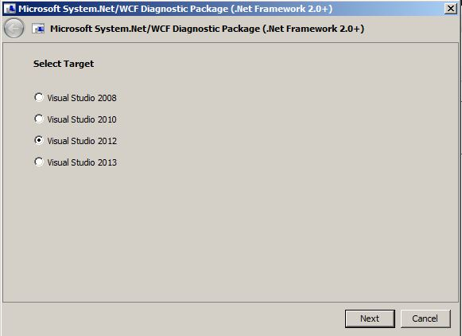
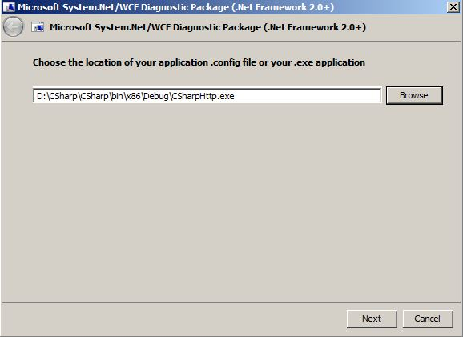

# System.Net and WCF diagnostics

This article introduces how to configure `System.Net` and Windows Communication Foundation (WCF) tracing and delete the trace files.

_Original product version:_ &nbsp; .NET Framework 4.5  
_Original KB number:_ &nbsp; 2952803

## Summary

The Support Diagnostic Package (SDP) for `System.Net` and WCF is used to configure `System.Net` and WCF tracing on the machine that is experiencing an issue with the `System.Net` or WCF technology. The SDP package will collect a `System.Net` or WCF trace of an application using the WCF or `System.Net.HttpWebRequest` or `System.Net.Sockets.Socket` class.

The SDP package will take care of enabling the WCF and `System.Net` tracing and disabling the tracing, but the trace files will need to be manually deleted.

## Configuration before System.Net or WCF package enables trace

Before `System.Net` or WCF SDP package enables the trace feature, it asks the .NET application type, configuration file, and trace output location.

1. Select .NET application type:

    

    If your application is a web application, select **IIS Web Application**. If your application is Visual Studio itself, such as Team Foundation Server (TFS) client, select **Visual Studio**. If the application is a service or .exe, select **Your Own Application**.

    **IIS Web Application** option will automatically detect the *web.config* file location to enable WCF or `System.Net` trace.

    

    

    **Visual Studio** option will automatically detect and find your Visual Studio version and configuration file location.

    

    **Your Own Application** option will ask you to select the application configuration file, such as *web.config* or *application.exe.config*.

    

2. Select trace file type to be enabled. You can select **System.Net Trace** or **WCF Trace** or both.

    

3. Trace file output folder:

    

4. `System.Net` trace option if you have `System.Net` trace enabled:

    

    WCF trace option if you have WCF trace enabled:

    

5. After you click **Next** button, the trace(s) will be enabled and the SDP package will be paused waiting for you to reproduce issue.

    If your application is an ASP.NET application, there's no need to restart Internet Information Services (IIS) Application Pool. If your application is a service or .exe application, you'll need to manually restart application to make new configuration file take effect.

    

6. After you reproduce the issue, click **Next** button and package will automatically disable the tracing feature. If your application is an ASP.NET application, there's no need to restart IIS Application Pool. If your application is a service or .exe application, you'll need to manually restart application to make new configuration file take effect.

    

For more information, see the folowing articles:

- [How to: Configure network tracing](/dotnet/framework/network-programming/how-to-configure-network-tracing)

- [Recommended Settings for Tracing and Message Logging](/dotnet/framework/wcf/diagnostics/tracing/recommended-settings-for-tracing-and-message-logging)

## System.Net or WCF SDP package

SDP package will create a backup of the selected configuration file and the existing configuration content will be combined with the new `<system.diagnostic>` section. The backup configuration file name will have the original file name appended with the current date, time, and *.sdp.backup*. For example: *CSharpHTTP.exe.config* will be backed up as *CSharpHTTP.exe.config.6-21-12-17-19.sdp.backup* or *web.config* will be backed up as *web.config.6-21-12-17-19.sdp.backup*.

To manually disable the `System.Net` trace feature, you just need to copy the configuration backup file back to the original configuration file name.

The SDP package will create a new .NET application configuration file if it doesn't exist. For this scenario, you can remove the .NET application configuration file to disable the `System.Net` trace feature.

Once you restore the original configuration file or remove the trace enabled configuration file, you'll have to restart the application process for the changes to be effective.

The trace file will be located in the trace file folder, which you select in SDP dialog box GUI. You'll need to manually delete the trace file after disabling the tracing feature. SDP package won't delete the trace file for you as the file may still be referenced by the .NET application process.

## References  

- [Information about Microsoft Automated Troubleshooting Services and Support Diagnostic Platform](https://support.microsoft.com/help/2598970)
