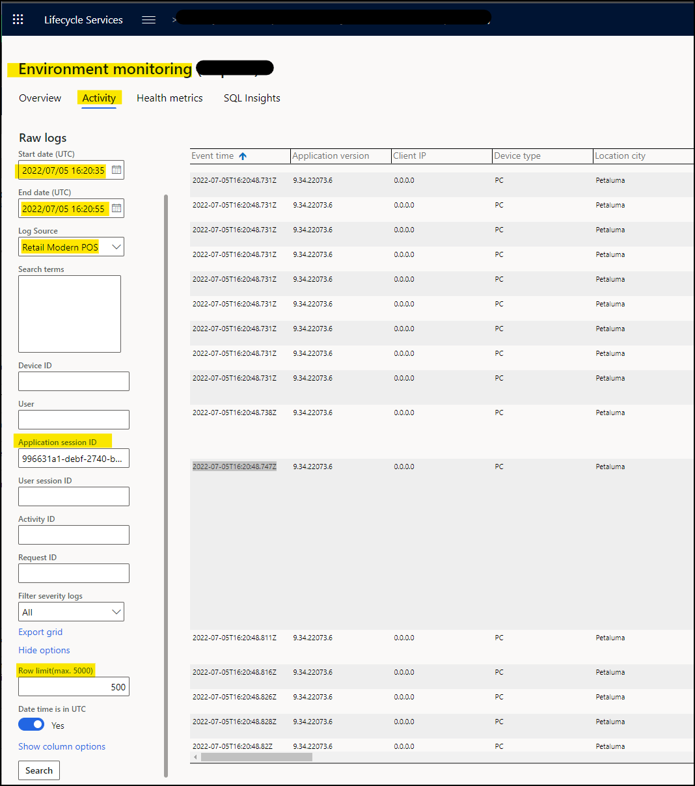

 # Introduction
 Receiving a generic error in POS such as "*Something went wrong*" is not very helpful determining what the underlying issue is when you encounter the error. Before opening a support case for more details behind this error, customers do have the ability log into LCS to review Telemetry data on this failure.

 
# Prerequisities
First, gather the following details from POS:

1.  Date/time that this occurred

2.  Application Session ID

3.  User Session ID

4.  Awareness of what was being done to encounter this error so you can follow the flow

> Note: These same details are great to provide in a support ticket if you need additional assistance on the issue.

 
# Troubleshooting 
1. Go to: LCS &gt; \*yourcompany\* &gt; Monitoring &gt; Environment monitoring &gt; Activity
2. Set the following:
     - Query name: Retail Channel events
     - Date/time in UTC: (this is the specific time of the failure, you can expand out the timeframe as needed until you locate the error)
       > Example:  If the specific error occurred on POS at **2023-07-15 01:07:34 UTC**    
       > Set Start Time to:  2023/07/15 01:07:00  
       > Set End time to:   2023/07/15 01:08:00

    - Log Source: Retail Cloud POS or Retail Modern POS
    - Search terms: you can enter part of the error message to help narrow the search, or leave it blank for a general search result
    - AppSessionID:   enter ID
    - UserSessionID:  enter ID
    - Show options &gt; Row limit: 500

3. Click Search

4. Order the results by the Event time

5. Review logs results for your error

 
When reviewing the POS Logs, if you find any requests that were sent to the RCSU (Retail Server) that you want to investigate them, since the error could have come from the RCSU, you can perform the following additional steps:

1. In the POS Log search results, find the value in the **requestId** column and copy its value

2. Change the **Log Source to Retail Cloud Scale Unit**

3. Clear the App and User session fields

4. Enter the copied value into the **Request ID** field

5. This returns the start/finish of this Request ID, to see more details, located the the **Activity ID** column and copy its value
6. Paste the Activity ID into the left search Activity ID field (Remember to clear the Request ID field)
7. Click search
8. You can then review RCSU search result logs as shown below. 

