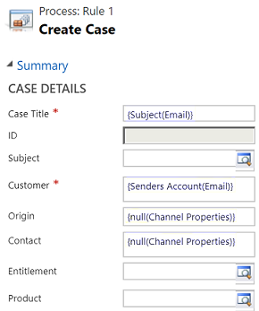
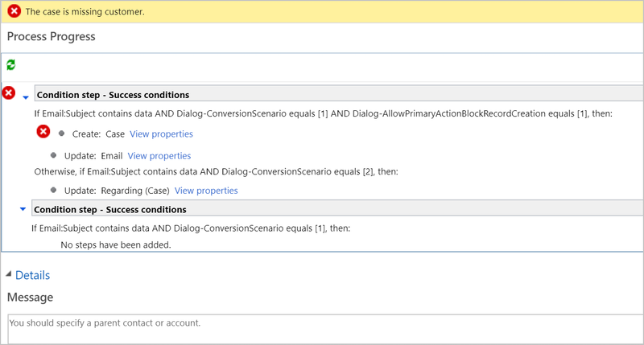
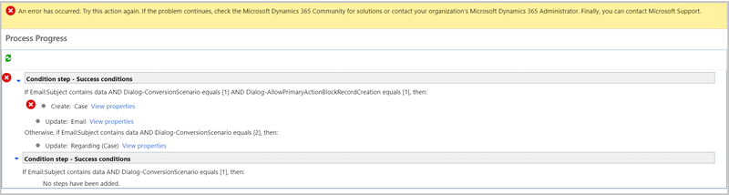
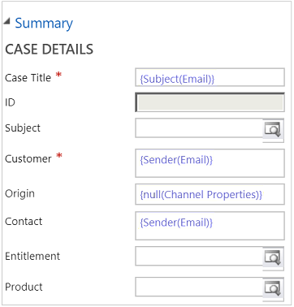

# Troubleshoot issues with converting an email to a case

This article helps you troubleshoot and resolve common issues with converting an email to a case. You can use the Activity monitor that is available on the **Record creation and update rules** page, and configure the options to view skipped scenarios, failed scenarios, or all scenarios for a time period. More information: [Use activity monitor to review and track rules](automatically-create-update-records.md#use-activity-monitor-to-review-and-track-rules).

## Issue 1 - Case creation fails when mail is sent from queue address to same queue address on which automatic record creation rule is configured

When configuring an automatic record creation rule for a queue in the web client, in the rule, set the customer value as null (Channel properties). Then, if you try to send mail from sender as queue mail address to recipient as queue mail address, the case creation fails with the following error message: "Case is missing customer".

### Cause

The automatic record creation rule in the web client considers the queue as a known sender and doesn't create a contact. Subsequently, the case creation fails because no account or contact is associated with the email.

This is an expected behavior.

### Resolution

Perform the following steps as a workaround:

1. Migrate your rule from the web client to Unified Interface. More information: [Migrate automatic record creation rules and service-level agreements](migrate-automatic-record-creation-and-sla-agreements.md).
2. Follow the information in [Configure advanced settings for rules](automatically-create-update-records.md#configure-advanced-settings-for-rules) to manage emails from unknown senders.

## Issue 2 - Incoming email is not converted to a case

### Cause

Email to case conversion is not functioning because of any of the following reasons:
- Email sync with the system
- QueueItem isn't found
- Email is coming from an unknown sender
- Automatic Rule Creation and Update Rule configuration issues
- Contact and account have different email address
- Email sent using only the "Bcc" field

### Resolution

Follow any of the below steps to diagnose and resolve the issue.

1. Check whether the email is syncing with the system: Navigate to **Activities** and look for the Email activity. If email isn't syncing with the system, there may be an issue with the email router or server-side sync configuration.
1. Check whether the email activity is created but a related QueueItem isn't found. If an active **Automatic Record Creation and Update Rule** exists for a specific queue, QueueItem is marked as inactive, and disappears from the QueueItem View.
1. If the email is coming from an unknown sender, check for the **Create contact for unknown sender** option. Go to the **Automatic Record Creation and Update Rule** configuration and check whether the **Create contact for unknown sender** box is checked. If the **Create contact for unknown sender** check box isn't checked, incoming email from an unknown sender won't be converted to a case.
1. Check whether **Automatic Record Creation and Update Rule** is configured properly by going to system jobs and checking for a failure message. For more information about configuration failure scenarios and resolution for sample configuration failure, see [Configuration failure scenarios and resolutions](#configuration-failure-scenarios-and-resolutions).

   > [!NOTE]
   > The Customer field in the case entity can be a contact or an account. If a matching incoming email address isn't found for a contact or an account, and **Create contact for unknown sender** box is checked, the system creates contact for incoming email address and links it to the case's customer field.

1. Check whether the contact and account exist with the same incoming email address. A case that's created from incoming email will resolve customer field on the case as Account.

1. Ensure that the queue email address is in the **To** or **Cc** fields of incoming mails. Emails sent with the queue address in the **Bcc** field won't be processed.

## Troubleshoot error messages 

Below is a list of some common errors and their resolutions.

### Scenario
**Sample**: Configuration on Automatic Record Creation and Update Rule
- **Create contact for unknown sender** box should be checked.
- Set condition criteria to **Any incoming email**.
- Add action to create case, select **View properties** and set the case fields as per business use case.

### Error 1

In the Customer field of the Case Details section, **Senders Account (Email)** is set as below value.

This results in the following error in system jobs:

#### Solution 1

To resolve this issue, keep the Customer field blank or set it to **{Sender(Email)}**. This allows the system to automatically create contact for the unknown sender and link it to the case.

## Error 2

The Customer field is set as **{Senders Account(Email)}** and Contact field as **{Sender(Email)}**.

This results in the following error in system jobs:

#### Solution 2

To resolve this issue, keep the Customer field blank or set it to **{Sender(Email)}**. This allows the system to automatically create contact for the unknown sender and link it to the case.

### Error 3

The Customer field and Contact field are set as **{Sender(Email)}**.

This results in the following error in system jobs:

#### Solution 3

To resolve this issue, leave contact field blank and set Customer field either to blank or to **{Sender(Email)}**.

### Validation steps

You must validate the configuration and validation steps given in the following table to understand the main cause of the issue, and resolve it:

|Option in Automatic Record Creation and Update Rule in Service Management  |If selected as  |Validation steps  |Outcome  |
|---------|---------|---------|---------|
|Create a case if a valid entitlement exists for the customer     |  Yes     |  Validate that an active entitlement exists for the customer. Valid active entitlement is evaluated as below:    - If the sender of the email is a contact with a parent account, then Dynamics 365 Customer Service creates a case if the contact’s parent account has a valid entitlement, and the contact is listed in the Contacts section of the entitlement   OR   - If the Contacts section is empty (which means that the entitlement is applicable to all contacts for the customer) |   A case is created      |
|Create a case from an email sent by unknown senders     |   Yes       |        For any incoming email from an unknown sender |     - A case is created    - A contact is also created for the unknown sender|
|     |   Yes      |    For an incoming email with email address of inactive account or contact     |   - A case is created   - An inactive account or contact is activated|
|     |   No      |     For an incoming email with email address of active account or contact   |  A case is created       |
|    |     No    |      For an incoming email sent by record type other than account or contact   |    No case is created     |
|  |   No      |     For an incoming email with email address of inactive account or contact    |  No case is created           |
|Create a case for activities associated with a resolved case     |    Yes     |   For an incoming email related to a resolved case      |    A case is created     |
|   |    Yes      |   For an incoming email related to an active case         |   No case is created      |
|  |         |         |         |
 
