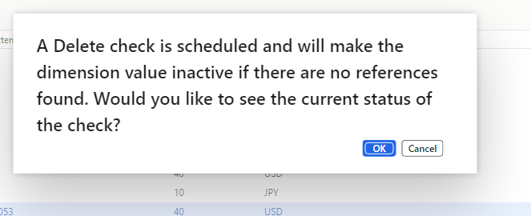
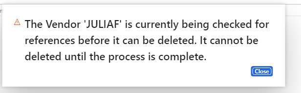
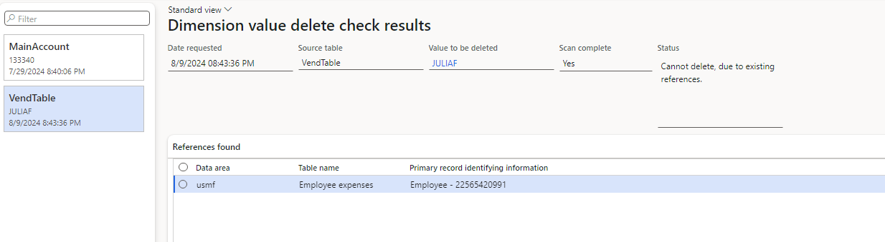

---
# required metadata
title: I want to delete a dimension value but am blocked
description: Troubleshooting steps for errors that prevent you from deleting financial dimension values
author: ethanrimes
ms.date: 02/10/2026
---

# I want to delete a dimension value but I am blocked

This guide provides troubleshooting steps for errors that prevent you from deleting financial dimension values.

## Deletion is disabled

Potential cause - Entity-backed dimensions can't be deleted from the **Financial dimension values** page.
Resolution - Delete the dimension value from the corresponding entity page. For example, to delete a Department dimension, go to the **Operating units** page.

Potential cause - The user lacks sufficient roles or privileges to manage dimension values. This can happen when [Extensible Data Security (XDS) policies](/dynamics365/fin-ops-core/dev-itpro/sysadmin/extensible-data-security-policies) restrict access to the backing entity.
Resolution - Verify that an administrator with full privileges can delete the dimension value. Contact your system administrator to request the necessary permissions.

## An error is preventing me

Potential cause - The dimension value was saved to the dimension framework, indicating it was entered in a ledger account or used in a transaction. Financial dimensions are insert-only and immutable for data integrity and auditing purposes. The system blocks deletion even if transactions were never posted or have been deleted.
Resolution - Because financial dimensions are insert-only and immutable, deletion is typically not possible once a value has been used. Instead, rename or suspend the value. For detailed steps and best practices, see [Deleting financial dimension values](/dynamics365/finance/general-ledger/financial-dimensions#deleting-financial-dimension-values).

## I can't delete a record from the underlying entity

Potential cause - The record you're trying to delete is referenced as a financial dimension value. This is by design. Financial dimensions are read-only once they've been entered into the dimension framework, meaning the backing entity record can't be deleted as long as the dimension value exists in the system.

You may see an error formatted as:
The *[Entity type]* '*[Entity identifier]*' is used in one or more transactions of the following types: *[Transaction usage category]* and cannot be deleted.

For example:

- `"The Customer 'CUST001' is used in one or more transactions of the following types: Ledger Budget Planning and can't be deleted."`
- `"The Project 'ProjA-22' is used in one or more transactions of the following types: Budget, Budget Control and can't be deleted."`
- `"The Item 'LCD_Television' is used in one or more transactions of the following types: Ledger and can't be deleted."`

You might also see the following popup when attempting the deletion:

Or a scan warning popup indicating that a delete check has been scheduled:

If the scan completes and finds a reference, the following UI is shown, and the delete is blocked:

- Resolution - (Recommended) - For dimension types that support it (Bank, Project, Vendor, Customer, and similar), allow the delete scan to run to completion. If no references are found, the backing record and its associated dimension value are allowed to be deleted. If references are found, they're displayed so that you can take any necessary action before retrying.

- Resolution - If the scan finds that the record is referenced as a dimension value and deletion is blocked, consider renaming or suspending the value instead. For detailed steps and best practices, see [Deleting financial dimension values](/dynamics365/finance/general-ledger/financial-dimensions#deleting-financial-dimension-values).
