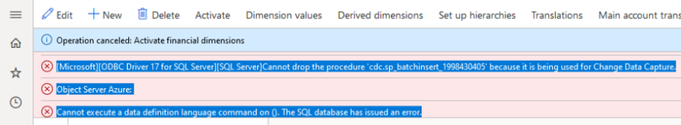

---
# required metadata
title: Troubleshoot financial dimension activation errors
description: Describes resolutions for errors that occur when activating financial dimensions in Dynamics 365 Finance.
author: ethanrimes
ms.date: 03/24/2026
---
# Troubleshoot financial dimension activation errors

This article helps you resolve errors and timeouts that occur when activating financial dimensions in Microsoft Dynamics 365 Finance.

## Activation fails

### Potential Cause 1: Name conflict when creating or renaming a dimension

**Description:** When you create a new dimension or rename an existing one, you receive one of the following error messages:

- `[DIMENSION NAME] is currently being used as a Dimension or has some other conflict that prevents it from being used as a name. If a dimension was previously deleted or renamed, but those changes are not yet activated, please activate now before attempting to recreate the same dimension, or choose a different name.`

  For example: `Department is currently being used as a Dimension or has some other conflict...`

- `Dimension [DIMENSION NAME] exists as an extension column on [ENTITY NAME] ([ENTITY TABLE NAME]) and [ENTITY NAME] ([ENTITY TABLE NAME]). You cannot change the name until this extension is removed.`

  For example: `Dimension CostCenter exists as an extension column on General journal account entry (GeneralJournalAccountEntry) and Budget register entry (BudgetTransactionLine). You cannot change the name until this extension is removed.`

- `The financial dimension name [DIMENSION NAME] exists as a translated name on financial dimension [EXISTING DIMENSION NAME].`

  For example: `The financial dimension name Department exists as a translated name on financial dimension BusinessUnit.`

The name you're trying to use already exists as a column in the dimension tables from a previous dimension that was deleted or renamed but not yet activated. The system blocks reuse until those pending changes are activated.

**Resolution:**

Activate all pending dimension changes to clear the conflict. For steps, see [Activating dimensions](/dynamics365/finance/general-ledger/financial-dimensions#activating-dimensions). If the error mentions an extension column conflict, the package containing that extension must be removed before the rename can proceed. If activation fails or the conflict persists, choose a different dimension name. See [Financial dimension naming requirements](/dynamics365/finance/general-ledger/tasks/define-financial-dimensions#naming-requirements) for naming constraints.

### Potential Cause 2: Stuck in maintenance mode due to entity extensions

**Description:** You're in maintenance mode and receive errors when trying to leave. The error references **DimensionCombinationEntity** or **DimensionSetEntity**, and the system rolls back automatically. A custom extension on **DimensionCombinationEntity** or **DimensionSetEntity** contains a hardcoded reference to a dimension name that no longer exists or has been renamed.

**Resolution:**

This resolution has a two-part solution: first escape the deadlock, then fix the actual problem. For general information about entering and exiting maintenance mode, see [Maintenance mode](/dynamics365/fin-ops-core/dev-itpro/sysadmin/maintenance-mode).

1. If you're stuck in maintenance mode, restore the deleted or renamed dimensions to their previous names so activation can succeed, then exit maintenance mode.
2. Remove the package containing the hardcoded column references.
3. Re-enter maintenance mode and activate dimensions again.
4. Create a replacement extension using the correct approach.

### Potential Cause 3: Change data capture (CDC) error

**Description:** Activation fails with one of the following errors:

- `Cannot drop the procedure 'cdc.sp_batchinsert_{number}' because it's being used for Change Data Capture`

  For example: `Cannot drop the procedure 'cdc.sp_batchinsert_1' because it's being used for Change Data Capture`

- `Column name 'SYSTEMGENERATEDATTRIBUTE[DIMENSION ATTRIBUTE]' in table 'cdc.dbo_DIMENSIONATTRIBUTEVALUECOMBINATION_CT' is specified more than once.`

  For example: `Column name 'SYSTEMGENERATEDATTRIBUTEDepartment' in table 'cdc.dbo_DIMENSIONATTRIBUTEVALUECOMBINATION_CT' is specified more than once.`

Change Data Capture (CDC) is enabled on the **DimensionAttributeValueCombination** or **DimensionAttributeValueSet** tables. CDC prevents the schema changes that dimension activation requires.

**Resolution:** Disable CDC on the **DimensionAttributeValueCombination** and **DimensionAttributeValueSet** tables before activating dimensions. After activation completes, you can re-enable CDC if needed.

## Activation times out

### Potential Cause 1: Data maintenance jobs are interfering

**Description:** The data maintenance batch jobs can start prematurely during activation or upgrade, blocking dimension tables before the system is ready.

**Resolution:**

Pause the data maintenance jobs before retrying activation. For steps on accessing and managing data maintenance jobs, see [Data maintenance portal](/dynamics365/fin-ops-core/dev-itpro/sysadmin/datamaintenanceportal). Specifically, set a sleep period on both **Data maintenance job to find opportunities** and **Data maintenance job to run fixes** through **System administration** > **Setup** > **Process automations** > **Background processes**, and cancel any currently running data maintenance batch jobs. After activation completes, remove the sleep period so data maintenance resumes normally.

### Potential Cause 2: Change tracking is enabled on dimension tables

**Description:** Change tracking enabled on dimension tables can cause performance issues and timeouts during activation.

**Resolution:** Disable change tracking for Dimension tables. For more information, see [Enable change tracking for entities](/dynamics365/fin-ops-core/dev-itpro/data-entities/entity-change-track).

### Potential Cause 3: Highly variable dimensions with large data volumes

**Description:** If your environment uses dimensions with a very large number of unique values spread across many transactions, activation may time out due to data volume.

**Resolution:** Review and address highly variable dimensions before retrying activation. For guidance, see [highly variable dimensions](/dynamics365/finance/cost-accounting/high-var-dimensions).
