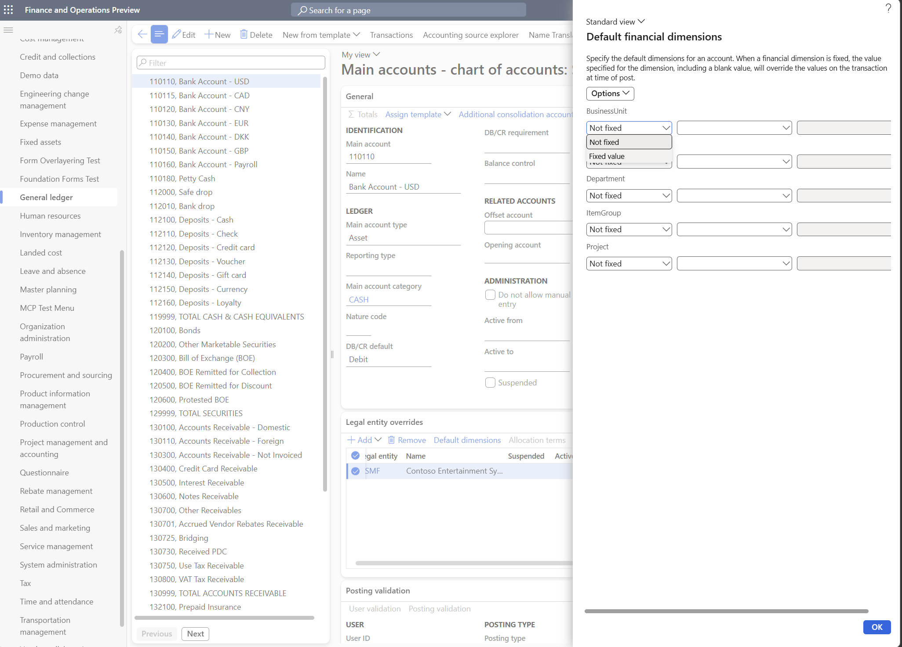

---
# required metadata

title: Financial dimension values are defaulting incorrectly in documents and transactions
description: Troubleshooting steps for when financial dimension values appear incorrect after being merged, saved, or posted in Dynamics 365 Finance
author: ethanrimes
ms.date: 03/01/2026

# optional metadata

audience: Application User
ms.reviewer: kfend
ms.custom: sap:General ledger - Setup, transactions and reporting\Issues with financial dimensions
ms.search.region: Global
ms.author: ethanrimes
ms.dyn365.ops.version: 10.0.0
---

# Financial dimension values are defaulting incorrectly in documents and transactions

This article helps you troubleshoot situations where financial dimension values appear incorrect after being merged, saved, or posted in Microsoft Dynamics 365 Finance. You may notice the problem only after posting, when you drill back into the original document or transaction.

## Symptoms

After completing a process such as posting a journal or source document, you notice that the financial dimension values on the resulting transaction don't match what you expected. The values may have appeared correct earlier in the process but changed by the time the transaction was finalized.

## Potential causes and resolutions

### Potential cause 1: Fixed dimensions are configured on the main account

Fixed dimensions are a setting on a main account that forces specific dimension values to be used on any transaction that posts to that account—regardless of what was entered on the document or journal line. This override happens at the moment of posting and can be surprising if you aren't aware the setting is enabled.

**Resolution:** Check whether fixed dimensions are set up on the main account involved in the transaction.

1. Go to **General ledger** > **Chart of accounts** > **Accounts** > **Main accounts**.
2. Open the main account used in the transaction.
3. Expand the **Legal entity overrides** FastTab.
4. Select the legal entity (company).
5. Select **Default dimension**.
6. In the **Default dimension** dialog, each financial dimension has a **Fixed** / **Not fixed** column. If a dimension is set to **Fixed**, its value is enforced at posting time and overrides values entered on documents, journals, and master data.

7. Select **Save** and close the dialog.

If the fixed dimension is intentional but causing confusion, consider updating user guidance or training so team members are aware. If it was set unintentionally, an administrator can remove or update the value.

---

### Potential cause 2: Another source of default dimensions is supplying an unexpected value

Financial dimension values are merged from multiple sources during document and journal processing. If a higher-priority source provides a value for a dimension, it overwrites what was entered or expected from a lower-priority source. The following sources can contribute default dimension values:

- **Journal header defaults** – Default dimensions set on the journal header apply to all lines in that journal unless a line-level value overrides them.
- **Master data defaults** – Dimension values associated with records such as customer accounts, vendor accounts, or workers are applied when those records are selected on a transaction line.
- **Ledger / legal entity defaults** – Default dimensions configured at the ledger level apply as a baseline across all transactions in that company.
- **Derived dimensions** – Rules that automatically populate one dimension value based on the value of another dimension (for example, selecting a specific department might automatically fill in a cost center).

[!NOTE]
If derived dimensions appear to be populating values even though **Replace existing dimension values with derived values** is disabled, this is by design. That setting only prevents derived values from overwriting fields that already have a value. Blank dimension fields are always populated with derived values regardless of how the setting is configured. **Replace existing dimension values with derived values** (available when configuring derived dimensions on the **General ledger** \> **Chart of accounts** \> **Financial dimensions** page) enables the overwriting of non-blank values with derived dimensions.

**Resolution:** Work through each source to identify which one is supplying the unexpected value, then correct it.

1. **Check journal header defaults.** Open the journal and select **Financial dimensions** on the journal header. If a value is set there that conflicts with what you expected on a line, clear or update it on the header, then retest.
2. **Check master data defaults.** If the journal line or document references a customer, vendor, worker, or similar record, open that record and navigate to its **Financial dimensions** tab. Verify that the defaults configured there are correct and update them if needed.
3. **Check ledger defaults.** Go to **General ledger** > **Ledger setup** > **Ledger**. Select **Default dimensions** and review what's configured. Because these defaults apply broadly across the company, an incorrect value here can affect many transactions.
4. **Check derived dimensions.** Go to **General ledger** > **Chart of accounts** > **Dimensions** > **Financial dimension value links**. Review any derived dimension rules that apply to the dimensions involved. If a rule is producing an unintended override, update or remove the rule.

After identifying the source of the unexpected value, update the configuration and retest the transaction to confirm the correct dimensions are applied.

---

### Potential cause 3: The document type is a correction, reversal, or relieving transaction

Certain document types—such as **Correction**, **Reversal**, and **Relieving** transactions—are designed to exactly undo a previously posted entry. To ensure the reversal precisely mirrors the original, the system intentionally reuses the dimension values from the original posted transaction rather than re-merging dimension defaults from the current setup.

This is expected behavior. If the system re-applied current dimension defaults on a reversal, the reversed entry might not balance correctly against the original, which could cause accounting problems.

**Resolution:** Verify that the document being created is a reversal or correction of a prior transaction.

1. Open the transaction and confirm whether it is a reversal, correction, or relieving document (this is often visible in the document header or transaction type field).
2. If it is, the dimension values shown are pulled from the original posted transaction—this is by design and ensures proper accounting integrity.
3. If you need different dimension values on the reversal, consider whether the correct approach is to post a new, separate adjusting entry rather than using the automatic reversal function.

If you believe the reversal is pulling incorrect original values, contact Microsoft Support, as this may indicate a data issue with the original transaction.

---

### Potential cause 4: A customization is changing dimension values during processing

If your Dynamics 365 Finance environment has custom code or extensions, those customizations may intentionally or unintentionally alter dimension values during document processing. The change can happen at any step in the workflow—entry, approval, or posting—making it difficult to trace.

**Resolution:** If you have ruled out fixed dimensions and the behavior doesn't occur in a standard demo environment, a customization is likely involved.

1. Test the same scenario in a standard demo data environment (such as **USMF**) without customizations. If the issue doesn't appear there, a customization in your environment is most likely the cause.
2. Contact your system administrator or the partner responsible for your Dynamics 365 customizations and ask them to review any custom code that touches financial dimensions during the affected process.
3. Ask whether any recent updates, deployments, or code changes were made before the issue started.

Your system administrator or partner will need to review the customization to determine whether the behavior is intentional or a defect.
