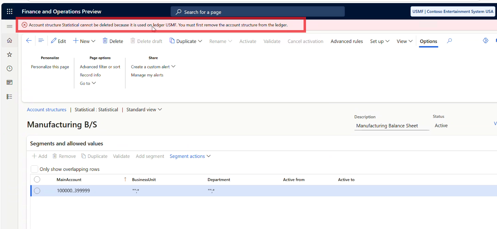

---
# required metadata
title: Unable to remove account structure from ledger
description: Troubleshooting steps for removing account structures that are in use
author: ethanrimes
ms.date: 02/10/2026
---

# Unable to remove account structure from ledger

This article helps troubleshoot problems removing an account structure from your general ledger.

## Symptoms

Customer is trying to remove an Accounts Structure from Ledger Setup. However, they receive Error: Account structure [Account structure being removed] cannot be deleted because it is in use by the general journal in [Company]. You must first update the general journal.

## Resolution

>[!IMPORTANT]
>When subdividing accounts (e.g. 1000-3000 into 1000-2000 and 2000-3000), it is recommended to change the existing account structure rather than deleting and replacing it. This prevents data orphaning and performance inefficiencies.
>
>For example, change the account structure from 1000-3000 to 1000-2000 and then create a new main account for 2000-3000, later rekeying the unposted transactions to the new structure.

An account structure cannot be deleted if there are unposted transactions that reference it.

Blocking unposted transactions can be found on the unposted journals at **General ledger > Journal entries > General journals** and **General ledger > Journal entries > Global general journals** by choosing the filter **Show > Not posted**. 

To view each journal's transactions, select the journal and click **lines** in the action pane. Transactions which reference the account structure to be deleted can removed with the **delete** button or can have their main account changed to something else.

After no more unposted transactions reference the account structure, you should be able to delete it.

If you are unable to find the unposted transaction or transactions which are blocking you, contact support.