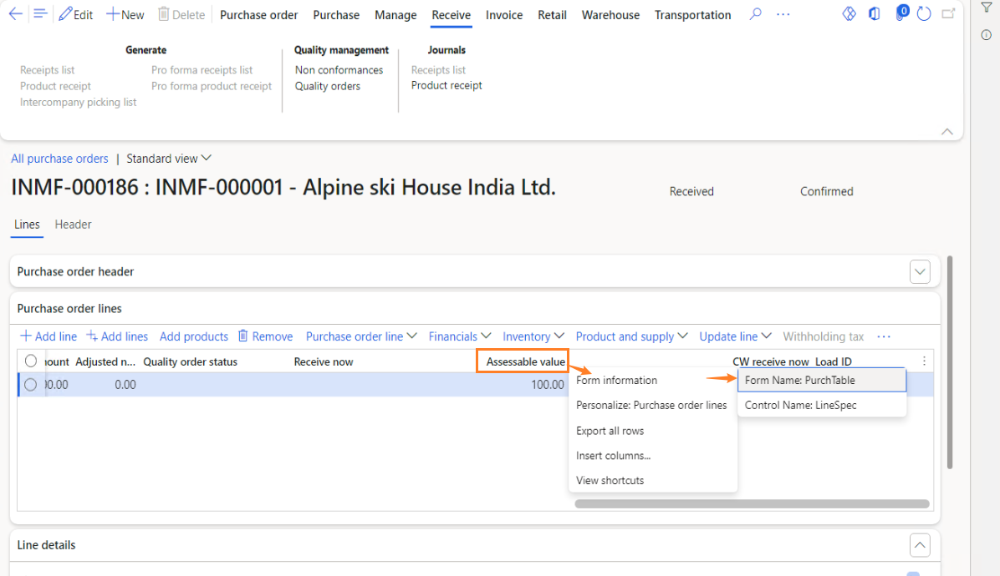
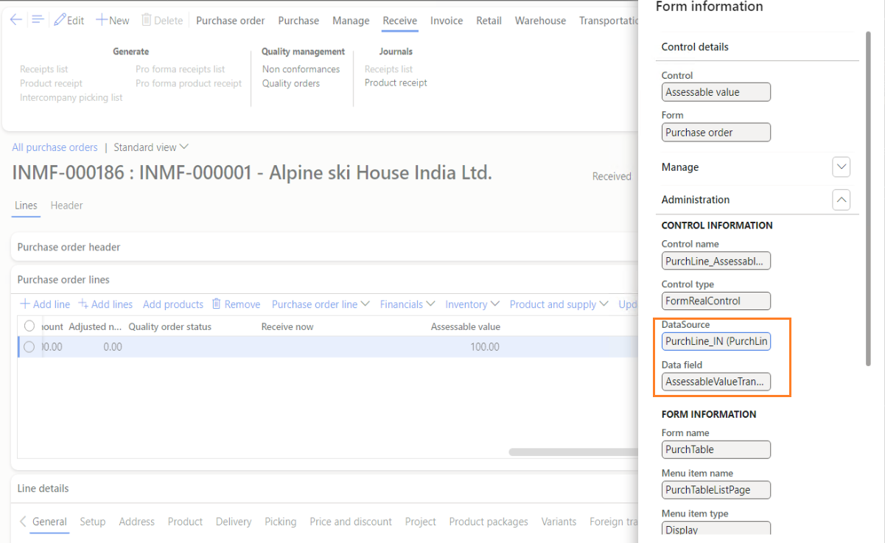
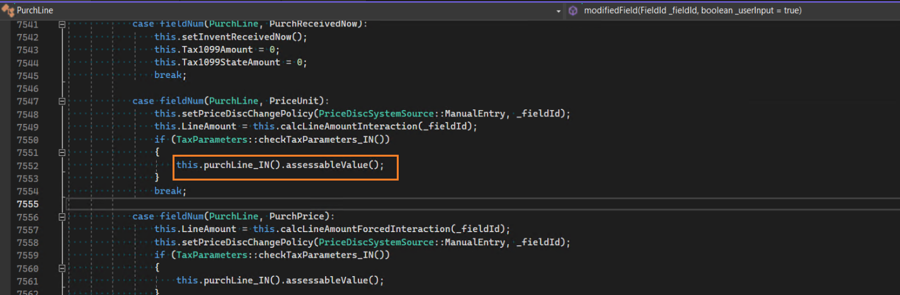

---
# required metadata

title: Assessable value is incorrect
description: Provides troubleshooting information that can help when the assessable value is incorrect.
author: shaoling
ms.date: 08/27/2024

# optional metadata

#ms.search.form:
audience: Application user
# ms.devlang: 
ms.reviewer:

# ms.tgt_pltfrm: 
ms.search.region: India
# ms.search.industry: 
ms.author: shaoling
ms.search.validFrom: 2021-04-01
ms.dyn365.ops.version: 10.0.1
---

# Assessable value is incorrect

The assessable value is typically updated automatically based on the transaction value. If the value doesn't appear as as expected, users can manually update the assessable value on the UI form. If this is not feasible (e.g., the control is not editable, there is no such UI, or it is too tedious to update many lines), you can follow the mitigation steps to resolve the issue using code extension.

## Mitigation with code extension
This section provides guidence on investigating the root cause and adding a code extension, using a purchase order as an example.

1. Get the table field of the assessable value from UI. 
   
  The field is **AssessableValueTransactionCurrency** of table **PurchLine_IN**, which is extension table of the main table **PurchLine** via [table extension framework](https://daxonline.org/9-table-extension-framework.html). 
  

2. Check the following methods of the main table (**PurchLine** for purchase order) to ensure they update the assessable value accordingly. You can set breakpoints and debug the process. If any issues arise, adding code extension to fix them.
   - **update**
   - **insert**
   - **modifiedField**
   
  For exemple, in **PurchLine.modifiedField**, there is code logic to update the assessable value.
    
