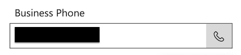
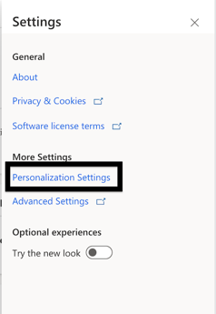
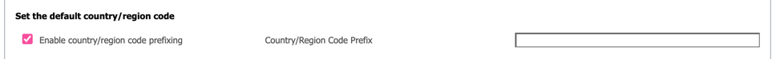

# Teams dialer calling through Contact/Account/Lead fails

This article provides a resolution for an issue where call via [Microsoft Teams dialer](/dynamics365/sales/configure-microsoft-teams-dialer) fails when calling through Contact/Account/Lead in Microsoft Dynamics 365 Sales.

## Symptoms

Call via the phone call icon next to the Contact/Account/Lead's number (see the photo below) failed when the number is without country code.  

## Cause

Country/region code prefixing is enabled on the CRM platform.

## Resolution

To resolve this issue, you should disable country/region code prefixing.

1. Click the settings icon in the top toolbar .   
2. Click on Personalization Settings:  
.
3. Uncheck country/region code prefixing.  
