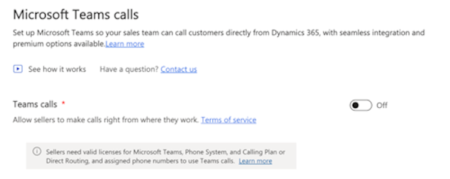

# Can't Enable Dialer
## Who is affected?
|                |                                 |
|----------------|---------------------------------|
| **Platform**   | Web                             |
| **OS**         | Windows and Mac                 |
| **Deployment** | User managed and admin managed  |
| **CRM**        | Dynamics 365                    |
| **Users**      | All users                       |

## Symptom
Admin user can't enable Teams calls on Teams Admin Settings:  

## Root cause and resolution
### Issue: Admin user missing licenses

#### Root cause
The problem arises due to the absence of the necessary licenses for the admin user.

#### Resolution
Follow this [documentation](https://learn.microsoft.com/en-us/MicrosoftTeams/setting-up-your-phone-system).