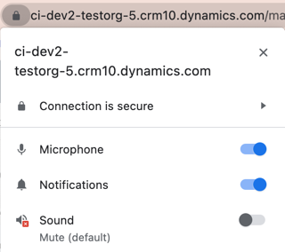

# Seller Can't hear other customer
## Who is affected?
|                |                                 |
|----------------|---------------------------------|
| **Platform**   | Web                             |
| **OS**         | Windows and Mac                 |
| **Deployment** | User managed and admin managed  |
| **CRM**        | Dynamics 365                    |
| **Users**      | All users                       |

## Symptom
When the other customer is speaking during a call, the seller can't hear their voice.

## Root cause and resolution
### Issue 1: Incorrect Device Selection

#### Root cause
The problem arises from sellers not selecting the correct speaker device in the dialer's device settings.

#### Resolution
To resolve this, ensure the right speaker device is chosen by following these steps:
1. Click on the three dots menu, and then select "Device Settings":  
     
2. Choose the appropriate speaker device:  
     

### Issue 2: Browser Sound permissions

#### Root cause
The issue is often caused by the seller not enabling sound permissions on the browser.

#### Resolution
To enable sound permissions for the browser, click the lock icon located below to the address bar: 
* On Google Chrome, click on the toggle located next to "Sound":  
  
* On Microsoft Edge, click on "Mute" and then select "Automatic(Default)":  
  
  
