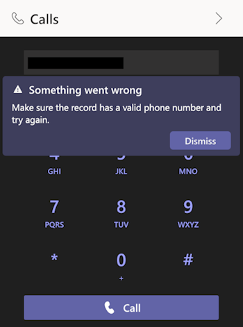

# Seller Can't Make Phone Calls to PSTN
## Who is affected?
|                |                                 |
|----------------|---------------------------------|
| **Platform**   | Web                             |
| **OS**         | Windows and Mac                 |
| **Deployment** | User managed and admin managed  |
| **CRM**        | Dynamics 365                    |
| **Users**      | All users                       |

## Symptom
When the seller attempts to make a phone call to a PSTN number, they encounter the following error message:  

## Root cause and resolution
### Issue 1: Seller doesn't have Teams license or phone number assigned.

#### Root cause
The problem arises when sellers don't have the necessary Teams license or a phone number assigned to their account.

#### Resolution
To address this issue, follow these steps:
1. Try to make a call using Teams desktop or Teams web. 
2. If the call doesn't connect or if there is no phone number displayed (as shown in the image below), it indicates that you don't have the required Teams license or a phone number assigned to your account.

Follow this [documentation](https://learn.microsoft.com/en-us/microsoftteams/assign-change-or-remove-a-phone-number-for-a-user).

### Issue 2: Try basic troubleshooting.

#### Resolution
Follow the steps in the [basic troubleshooting](dialer-basic-troubleshooting.md).