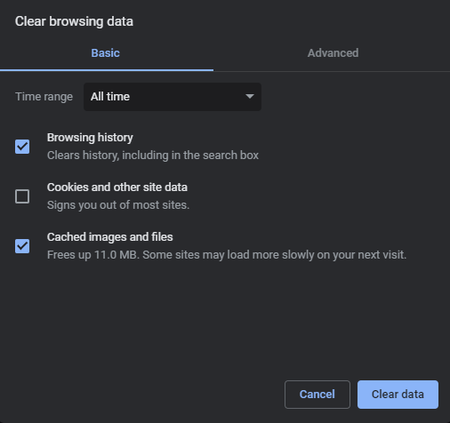
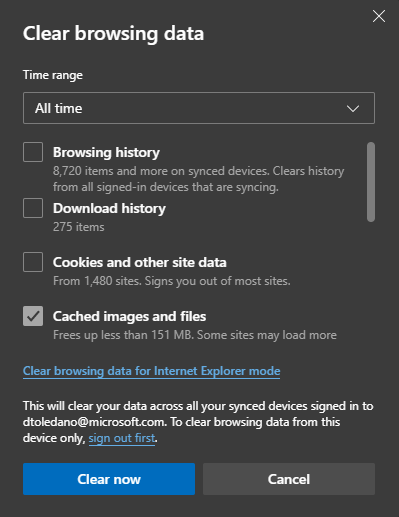

# Dialer Basic Troubleshooting - Clean Browser Cache

The basic troubleshooting step should be to clean the browser cache and perform a hard refresh.

### Step 1 - Clear Browsing Data

#### Chrome

In Google Chrome:
1. Go to chrome://settings/clearBrowserData (please copy and paste it in the URL in your browser)
2. Select "Cached images and files"
3. Press "Clear data"  

#### Edge

In Edge:
1. Go to edge://settings/clearBrowserData (please copy and paste it in the URL in your browser)
2. Select "Cached images and files"
3. "Clear now"  

### Step 2 - Hard Refresh

**Chrome, Firefox, or Edge for Windows:**  
Press Ctrl+F5 (If that doesn’t work, try Shift+F5 or Ctrl+Shift+R).

**Chrome or Firefox for Mac:**  
Press Shift+Command+R