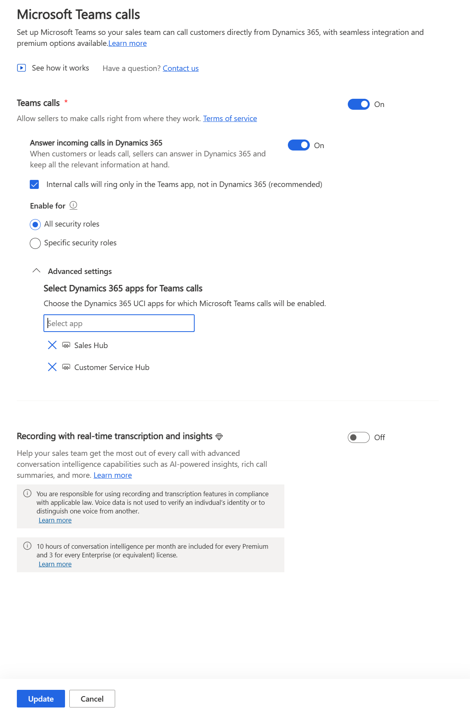

# Dialer Not Available In Custom App
## Who is affected?
|                |                                 |
|----------------|---------------------------------|
| **Platform**   | Web                             |
| **OS**         | Windows and Mac                 |
| **Deployment** | User managed and admin managed  |
| **CRM**        | Dynamics 365                    |
| **Users**      | All users                       |

## Symptom
Seller can't see the dialer on the custom app.

## Root cause and resolution
### Issue: The plugging that should install the custom app didn't work.

#### Root cause
The problem arises when sellers don't have the necessary Teams license or a phone number assigned to their account.

#### Resolution
If a seller can't see the dialer he should try to re-add it:
1. Go to dialer settings page (Dialer settings page will only be shown on the 'Sales Hub' application).
2. Remove the custom app from the 'Advanced settings' dropdown.
3. Click update.
4. After the page finish saving, refresh the page.
5. Add the custom app to the 'Advanced settings' dropdown.
6. Click update.
7. Go to the custom app and check if the dialer is displaying now.

