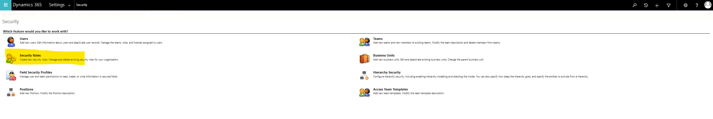
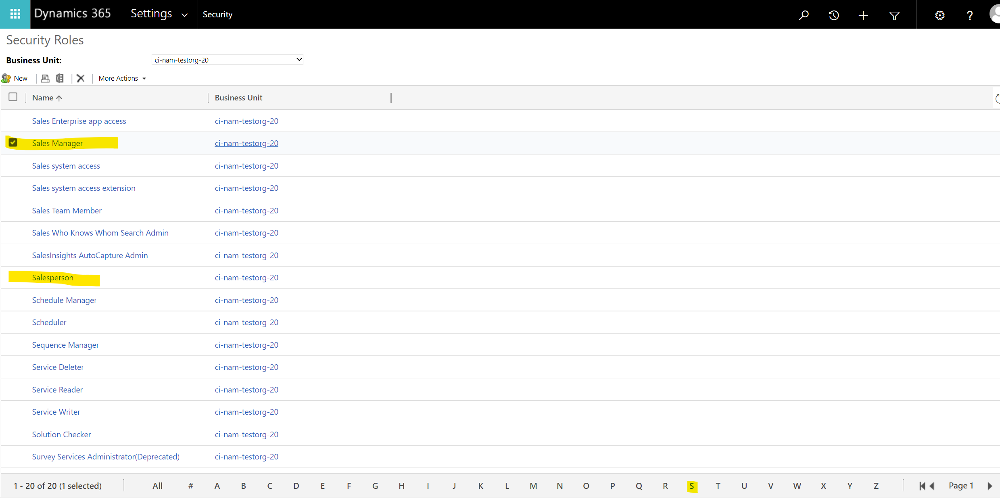
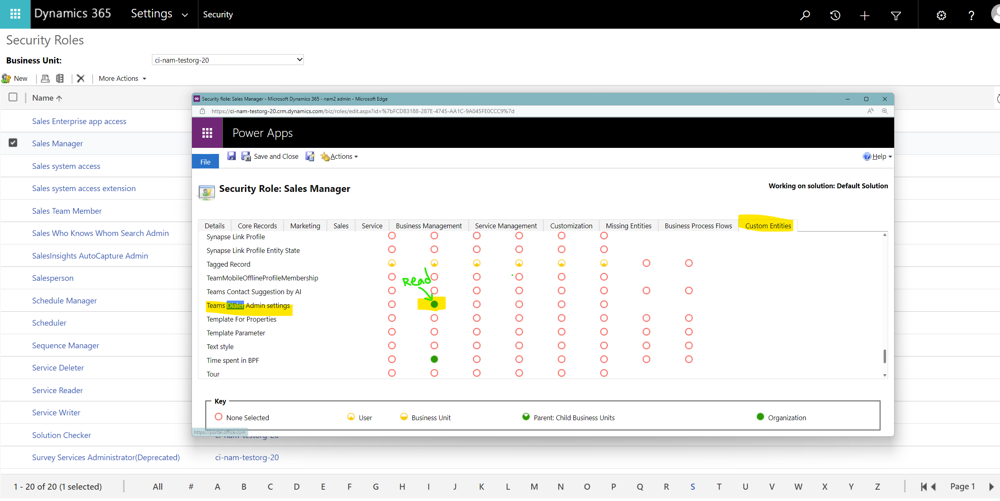

# Dialer Not Available In CRM
## Who is affected?
|                |                                 |
|----------------|---------------------------------|
| **Platform**   | Web                             |
| **OS**         | Windows and Mac                 |
| **Deployment** | User managed and admin managed  |
| **CRM**        | Dynamics 365                    |
| **Users**      | All users                       |

## Symptom
Seller can't see the dialer on CRM.

## Root cause and resolution
### Issue 1: Try basic troubleshooting.

#### Resolution
Follow the steps in the [basic troubleshooting](dialer-basic-troubleshooting.md).

### Issue 2: Missing User Assigned Security Roles

#### Root cause
To see the dialer, the user assigned security roles should have read privileges for the Teams Dialer Admin settings entity.
These privileges should be granted automatically for the Sales Manager and salesperson security roles.

#### Resolution
In case there is a problem with the privileges, follow the mitigation steps:
1. Login into the CRM (orgUrl) with an admin user.
2. Navigate to Settings --> Advanced Settings:  
   

3. Navigate to Security --> Security Roles:  
   

4. Select the relevant security role: Update the entity read permission:  
   

5. Update the Teams Dialer Admin settings entity read permission:  
   
