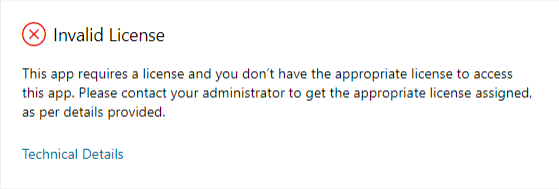

# Error Code: 2147812097 Invalid License: This application requires a license and you don't have an appropriate license assigned

This article provides a solution to an error that occurs when you try to access an app module (business application) which requires an appropriate license and isn't assigned.

_Applies to:_ &nbsp; Microsoft Dynamics CRM Online  
_Original KB number:_ &nbsp; 4548022

## Symptoms

When a user tries to access an app module (business application) which requires an appropriate license and isn't assigned, the user receives the following error message:

> This app requires a license and you don't have the appropriate license to access this app. Please contact your administrator to get the appropriate license assigned, as per details provided.  
Details  
User does not have a license to access this app module uniqueName=< unique name> with Id=\<Id> from publisher=\<publisher name>. A license is required with one of the service plans: \<Service Plan name>: \<Service Plan Id>. Please refer to the article \<link to this KB> for more details.

## Cause

This issue occurs when an application requires a license and the administrator hasn't assigned the appropriate license to the user(s) of the application.

For example, if the user with a team member license tries to access the Customer Service Hub application, the user will see this error:

> This app requires a license and you don't have the appropriate license to access this app. Please contact your administrator to get the appropriate license assigned, as per details provided.  
>
>Details
>
> User does not have any license to access this app module uniqueName= Customerservicehub from publisher= dynamics365customerengagement. A license is required with one of the service plans: 'Dynamics 365 for Customer Service: 99340b49-fb81-4b1e-976b-8f2ae8e9394f

## Resolution

The resolution is to reach out to your administrator and request the license to be assigned. The license name and the application names are present in the error details.

**Access to Custom Apps:**

For access to custom apps (canvas or model-driven), you need to be assigned a Dynamics 365 Enterprise or Professional license, **PowerApps Per User** plan or the environment needs to be given **PowerApps per app** plans (aka **app passes**). For more information about **PowerApps per app** plans (aka **app passes**), see [About Power Apps per app plans](/power-platform/admin/about-powerapps-perapp).
