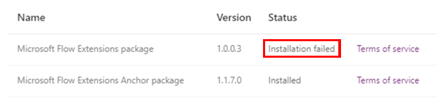

# Microsoft Flow Extension Package shows "Installation failed" on PPAC

This article provides a solution to an issue where Microsoft Flow Extension Package shows Installation failed.

_Applies to:_ &nbsp; Power Platform  
_Original KB number:_ &nbsp; 4560419

## Symptoms

Power Platform Admin Center is showing "Installation failed" for Microsoft Flow Extensions Package version 1.0.0.3.

## Cause

The installation of old version 1.0.0.3 of Microsoft Flow Extensions Package failed on some orgs.

## Resolution

If you see installation is failed for Microsoft Flow Extensions Package 1.0.0.3, then no action is required and this error can be ignored.

It's because an updated package Microsoft Flow Extensions Anchor package is already present in the org.
