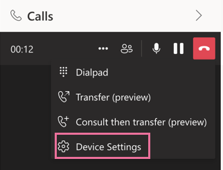
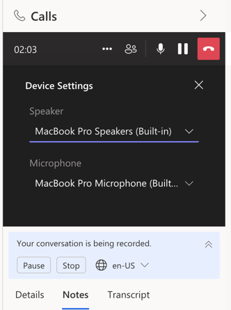
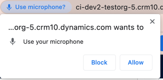
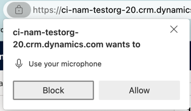
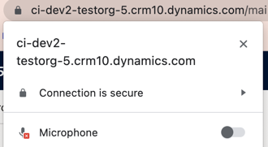
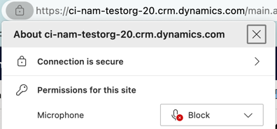

# Seller Voice Unheard by Other Customer
## Who is affected?
|                |                                 |
|----------------|---------------------------------|
| **Platform**   | Web                             |
| **OS**         | Windows and Mac                 |
| **Deployment** | User managed and admin managed  |
| **CRM**        | Dynamics 365                    |
| **Users**      | All users                       |

## Symptom
When the Seller is speaking during a call, the other customer can't hear their voice.

## Root cause and resolution
### Issue 1: Incorrect Device Selection

#### Root cause
The problem arises from sellers not selecting the correct microphone device in the dialer's device settings.

#### Resolution
To resolve this, ensure the right microphone device is chosen by following these steps:
1. Click on the three dots menu, and then select "Device Settings":  
     
2. Choose the appropriate microphone device:  
     

### Issue 2: Browser Microphone permissions

#### Root cause
The issue is often caused by the seller not enabling microphone permissions on the browser.

#### Resolution
To enable microphone permissions for the browser, follow these steps:
1. Click on "Allow" in the pop-up window next to the lock icon located below to the address bar:  
   * On Google Chrome:  
     
   * On Microsoft Edge:  
   
2. If you have previously disabled the microphone permissions, you can re-enable it by clicking the same lock icon:  
   * On Google Chrome, click on the toggle located next to "Microphone":  
      
   * On Microsoft Edge, click on "Block" and then select "Allow":  
   
