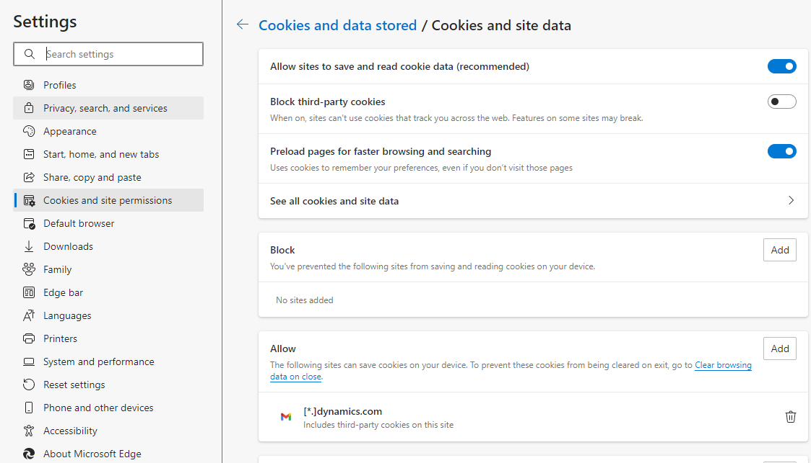
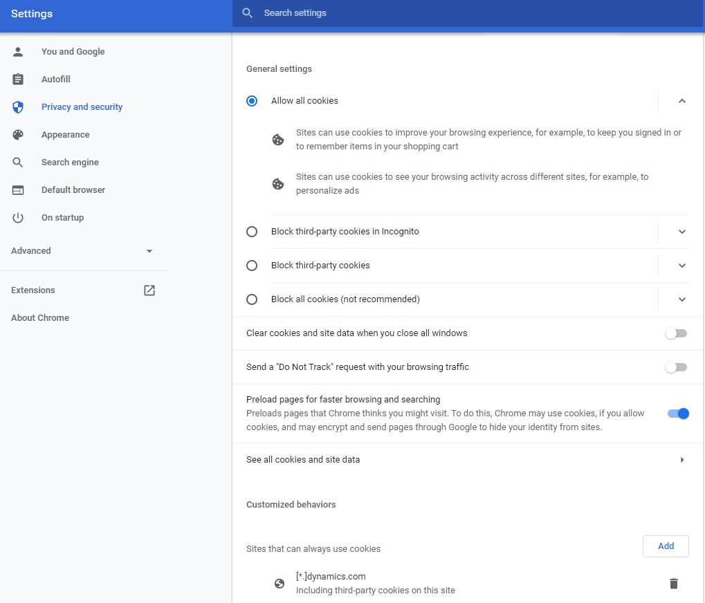

## Troubleshoot issue with opening chat windows in Dynamics 365

When you try to open chat window or start a new chat from dynamics 365 and you see an error, it might be because your organization uses Trusted Sites and doesn't enable the URLs for Dynamics. To resolve this error, change the settings for your browser using administrator rights or a Group Policy Object (GPO).

## Microsoft Edge

1. In the Edge **Settings** window, select **Cookies and site permissions** then select Manage and delete cookies and site data under Cookies and data stored.

2. Turn on **Allow sites to save and read cookie data (recommended)** and make sure **Block third-party cookies** is turned off. Alternatively, follow step 3 if you need to keep third-party cookies blocked.

1. In the same window, under **Allow**, select **Add** to add the following site and then select the Including third-party cookies on this site check box:

- [*.]dynamics.com

To change the settings by using GPO, follow these steps:

1. [Download and install the Microsoft Edge administrative template](https://docs.microsoft.com/en-us/deployedge/configure-microsoft-edge#1-download-and-install-the-microsoft-edge-administrative-template).
1. Add the sites listed in step 3 above to the **Content settings > CookiesAllowedForUrls** setting, either with a mandatory or recommended policy. For more information, see [Set mandatory or recommended policies](https://docs.microsoft.com/en-us/deployedge/configure-microsoft-edge#2-set-mandatory-or-recommended-policies) and [CookiesAllowedForUrls setting](https://docs.microsoft.com/en-us/deployedge/microsoft-edge-policies#cookiesallowedforurls).

## Google Chrome

1. In the Chrome **Settings** window, on the **Privacy and security** tab, select **Cookies and other site data**.

1. Under **Sites that can always use cookies**, select **Add**, and then select the **Including third-party cookies on this site** check box.

1. Add the following site:
- [*.]dynamics.com

To change the settings by using GPO:
1. [Download and install the Chrome administrative template](https://support.google.com/chrome/a/answer/187202).
1. Add the sites listed in step 3 above to the **Content settings > CookiesAllowedForUrls** setting.
