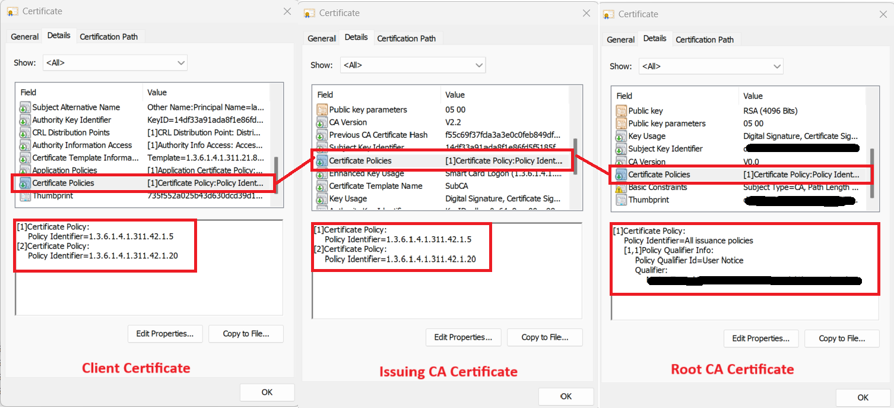

---
# Required metadata
# For more information, see https://review.learn.microsoft.com/en-us/help/platform/learn-editor-add-metadata?branch=main
# For valid values of ms.service, ms.prod, and ms.topic, see https://review.learn.microsoft.com/en-us/help/platform/metadata-taxonomies?branch=main

title: 'AADSTS50017: Validation of Given Certificate for Certificate-Based Authentication Failed '
description: 'AADSTS50017: Validation of Given Certificate for Certificate-Based Authentication Failed '
author:      Laks1 # GitHub alias
ms.author:   laks # Microsoft alias
ms.service: entra-id
ms.topic: troubleshooting-problem-resolution
ms.date:     02/10/2025
ms.subservice: authentication
---
# Error AADSTS50017 - Validation of Given Certificate for Certificate-Based Authentication Failed

This article discusses scenarios where the AADSTS50017 error occurs when a user accesses an application or resource with Certificate Based Authentication (CBA).

## Symptoms

When a  user tries to access an application or resource with Certificate-Based authentication ( CBA)  the sign-in process fails, and the following error message is displayed:

> AADSTS50017: Validation of given certificate for certificate based authentication failed.

## Scenario 1: Certificate chain failures due to missing CA Certificates in store or validation failures with SKI and AKI Values 

## Solution :

1. Check if issuing certificate was correctly uploaded to the trusted certificates list. A certificate chain consists of multiple certificates linked together. The end-user’s certificate can be issued by a root CA, or by a non-root CA (a.k.a. intermediate CA).

2. If you have a non-root Issuing CA (intermediate CA), both intermediate and root CA certificates must be uploaded to the Entra ID CA trusted store. 

3. In Public Key Infrastructure (PKI), the certificate chain validation process ensures the integrity and authenticity of the certificate chain. Below two key identifiers play a crucial role: 

**Subject Key Identifier (SKI):** The **SKI** provides a unique identifier for the public key held by the certificate.  
 **Authority Key Identifier (AKI):** The **AKI** is used to identify the certificate authority (CA) that issued the certificate. 

**1.1)**  Check the SKI of the user’s certificate and confirm if the AKI matches any of the intermediate or root CAs it was uploaded to the trusted store.  

It’s possible to check that information by navigating through the details of the user’s certificate and uploaded issuing CAs, as shown on the next pictures:  


1. **Root CA Certificate:** 
    - Has its own SKI.
    - Issues the Intermediate certificates (when applicable).
    - The Root Certificate will not contain the Authority Key Identifier (AKI) field 

2. **Issuing or intermediate CA Certificate (when applicable):**
    - AKI points to the Root CA’s SKI. 
    - Has its own SKI that will match the AKI on the user’s certificate. 
    - Issues the user’s Certificate. 
    - Multiple intermediate CAs can exist. 
    - Issues the Intermediate certificates (when applicable). 

3. **End-Entity (User or Client) Certificate:**
    - Has its own SKI 
    - AKI points to the Issuing CA’s SKI. 

**1.2)** If there is no match, the missing CA certificates or the user’s certificate should be changed accordingly. Details under [Configure Certification Authorities using the Microsoft Entra Admin Center ](/entra/identity/authentication/how-to-certificate-based-authentication#configure-certification-authorities-using-the-microsoft-entra-admin-center).


## Scenario 2: Invalid CAs Where the Issuer Does Not Carry Valid Extension Identifiers. 

The AADSTS50017 error may also occur if any certificates in the chain are missing valid extension identifiers, such as certificate policy extensions. 

2.1) Validate the Certificate Policies extensions for all certificates within the certificate chain, including user certificates, intermediate Certification Authority (CA) certificates, and the root CA certificate. Ensure that the Certificate Policies extension and its Object Identifiers (OIDs) are consistent and valid across the entire chain. 


You can verify the policy Object Identifiers (OIDs) for consistency and validity by retrieving the relevant certificates in chain and validating them as shown below:  




If any of the certificates are missing Certificate Policies extensions, it is necessary to reissue the Certification Authority (CA) certificate or end user certificate with the appropriate Certificate Policies extensions embedded.  

For more details about **policy extension and other supported extensions**, please refer to the following article:

## AADSTS error code reference

For a full list of authentication and authorization error codes, see [Microsoft Entra authentication and authorization error codes](/entra/identity-platform/reference-error-codes). To investigate individual errors, search at https://login.microsoftonline.com/error.

[!INCLUDE [Azure Help Support](../../../includes/azure-help-support.md)]

```

