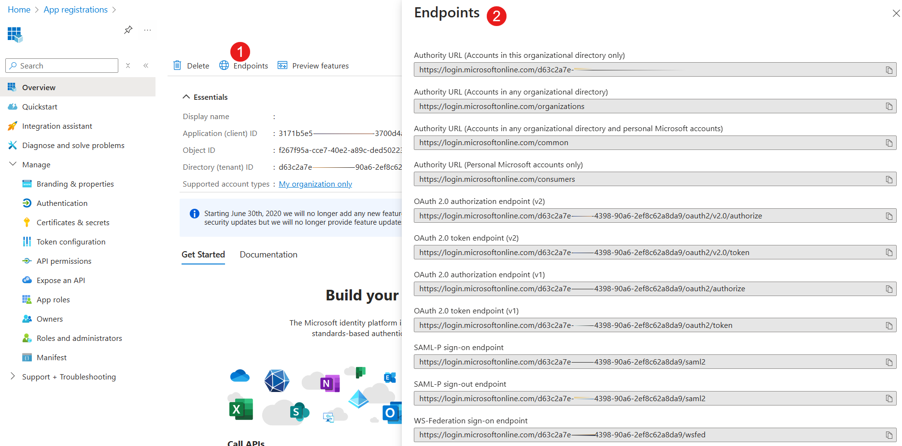
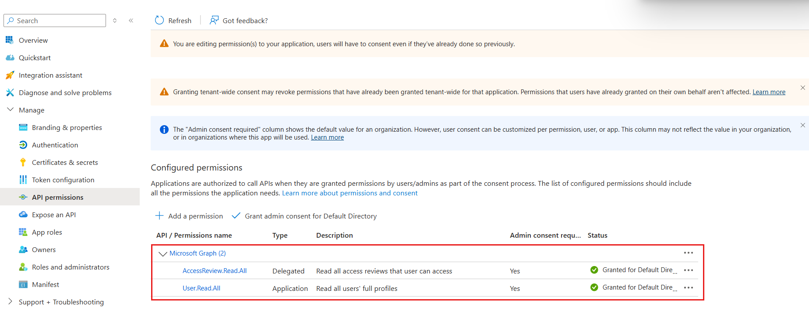

# Troubleshoot Authorization_RequestDenied error with Microsoft Graph

When using Microsoft Graph API to manage users, you may encounter the following error:

> `Authorization_RequestDenied. Insufficient privileges to complete the operation.`

This article demonstrates how to troubleshoot the `Authorization_RequestDenied` error in Microsoft Graph API using Postman, through a "disable user" scenario.

## Cause of the Authorization_RequestDenied error

This error typically occurs because the user does not have sufficient permissions. Specifically, the following conditions must be met:

- The user or application must have an administrative role.

- Microsoft Graph access must have the appropriate permissions.

## Troubleshooting Microsoft Graph API by using Postman

The following sample uses [app-only authentication](/entra/identity-platform/permissions-consent-overview#app-only-access-access-without-a-user) with Entra ID in Postman.  

### Step 1: Locate the application ID, client secret and token endpoints of your app

1. Log in to [Azure portal](https://portal.azure.com). Go to **App registrations**, and select your app registration.  
1. On the **Overview** page, record the **Application (client) ID**.
1. Select **Endpoints**. It provides the information such as token endpoints that will be used in the Postman configuration. This sample use auth2.0 and token to authenticate with the Entra ID. In this case, you should record the **OAuth 2.0 token endpoint (v2)**.
    
1. In the **Manage** section, select **Certificates & secrets**. Create a new client secret or use existing client secret for testing.

    In the Postman configuration, you should provide the **Client secret value**, not the Secret ID. The Client secret value cannot be viewed, except for immediately after creation.

### Step 2: Configure the Postman

1. In new request or collect, select **Authorization**.
1. The following is the authorization configuration for using Microsoft Graph API:

   - Grant type: Client Credentials
   - Access Token URl: \<OAuth 2.0 token endpoint\>.
   - Client ID: \<Application (client) ID\>
   - Client secret: \<Client secret value\>
   - Scope: `https://graph.microsoft.com/.default`
   - Client Authentication: Send as Basic Auth header
    
1. Select **Get New Access Token**. If the configuration is correct, you should receive a token that will be used to run the Microsoft Graph API call.
1. Select **Proceed**, and then select **Use token**.

### Step 3: Test and troubleshoot the Microsoft Graph API

1. Send the following PATCH request to disable a user. In the following sample, `1f953789-0000-0000-0000-6f21508fd4e2` is the object ID of a user in the Entra ID.

    ``` REST
    Patch https://graph.microsoft.com/v1.0/users/1f953789-0000-0000-0000-6f21508fd4e2
    ```

    ```body
    {
    "accountEnabled": false
    }


    ```

1. The `Authorization_RequestDenied` error is received in the response.

    ```json
    {
        "error": {
            "code": "Authorization_RequestDenied",
            "message": "Insufficient privileges to complete the operation.",
            "innerError": {
                "date": "2024-12-24T03:25:32",
                "request-id": "096361b2-75be-479b-b421-078610030949",
                "client-request-id": "096361b2-75be-479b-b421-078610030949"
            }
        }
    }
    ```
        
1. Check the [Update user scenario in Microsoft Graph REST API v1.0 endpoint reference](/graph/api/user-update?view=graph-rest-1.0&tabs=http#permissions&preserve-view=true). The following is the required permissions for enabling and disabling user that described in the Microsoft Graph REST API v1.0 endpoint reference:

    | Property        | Type    | Description |
    |:----------------|:--------|:------------|
    | accountEnabled  | Boolean | `true` if the account is enabled; otherwise, `false`. This property is required when a user is created. <br/> - *User.EnableDisableAccount.All* + *User.Read.All* is the least privileged combination of permissions required to update this property. <br/> - In delegated scenarios, *Privileged Authentication Administrator* is the least privileged role that's allowed to update this property for all administrators in the tenant. |

1. Check if the app registration has the required permission:
    1. Locate your app registration in the Azure portal.
    2. In the **Manage** section, select **API permissions**
    3. Check the configured API Permissions. In this case, the app registration doesn't have the **EnableDisableAccount.All** permission that is the root cause of the issue.

        
1. Select **Add Permissions** to add the `EnableDisableAccount.All` to the app registration. 
1. You must also select **Grant admin consent for default directory** for the permissions. Select **Yes** to confirm that you want to grant admin consent.
1. Send the PATCH request to disable a user. If the request is successful, you should receive `204 No Content`.


