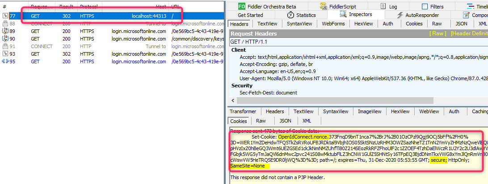

# ValidationContext.Nonce is null errors in ASP.NET MVC apps

This article provides solutions to the common nonce validation errors encountered in ASP.NET MVC apps using OpenID Connect (OIDC)  middleware.

## Common error messages

Depending on the version of Open Web Interface for .NET (OWIN) being used, you may encounter one of the following error messages:

- `IDX21323: RequireNonce is '[PII is hidden by default. Set the 'ShowPII' flag in IdentityModelEventSource.cs to true to reveal it.]'. OpenIdConnectProtocolValidationContext.Nonce was null, OpenIdConnectProtocol.ValidatedIdToken.Payload.Nonce was not null. The nonce cannot be validated. If you do not need to check the nonce, set OpenIdConnectProtocolValidator.RequireNonce to false.`

- `IDX10311: RequireNonce is 'true' (default) but validationContext.Nonce is null. A nonce cannot be validated. If you do not need to check the nonce, set OpenIdConnectProtocolValidator.RequireNonce to false.`

## Understanding nonce cookies

The ASP.NET OIDC middleware uses a nonce cookie to prevent [replay attacks](/dotnet/framework/wcf/feature-details/replay-attacks). As mentioned in the error, the app throws the exception when it can't find the nonce cookie in the authenticated request. Cookies are domain-based, meaning that once they're set for a specific domain, all subsequent requests to that domain will include these cookies until they expire or are deleted.

The following are Fiddler traces about how these cookies are set and used in a working flow:

1. In frame 116, the browser sends a request to the OIDC app protected by Microsoft Entra ID. After receiving the request, the app detects that it isn't authenticated and redirects it to  Microsoft Entra ID (`login.microsoftonline.com`) for authentication. Additionally, the app sets the `OpenIdConnect.nonce` cookie in the 302 redirect response.

    :::image type="content" source="media/troubleshoot-validation-context-nonce-null-mvc/fiddler-trace-start-auth.png" alt-text="Screenshot of Frame 116 in Fiddler Trace." lightbox="media/troubleshoot-validation-context-nonce-null-mvc/fiddler-trace-start-auth.png":::

2. After successful authentication (frame 120 – 228), Microsoft Entra ID redirects the request back to the web app (frame 229) with the authenticated ID token. The nonce cookie previously set for this domain is also included in the POST request. The OIDC middleware validates the authenticated token and the nonce cookie before it continues loading the page (via another redirect). At this point, the nonce cookie's purpose is complete, and the app invalidates it by setting the expiration attribute to expire.

    :::image type="content" source="media/troubleshoot-validation-context-nonce-null-mvc/fiddler-trace-after-auth.png" alt-text="Screenshot of Fiddler Trace Frames about authentication." lightbox="media/troubleshoot-validation-context-nonce-null-mvc/fiddler-trace-after-auth.png":::


## Solution

### Cause 1: Multiple domains are used for the same website

The browser originally navigates to the app on domain A (frame 9 below), and the nonce cookie is set for this domain. Later, Microsoft Entra ID sends the authenticated token to domain B (frame 91). Since the redirection to domain B doesn't include the nonce cookie, the web app throws the `validationContext.Nonce is null` error.
    :::image type="content" source="media/troubleshoot-validation-context-nonce-null-mvc/fiddler-trace-multiple-domains.png" alt-text="Screenshot of Fiddler Trace Frames about cause 1." lightbox="media/troubleshoot-validation-context-nonce-null-mvc/fiddler-trace-multiple-domains.png":::

#### Solution

To resolve this issue, follow these steps:

1. Redirect the request back to the same domain used originally after authentication. To control where Azure AD sent the authenticated request back to the app, set the `OpenIdConnectAuthentications.RedirectUri` property in the `ConfigureAuth` method.

1. Configure the reply URL in App Registration, otherwise you may receive the following error: AADSTS50011: The reply url specified in the request doesn't  match the reply urls configured for the app.

### Cause 2: Missing SameSite attributes

Due to the [SameSite cookie security updates](/azure/active-directory/develop/howto-handle-samesite-cookie-changes-chrome-browser?tabs=dotnet), all cookies involved in the authentication process, including Nonce cookies, should contain the following attributes:

- SameSite=None
- Secure

For more information, see [SameSite cookies and the Open Web Interface for .NET](/aspnet/samesite/owin-samesite).



### Solution

To make sure both of the above requirements are satisfied, follow these steps:

1. Use the HTTPS protocol to navigate to the web app.
1. Update .NET Framework and NuGet packages:
    - For .NET Framework apps:  Upgrade .NET Framework to version 4.7.2+ and relevant NuGet packages (Microsoft.Owin.Security.OpenIdConnect, Microsoft.Owin) to version 4.1.0+.
    - For .NET Core apps:
        - Version 2.x apps should use .NET Core 2.1+
        - Version 3.x apps should use .NET Core 3.1+

Example configuration code for Startup.Auth.cs:

```csharp
using System.Configuration;
using Owin;
using Microsoft.Owin.Security;
using Microsoft.Owin.Security.Cookies;
using Microsoft.Owin.Security.OpenIdConnect;
using System.Threading.Tasks;
using Microsoft.Owin.Security.Notifications;
using Microsoft.IdentityModel.Protocols.OpenIdConnect;

namespace NetWebAppOIDC2
{
    public partial class Startup
    {
        private static string clientId = ConfigurationManager.AppSettings["ida:ClientId"];
        private static string aadInstance = ConfigurationManager.AppSettings["ida:AADInstance"];
        private static string tenantId = ConfigurationManager.AppSettings["ida:TenantId"];
        private static string postLogoutRedirectUri = ConfigurationManager.AppSettings["ida:PostLogoutRedirectUri"];
        private static string authority = aadInstance + tenantId;

        public void ConfigureAuth(IAppBuilder app)
        {
            app.SetDefaultSignInAsAuthenticationType(CookieAuthenticationDefaults.AuthenticationType);

            app.UseCookieAuthentication(new CookieAuthenticationOptions());
            app.UseOpenIdConnectAuthentication(
                new OpenIdConnectAuthenticationOptions
                {
                    ClientId = clientId,
                    Authority = authority,
                    PostLogoutRedirectUri = postLogoutRedirectUri,
                    RedirectUri = "https://localhost:44313",
                    
                    Notifications = new OpenIdConnectAuthenticationNotifications
                    {
                        AuthenticationFailed = OnAuthenticationFailed
                    }

                    // Don't use SystemwebCookieManager class here to override the default CookieManager as that seems to negate the SameSite cookie attribute being set
                    // CookieManager = new SystemWebCookieManager()

                });
        }

        private Task OnAuthenticationFailed(AuthenticationFailedNotification<OpenIdConnectMessage, OpenIdConnectAuthenticationOptions> context)
        {
            context.HandleResponse();
            context.Response.Redirect("/?errormessage=" + context.Exception.Message);
            return Task.FromResult(0);
        }
    }
}
```

[!INCLUDE [Azure Help Support](../../../includes/azure-help-support.md)]
