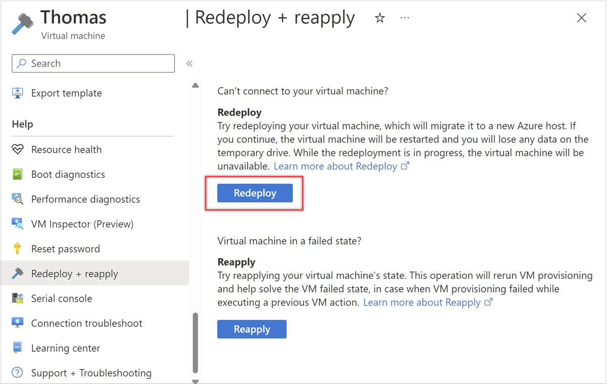

## Use the Azure portal
1. Go to the [Azure portal](https://portal.azure.com), select the VM you wish to redeploy.
1. In the **Help** section, select **Redeploy and reapply**, and then select **Redeploy** to migrate it to a new Azure host.

  