# Configure operating system deployment in System Center 2012 Configuration Manager

Most support issues that affect operating system deployment (OSD) in System Center 2012 Configuration Manager stem from product misconfigurations. Although there are no simple guidelines to implement something as powerful and complex as OSD, this article describes the step-by-step process for configuring System Center 2012 Configuration Manager (ConfigMgr 2012) to capture an existing Windows image. This article also guides you through creating a client package and task sequence to deploy and install that image.

_Original product version:_ &nbsp; Microsoft System Center 2012 Configuration Manager  
_Original KB number:_ &nbsp; 2969096

## Introduction

This article assumes that you have an existing environment that has a Configuration Manager 2012 site installed and also a primary site that's running Configuration Manager 2012. These steps can also be used together with a stand-alone primary site that is running Configuration Manager 2012. Additionally, this article requires that the Network Access Account and Boundaries are configured correctly, and that ConfigMgr client agents are installed on the clients.

### Overview of the technology

OSD provides System Center 2012 Configuration Manager administrative users a tool to create operating system images that can be deployed both to computers that are managed by Configuration Manager and to unmanaged computers. You can do this by using bootable media, such as a CD set, DVD, or USB flash drives. A description of each component of the OSD process can be found in [Introduction to Operating System Deployment in Configuration Manager](/previous-versions/system-center/system-center-2012-R2/gg682108(v=technet.10)).

## Prerequisites

|Task|Detailed steps|
|---|---|
|Prerequisites|This article assumes you have an existing environment with a Configuration Manager 2012 site installed as well as a primary site running Configuration Manager 2012. These steps can also be used with a standalone primary site running Configuration Manager 2012. Further, this article requires that the Network Access Account and Boundaries are properly configured and that ConfigMgr client agents are installed on the clients.|
|Computers used in this exercise|GTRCM12CAS (ConfigMgr 2012 central administration site (CAS) server) GTRCM12PRI1 (ConfigMgr 2012 primary site server) GTRCM12WIN7B (ConfigMgr 2012 client) GTRCMXP01 (ConfigMgr 2012 client) |
|||  

## Configure the components

In this section, we will install the Windows Deployment Services (WDS) role on GTRCM12PRI1 and then share a folder. We will configure a distribution point (DP) to respond to incoming PXE requests, and then we will copy x86 and x64 boot images to it.

|Task|Detailed steps|
|---|---|
|| Complete the following steps on the primary site server (GTRCM12PRI1) |
|Open an elevated command prompt|1. On the **Start** menu, point to **All Programs**, point to **Accessories**, and then point to **Command Prompt**. Right-click it and select **Run as administrator** from the shortcut menu.|
|Share folder Flats as Sources|2. Run the `net share Sources=C:\Flats /Grant:System,Full /Grant:Administrators,Full` command to grant System and local admin permission to the Sources share.  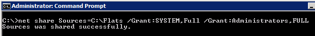 |
|Log off GTRCM12PRI1||
|| Complete the following tasks on the CAS (GTRCM12CAS) |
|Start the Configuration Manager Console|1. On the **Start** menu, point to **All Programs**, point to **Microsoft System Center**, point to **Configuration Manager 2012**, and then select **ConfigMgr Console**.|
||2. Switch to the Administration Overview page. Expand **Site Configuration** > **Servers and Site System Roles**. Select the primary site server (GTRCM12PRI1). Look for **Distribution point** located in the **Site System Roles** area, then right-click it and select **Properties** from the menu.  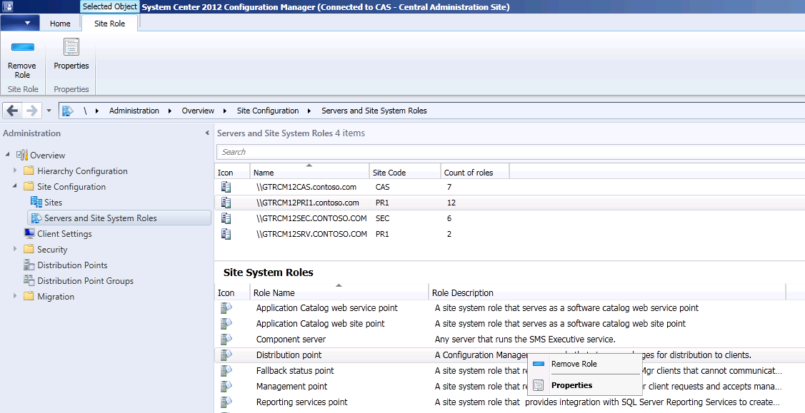|
||3. On the **PXE** tab, select **Enable PXE support for clients, Allow this distribution point to respond to incoming PXE requests**, and **Enable unknown computer support**.  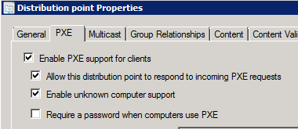|
|Configure the image properties|4. Move to the **Software library Overview** page. Expand **Operating Systems** and then **Boot Images**. Select **Boot image (x64)**. Right-click it and select **Properties** from the shortcut menu. On the **Data Source** tab, enable **Deploy this boot image from PXE service point**, and then select **Apply**.  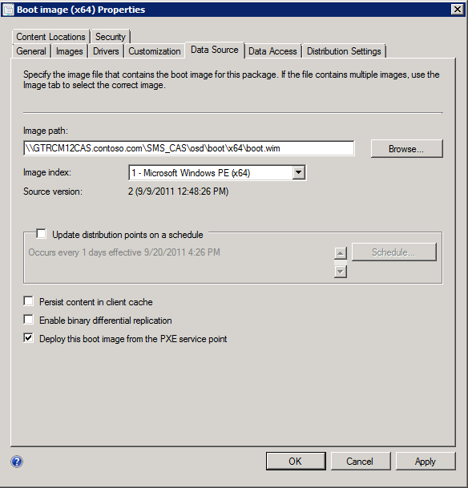  Complete the wizard to update the boot image. Repeat these steps for **Boot image (x86)**.|
|Copy both boot images to your DP on GTRCM12PRI1|5. Select both boot images, and then select **Distribute Content** from the bar at the top. Be sure you select the primary site server (GTRCM12PRI1) as the destination.  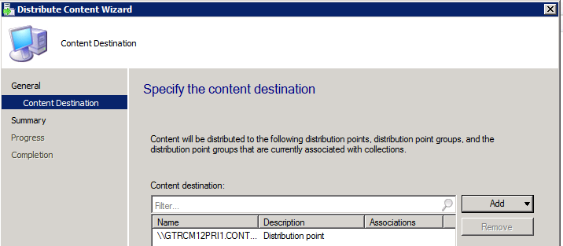|
|Optional|Monitor the distmgr.log file on GTRCM12PRI1. Notice that PXE configuration occurs when the first boot image has been copied to the DP.  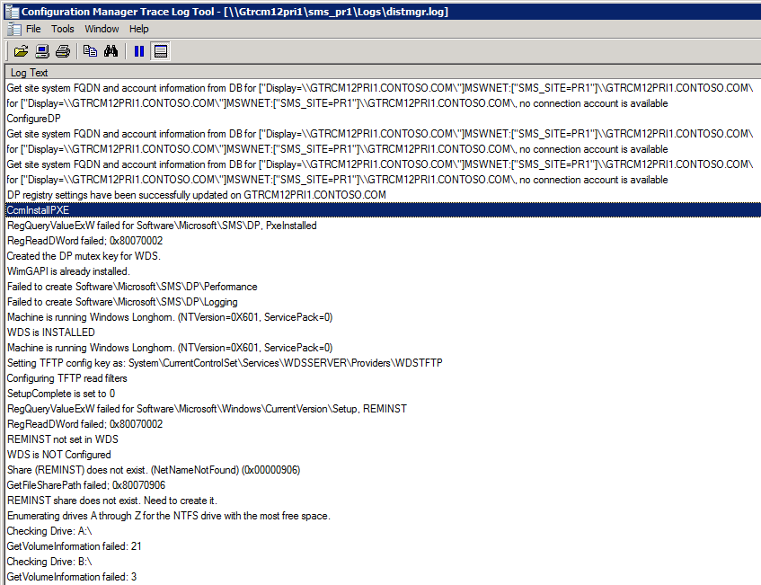|
|||  

## Create a custom task sequence to capture an image

Here we will create a custom task sequence to capture an image from a client named GTRCM12WIN7B. After a successful capture, we will then use this image to reinstall a second client (GTRCM12XP1) with Windows 7.

|Task|Detailed Steps|
|---|---|
||Complete the following task on the CAS (GTRCM12CAS)|
|Start the Configuration Manager Console|1. On the **Start** menu, point to **All Programs**, point to **Microsoft System Center**, point to **Configuration Manager 2012**, and then select **ConfigMgr Console**.   **Note** The **System Center Configuration Manager Console** window appears and displays the Administration Overview page.|
||2. In the navigation pane, select **Software Library**. Expand **Operating Systems** and then select **Task Sequences**. Select **Create Task Sequence** from the bar at the top.  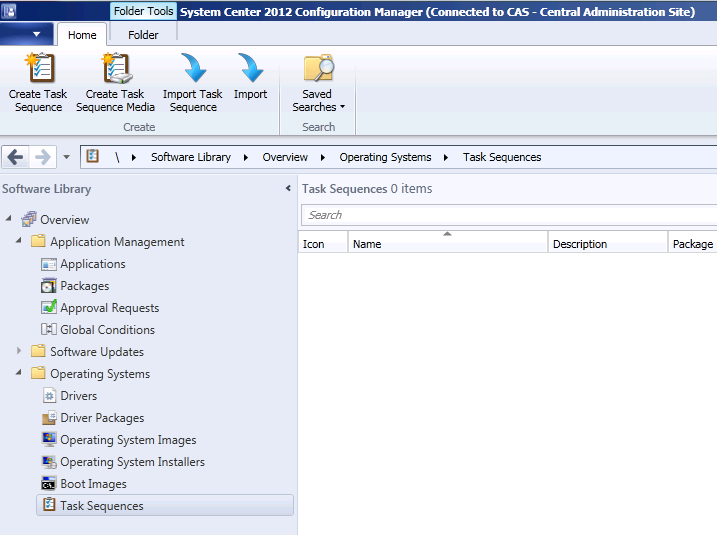|
|Create a custom task sequence|1. Select **Create a new custom task sequence**.  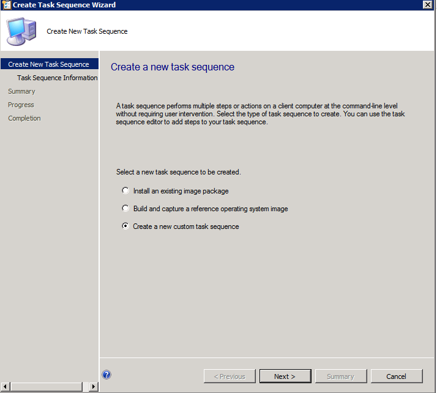|
||2. Name it **Capture Reference Computer**, select **Boot Image (x86)**, and then finish the wizard.  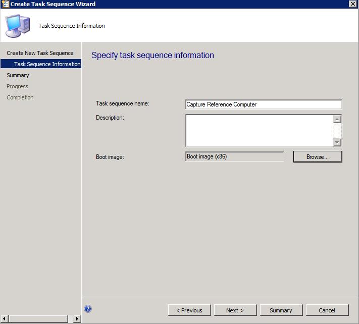  3. Right-click **Capture Reference Computer** and select **Edit** from the shortcut menu.  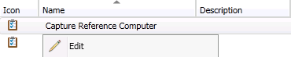|
||4. Select **Add** and select **New Group**. Name it **Capture Image**.  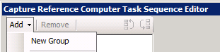  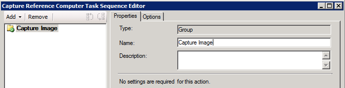  5. Add the following three steps from **Images** underneath your **Capture Image** group as shown in the following screenshot.  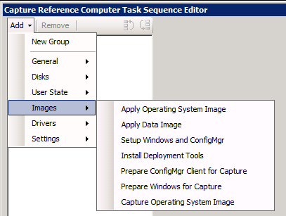  *Prepare ConfigMgr Client for Capture*  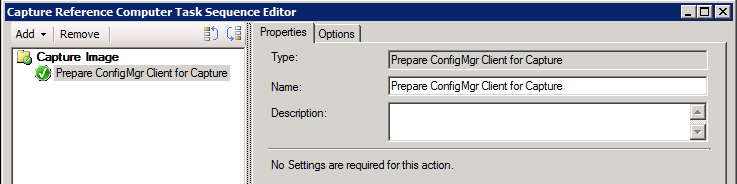|
|| *Prepare Windows for Capture*   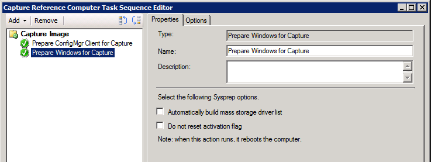  *Capture Operating System Image*   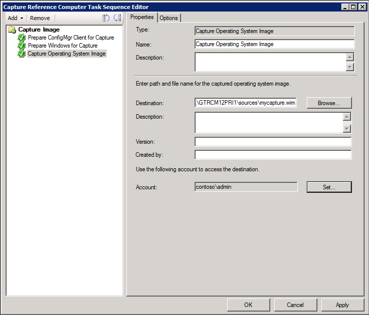|
||6. Theoretically, we could use the task sequence to do the capture now. However, we should first make sure the target is not part of a domain. If it is, we will add a step to move the target computer to a workgroup.  **NOTE**  Systems that are part of a domain cannot be captured and your task sequence will fail!  7. Add another group, and name it Domain membership check.    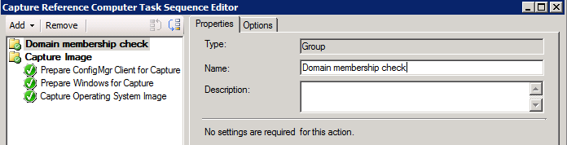   8. Use the following WMI query to verify domain membership on the **Options** page.   `SELECT * from Win32_ComputerSystem WHERE Workgroup = NULL`   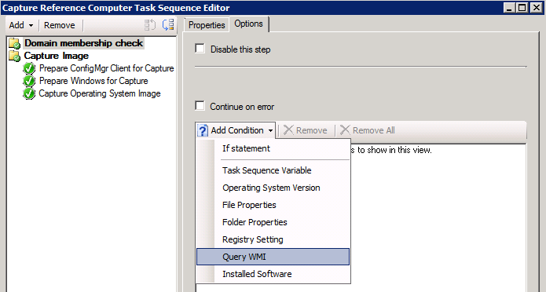 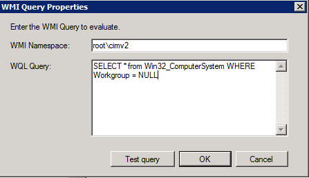 |
||Run the test, which should return an instance count of 1. This means that the current system (in our case the CAS named GTRCM12CAS) is member of a domain.  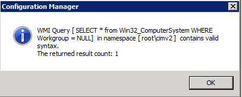  9. Add a final step to join the system to a workgroup.   **NOTE** The target system will restart after executing this task.    |
|Create a device collection|1. Select the **Assets and Compliance** workspace. In the navigation pane, select **Device Collections**. Select **Create Device Collection** from the bar at the top.  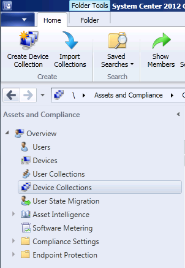  2. Name it **Capture Image**.  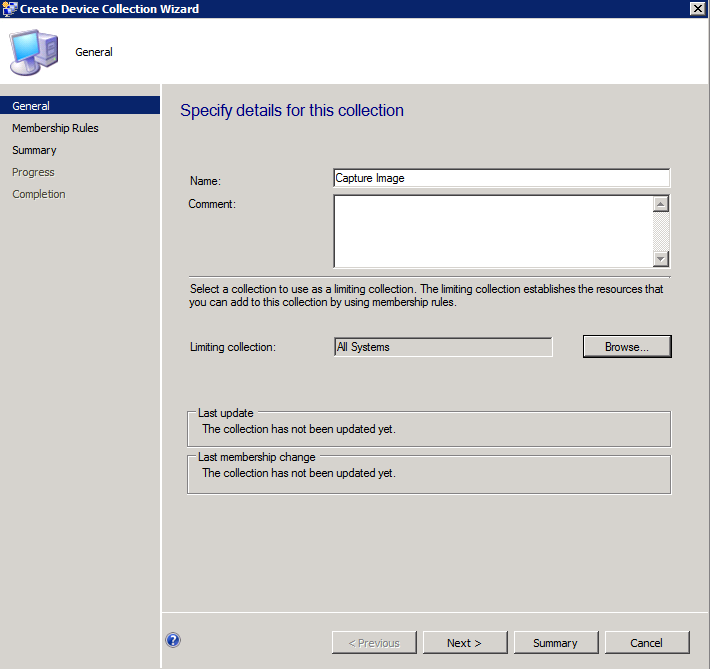|
||3. Add the reference computer (here it is the client GTRCM12WIN7B) as direct member, and then finish the wizard.  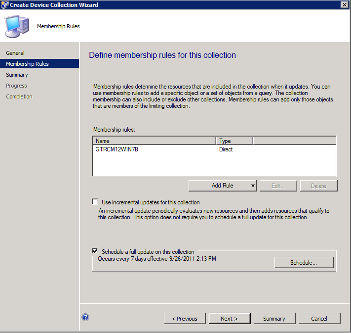|
|Deploy your task sequence to the new collection.|1. Right-click your new collection and select **Deploy** > **Task Sequence** from the shortcut menu. Click through the wizard and finish it.  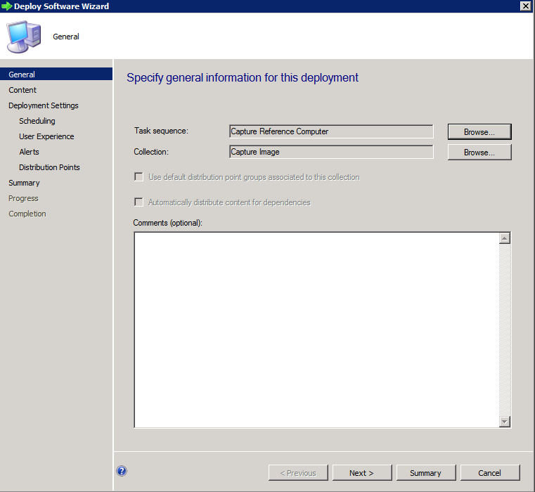|
|Log on to the reference computer (GTRCM12WIN7B) and run the task sequence|1. Log on to GTRCM12WIN7B.  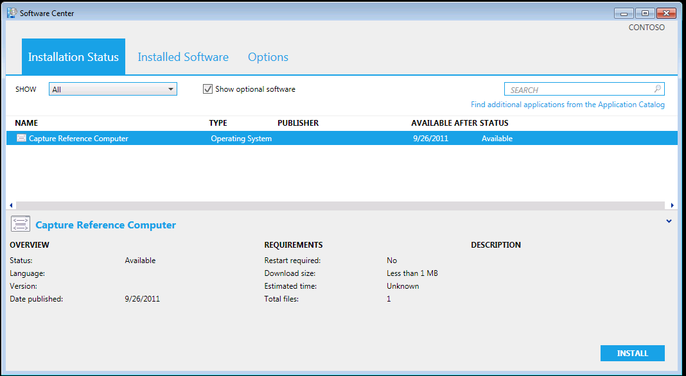  Confirm and run the task sequence.  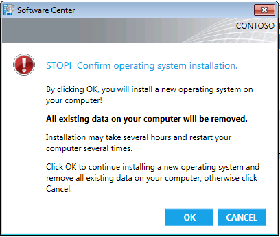  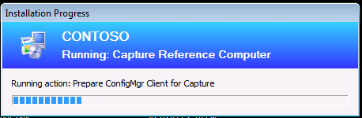|
|||

## Create a configuration manager client package

In this exercise, we will create a Configuration Manager client package to use during operating system installations.

|Task|Detailed steps|
|---|---|
|| Complete the following tasks on the CAS (GTRCM12CAS) |
|Start the Configuration Manager Console|1. On the **Start** menu, point to **All Programs**, point to **Microsoft System Center**, point to **Configuration Manager 2012**, and then select **ConfigMgr Console**.  **NOTE** The System Center Configuration Manager Console window appears to display the Administration Overview page.|
|Create a package from Definition|2. In the navigation pane, select **Software Library**. Expand **Application Management**, and then select **Packages**. Select **Create Package from Definition** from the bar at the top.  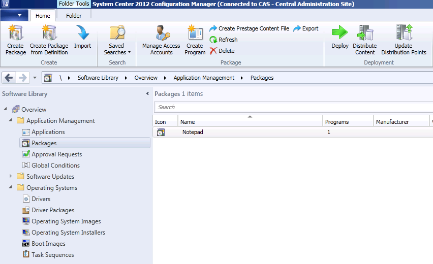|
||3. Select **Configuration Manager Client Upgrade 5.0**  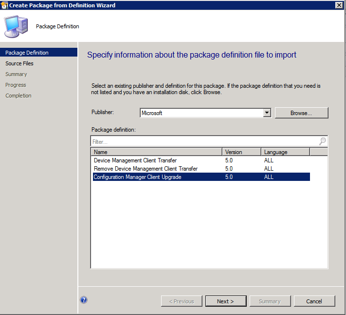|
||4. Select **Always obtain files source files from a source folder**.  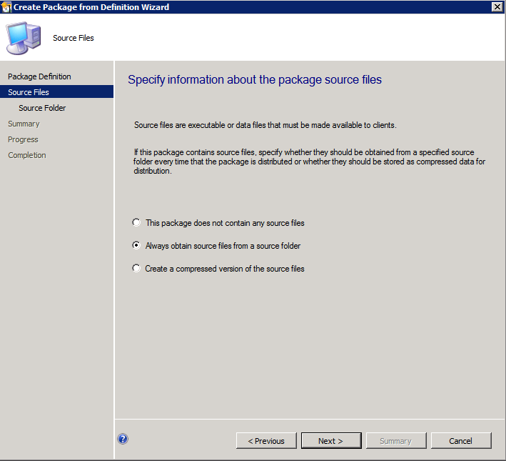|
||5. Specify the appropriate client source location. Here we will use \\\GTRCM12PRI1\sms_pr1\Client as our source location.    Complete the wizard, and then distribute the content to your distribution points.|
|||  

## Create a task sequence to install your image

In this exercise, we will create a task sequence to install our new image to a client named GTRCM12XP1.

|Task|Detailed steps|
|---|---|
|| Complete the following tasks on the CAS (GTRCM12CAS) |
|Start the Configuration Manager Console|1. On the **Start** menu, point to **All Programs**, point to **Microsoft System Center**, point to **Configuration Manager 2012**, and then select **ConfigMgr Console**. **NOTE** The System Center Configuration Manager Console window appears to display the Administration Overview page.|
|Add your Operating System image|2. In the navigation pane, select **Software Library**. Expand **Operating Systems** and select **Operating System Images**. Select **Add Operating System Image** from the bar at the top.  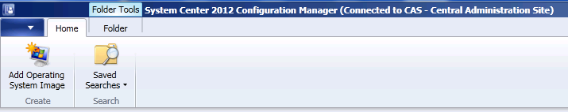|
||3. Select the capture folder on the primary site server (here it is \\\GTRCM12PRI1\sources\mycapture.wim) as the data source. This is where we previously captured our image.  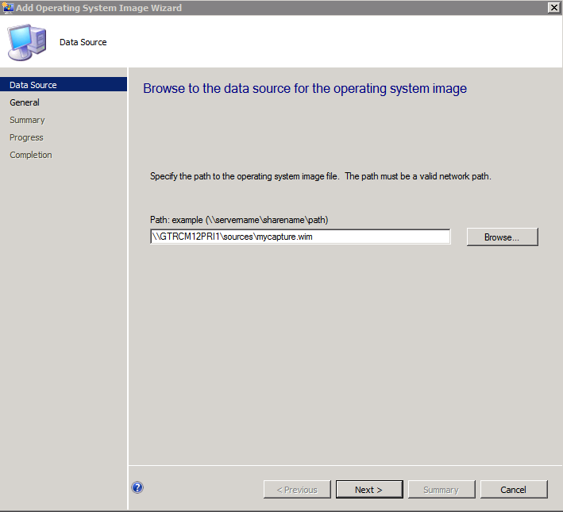|
||4. Name your image, then complete the wizard and distribute it to your distribution points.  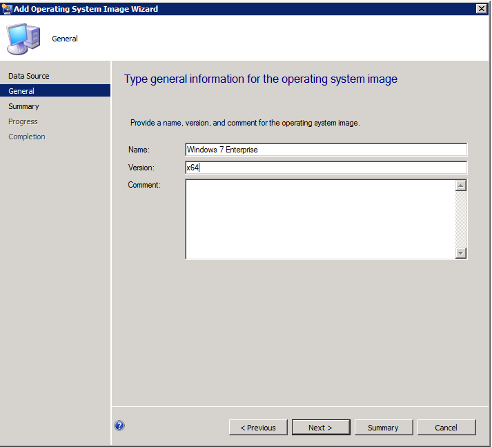|
|Create a new task sequence to install your image|1. In the navigation pane, select **Software Library**. Expand **Operating Systems** and select **Task Sequences**. Select **Create Task Sequence** from the bar at the top.  |
||2. Select **Install an existing image package**.  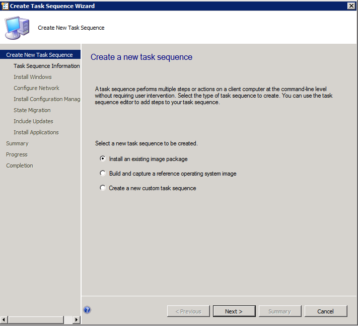|
||3. Name your task sequence, and then select your **Boot Image (x86**).  Tip: In this case, you can use either your x86 or x64 boot image. We aren't running an architecture-based setup.exe like we do when using an Operating System Install package.  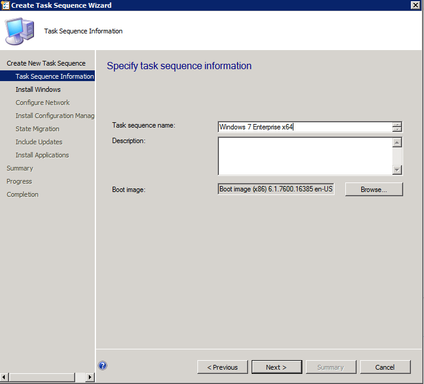|
||4. Select your image, and then provide the administrator password used for that image.  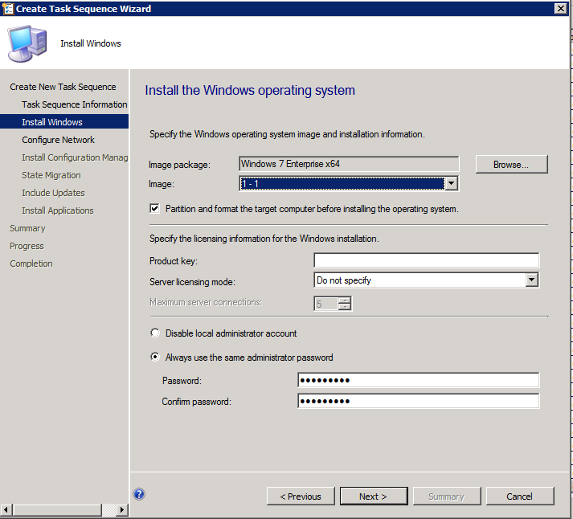|
||5. Select **Join a domain**, and provide an appropriate domain account and password. This account should have **domain join** and **reset computer passwords** permissions.   Warning: Never use a domain admin account to do this in production environments! You just need domain join permissions and the right to reset computer passwords.  |
||6. Select your Configuration Manager client package, and then provide your FSP as an installation parameter. Here, we will use our primary site server (FSP=GTRCM12PRI1).  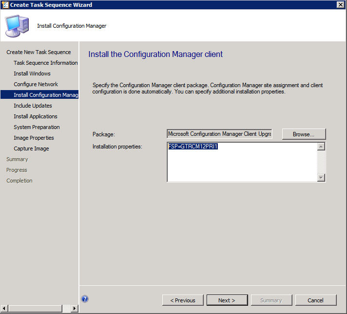|
||7. Clear the **This action will capture the user specific settings** check box.  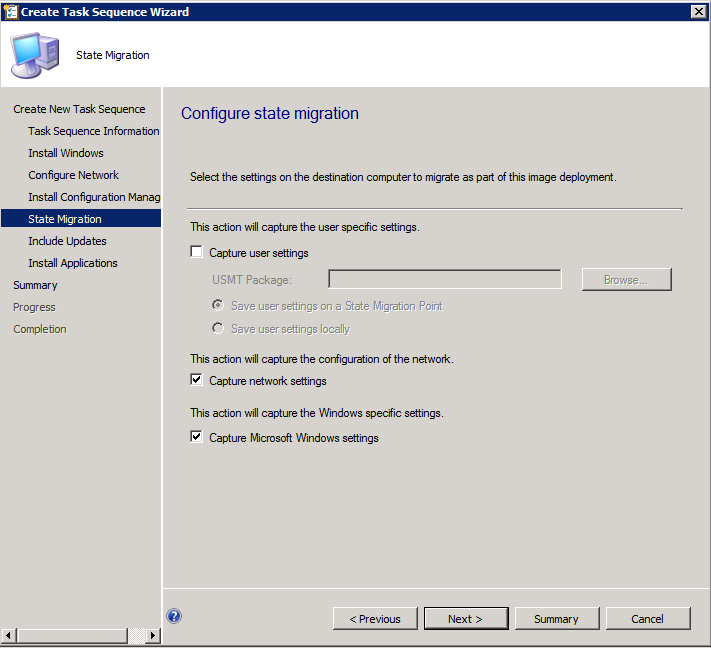   Tip: Capture network settings will ensure that our custom network settings are reapplied during deployment.  Don't install updates or software, and then complete the wizard.|
|Create a new device collection|1. Select the **Assets and Compliance** workspace. In the navigation pane, select **Device Collections**. Select **Create Device Collection** from the bar at the top.  |
||2. Name the collection as **Windows 7 Enterprise x64**.  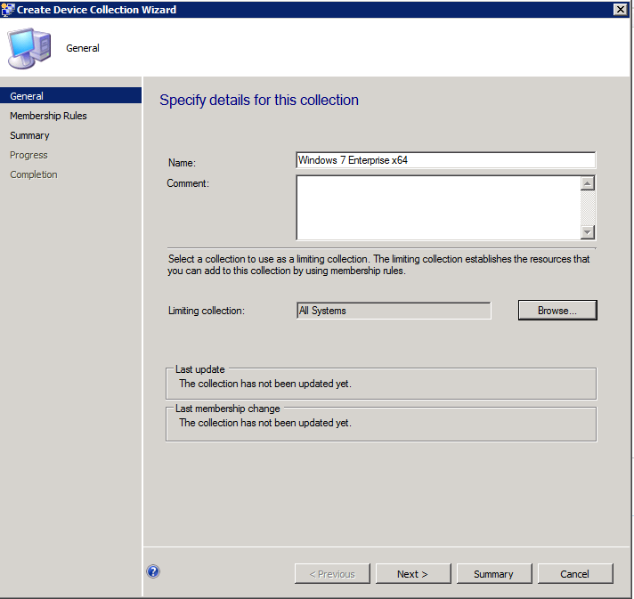|
||3. Add our target computer (in this case GTRCM12XP1) as a direct member.  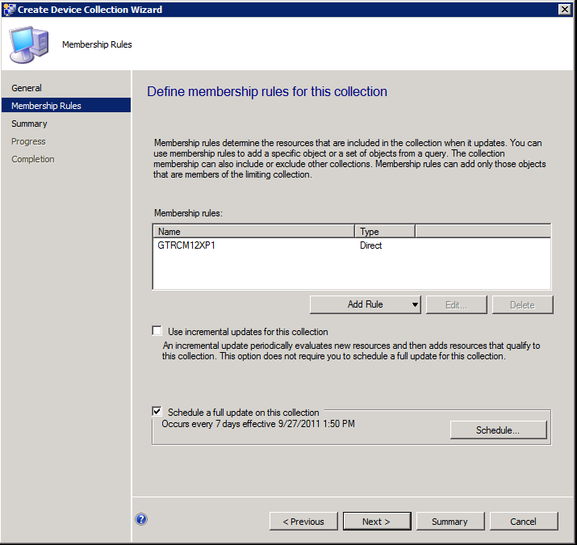|
|Distribute the task sequence to this collection|1. Right-click your new collection, and then select **Deploy** > **Task Sequence** from the shortcut menu. Click through the wizard, and then finish.  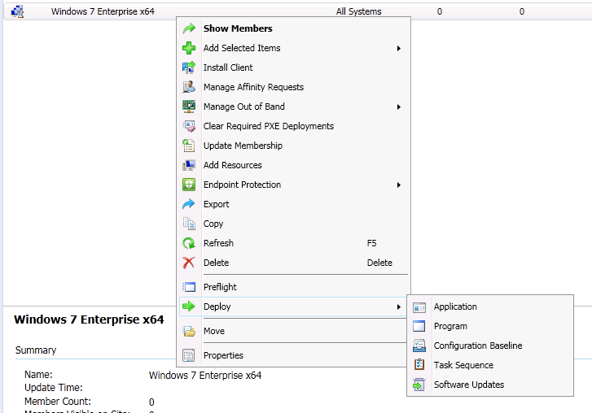|
|Run the task sequence on GTRCM12XP1 to install the operating system image.|1. Log on to GTRCM12XP1, and then run the new task sequence to install your new operating system.  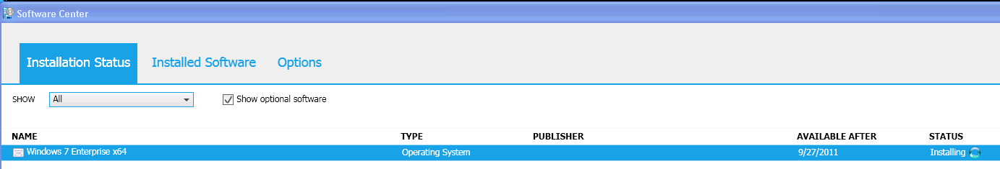    |
|||

## OSD task sequences known issues

- [You cannot stage a Windows PE 3.1 boot image to a Windows XP-based computer in Configuration Manager](https://support.microsoft.com/help/2910552)
- [Task sequence fails in Configuration Manager if software updates require multiple restarts](https://support.microsoft.com/help/2894518)
- [FIX: Task sequence to install an operating system doesn't run when you use custom port settings in System Center Configuration Manager 2012 SP1](https://support.microsoft.com/help/2838585)
- [An update is available for the "Operating System Deployment" feature of Configuration Manager](https://support.microsoft.com/help/2905002)

The above and a number of other issues with task sequences are addressed in [Description of Cumulative Update 1 for System Center 2012 R2 Configuration Manager](https://support.microsoft.com/help/2938441).
