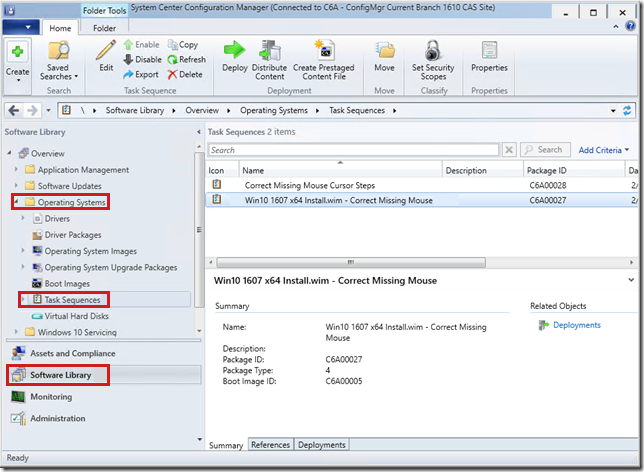
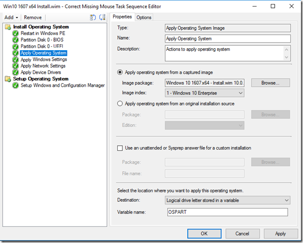
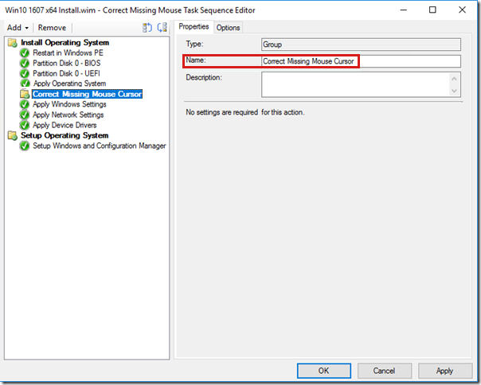
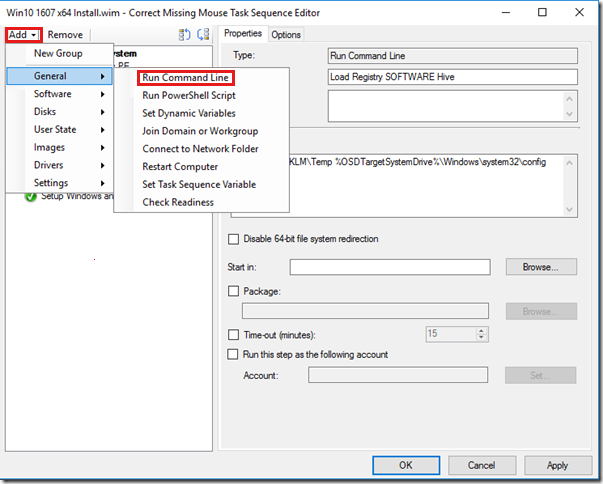
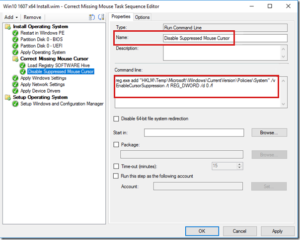
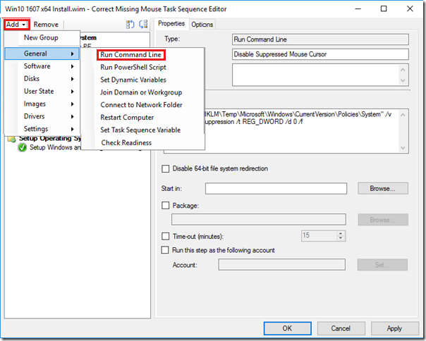

# No mouse cursor appears during a Configuration Manager OSD task sequence

_Original product version:_ &nbsp; Configuration Manager  
_Original KB number:_ &nbsp; 4494800

This article fixes an issue in which no mouse cursor appears during a Configuration Manager OS deployment (OSD) task sequence.

## Symptoms

You're running a Configuration Manager OSD task sequence that deploys Windows 10. During the **Setup Windows and ConfigMgr** task, the device restarts out of Windows PE and into the newly installed Windows system. If you then open a Command Prompt window by pressing F8, no mouse cursor appears. This issue continues to occur for the rest of the task sequence. After the task sequence finishes, the mouse cursor appears.

## Cause

This issue is caused by a design change in Windows 10 in which the mouse cursor is suppressed during Windows Setup. Because Configuration Manager OSD task sequences run entirely within Windows Setup in the newly installed Windows system, the mouse cursor is suppressed during this phase of the task sequence.

## Resolution

To resolve this issue, change the policy that suppresses the mouse cursor during Windows Setup by default. This is easily accomplished by changing the registry key value that's associated with the policy. The registry key value is located in the following subkey:

`HKEY_LOCAL_MACHINE\SOFTWARE\Microsoft\Windows\CurrentVersion\Policies\System`

|Value name|Value type|Values|
|---|---|---|
|`EnableCursorSuppression`|REG_DWORD| **1** = Enabled: Mouse cursor is suppressed (default)   **0** = Disabled: Mouse cursor is not suppressed|
||||

To make sure that the mouse cursor is available throughout the task sequence, set this registry key during the Windows PE portion of the task sequence to the offline Windows system. This can be done at any point between the **Apply Operating System** and **Setup Windows and ConfigMgr** tasks.

To make this change, use either of the following methods.

### Method 1: Import the task sequence

1. Download the task sequence from [CorrectMissingMouseCursor.zip](https://msdnshared.blob.core.windows.net/media/2017/02/CorrectMissingMouseCursor.zip).

   The task sequence contains all the required additional steps. These will be copied into the existing task sequence that's experiencing the issue.

2. Import the downloaded task sequence to Configuration Manager by following the steps in [Process to import task sequences](/mem/configmgr/osd/deploy-use/manage-task-sequences-to-automate-tasks#process-to-import-task-sequences).

3. In the Configuration Manager console, under **Software Library** > **Operating Systems** > **task sequences**, navigate to the newly imported **Correct Missing Mouse Cursor Steps** task sequence from step 2.

   

4. Right-click the **Correct Missing Mouse Cursor Steps** task sequence that was imported in step 2, and select **Edit**. Make sure to leave the task sequence open so that its steps can be copied to the affected task sequence.

   

5. In the Configuration Manager console, under **Software Library** > **Operating Systems** > **Task Sequences**, navigate to the affected task sequence.

    

6. Right-click the affected task sequence and select **Edit**.

    

7. For steps 8-12, make sure that both the affected task sequence and the imported **Correct Missing Mouse Cursor Steps** task sequence are always open. Do not close either of these task sequences during these steps.

   :::image type="content" source="./media/no-mouse-cursor-during-osd-task-sequence/imported-task-sequence-open.png" alt-text="Open the Correct Missing Mouse Cursor Steps task sequence.":::

   :::image type="content" source="./media/no-mouse-cursor-during-osd-task-sequence/affected-task-sequence-open.png" alt-text="Open the affected task sequence.":::

8. In the imported **Correct Missing Mouse Cursor Steps** task sequence, right-click the **Correct Missing Mouse Cursor** group, and then select **Copy**.

   :::image type="content" source="./media/no-mouse-cursor-during-osd-task-sequence/copy-imported-task-sequence.png" alt-text="Select Copy for the imported task sequence.":::

9. In the affected task sequence, right-click the **Apply Operating System** task, and then select **Paste**.

   :::image type="content" source="./media/no-mouse-cursor-during-osd-task-sequence/paste.png" alt-text="Select Paste for the affected task sequence.":::

   > [!NOTE]
   > This should copy the **Correct Missing Mouse Cursor** group immediately after the **Apply Operating System** task.

   

10. In the imported **Correct Missing Mouse Cursor Steps** task sequence, right-click the **Reset Mouse Suppression to Default** task, and select **Copy**.

    :::image type="content" source="./media/no-mouse-cursor-during-osd-task-sequence/copy-task.png" alt-text="Copy Reset Mouse Suppression to Default task.":::

11. In the affected task sequence, right-click the last task in the task sequence, and then select **Paste**.

    :::image type="content" source="./media/no-mouse-cursor-during-osd-task-sequence/paste-to-last-task.png" alt-text="Paste to the last task in the affected task sequence.":::

    This should copy the **Reset Mouse Suppression to Default** task as the last task in the task sequence. The last task in the task sequence may differ from the one that's shown in the screenshot.

    :::image type="content" source="./media/no-mouse-cursor-during-osd-task-sequence/pasted-task-display.png" alt-text="Reset Mouse Suppression to Default task showing.":::

12. Select the **OK** or **Apply** button on the affected task sequence to save the sequence.

    :::image type="content" source="./media/no-mouse-cursor-during-osd-task-sequence/ok-and-apply.png" alt-text="Apply the change.":::

13. Close the imported **Setup Complete Workaround Steps** task sequence.

    :::image type="content" source="./media/no-mouse-cursor-during-osd-task-sequence/close.png" alt-text="Close the Setup Complete Workaround Steps task sequence.":::

> [!NOTE]
>
> - For step 12, the last task selected does not necessarily have to be the absolute last task in the task sequence. However, it should be located toward the end of the task sequence.
> - For MDT task sequences, steps 11-12 should be performed two times: One time at the end of the **State Restore** group and again at the end of the **Gather Logs and StateStore on Failure** group. Additionally, on the **Options** tab of the **Reset Mouse Suppression to Default** task that was added to the end of the **Gather Logs and StateStore on Failure** group, the **Continue on error** option should be selected.
> - Steps 10-11 restore the `EnableCursorSuppression` policy to its default value in Windows. Although this setting is not required for the solution to work, we recommend that you reset the `EnableCursorSuppression` policy to its default value. This will make sure that there are no unusual consequences in Windows after the task sequence finishes changing the policy from its default value.

### Method 2: Manually set the task sequence

1. In the Configuration Manager console under **Software Library** > **Operating Systems** > **Task Sequences**, navigate to the affected task sequence.

   

2. Right-click the affected task sequence, and select **Edit**.

   

3. In the affected task sequence, select the **Apply Operating System** task.

   

4. Add a new group immediately after the **Apply Operating System** task. To do this, open the **Add** menu, and select **New Group**.

   :::image type="content" source="./media/no-mouse-cursor-during-osd-task-sequence/new-group.png" alt-text="Add new group.":::

5. Select the newly created group, and rename it to **Correct Missing Mouse Cursor**.

   **  

6. Under the **Correct Missing Mouse Cursor** group, add a **Run Command Line** task. To do this, open the **Add** menu, and then select **General** > **Run Command Line**.

   :::image type="content" source="./media/no-mouse-cursor-during-osd-task-sequence/add-task.png" alt-text="Add Run Command Line task.":::

7. Select the newly created **Run Command Line** task, and specify the following values:

   - Name: **Load Registry SOFTWARE Hive**
   - Command line command:

     `reg.exe load HKLM\Temp %OSDTargetSystemDrive%\Windows\system32\config\software`

   :::image type="content" source="./media/no-mouse-cursor-during-osd-task-sequence/specify-values.png" alt-text="Specify name and Command line.":::

8. Immediately after the **Load Registry SOFTWARE Hive** task, add another **Run Command Line** task. To do this, open the **Add** menu, and select **General** > **Run Command Line**.

   

9. Select the newly created **Run Command Line** task, and specify the following values:

   - Name: **Disable Suppressed Mouse Cursor**
   - Command line command:

     `reg.exe add "HKLM\Temp\Microsoft\Windows\CurrentVersion\Policies\System" /v EnableCursorSuppression /t REG_DWORD /d 0 /f`

   

10. Immediately after the **Disable Suppressed Mouse Cursor** task, add another **Run Command Line** task. To do this, open the **Add** menu, and select **General** > **Run Command Line**.

    

11. Select the newly created **Run Command Line** task, and specify the following values:

    - Name: **Unmount Registry SOFTWARE Hive**
    - Command line command:

      `reg.exe unload HKLM\Temp`
  
    :::image type="content" source="./media/no-mouse-cursor-during-osd-task-sequence/unmount-registry-software-hive.png" alt-text="Specify Unmount Registry SOFTWARE Hive.":::

12. Select the last task in the task sequence.

    The last task in the task sequence may differ from the one that's shown in the screenshot.

    :::image type="content" source="./media/no-mouse-cursor-during-osd-task-sequence/last-task.png" alt-text="Select last task.":::

13. Add a **Run Command Line** task. To do this, open the **Add** menu, and then select **General** > **Run Command Line**. This should add the **Run Command Line** task as the last task in the task sequence.

    :::image type="content" source="./media/no-mouse-cursor-during-osd-task-sequence/add-last-task.png" alt-text="Add a Run Command Line task as the last task.":::

14. Select the newly created **Run Command Line** task and specify the following values:

    - Name: **Reset Mouse Suppression to Default**
    - Command Line:

      `reg.exe add "HKLM\SOFTWARE\Microsoft\Windows\CurrentVersion\Policies\System" /v EnableCursorSuppression /t REG_DWORD /d 1 /f`

    :::image type="content" source="./media/no-mouse-cursor-during-osd-task-sequence/reset-mouse-suppression-to-default.png" alt-text="Specify the Run Command Line task.":::

15. Select the **OK** or **Apply** button to save the task sequence.

    :::image type="content" source="./media/no-mouse-cursor-during-osd-task-sequence/apply-to-save.png" alt-text="Save the task sequence.":::

> [!NOTE]
>
> - For step 13, the last task that's selected does not necessarily have to be the absolute last task in the task sequence. However, it should be located toward the end of the task sequence.
> - For MDT task sequences, steps 13-15 should be performed two times: One time at the end of the **State Restore** group, and again at the end of the **Gather Logs and StateStore on Failure** group. Additionally, on the **Options** tab of the the **Reset Mouse Suppression to Default** task that's added to the end of the **Gather Logs and StateStore on Failure** group, the **Continue on error** option should be selected.
> - Steps 12-14 restore the `EnableCursorSuppression` policy to its default value in Windows. Although it's not required for the solution to work, we recommend that you reset the `EnableCursorSuppression` policy to its default value. This will make sure that there are no unusual consequences in Windows after the task sequence finishes changing the policy from its default value.
