# Understand and troubleshoot Updates and Servicing in Configuration Manager

_Original product version:_ &nbsp; Configuration Manager (current branch)  
_Original KB number:_ &nbsp; 4490424

This article helps administrators understand the Updates and Servicing process in Configuration Manager (current branch). This article can also help you troubleshoot common issues that you might encounter when you install updates.

Configuration Manager synchronizes with the Microsoft Cloud service to get updates that apply to your infrastructure and version. You can use the Configuration Manager console to install these updates.

To view and manage the updates, in the Configuration Manager console that's connected to the top-level site, navigate to **Administration** > **Cloud Services** > **Updates and Servicing** For more information, see [Install in-console updates for Configuration Manager](/mem/configmgr/core/servers/manage/install-in-console-updates).

## Best practices for updates

Before you install updates by using the Configuration Manager console, review the following steps.

### Step 1: Review the update checklists

Review the following update checklists for actions to take before you start the update:

- [Checklist for installing update 2503](/mem/configmgr/core/servers/manage/checklist-for-installing-update-2503)
- [Checklist for installing update 2409](/mem/configmgr/core/servers/manage/checklist-for-installing-update-2409)
- [Checklist for installing update 2403](/mem/configmgr/core/servers/manage/checklist-for-installing-update-2403)

### Step 2: Run the prerequisite checker before you install an update

Before you install an update, consider running the prerequisite check for that update. For more information, see [Before you install an in-console update](/mem/configmgr/core/servers/manage/prepare-in-console-updates#before-you-install-an-in-console-update).

## Glossary

| Term | Explanation |
|---|---|
| Update package | A collection of files and metadata that are used to update the Configuration Manager infrastructure. |
| Service Connection Point (SCP) | A site system role that connects Configuration Manager to the Microsoft cloud to synchronize updates. |
| Service Connection Tool (SCT) | A tool that's used to synchronize and download update packages offline. |
| Easy setup payload | The actual payload of an update package. |
| Redist | A set of redistributable software components that are required to install updates. |
| Easy setup package | A hidden Configuration Manager package that's used to replicate the payload and redists of an update package. |

## List of primary components

| Name | Component name | Friendly name | Binary | Description |
|---|---|---|---|---|
| DMP Downloader | SMS_DMP_DOWNLOADER | DmpDownloader | Dmpdownloader.dll | Part of the Service Connection Point role. Responsible for synchronizing and downloading update packages. |
| Service Connection Tool | - | SCT | ServiceConnectionTool.exe | Tool that's used for Offline Site Servicing. |
| Hierarchy Manager | SMS_HIERARCHY_MANAGER | HMAN | HMAN.dll | Site Server component that processes update packages. |
| Configuration Manager Update | CONFIGURATION_MANAGER_UPDATE | CMUpdate | CMUpdate.exe | Service that installs update packages. |

## Prepare to troubleshoot Updates and Servicing issues

> [!IMPORTANT]  
> When you troubleshoot an update or servicing issue, avoid the following actions:
>
> - Manually cleaning up any related folders (\EasySetupPayload, \CMUStaging). Only manually change these if Microsoft Support instructs you to.
> - Manually cleaning up any SQL tables. Only manually change these if Microsoft Support instructs you to.
> - Restoring the Configuration Manager database and/or Configuration Manager Site Server if there's an error during the upgrade. Instead, fix the issue, and then try again to install.
> - Reinstalling a Service Connection Point during the installation.
> - Restarting the Configuration Manager Update service during the installation.
> - Keeping the \CMUStaging\ folder open during the installation.

> [!NOTE]  
> After an update package starts installing, don't use [CMUpdateReset.exe](/mem/configmgr/core/servers/manage/update-reset-tool).

### Identify the update package GUID

Before you troubleshoot an update issue, identify the GUID of the update package. To view the GUID, if the update package is visible in the ConfigMgr Console, add the **Package Guid** column to the **Administration\Update and Servicing** node.

Sometimes, the console doesn't list the affected update package. In this case, you can find the GUID in the ConfigMgr database. To find the GUID, run a SQL query that resembles the following excerpt:

```sql
SELECT Name, PackageGuid FROM v_LocalizedUpdatePackageMetaData_SiteLoc
```

For reference, the following table lists well-known update package GUIDs. The list doesn't include opt-in releases or hotfixes.

| Update Name | Package GUID |
|---|---|
| Configuration Manager 2309 | FD3D0214-F4DC-4664-B6BB-997E381B7C9D |
| Configuration Manager 2403 | 5B8886C7-F967-4F8A-92AA-009E28368853 |
| Configuration Manager 2403 HFRU | A02D38C5-021E-4144-8249-E7CDE48DA83F|
| Configuration Manager 2409 | 3B7D84FA-ECCC-4EA0-B8AB-ABBDA1E88E0E |
| Configuration Manager 2409 HFRU | 345A6BE1-3D07-43ED-B6E5-FAC0889DA04C |
| Configuration Manager 2503 | 8576527E-DDE9-4146-8ED9-DB91091C38EF|
| Configuration Manager 2503 HFRU | 6B0783D9-B8A2-4848-82F6-8EFE956F4988|

### Identify the installation stage of the update

During the update process, an update package passes through the following stages:

- Synchronization
- Applicability check
- Download
- Replication
- Prerequisite check
- Installation

Knowing the stage at which the update failed gives you a starting point for troubleshooting the issue. Use the following diagram to identify the stage of the update package installation.

> [!NOTE]  
> The Replication stage is part of either the Prerequisite check stage or the Installation stage, so it's not listed separately in the diagram.

:::image type="content" source="./media/understand-troubleshoot-updates-servicing/cm-updates-and-servicing-scoping-support-tickets.svg" alt-text="Diagram of a decision tree to identify the installation state.":::

> [!IMPORTANT]  
> If the update package doesn't appear in either the console or in the Windows PowerShell output, the installation might be in the Applicability stage. Search the top-level site's SQL CM_UpdatePackages table. Use a query that resembles the following excerpt:
>
> ```sql
> SELECT PackageGuid,State FROM CM_UpdatePackages where PackageGUID = '<Package GUID>'
> ```
>
> This table should contain the record of the target package.

Select one of the following links to troubleshoot a particular stage, or work through the sections for each stage.

- [Investigate the Synchronization and Applicability stages](#investigate-the-synchronization-and-applicability-stages)
- [Investigate the Download stage](#investigate-the-download-stage)
- [Investigate the Replication, Prerequisite Check, or Installation stages](#investigate-the-replication-prerequisite-check-or-installation-stages)

## Investigate the Synchronization and Applicability stages

The [SCP](/mem/configmgr/core/servers/deploy/configure/about-the-service-connection-point) downloads updates that apply to your Configuration Manager infrastructure. In online mode, it automatically checks for updates every 24 hours. When your SCP is in offline mode, use the [Service Connection Tool](/mem/configmgr/core/servers/manage/use-the-service-connection-tool) to manually download updates.

The following steps provide an overview of the process that an online SCP uses to download in-console updates. For a diagram of this process, see [Flowchart - Download updates for Configuration Manager](/mem/configmgr/core/servers/manage/download-updates-flowchart).

<details><summary>Select here to see the Synchronization and Applicablity steps.</summary>

### Process step 1: DMPDownloader: Synchronize

Every 24 hours, the DMPDownloader component on the SCP checks for new update packages. During this process, it logs entries in DMPDownloader.log that resemble the following excerpt:

```output
Hasn't synced recently.
Generating state message: 0 for package 00000000-0000-0000-0000-000000000000~~
Write the state message in E:\ConfigMgr\inboxes\auth\statesys.box\incoming\high\___CMUhxpzo31n.SMX~~
Successfully Dropped the state message 0~~
```

DMPDownloader sends the `0 (START_PROCESS)` high-priority state message to the Site Server to indicate that the synchronization process is starting.

Then DMPDownloader checks for the latest update manifest by downloading the ConfigMgr.Update.Manifest.cab file from the manifest link. The manifest contains all recently released ConfigMgr updates and their metadata. During this process, DMPDownloader logs entries in DMPDownloader.log that resemble the following excerpt:

```output
Checking for preview version~~
Site is preview? no~~
Is it a fast channel? :False~~
Easysetup fwlink to download the manifest: https://go.microsoft.com/fwlink/?LinkId=2309745~~
Download Easy setup payloads~~
Get manifest.cab url~~
Get manifest.cab from download center.~~
GetSABranchInfo: Site is at 1 branch.~~
Redirected to URL https://sccm.manage.microsoft.com/SCCMConnectedService.svc~~
The flighting request url is https://sccm.manage.microsoft.com/SCCMConnectedService.svc/Manifest?Tenant=WsklMWus1G4EphGKZHLtnQzE494yuqfhvdyMP%2foS3CQ%3d&Version=5.00.9135.1000&Ring=2376918;Branch=1~~
Flighting is not configured, fallback to default setting.~~
Generating state message: 1 for package 00000000-0000-0000-0000-000000000000~~
Write the state message in E:\ConfigMgr\inboxes\auth\statesys.box\incoming\high\___CMUp4qnqtjp.SMX~~
Successfully Dropped the state message 1~~
```

DMPDownloader sends the `1 (START_VERIFY_MANIFEST)` state message to the Site Server to indicate that the manifest download is in progress. After it sends the message, it downloads the manifest to the \\EasySetupPayload folder. During this process, DMPDownloader logs entries that resemble the following excerpt:

```output
Download manifest.cab~~
Redirected to URL https://download.microsoft.com/download/6e09da86-4e81-4c36-a2f4-98b7bc4e261c/70.KB33177653_CM2403_9128.1033_CM2409_9132.1027_CM2503_9135.1006/ConfigMgr.Update.Manifest.cab~~
Got fwdlink and recreating the httprequest/response~~
manifest.cab (http response) size is 11526232~~
Generating state message: 2 for package 00000000-0000-0000-0000-000000000000~~
Write the state message in E:\ConfigMgr\inboxes\auth\statesys.box\incoming\high\___CMUdrcn3u4r.SMX~~
Successfully Dropped the state message 2~~
```

DMPDownloader sends the `2 (START_VERIFY_MANIFESTFILE_TRUSTED)` state message to indicate that DMPDownloader is about to verify the digital signature of the ConfigMgr.Update.Manifest.cab file. As it verifies the signature, DMPDownloader logs entries that resemble the following excerpt:

```output
File 'E:\ConfigMgr\EasySetupPayload\ConfigMgr.Update.Manifest.cab' is signed and trusted.
File 'E:\ConfigMgr\EasySetupPayload\ConfigMgr.Update.Manifest.cab' is signed with MS root cert.
Finished calling verify manifest~~
Generating state message: 3 for package 00000000-0000-0000-0000-000000000000~~
Write the state message in E:\ConfigMgr\inboxes\auth\statesys.box\incoming\high\___CMUhclfcg15.SMX~~
Successfully Dropped the state message 3~~
```

DMPDownloader sends the `3 (VERIFIED_MANIFEST)` state message to confirm that the file has a trusted signature.

Finally, DMPDownloader renames ConfigMgr.Update.Manifest.cab to ___CABConfigMgr.Update.Manifest.MCM, and then moves the renamed file to one of the following locations:

- If the SCP is remote from the Site Server, DMPDownloader stores the file at MP\\OUTBOXES\\MCM.box. The MPFDM component moves the file to the Site Server.
- If the SCP is co-located with the Site Server, the file is saved directly to inboxes\\hman.box\\ForwardingMsg.

During this process, DMPDownloader logs entries that resemble the following excerpt:

```output
Manifest.cab was successfully moved to the connector outbox~~
Generating state message: 4 for package 00000000-0000-0000-0000-000000000000~~
Write the state message in E:\ConfigMgr\inboxes\auth\statesys.box\incoming\high\___CMUbcfe5xql.SMX~~
Successfully Dropped the state message 4~~
```

DMPDownloader sends the`4 (MANIFEST_DOWNLOADED)` state message to indicate that this process has finished.

In Hierarchy Manager (HMAN), a message forwarding thread moves the incoming MCM file to hman.box\\CFD\\ConfigMgr.Update.Manifest.CAB. This operation doesn't generate log entries.

### Process step 2: HMAN: Check applicability

HMAN checks for the manifest for the download signature, extracts the manifest, and then processes the manifest and checks that the update packages are applicable.

The SMSDBMon component drops a blank file that's named \<SiteCode>.SCU to the \<ConfigMgr installation Directory>\\inboxes\\hman.box folder.

> [!NOTE]  
> In these file and path names, \<SiteCode> represents the code of your Configuration Manager site, and \<ConfigMgr installation Directory> represents the local directory where Configuration Manager is installed.

This event triggers HMAN to start processing. It logs entries in HMAN.log that resemble the following excerpt:

```output
STATMSG: ID=3306 SEV=I LEV=M SOURCE="SMS Server" COMP="SMS_HIERARCHY_MANAGER"
SYS=<SiteServerFQDN> SITE=XXX PID=2168 TID=4888 GMTDATE=Wed Dec 21 16:15:08.957 2016 ISTR0="C:\Program Files\Microsoft Configuration Manager\inboxes\hman.box\CAS.SCU"
```

HMAN checks for the download signature, and then extracts the manifest to the \\CMUStaging folder on the Site Server. During this process, HMAN logs entries that resemble the following excerpt:

```output
File 'E:\ConfigMgr\inboxes\hman.box\CFD\ConfigMgr.Update.Manifest.CAB' is signed and trusted.
File 'E:\ConfigMgr\inboxes\hman.box\CFD\ConfigMgr.Update.Manifest.CAB' is signed with MS root cert.
Extracting file E:\ConfigMgr\inboxes\hman.box\CFD\ConfigMgr.Update.Manifest.CAB to E:\ConfigMgr\CMUStaging\~
```

The extracted files include an ApplicabilityChecks folder, which contains SQL query files. HMAN runs these queries to assess the applicability of the update packages in the manifest. During this process, HMAN logs entries that resemble the following excerpt:

```output
Extracted C:\Program Files\Microsoft Configuration Manager\CMUStaging\Manifest.xml  
Processing Configuration Manager Update manifest file C:\Program Files\Microsoft Configuration Manager\CMUStaging\manifest.xml  
C:\Program Files\Microsoft Configuration Manager\CMUStaging\ApplicabilityChecks\CM1610-KB3209501_AppCheck_10AA8BA0.sql has hash value SHA256:EB2C2D2E27EA0ACE8D4B6E4806FD2698BDE472427F28E60FB969A11BC5D811AB  
Configuration Manager Update (PackageGuid=10AA8BA0-04D4-4FE3-BC21-F1874BC8C88C) is applicable
```

If a package doesn't apply, the HMAN logs entries that resemble the following excerpt:

```output
C:\Program Files\Microsoft Configuration Manager\CMUStaging\ApplicabilityChecks\CM1610-KB3211925_AppCheck_9390F966.sql has hash value SHA256:048DA8137C249AAD11340A855FF7E0E8568F5325FED5F503C4D9C329E73AD464  
SQL MESSAGE:  - Not a 1610 FR2 build, skip this hotfix  
Configuration Manager Update (PackageGuid=9390F966-F1D0-42B8-BDC1-8853883E704A) is not applicable and should be filtered.
```

</details>

### Results of the Synchronization and Applicability processes

The console displays new applicable updates and labels their state as **Available to Download** or **Ready to Install**. The applicability check might hide some update packages. To verify an update's state, check the **State** column in the CM_UpdatePackages table. In the table, available updates have entries in this column that resemble the following excerpts:

- `APPLICABILITY_SUCCESS  =  327682`
- `DOWNLOAD_SUCCESS  =  262146`

Updates that aren't applicable (and aren't visible in the console) have entries in this column that resemble the following excerpts:

- `APPLICABILITY_HIDE  =  393213`
- `APPLICABILITY_NA  =  393214`

### Troubleshoot the Synchronization stage

Use the following flowchart to investigate issues that might occur during the Synchronization stage.

:::image type="content" source="./media/understand-troubleshoot-updates-servicing/cm-updates-and-servicing-synchronization.svg" alt-text="Diagram of a decision tree to determine whether an issue occurs during the Synchronization stage.":::

The following steps summarize this troubleshooting process. The steps vary depending on whether your SCP is configured in Online mode or Offline mode.

- **SCP in Online mode**

  1. On the SCP, check **DMPDownloader.log** for any error messages that the DMPDownloader generated while it downloaded and processed the manifest .cab file.
  1. Verify that **HMAN.log** includes entries that resemble the following excerpt:

     ```output
     Extracting file E:\ConfigMgr\inboxes\hman.box\CFD\ConfigMgr.Update.Manifest.CAB to E:\ConfigMgr\CMUStaging\~
     Extracted E:\ConfigMgr\CMUStaging\Manifest.xml
     ```

     These log entries indicate that DMPDownloader successfully downloaded and processed the .cab file.

- **SCP in Offline mode**

  1. Verify the presence of **ConfigMgr.Update.Manifest.ENC** in the downloaded data used for Import step.
     1. If missing, explore **ServiceConnectionTool.log** from Connect step for any errors related to **ConfigMgr.Update.Manifest.ENC** file download.
     1. If present, verify the **ServiceConnectionTool.log** generated at Import step.

     After performing the Import step, the DMPDownloader on SCP should submit the State Message with the State=4.

     ```output
     Successfully Dropped the state message 4~~
     ```

### Troubleshoot the Applicability stage


The usual cause here is manual database manipulation or update failure that leaves the Site Version in inconsistent state; therefore, the specific update isn't found applicable.
One may want to install a newer update if it's available in the console.

Use the flowchart to narrow down the issue at Applicability step. Accessing top-level Site SQL Database required, same query as above identifies the State to start with:

```sql
SELECT PackageGuid,State FROM CM_UpdatePackages where PackageGUID = '<Package GUID>'
```

:::image type="content" source="./media/understand-troubleshoot-updates-servicing/cm-updates-and-servicing-applicability.svg" alt-text="Screenshot of the Troubleshoot Applicability flowchart.":::

The main log to check is **HMAN.log**.

#### Verify site database functions

The site database functions must return the correct Site Version that correlates to other sources (like **smsexec.exe** binary version). Use the following SQL syntax to check the scalar function output:

```sql
SELECT dbo.fnCurrentSiteVersion()
```

Note only _nnnn_ is the build number to look at. Minor build number _mm_ isn't used for the applicability purposes. If you spot a discrepancy, submit a ticket to Microsoft Support.

| Location | Function/Value | Expected value |
|---|---|---|
| SQL DB | fnCurrentSiteVersion | 5.00.nnnn.1000 |
| SQL DB | fnSetupFullVersion | 5.00.nnnn.10mm |
| SQL DB | fnCurrentSiteVersion_INT/fnCurrentSiteVersion_INT_TABLE | 500nnnn |
| Registry | HKEY_LOCAL_MACHINE\SOFTWARE\Microsoft\SMS\Setup\Full Version | 5.00.nnnn.1000 |
| SQL DB | Sites.Version | 5.00.nnnn.1000 |
| SMSExec.exe | Product Version | 5.00.nnnn.10mm |

## Investigate the Download stage

Each update package has a unique GUID (further referred as `Update GUID`). You can either explore the `manifest.xml` from unpacked `ConfigMgr.Update.Manifest.cab` or add "Package GUID" column to `\Administration\Overview\Updates and Servicing` node of the Console to identify the GUID of the update package you're interested in. Use it to follow all the later steps of update package processing.

<details><summary>Click to expand the steps</summary>

### Process step 1: DMPDownloader Download

By default, DMPDownloader automatically initiates the download of the latest applicable update package.

Administrator can opt in to download any other applicable  update package by selecting it in the console and clicking "Download" button. SMS Provider calls `spAddPackageToDownload` Stored Procedure to add the Package GUID to `CM_UpdatePackagesToDownload` table in SQL database for DMPDownloader to pick up.

DMPDownloader picks up the packages to download by running `spCMUCheckAvailableUpdates` stored procedure. The following entries are logged in DMPDownloader.log if a new update requires to be downloaded:

```output
Get new Easy Setup Package IDs~~
Found a new available update~~
```

DMPDownloader uses high priority [State Messages](../update-management/state-messaging-description.md) to report the progress to the site server. The following entries are logged in DMPDownloader.log referring the  update package GUID (for example, `3b7d84fa-eccc-4ea0-b8ab-abbda1e88e0e`):

```output
Generating state message: 6 for package 3b7d84fa-eccc-4ea0-b8ab-abbda1e88e0e~~
Write the state message in E:\ConfigMgr\inboxes\auth\statesys.box\incoming\high\___CMUaxxtrjtn.SMX~~
Successfully Dropped the state message 6~~
```

Then DMPDownloader performs the actual download by the Payload URL from the manifest. The following entries are logged in DMPDownloader.log, note the State Message changes from 6 (FOUND_NEW_PACKAGE) to 10 (PAYLOAD_DOWNLOADED):

```output
EasySetupMaintenance - Redownload packages if needed~~
EasySetupMaintenance - Redownload package: 3b7d84fa-eccc-4ea0-b8ab-abbda1e88e0e~~
EasySetupDownloadSinglePackage downloading 3b7d84fa-eccc-4ea0-b8ab-abbda1e88e0e. ~~
Generating state message: 8 for package 3b7d84fa-eccc-4ea0-b8ab-abbda1e88e0e~~
Write the state message in E:\ConfigMgr\inboxes\auth\statesys.box\incoming\high\___CMUiekp0rdo.SMX~~
Successfully Dropped the state message 8~~
Checking IsPayloadLocal with HashAlgorithm = SHA256 ...~~
expected hash = 6C3C912C1C79E3958A0D8EE7F306470A87058E5DC6936F3438BF812D367F976F~~
actual hash = ~~
PayloadExist = -1~~
Content for 3b7d84fa-eccc-4ea0-b8ab-abbda1e88e0e does not exist locally. Download it from internet~~
Write the package meta data to connector's outbox~~
The CMU file name is E:\ConfigMgr\inboxes\hman.box\ForwardingMsg\___CMU3b7d84fa-eccc-4ea0-b8ab-abbda1e88e0e.MCM~~
outerxml is <ConfigurationManagerUpdateContent Guid="3b7d84fa-eccc-4ea0-b8ab-abbda1e88e0e" State="262145" ReportTime="2024-12-17T14:49:55" />~~
Successfully write the update meta into outbox for package 3b7d84fa-eccc-4ea0-b8ab-abbda1e88e0e~~
The payload to be processed is at E:\ConfigMgr\EasySetupPayload\3b7d84fa-eccc-4ea0-b8ab-abbda1e88e0e.cab~~
Generating state message: 9 for package 3b7d84fa-eccc-4ea0-b8ab-abbda1e88e0e~~
Write the state message in E:\ConfigMgr\inboxes\auth\statesys.box\incoming\high\___CMUidgtakwg.SMX~~
Successfully Dropped the state message 9~~
Download content for payload 3b7d84fa-eccc-4ea0-b8ab-abbda1e88e0e~~
Download large file with BITs~~
Redirected to URL https://configmgrbits.azureedge.net/release/2409SR1_9132.1011/3B7D84FA-ECCC-4EA0-B8AB-ABBDA1E88E0E/3B7D84FA-ECCC-4EA0-B8AB-ABBDA1E88E0E.cab~~
Generating state message: 10 for package 3b7d84fa-eccc-4ea0-b8ab-abbda1e88e0e~~
Write the state message in E:\ConfigMgr\inboxes\auth\statesys.box\incoming\high\___CMUqdahi22d.SMX~~
Successfully Dropped the state message 10~~
Write the package meta data to connector's outbox~~
The CMU file name is E:\ConfigMgr\inboxes\hman.box\ForwardingMsg\___CMU3b7d84fa-eccc-4ea0-b8ab-abbda1e88e0e.MCM~~
outerxml is <ConfigurationManagerUpdateContent Guid="3b7d84fa-eccc-4ea0-b8ab-abbda1e88e0e" State="262145" ReportTime="2024-12-17T14:53:25" />~~
Successfully write the update meta into outbox for package 3b7d84fa-eccc-4ea0-b8ab-abbda1e88e0e~~
```

DMPDownloader places the CAB file to `\EasySetupPayload\<Update GUID>.cab` file on SCP. Then it extracts the contents of the file to the folder with the same name. The following entries are logged in DMPDownloader.log:

```output
Verify the payload signature, hash value and extract the payload~~
File 'E:\ConfigMgr\EasySetupPayload\3b7d84fa-eccc-4ea0-b8ab-abbda1e88e0e.cab' is signed and trusted.
File 'E:\ConfigMgr\EasySetupPayload\3b7d84fa-eccc-4ea0-b8ab-abbda1e88e0e.cab' is signed with MS root cert.
File splash.hta is being extracted~~
...
File E:\ConfigMgr\EasySetupPayload\3b7d84fa-eccc-4ea0-b8ab-abbda1e88e0e.cab has been extracted with 0~~
Generating state message: 25 for package 3b7d84fa-eccc-4ea0-b8ab-abbda1e88e0e~~
Write the state message in E:\ConfigMgr\inboxes\auth\statesys.box\incoming\high\___CMUrcscp1g0.SMX~~
Successfully Dropped the state message 25~~
```

DMPDownloader then checks if the update contains fresh redistributable files. The following entries are logged in DMPDownloader.log:

```output
Check if there is redist to download for update, 3b7d84fa-eccc-4ea0-b8ab-abbda1e88e0e~~
Download redist for update 3b7d84fa-eccc-4ea0-b8ab-abbda1e88e0e~~
Successfully download redist for 3b7d84fa-eccc-4ea0-b8ab-abbda1e88e0e.~~
Generating state message: 11 for package 3b7d84fa-eccc-4ea0-b8ab-abbda1e88e0e~~
Write the state message in E:\ConfigMgr\inboxes\auth\statesys.box\incoming\high\___CMUga4ldcw3.SMX~~
Successfully Dropped the state message 11~~
Write the package meta data to connector's outbox~~
The CMU file name is E:\ConfigMgr\inboxes\hman.box\ForwardingMsg\___CMU3b7d84fa-eccc-4ea0-b8ab-abbda1e88e0e.MCM~~
outerxml is <ConfigurationManagerUpdateContent Guid="3b7d84fa-eccc-4ea0-b8ab-abbda1e88e0e" State="262146" ReportTime="2024-12-17T15:09:52" />~~
Successfully write the update meta into outbox for package 3b7d84fa-eccc-4ea0-b8ab-abbda1e88e0e~~
Generating state message: 12 for package 3b7d84fa-eccc-4ea0-b8ab-abbda1e88e0e~~
Write the state message in E:\ConfigMgr\inboxes\auth\statesys.box\incoming\high\___CMUdbkthmu2.SMX~~
Successfully Dropped the state message 12~~
Generating state message: 13 for package 3b7d84fa-eccc-4ea0-b8ab-abbda1e88e0e~~
Write the state message in E:\ConfigMgr\inboxes\auth\statesys.box\incoming\high\___CMUcneiawu1.SMX~~
Successfully Dropped the state message 13~~
EasySetupDownloadSinglePackage finishes downloading 3b7d84fa-eccc-4ea0-b8ab-abbda1e88e0e. ~~
```

To download the redistributable files, DMPDownloader reads the same `Manifest.xml` file that was used for Update Detection, since it contains Redist and LanguagePack URLs. For example:

```xml
<Manifest>
<Update>2409</Update>
<MinCMVersion>5.00.9106.1000</MinCMVersion>
<MaxCMVersion>5.00.9132.1009</MaxCMVersion>
<MoreInfoLink>https://go.microsoft.com/fwlink/?LinkID=2298746</MoreInfoLink>
...
<Content ContentUrl="https://go.microsoft.com/fwlink/?LinkID=2298748">
<Hash Algorithm="SHA256">2F1168BD3BF4982CCB2FDF5C869B7E43DD5C2CCEA27CDCA0056C18EAAFF48E2D</Hash>
<Redist ManifestUrl="https://go.microsoft.com/fwlink/?LinkID=2298749"/>
<LanguagePack ManifestUrl="https://go.microsoft.com/fwlink/?LinkId=2298744"/>
</Content>
```

Then DMPDownloader engages the usual ConfigMgr Redist Downloader `SetupDL.exe`. The following entries are logged in its log `ConfigMgrSetup.log` when `SetupDL.exe` downloads the redistributable files and language manifests:

```output
INFO: Attempting to load resource DLL...
INFO: Setup downloader setupdl.exe: STARTED
INFO: Downloading files to E:\ConfigMgr\EasySetupPayload\3b7d84fa-eccc-4ea0-b8ab-abbda1e88e0e\redist
INFO: Downloading component manifest...
INFO: Downloading https://go.microsoft.com/fwlink/?LinkId=2298744 as ConfigMgr.LN.Manifest.cab
INFO: Downloading https://go.microsoft.com/fwlink/?LinkID=2298749 as ConfigMgr.Manifest.cab
INFO: Extracted file C:\Windows\TEMP\ConfigMgr.LN.Manifest.xml
```

The manifest XMLs contain the list of redistributable files to download with download links and expected hashes. `SetupDL.exe` downloads the files, verifies the hashes and unpacks the files to `\EasySetupPayload\<Update GUID>\redist\` folder:

```output
INFO: Verify directory E:\ConfigMgr\EasySetupPayload\3b7d84fa-eccc-4ea0-b8ab-abbda1e88e0e\redist\LanguagePack\MobileDevice\SMSSETUP\BIN\X64\
INFO: Setup downloader setupdl.exe: FINISHED
```

### Process step 2: Completing the Download

As a result of the previous processing, the `\EasySetupPayload` share should contain a folder `\<Update GUID>` with integrated `\<Update GUID>\Redists`.

DMPDownloader puts a so-called CMU file to the one of the following locations:

- If the SCP is remote from the Site Server, the file is stored at `MP\OUTBOXES\MCM.box` to be moved by the MP File Dispatch manager (MPFDM) to `inboxes\hman.box\ForwardingMsg` for the Site Server.
- If the SCP is collocated with the Site Server, the file is saved directly to located at `inboxes\hman.box\ForwardingMsg`.

The file has MCM extension and contains the information to mark the update package as State="262146" aka "DOWNLOAD_SUCCESS":

```output
The CMU file name is E:\ConfigMgr\inboxes\hman.box\ForwardingMsg\___CMU3b7d84fa-eccc-4ea0-b8ab-abbda1e88e0e.MCM~~
outerxml is <ConfigurationManagerUpdateContent Guid="3b7d84fa-eccc-4ea0-b8ab-abbda1e88e0e" State="262146" ReportTime="2024-12-17T15:10:03" />~~
```

Note the notification file is just an XML that contains the update package GUID and its new State="262146" that marks that the update package is Downloaded.

HMAN converts the file back to `.CMU` and moves it to `HMAN.box\CFD` similar to Manifest CAB file at [Synchronization](#step-1-dmpdownloader-sync). Then the following entry is logged in `HMAN.log` by CMUHandler thread:

```output
Validate CMU file C:\Program Files\Microsoft Configuration Manager\inboxes\hman.box\CFD\e8e74b72-504a-4202-9167-8749c223d2a5.CMU with no intune subscription.
```

The CMUHandler thread in HMAN processes the file and updates the `State` in `CM_UpdatePackages` table to "262146" (DOWNLOAD_SUCCESS) by calling `spCMUSetUpdatePackageState` SQL Stored Procedure. At Verbose logging level, the following entries are logged in HMAN.log:

```output
INFO: File without BOM : (E:\ConfigMgr\inboxes\hman.box\CFD\e8e74b72-504a-4202-9167-8749c223d2a5.CMU)
There is no additional error details E:\ConfigMgr\inboxes\hman.box\CFD\e8e74b72-504a-4202-9167-8749c223d2a5.CMU from file
Updated CMUpdatePackage state to 262146 (PackageGuid=e8e74b72-504a-4202-9167-8749c223d2a5)
deleted file E:\ConfigMgr\inboxes\hman.box\CFD\e8e74b72-504a-4202-9167-8749c223d2a5.CMU
```

The update package GUID is also removed from `CM_UpdatePackagesToDownload` table upon receiving both "262146" (DOWNLOAD_SUCCESS) and "327679" (DOWNLOAD_FAILED) states.

</details>

### Download Result

Admin Console displays the list of update packages with their states. The downloaded package content resides on SCP in the `EasySetupPayload` folder. The update package is marked as "Ready to Install" in the console.

### Troubleshoot Download

At this stage, the DMPDownloader component is responsible for downloading the Easy Setup Payload and Redistributable files (Redists). In Offline mode, these files are imported by the Service Connection Tool (SCT). Then DMPDownloader must verify the files and inform the site server about their availability. Hence, the main log to check is **DMPDownloader.log**.

Use the flowchart to narrow down the issue at Download stage.

:::image type="content" source="./media/understand-troubleshoot-updates-servicing/cm-updates-and-servicing-download.svg" alt-text="Screenshot of the Troubleshoot Download flowchart.":::

#### Approaching Download Issues

Make sure Redists are downloaded by "SetupDL.exe" by inspecting **ConfigMgrSetup.log**. This applies for both Online and Offline modes.

If a specific URL found to be failing the download, the error resembling the following is logged in DMPDownloader.log or ServiceConnectionTool.log:

> ERROR: Failed to download Admin UI content payload with exception: The underlying connection was closed: Could not establish trust relationship for the SSL/TLS secure channel.  

In this case:

1. Verify [Internet access requirements](/mem/configmgr/core/plan-design/network/internet-endpoints#updates-and-servicing) and [TLS 1.2 ones](/mem/configmgr/core/plan-design/security/enable-tls-1-2) on the machine hosting Service Connection Point.
1. Follow up on the proxy usage - and verify the site system configuration.
1. Copy-paste URL to a browser and make sure the file downloads successfully with its digital signature being valid.
1. Collect the network trace with any convenient tool and analyze the outcome.

See also the following article: [Error when downloading ConfigMgr.AdminUIContent.cab by using SMS_DMP_DOWNLOADER or ServiceConnectionTool.exe](service-connection-tool-not-download-updates.md).

#### Approaching extraction issues

There are rare cases when DMPDownloader fails to unpack incoming files even if the content itself is fine. The usual cause is Anti-malware scan. Make sure the [Configuration Manager anti-malware exclusions](../endpoint-protection/recommended-antivirus-exclusions.md) are properly configured.

#### Restarting update sync and download

If you suspect that the download has completed, but the content has been tampered with, use [Update Reset tool](/mem/configmgr/core/servers/manage/update-reset-tool) to clean up update package information from the database and delete all downloaded content. This tool restarts the whole process from **Synchronization** step.


## Investigate the Replication, Prerequisite Check, or Installation stages

Identify Replication and Installation Troubleshooting Path

After an update package is Downloaded, it's automatically moves to "Ready to Install" state in the Console. Then, once installation or prerequisite check is triggered, the update package payload content is replicated all (Primary) Sites Content Libraries and extracted to be further used for installation itself.

Best place to start with is **\Monitoring\Overview\Site Servicing\update packages** node in the Console. The **"Show Status"** button should display the progress of each step in the process divided into categories:

- Replication
- Prerequisite check
- Installation
- Post-installation

Use flowchart to narrow down the section responsible for the issue.

:::image type="content" source="./media/understand-troubleshoot-updates-servicing/cm-updates-and-servicing-replication-and-installation.svg" alt-text="Screenshot of the Replication and Installation flowchart.":::

## Replication

Once update package is downloaded, it must be replicated to other sites before installation can occur. Configuration Manager reuses the Package concept to facilitate this process by creating and maintaining a hidden Easy Setup Package. The Easy Setup Package is configured to replicate only to Primary Site Servers.

Once replicated, the Easy Setup Package is extracted back from Content Library of the Site Server into `\CMUStaging` folder to be used during the installation process.

The following steps explain the [flow](/mem/configmgr/core/servers/manage/update-replication-flowchart) for an in-console update in which the installation replicates to other sites.

<details><Summary>Select here to see the Replication steps.</summary>

### Step 1: Initialization

The process starts at the top-level site when the administrator selects **Install** to start the update installation or runs a prerequisite check. Hierarchy manager (HMAN) creates or updates the package by using the shared folder `\\[servername]\EasySetupPayload\<Update GUID>` as the source.

Changing the update package state fires the trigger `CM_UpdatePackages_UPD_HMAN` and SMSDBMON drops a file `HMAN.box\CFD\2.ESC` waking up HMAN to begin processing. The following entries are logged in Smsdbmon.log (verbose logging level):

```output
RCV: UPDATE on CM_UpdatePackages for CM_UpdatePackages_UPD_HMAN [2  ]
Modified trigger definition for Hierarchy Manager[CM_UpdatePackages_UPD_HMAN]: table CM_UpdatePackages(State) on update, file ESC in dir C:\Program Files\Microsoft Configuration Manager\inboxes\hman.box\CFD\  
SND: Dropped C:\Program Files\Microsoft Configuration Manager\inboxes\hman.box\CFD\2.ESC
```

Upon detecting this file, HMAN runs the following query to check which update package was selected to install:

```sql
SELECT TOP 1 convert(NVARCHAR(40), PackageGuid) FROM CM_UpdatePackages WHERE State=2
```

The following entries are logged in HMAN.log:

```output
INFO: 2.ESC file was found. Easy setup package needs to be updated.  
Get  Update Pack E8E74B72-504A-4202-9167-8749C223D2A5, \\<SCP.FQDN>\EasySetupPayLoad\E8E74B72-504A-4202-9167-8749C223D2A5
```

If the package was replicated before, the following entry is logged:

```output
Easy setup source folder hash is not changed. Skip updating.
```

Otherwise, the following entries are logged:

```output
INFO: Successfully requested package CAS10001 to be updated from its source.  
Info: Updated package CAS10001 and SMS_DISTRIBUTION_MANAGER will replicate the content to all the site servers except the secondary sites. The content will be stored in the content library on the site servers. Check distmgr.log for replication status.
Successfully reported ConfigMgr update status (SiteCode=CAS, SubStageID=0xb0001, IsComplete=2, Progress=100, Applicable=1)
```

### Step 2: HMAN: Updating the Easy Setup Package

HMAN updates the EasySetupSettings table to have the Package GUID of the update package.

The following entries are logged:

```output
Updating easy setup settings with EXEC sp_UpdateEasySetupSettings N'CAS10001','2',N'561BE7B704CA99A8DB6697886E75BD7C4812324D0A637708E863EC9DF97EFB94'
```

You can find the `PackageID` value of the Easy Setup Package by running the following SQL query (available also via TSS):

```sql
Select * from vEasySetupPackage
```

SMSDBMon drops `<PackageGUID>.CME` in `HMAN.box\CFD` to keep HMAN busy so that other files aren't processed. The following entry is logged in the Smsdbmon.log at the verbose logging level:

```output
SND: Dropped C:\Program Files\Microsoft Configuration Manager\inboxes\hman.box\CFD\10AA8BA0-04D4-4FE3-BC21-F1874BC8C88C.CME
```

### Step 3: Content Distribution

These steps are essentially the same as for any InterSite Content Replication, however the Easy Setup Package isn't replicated to Secondary Sites and Distribution Points.

Distribution Manager (DistMgr) creates Easy Setup Package snapshot from `\\<SCP.FQDN>\EasySetupPayLoad\<Update GUID>` to the Content Library of the top level site.

The following entries are logged in DistMgr.log:

```output
Found package properties updated notification for package 'CAS10001'  
Info: package 'CAS10001' is set to replicate to site servers only.  
Taking package snapshot for package CAS10001 from source \\<SCP.FQDN>\EasySetupPayLoad\E8E74B72-504A-4202-9167-8749C223D2A5
```

You can filter DistMgr.log for the thread ID to check the status. To get the thread ID, examine the **Package Processing Queue** value of the `HKEY_LOCAL_MACHINE\SOFTWARE\Microsoft\SMS\COMPONENTS\SMS_DISTRIBUTION_MANAGER` registry key.

Distribution Manager also creates a minijob to replicate content to Child Primary Sites if they exist. The following entries are logged in DistMgr.log:

```output
Setting CMiniJob transfer root to C:\SMSPKG\CAS10001.PCK.1  
Created minijob to send compressed copy of package CAS10001 to site XXX.  Transfer root = C:\SMSPKG\CAS10001 .PCK.1
```

Scheduler schedules a file replication job to transfer the content to Child Primary Sites. The following entries are logged in Scheduler.log:

```output
1 jobs found in memory, 10 jobs found in job source.  
~Instruction file = C:\Program Files\Microsoft Configuration Manager\inboxes\schedule.box\tosend\00000391.Idb  
<Updating JOB 00000391> [Software Distribution for Configuration Manager Easy Setup Package, Package ID = CAS10001]~  
<JOB STATUS - COMPLETE>~
```

Sender manages the actual content transfer. The following entries are logged in Sender.log:

```output
~Package file = C:\SMSPKG\CAS10001.DLT.5.6  
~Instruction file = C:\Program Files\Microsoft Configuration Manager\inboxes\schedule.box\tosend\00000391.Idb  
~Sending Started [C:\SMSPKG\CAS10001.DLT.5.6]  
~Finished sending SWD package CAS10001 version 6 to site PRI  
~Sending completed successfully
```

The replication process continues at the Primary site. After the Sender completes the transfer of the Easy Setup Package, the Despooler of the Child Primary Site unpacks the content of Easy Setup Package to a Content Library of a receiving Site. The following entries are logged in Despool.log:  

```output
Received package CAS10001 version 1. Compressed file -  C:\SMSPKG\CAS10001.PCK.1 as C:\Program Files\Microsoft Configuration Manager\inboxes\despoolr.box\receive\ds_r7or9.pkg  
Content Library: C:\SCCMContentLib  
Extracting from C:\SMSPKG\CAS10001.PCK.temp  
Extracting package CAS10001  
Extracting content CAS10001.1  
Writing package definition for CAS10001  
Package CAS10001 (version 0) exists in the distribution source, save the newer version (version 1).  
Stored Package CAS10001. Stored Package Version = 1
```

Each Content Distribution component updates `ObjectDistributionState` table on its way. This table has a trigger `ObjectDistributionState_ins_updMon` that's responsible for storing the replication stages to `CM_UpdatePackage_MonitoringStatus` table. The following SQL query can be used to further detail the Replication and Installation state:

```sql
select ServerData.SiteCode, cmums.* from CM_UpdatePackage_MonitoringStatus cmums
Left join serverdata on cmums.SiteNumber=ServerData.ID
where PackageGUID='<Package GUID>'
```

### Step 4: Content Distribution completion

Distribution Manager marks the process for the package as successful
The following entries are logged in DistMgr.log:

```output
Found package properties updated notification for package 'CAS10001'  
Adding package 'CAS10001' to package processing queue.  
Started package processing thread for package 'CAS10001',  
Start updating the package CAS10001...  
Successfully created/updated the package CAS10001
```

Then, HMAN creates a `<Update GUID>.CMI` file for Configuration Manager Update Service (CMUpdate.exe) at Child Primary Sites: see HMAN.log:

```output
Created notification file (E8E74B72-504A-4202-9167-8749c223d2a5.CMI) for CONFIGURATION_MANAGER_UPDATE
```

The later moves the update package further to Prerequisite Check phase.

</details>

### Replication Result

update package content (EasySetup Package) is replicated to all Child Primary Sites and present in the Content Library.

### Troubleshoot Replication

The first component involved is **HMAN**, which must detect a new package to be processed and update the EasySetupSettings SQL table settings accordingly. Then **DistMgr** takes over to create the **Easy Setup Package** snapshot from `\EasySetupPayload\` share into Content Library as **Easy Setup Package**. This package follows usual Inter-site Content Replication flow to replicate to Child Primary Sites like any other classic Package. The best place to start with is **CM_UpdatePackages** in SQL filtered by specific update package GUID.

Use flowchart to narrow down the issue at Replication step. Note it assumes that the installation or prerequisite check was triggered.

:::image type="content" source="./media/understand-troubleshoot-updates-servicing/cm-updates-and-servicing-replication.svg" alt-text="Screenshot of the Replication troubleshooting flowchart.":::

For the multi-tier hierarchy, the Child Primary Sites must also replicate the Easy Setup Package from their Parent Site. The flow is exactly the same as for any other classic Package. Refer to the [Flowchart - Update replication for Configuration Manager](/mem/configmgr/core/servers/manage/update-replication-flowchart) page for more details.

#### Troubleshoot update package staying in State=2 (Enabled)

If the **State** stays in 2 (Enabled), it likely identifies the **HMAN** component as unable to perform its job. Check **HMAN.log** for the following:

1. Look for 2.ESC file processing.
1. Filter by respective thread.
1. Alternatively, look for the last SubstageID recorded in the message similar to the following: IsComplete=2 means Success and IsComplete=4 means Failure.

    >Successfully reported ConfigMgr update status (SiteCode=CS1, SubStageID=0xb0001, IsComplete=2, Progress=100, Applicable=1)

1. If the **HMAN.log** rolled over, attempt recreating the empty `2.ESC` file in `HMAN.box\CFD` manually. It should trigger the same process again.

Note **HMAN** must be able to access the Package Source via Share (even if SCP is local to the Site Server) - `\\<SCP FQDN>\EasySetupPayLoad\<PackageGUID>` to calculate the Easy Setup Package hash and update the **EasySetupSettings** table. If it fails to access the share, the following error is logged:

```output
Get update package 05F7ED65-3CB0-46CF-91E7-71193DAF9845, \\<SCP FQDN>\EasySetupPayLoad\05F7ED65-3CB0-46CF-91E7-71193DAF9845
Failed to calculate hash
```

Verify the access to this share for the Site Server computer account.

#### Explore vEasySetupPackage SQL view

If the **State** is different, investigate **vEasySetupPackage** view in SQL.

Sample view content includes:

| PackageID | PackageVersion | PackageHash | PackageGUID | StoredPkgHash | Source | SourceSite | LastRefresh | StoredPkgVersion | StorePkgFlag | SourceDate | SourceVersion | SourceSize |
|-----------|----------------|-------------|-------------|---------------|--------|-----------|-------------|------------------|--------------|------------|---------------|------------|
| CS10001F | 1 | E53E...1F25 | C00DC5CD-0955-418F-9F32-F54016659FFF | E53E...1F25 | \\\\SCP.FQDN.COM\\EasySetupPayLoad\\C00DC5CD-0955-418F-9F32-F54016659FFF | CS1 | 2025-09-02 13:05:10.000 | 1 | 2 | 2025-09-02 13:04:42.000 | 1 | 150676 |

Verify the Source, Package Version, and PackageID. Use PackageID to trace the Easy Setup Package further to **DistMgr.log** and other Content Replication logs.

#### Investigate Content Distribution failures

The rest of the troubleshooting is the same as for any [Classic Package replicated between Sites](../content-management/understand-package-actions.md#distribute-a-package-to-dp-across-sites). If the flow failed or the logs were rolled over, use the **RetryContentReplication WMI Method** of the SMS provider of the top-level site to force the Easy Setup Package update:

 ```powershell
 (gwmi -Namespace "ROOT\SMS\site_<SITE CODE>" -query "select * from SMS_CM_UpdatePackages where PackageGuid = '<PACKAGE GUID>'").RetryContentReplication($true)
 ```

The output should look like this example:
    
```powershell
    __GENUS          : 2
    __CLASS          : __PARAMETERS
    __SUPERCLASS     : 
    __DYNASTY        : __PARAMETERS
    __RELPATH        : 
    __PROPERTY_COUNT : 1
    __DERIVATION     : {}
    __SERVER         : 
    __NAMESPACE      : 
    __PATH           : 
    ReturnValue      : 0
    PSComputerName   : 
```

Refer to **DistMgr.log** to track reprocessing of the Easy Setup Package.

## Prerequisite check

The following steps explain the process of extracting the update to run prerequisite checks before installing update packages at a Central Administration Site and Child Primary Sites.

The current set of rules in the Prerequisite checks can be found in the [list of Prerequisite Checks](/mem/configmgr/core/servers/deploy/install/list-of-prerequisite-checks). Updating a site causes only SOME checks to be performed.

<details><Summary>Prerequisite Check Steps</summary>

### Step 1: Initiating the check

After one selects the update package and selects **Run prerequisite check**, the Console calls `InitiateUpgrade` method on the instance of `SMS_CM_UpdatePackages` WMI class of SMS Provider namespace. The parameter `Flag` is set to 1 (PREREQ_ONLY).

This action initiates the [Content Replication](#replication) if it hasn't completed before.

### Step 2: HMAN: Starting the check

Once HMAN updates the Easy Setup Package, it verifies the state of `CONFIGURATION_MANAGER_UPDATE` service and creates the notification (`<Update GUID>.CMI`) in `CMUpdate.box` inbox. The following entries are logged in HMAN.log

```output
INFO: Starting service CONFIGURATION_MANAGER_UPDATE
CONFIGURATION_MANAGER_UPDATE is already running.
Successfully checking Site server readiness for update.
There are update package in progress. Cleanup will skip this time.
```

### Step 3: CMUpdate: Extracting the update

Either once in 10 minutes or on receiving an inbox trigger to `CMUpdate.box`, CMUpdate.exe runs the following SQL Stored Procedure:

```sql
exec spCMUGetPendingUpdatePackage
```

The later collects the information from `CM_UpdatePackages` and `CM_UpdatePackageSiteStatus` tables for the site running the check. As soon as CMUpdate thread detects an update package with State = 65538 (CONTENT_REPLICATION_SUCCESS), it extracts the Easy Setup Package Content to `\CMUStaging\<Update GUID>` folder.

The following entries are logged in CMUpdate.log: note `SubStageID=0xd0005` being mentioned.

```output
Detected a change to the "E:\ConfigMgr\inboxes\cmupdate.box" directory.
INFO: setup type: 8, top level: 1.
Content replication succeeded. Start extracting the package to run prereq check...
Successfully reported ConfigMgr update status (SiteCode=CS1, SubStageID=0xd0005, IsComplete=1, Progress=1, Applicable=1)
Successfully reported ConfigMgr update status (SiteCode=CS1, SubStageID=0xd0005, IsComplete=1, Progress=25, Applicable=1)
Checking if the CMU Staging folder already has the content extracted.
Creating hash for algorithm 32780
Staging folder has hash = C2CF43A73903C6E987E1BE5872C292AAE8AC2C5D15F6D145492BECE84D7D47C0
Staging folder (\\?\E:\ConfigMgr\CMUStaging\8576527E-DDE9-4146-8ED9-DB91091C38EF) has hash C2CF43A73903C6E987E1BE5872C292AAE8AC2C5D15F6D145492BECE84D7D47C0 which does not match hash from content library 8055DAEFDDE5FFCE763FA6F1B0DEA2C7115347FF1FFF848A8192AB769DF22FA3
Delete folder \\?\E:\ConfigMgr\CMUStaging\8576527E-DDE9-4146-8ED9-DB91091C38EF\ returned 0. Extractring the content from content library...
update package content 8576527E-DDE9-4146-8ED9-DB91091C38EF has been expanded to foler \\?\E:\ConfigMgr\CMUStaging\8576527E-DDE9-4146-8ED9-DB91091C38EF\
Successfully reported ConfigMgr update status (SiteCode=CS1, SubStageID=0xd0005, IsComplete=1, Progress=50, Applicable=1)
File '\\?\E:\ConfigMgr\CMUStaging\8576527E-DDE9-4146-8ED9-DB91091C38EF\SMSSetup\update.map.cab' is signed and trusted.
File '\\?\E:\ConfigMgr\CMUStaging\8576527E-DDE9-4146-8ED9-DB91091C38EF\SMSSetup\update.map.cab' is signed with MS root cert.
Extracting file \\?\E:\ConfigMgr\CMUStaging\8576527E-DDE9-4146-8ED9-DB91091C38EF\SMSSetup\update.map.cab to \\?\E:\ConfigMgr\CMUStaging\8576527E-DDE9-4146-8ED9-DB91091C38EF\SMSSetup\~
Extracted \\?\E:\ConfigMgr\CMUStaging\8576527E-DDE9-4146-8ED9-DB91091C38EF\SMSSetup\update.map~
Successfully reported ConfigMgr update status (SiteCode=CS1, SubStageID=0xd0005, IsComplete=1, Progress=75, Applicable=1)
Successfully read file \\?\E:\ConfigMgr\CMUStaging\8576527E-DDE9-4146-8ED9-DB91091C38EF\SMSSetup\update.map
Successfully reported ConfigMgr update status (SiteCode=CS1, SubStageID=0xd0005, IsComplete=2, Progress=100, Applicable=1)
```

Same happens on other primary sites.

Besides, CMUpdate verifies the signature and extracts the `update.map.cab` file that contains `update.map` file defining the hashes and locations for the files being updated.

### Step 4: CMUpdate: Prerequisite Check start

Once the content is extracted, CMUpdate.exe starts the prerequisite check:

```output
~FQDN for server BIG-CS1SITE is BIG-CS1SITE.biglab.net
INFO: Target computer is a 64 bit operating system.
INFO: Checking for existing setup information.
INFO: Setting setup type to  8.
INFO: Checking for existing SQL information.
INFO: 'BIG-ALWAYSON.biglab.net' is a valid FQDN.
INFO: Verifying the registry entry for Asset Intelligence installation
INFO: Setup detected an existing Configuration Manager installation. Currently installed version is 9132~
INFO: Phase is 1C7~
INFO: SDK Provider is on BIG-CS1SITE.biglab.net.
Set working directory to the staging folder E:\ConfigMgr\CMUStaging\8576527E-DDE9-4146-8ED9-DB91091C38EF\SMSSetup
INFO: Setting the default CSV folder path
INFO: Language: Mobile Device (INTL), LangPack: 0.
INFO: Configuration Manager Build Number = 9135
INFO: Configuration Manager Version = 5.0
INFO: Configuration Manager Minimum Build Number = 800
Preparing prereq check for site server [BIG-CS1SITE.BIGLAB.NET]...~
```

During this action, CMUpdate.exe silently sets Update State in the `CM_UpdatePackages` table to 131073 (PREREQ_IN_PROGRESS).

Then CMUpdate.exe looks for `Update.map` file in `\CMUStaging\<PackageGUID>\SMSSetup` and looks up for the `CONFIGURATION_MANAGER_UPDATE` section that contains the hashes of the files needed for the prerequisite check:

```xml
BEGIN_COMPONENT_FILELIST
    <CONFIGURATION_MANAGER_UPDATE>
    <268436008>
    BEGIN_DIRECTORY
        <bin\x64>
        <5><AMD64><>
        FILEEX <cmupdate.exe><1><26699848><SHA256><6953438BE14562E2E2A2860195BC7308FE3647ABF803F98269F8976A145063AC>
        FILEEX <setupcore.dll><0><28034624><SHA256><A335EE6EDF6593AF9F1498B1F6297C0B9E49E58BF3C472929AFEA38F09F51C85>
        FILEEX <prereqcore.dll><0><4464648><SHA256><48899098998C712DDF097638B281D5620D8C511FB9B51E2391119281E0ECA43E>
        FILEEX <DcmDigest.xsd><0><73022><SHA256><91E264E70863EC00DAFDE0B2EAC36B7CBA9BC73A4C3CA2520BE9337C4FFB88B7>
        FILEEX <appmgmtdigest.xsd><0><25916><SHA256><F0F2A3880D57E930EAF4A13285F3EDC56EF7032AFF656B2C31833099D15426C7>
        FILEEX <Rules.xsd><0><27433><SHA256><1665E3AF74BFF8BCD5DFD3E71BE869475A53BC60A712BF009D828AEF8C176C3D>
        FILEEX <SecuredRoles.xsd><0><1588><SHA256><3F400C0DC1590CF2A2332741D1D801CC242A6A46FDD6B7CD9A439D16059568EA>
        FILEEX <SoftwareCenterCustomization.xsd><0><4658><SHA256><4B6AD4CDCAF88204961ACC8D563021F9C962A74BBDB270DCF2ED6095D10362C6>
    END_DIRECTORY
    BEGIN_DIRECTORY
        <AI>
        <517><AMD64><>
        FILEEX <LUTables.enc><0><212980419><SHA256><9D43DE730D74B335F77AB2264EE450B233698E94407C6491D136761EEBCFEDE7>
    END_DIRECTORY
    UNIT <SMS>
END_COMPONENT_FILELIST
```

The file of particular interest is `prereqcore.dll` that contains the actual prerequisite check logic. CMUpdate.exe calculates the hash of the file present in `\CMUStaging\<PackageGUID>\SMSSetup\BIN\X64` and compares it with the one in the `Update.map` file. If they match, the check continues. The usual logging is:

```output
prereqcore has hash value SHA256:48899098998C712DDF097638B281D5620D8C511FB9B51E2391119281E0ECA43E
```

Then CMUpdate.exe loads `prereqcore.dll` and calls the entry point `RunPrereqChecks`:

```output
Running prereq checking against Server [BIG-CS1SITE.BIGLAB.NET] ...~
```

For the hotfixes, usually, there's no specific section in the `Update.map` file:

```output
update.map has no update for CONFIGURATION_MANAGER_UPDATE
```

In this case, CMUpdate.exe uses the `prereqcore.dll` from the installed version of ConfigMgr.

### Step 5: Prerequisite checker starts up

Prerequisite checker starts up within the same thread as CMUpdate.exe (note the command line), however logs to `C:\ConfigMgrPrereq.LOG`. It passes the list of relevant Site Roles to the actual worker:

```output
********************************************
******* Start Prerequisite checking. *******
********************************************
INFO: PrereqCoreRes.dll source path is set to E:\CONFIGMGR\CMUSTAGING\8576527E-DDE9-4146-8ED9-DB91091C38EF\SMSSETUP\BIN\X64
Commandline :~"E:\ConfigMgr\bin\x64\cmupdate.exe"
INFO: Checking SQLNCli version on ServerName BIG-CS1SITE
INFO: SQLNCli version is 11.4.7001.0
...
INFO: SDK Provider is on BIG-CS1SITE.biglab.net.
Check Type: Configuration Manager Update
Check Type: Easy Update ~ Site Server: BIG-CS1SITE.biglab.net,~ SQL Server: BIG-ALWAYSON.biglab.net
...
```

### Step 6: Prerequisite checker performs the checks

Once the checker is loaded, it goes through the actual checklist by spawning another thread. The checks are run for each role targeted - and also sorted by categories.

Site Server checks:

```output
INFO: Prerequisite rules for CAS site update are being run.
INFO: Executing prerequisite functions...
===== INFO: Prerequisite Type & Server: SITE_PRI:BIG-CS1SITE.biglab.net =====
<<<RuleCategory: Access Permissions>>>
<<<CategoryDesc: Checking access permissions...>>>
...
<<<RuleCategory: Dependent Components>>>
<<<CategoryDesc: Checking dependent components for ConfigMgr...>>>
...
<<<RuleCategory: Site Upgrade Requirements>>>
<<<CategoryDesc: Checking if the target ConfigMgr site is ready to upgrade...>>>
...
```

Site Database Server checks: note the bootstrap being spawned

```output
===== INFO: Prerequisite Type & Server: SQL:BIG-ALWAYSON.biglab.net =====
<<<RuleCategory: Access Permissions>>>
<<<CategoryDesc: Checking access permissions...>>>
...
<<<RuleCategory: System Requirements>>>
<<<CategoryDesc: Checking system requirements for ConfigMgr...>>>
...
...
<<<RuleCategory: Dependent Components>>>
<<<CategoryDesc: Checking dependent components for ConfigMgr...>>>
...
<<<RuleCategory: Site Upgrade Requirements>>>
<<<CategoryDesc: Checking if the target ConfigMgr site is ready to upgrade...>>>
...
```

And, finally, SMS Provider (also known as SDK) checks:

```output
===== INFO: Prerequisite Type & Server: SDK:BIG-CS1SITE.biglab.net =====
<<<RuleCategory: Access Permissions>>>
<<<CategoryDesc: Checking access permissions...>>>
...
<<<RuleCategory: System Requirements>>>
<<<CategoryDesc: Checking system requirements for ConfigMgr...>>>
...
<<<RuleCategory: Dependent Components>>>
<<<CategoryDesc: Checking dependent components for ConfigMgr...>>>
...
<<<RuleCategory: Site Upgrade Requirements>>>
<<<CategoryDesc: Checking if the target ConfigMgr site is ready to upgrade...>>>
...
***************************************************
******* Prerequisite checking is completed. *******
***************************************************
```

During the check, each rule calls SQL Stored Procedure `spCMUAddPrereqMessage` to update the database `CM_UpdatePackagePrereqStatus` table with the results of each check (Passed, Warning, Failed) for specific Site.

### Step 7: CMUpdate: Completing the check

CMUpdate.exe waits for the Prerequisite Checker thread to return the information about the result of the check and updates the `CM_UpdatePackagesSiteStatus` table with the latest State (for example, PREREQ_SUCCESS). `State` and `Flag` combination from the SQL Stored Procedure `spCMUGetPendingUpdatePackage` define the further action, for example, continue while having warnings or stop on errors:

```output
INFO: SQL Connection succeeded. Connection: SMS ACCESS, Type: Secure
INFO: setup type: 8, top level: 1.
Continue configuration manager update as it is configured to ignore prereq warnings.
```

The change in `CM_UpdatePackagesSiteStatus` table triggers a `<PackageGUID>.CME` file creation in `HMAN.box\CFD` inbox:

```output
Check CMU status...
deleted notification file E:\ConfigMgr\inboxes\hman.box\CFD\8576527E-DDE9-4146-8ED9-DB91091C38EF.CME
```

HMAN then calls the SQL Stored Procedure `spProcessCMUPackages`:

```sql
exec spProcessCMUPackages
```

That further calls `spProcessCMU` SQL Stored Procedure to update general `CM_UpdatePackages` table with the latest state.

In multi-site environments, the worst state for all sites is considered. For example, if CAS passed the check, but Primary has warnings, the overall result is PREREQ_WARNING.

</details>

### Prerequisite Check Result

The update package is marked as "Prerequisite check passed" in the console. The `CM_UpdatePackages` table has the state set one of the values for the update package of interest:

- PREREQ_SUCCESS  131074
- PREREQ_WARNING  131075
- PREREQ_ERROR    196607

### Troubleshoot Prerequisite Check

The flowchart assumes that the Prerequisite Check is either in progress for a long time - or failed. It applies to all Primary Sites and Central Administration Site (CAS) in multi-tier environments.

:::image type="content" source="./media/understand-troubleshoot-updates-servicing/cm-updates-and-servicing-prerequisite-check.svg" alt-text="Screenshot of the Prerequisite Check troubleshooting flowchart.":::

There are two main kinds of issues with the prerequisite check.

1. The check gets stuck in the **Checking Prerequisites** state. In most cases, the real issue is [Replication](#replication).
2. The check completes with **Prerequisites Failed** state. It does mean that the check was able to run and **excludes** the [Replication](#replication) part.
  
In the latter case, the real issue is found in **ConfigMgrPrereq.log** or in the Console: **\Monitoring\Overview\Updates and Servicing Status** node per site.

Follow the guidance listed in **Description** for the failing check and the detailed log entries in **ConfigMgrPrereq.log** to resolve the failure.

#### SQL client prerequisites

The latest versions of Configuration Manager introduced various SQL client prerequisites. Current update package installation process doesn't automatically upgrade them. Hence, it makes sense to install the SQL Clients before attempting the installation.

Since 1810, ConfigMgr requires SQL Native Client version 11.4.7001.0 or later. The actual requirement is the registry value:

```reg
[HKEY_LOCAL_MACHINE\SOFTWARE\Microsoft\SQLNCLI11]
"InstalledVersion"="11.4.7001.0"
```

Also, since 2303, ConfigMgr requires ODBC Driver 18 for SQL Server or later. The actual check is also the registry value:

```reg
[HKEY_LOCAL_MACHINE\SOFTWARE\Microsoft\MSODBCSQL18]
"InstalledVersion"="18.4.1.1"
```

Starting from 2503, the required version is at least 18.4.1.1, so the corresponding check was updated.

To meet both prerequisites, consider manually installing the following MSIs from `\EasySetupPayload\<Update GUID>\redist\` folder (available only for major releases):

- sqlncli.msi
- msodbcsql.msi

Alternatively, download latest binaries from Microsoft Download Center:

- [SQL Server 2012 Native Client 11.0.7001.0](https://www.microsoft.com/download/details.aspx?id=50402) or [SQL Server 2012 Feature Pack (scroll to Native Client)](https://www.microsoft.com/download/details.aspx?id=29065)
- [ODBC Driver 18 for SQL Server](/sql/connect/odbc/download-odbc-driver-for-sql-server)

#### Frequently blocking checks

The following checks are known to frequently block the Upgrade Package Setup. There's no way to bypass them but resolving the blocking condition. In case of any doubts, consider opening a ticket with Microsoft Support.

##### Site System Server with Windows Server 2012 or 2012 R2

A Site Server or a Site System Server running on Windows Server 2012 or 2012 R2 blocks the upgrade. Distribution Points (DPs) are temporarily exempted: having such a DP throws the **warning**. The check also doesn't apply for the Secondary Site remote roles.

The following message is displayed in the Console:

> **Windows Server 2012 and 2012 R2 lifecycle**
> Support for Windows Server 2012 and 2012 R2 ends on October 9, 2023. Plan to upgrade your site servers to a supported operating system. For more information, see [New options for SQL Server 2012 and Windows Server 2012 end of support](https://go.microsoft.com/fwlink/?linkid=2186091).

If you just in-place upgraded the OS on remote site system, restart the site server machine or its "SMS_Executive" service to ensure that the new OS version is detected correctly.

##### Resource access profiles and/or certificate registration point role

Having any resource access profile or its deployment configured in earlier version of ConfigMgr also creates a block. Besides, any existing co-managed device with 'RA Profile' workload set toward ConfigMgr blocks the upgrade too.

To pass the check, move the Resource Access Policies workload slider to Intune only. Follow the official guidance on [Co-management workloads](/intune/configmgr/comanage/workloads).
If there's no co-management configured, you have to configure it at least temporarily to move the slider.

This check also fires when Certificate Registration Point role is installed. Navigate to **\Administration\Overview\Site Configuration\Servers and Site System Roles** node in the Console, select the site system hosting CRP role and remove it.

##### Cloud Management Gateway (CMG) as a cloud service (classic) deprecation

Cloud Management Gateway deployed as a Classic Cloud service blocks the upgrade. Rule name and message are:

>**Check for a cloud management gateway (CMG) as a cloud service (classic)**
>The option to deploy a cloud management gateway (CMG) as a cloud service (classic) is deprecated. All CMG deployments should use a virtual machine scale set. For more information, see [Process to convert a CMG to a virtual machine scale set](https://go.microsoft.com/fwlink/?linkid=2187166).

Follow the public guidance on [moving to CMGv2](/mem/configmgr/core/clients/manage/cmg/modify-cloud-management-gateway#convert).

##### Only enhanced HTTP or HTTPS communication is allowed

ConfigMgr sites now only allow Enhanced HTTP as a supported option after the deprecation in ConfigMgr 2409.

The Prerequisite Check error text:

>HTTPS or Enhanced HTTP are not enabled for client communication. HTTP-only communication is deprecated, and support is removed in this version of Configuration Manager.
>To proceed with the upgrade, enable a more secure communication method for the site either by enabling HTTPS or Enhanced HTTP. For more information, see https://go.microsoft.com/fwlink/?linkid=2155007.

You must switch the Site Communication to Enhanced HTTP or HTTPS to proceed with the Upgrade. Follow the official guidance on [Enable the site for HTTPS-only or enhanced HTTP](/mem/configmgr/core/servers/deploy/install/list-of-prerequisite-checks#enable-site-system-roles-for-https-or-enhanced-http).

## Installation

Once the Administrator selects "Install Update" in the Console, or chooses to ignore the warning, the actual site upgrade is initiated. First, it always reruns the [Prerequisite Check](#prerequisite-check) to ensure that the site is ready for the upgrade. If the check fails, the upgrade is aborted.

<details><Summary>Installation Steps</summary>

### Step 1: CMUpdate: Check site server readiness

Once Prerequisite Check is passed, CMUpdate assesses the readiness of sites and Service Windows configured.

```output
Successfully reported ConfigMgr update status (SiteCode=CS1, SubStageID=0xd0007, IsComplete=1, Progress=1, Applicable=1)
INFO: Waiting for CONFIGURATION_MANAGER_SERVICE to be ready to apply update: 3B7D84FA-ECCC-4EA0-B8AB-ABBDA1E88E0E
```

CMUpdate upgrades itself to the new version:

```output
CONFIGURATION_MANAGER_UPDATE service is stopping...
...
CONFIGURATION_MANAGER_UPDATE service is starting...
Microsoft Microsoft Configuration Manager v5.00 (Build 9132)
```

And looks for the Service Window set for the site:

```output
There is no service window defined for the site server to apply the CM server updates.
```

### Step 2: CMUpdate: Content and Redist verification

CMUpdate then verifies that CMUStaging content is intact and reads update.map file:

```output
Checking if the CMU Staging folder already has the content extracted.
Creating hash for algorithm 32780
Staging folder has hash = 6C3C912C1C79E3958A0D8EE7F306470A87058E5DC6936F3438BF812D367F976F
Content is already found at the staging folder
...
Successfully read file \\?\E:\ConfigMgr\CMUStaging\3B7D84FA-ECCC-4EA0-B8AB-ABBDA1E88E0E\SMSSetup\update.map
Successfully reported ConfigMgr update status (SiteCode=CS1, SubStageID=0xd0005, IsComplete=2, Progress=100, Applicable=1)
```

Then it proceeds to Redists and creates in-memory list of files to be copied:

```output
Successfully reported ConfigMgr update status (SiteCode=CS1, SubStageID=0xd0006, IsComplete=1, Progress=1, Applicable=1)
Found redist manifest E:\ConfigMgr\CMUStaging\3B7D84FA-ECCC-4EA0-B8AB-ABBDA1E88E0E\redist\ConfigMgr.Manifest.cab and set redist folder to E:\ConfigMgr\CMUStaging\3B7D84FA-ECCC-4EA0-B8AB-ABBDA1E88E0E\redist.
INFO: Extracted file C:\Windows\TEMP\ConfigMgr.Manifest.xml
INFO: Processing file group "Dot_Net_Framework"
INFO: Processing file "NDP462-KB3151800-x86-x64-AllOS-ENU.exe"
INFO: File will be downloaded from https://go.microsoft.com/fwlink/?LinkID=2171070.
INFO: File for NDP462-KB3151800-x86-x64-AllOS-ENU.exe [.NET Framework Extended 4.6.2 RTM] will be copied with file name: NDP462-KB3151800-x86-x64-AllOS-ENU.exe.
...
Successfully reported ConfigMgr update status (SiteCode=CS1, SubStageID=0xd0006, IsComplete=2, Progress=100, Applicable=1)
```

### Step 3: CMUpdate: Installation begins

From here the real upgrade starts. The following steps are performed:

- CMUpdate unpacks and runs Pre-upgrade SQL scripts from `\CMUStaging\<Update GUID>\redist\ConfigMgr.AutoUpgradeScripts.cab`.
- Turns off SQL Server Service Broker.
- Stops Configuration Manager Services.
- Unloads WMI providers.
- Deletes SMSDBMON triggers.
- Saves site control settings.
- Upgrades the Configuration Manager database.
- Updates SQL registry.
- Updates RCM registry.
- Installs files, language packs, components, and controls.
- Upgrades site control settings.
- Configures SQL Server Service Broker.
- Starts WMI, and installs services.
- Updates the site table.
- Updates Admin console binaries.
- Turns on SQL Server Service Broker.

At "Install Files" phase, the Redists are also copied. The usual logging is as follows. Note it takes the files from `\CMUStaging\<Update GUID>\redist\` folder:

```output
INFO: Checking media: E:\ConfigMgr\CMUStaging\3B7D84FA-ECCC-4EA0-B8AB-ABBDA1E88E0E\SMSSetup\bin\x64\NDP462-KB3151800-X86-X64-ALLOS-ENU.EXE
INFO: Verifying hash for file 'E:\ConfigMgr\CMUStaging\3B7D84FA-ECCC-4EA0-B8AB-ABBDA1E88E0E\SMSSetup\bin\x64\NDP462-KB3151800-X86-X64-ALLOS-ENU.EXE'
Expected hash:B4CBB4BC9A3983EC3BE9F80447E0D619D15256A9CE66FF414AE6E3856705E237, Actual hash:E3B0C44298FC1C149AFBF4C8996FB92427AE41E4649B934CA495991B7852B855
WARNING: File hash mismatch for E:\ConfigMgr\CMUStaging\3B7D84FA-ECCC-4EA0-B8AB-ABBDA1E88E0E\SMSSetup\bin\x64\NDP462-KB3151800-X86-X64-ALLOS-ENU.EXE
INFO: Checking alternate path: E:\ConfigMgr\CMUStaging\3B7D84FA-ECCC-4EA0-B8AB-ABBDA1E88E0E\redist\NDP462-KB3151800-X86-X64-ALLOS-ENU.EXE
INFO: Verifying hash for file 'E:\ConfigMgr\CMUStaging\3B7D84FA-ECCC-4EA0-B8AB-ABBDA1E88E0E\redist\NDP462-KB3151800-X86-X64-ALLOS-ENU.EXE'
INFO: Verifying signature for file 'E:\ConfigMgr\CMUStaging\3B7D84FA-ECCC-4EA0-B8AB-ABBDA1E88E0E\redist\NDP462-KB3151800-X86-X64-ALLOS-ENU.EXE'
INFO: Found valid source in folder: 'E:\ConfigMgr\CMUStaging\3B7D84FA-ECCC-4EA0-B8AB-ABBDA1E88E0E\redist\'
INFO: Found valid source for external dependency file 'NDP462-KB3151800-X86-X64-ALLOS-ENU.EXE' at 'E:\ConfigMgr\CMUStaging\3B7D84FA-ECCC-4EA0-B8AB-ABBDA1E88E0E\redist\'
This file E:\ConfigMgr\CMUStaging\3B7D84FA-ECCC-4EA0-B8AB-ABBDA1E88E0E\redist\NDP462-KB3151800-X86-X64-ALLOS-ENU.EXE will be copied from redist.
e:\configmgr\bin\x64\ndp462-kb3151800-x86-x64-allos-enu.exe file version is up to date (4.6.1590.0).
same version detected, and this file is flagged to compare signing timestamp.
Per digital signature signing time E:\ConfigMgr\CMUStaging\3B7D84FA-ECCC-4EA0-B8AB-ABBDA1E88E0E\redist\NDP462-KB3151800-X86-X64-ALLOS-ENU.EXE file version is up to date per signing timestamp.
File E:\ConfigMgr\CMUStaging\3B7D84FA-ECCC-4EA0-B8AB-ABBDA1E88E0E\redist\NDP462-KB3151800-X86-X64-ALLOS-ENU.EXE has newer modification time than (e:\configmgr\bin\x64\ndp462-kb3151800-x86-x64-allos-enu.exe) but they have the same hash. It will be skipped.
```

The files provided in `\CMUStaging\<Update GUID>\SMSSetup\*` folders are just 0-byte placeholders to be replaced from Redists.

### Step 4: CMUpdate: Later installation stages

Once the files are installed, CMUpdate updates the OSD packages:

```output
INFO: Adding default USMT package ...
INFO: USMT package path is C:\Program Files (x86)\Windows Kits\10\Assessment and Deployment Kit\User State Migration Tool
INFO: Adding Boot Image Packages, this may take some time...
INFO: Attempting to export x86 boot image from ADK installation source
INFO: Attempting to export x64 boot image from ADK installation source
INFO: Attempting to export arm64 boot image from ADK installation source
Successfully reported ConfigMgr update status (SiteCode=CS1, SubStageID=0xd001a, IsComplete=3, Progress=100, Applicable=1)
```

Then, CMUpdate service asynchronously waits for multiple processes to complete, including Sitecomp:

```output
~   Starting ConfigMgr Update post installation monitor thread...
```

The component reinstallation is visible in SiteComp.log.

### Step 5: CMUpdate: CD.Latest update

CMUpdate updates the CD.Latest file to reflect the new version:

```output
Creating cd backup location at E:\ConfigMgr\cd.latest
Copying contents of update package from E:\ConfigMgr\CMUStaging\3B7D84FA-ECCC-4EA0-B8AB-ABBDA1E88E0E to E:\ConfigMgr\cd.latest
...
successfully updated setup registry to have new external files stored at E:\ConfigMgr\cd.latest\redist
```

At the last step, it creates a notification file `196612.ESC` for the HMAN and starts the post-install tasks:

```output
INFO: Successfully dropped update pack installed notification to HMAN CFD box.
```

### Step 6: Post installation tasks

Here are the detailed steps:

1. Verify that SMS_Executive service is installed.
2. Verify that the SMSDBMon component is installed.
3. Verify that the SMSHMAN component is installed.
4. Verify that the RCM component is installed.
5. Monitor replication initialization.
6. Update Configuration Manager client preproduction package.
7. Update client folder on the site server.
8. Update Configuration Manager client package.
9. Turn on features that are specified in the upgrade wizard. Then reopen the console to display the features.

> [!NOTE]
>
> - Update.map contains the list of updates and files to be replaced and added. To review the list of files, open update.map in Notepad.
> - Install.map contains the list of steps that the installation process runs. It serves as a workflow for Cmupdate.exe that provides the steps and parameters to run in order.
> - For minor upgrades, check CMUpdate.log for details.

HMAN performs the tasks starting from updating the Client Packages. The usual logging is:

```output
INFO: 196612.ESC file was found. Updating client packages. InteropMode = 0
WARN: The current update package's state (196611) is not set to installed yet. Will retry in next cycle.
...
INFO: 196612.ESC file was found. Updating client packages. InteropMode = 0
Loaded client upgrade settings from DB successfully. FullClientPackageID=CS100004, StagingClientPackageID=CS100008, ClientUpgradePackageID=CS100005, PilotingUpgradePackageID=CS100009, ClientUpgradeAdvertisementID=CS120000, ClientPilotingAdvertisementID=(null)
Client piloting is not enabled.
Successfully reported ConfigMgr update status (SiteCode=CS1, SubStageID=0xe0007, IsComplete=1, Progress=1, Applicable=1)
~Directory \\?\E:\ConfigMgr\StagingClient\i386 exists
Copying ccmsetup from 'E:\ConfigMgr\CMUClient\CcmSetup.exe' to 'E:\ConfigMgr\PilotingUpgrade\CcmSetup.exe'...
...
Successfully reported ConfigMgr update status (SiteCode=CS1, SubStageID=0xe0007, IsComplete=2, Progress=100, Applicable=1)
...
Successfully reported ConfigMgr update status (SiteCode=CS1, SubStageID=0xe0009, IsComplete=1, Progress=1, Applicable=1)
Successfully reported ConfigMgr update status (SiteCode=CS1, SubStageID=0xe0008, IsComplete=1, Progress=1, Applicable=1)
Copying client binaries from 'E:\ConfigMgr\CMUClient' to 'E:\ConfigMgr\Client'...
Copying ccmsetup from 'E:\ConfigMgr\CMUClient\ccmsetup.exe' to 'E:\ConfigMgr\ClientUpgrade\ccmsetup.exe'...
Successfully reported ConfigMgr update status (SiteCode=CS1, SubStageID=0xe0009, IsComplete=2, Progress=100, Applicable=1)
Successfully reported ConfigMgr update status (SiteCode=CS1, SubStageID=0xe0008, IsComplete=2, Progress=100, Applicable=1)
```

HMAN is also responsible of enabling new features after the upgrade.

</details>

### Installation result

The update package is marked as "Installed" in the console. The `CM_UpdatePackages` table has the state set to **196612** for the update package of interest.
Older packages are usually hidden from the console due to the Applicability check performed by HMAN.

### Troubleshoot Installation and Failures

The flowchart assumes the installation is either stuck in "Installing" state or "Failed" in **\Administration\Overview\Updates and Servicing** console node. The first thing to check should be the update package state at **\Monitoring\Overview\Updates and Servicing Status** node and identify the Site being stuck.



Alternatively, the following SQL Query can be used to fetch update package States per a Site:

```sql
-- Use Update GUID parameter for monitoring status query
DECLARE @UpdateGUID UNIQUEIDENTIFIER = '<PACKAGE GUID>';

select ServerData.SiteCode, cmupss.* from CM_UpdatePackageSiteStatus cmupss
Left join serverdata on cmupss.SiteNumber=ServerData.ID
where cmupss.PackageGUID = @UpdateGUID and cmupss.state<>196612
```

When an update package gets stuck in the **Installing** state in the console, it may be caused by one of the following reasons:

- Installation is actually progressing. Investigate **CMUpdate.log** for progress.
- Content Replication wasn't finished. In this case, proceed to [Replication](#replication) section.
- One of the Sites is waiting for a Service Window. In this case, verify the Service Window created.
- Installation can't continue of because "CMUpdate.exe" process crash.
- Database Replication Service (DRS) issue prevents replicating the information between CAS and Primary Sites.

Failures can occur at any Installation stage. **CMUpdate.log** is the primary log to investigate the installation issues. However, if the failure occurs at Post-Installation steps, verify that **SiteComp.log** managed to install and **SMSExec.log** managed to start up all components.

#### Installation: Case Studies

##### Issue 1: Error in verifying the trust of file \\\\?\...\CMUStaging\79FB5420-BB10-44FF-81BA-7BB53D4EE22F\SMSSetup\update.map.cab**

You receive an error that resembles the following example in CMUpdate.log:

> update package content 79FB5420-BB10-44FF-81BA-7BB53D4EE22F has been expanded to folder \\\\\?\...\CMUStaging\79FB5420-BB10-44FF-81BA-7BB53D4EE22F\
> Error in verifying the trust of file '\\\\?\...\CMUStaging\79FB5420-BB10-44FF-81BA-7BB53D4EE22F\SMSSetup\update.map.cab'.

This issue occurs because the files aren't downloaded correctly. To fix it, follow these steps:

1. Verify the contents of EasySetupPayload folder: both Payload and Redists should have valid signatures. Switch SCP to offline mode if necessary.
2. Run [RetryContentReplication WMI Method](#investigate-content-distribution-failures) to force the Easy Setup Package update and wait for Replication to finish.
3. Attempt installation again.

##### Issue 2: Update is installed on CAS and Primary Sites, but Console still displays Installing

The installation completion information is replicated via specific global replication group **CMUpdates** every 1 minute. If the replication is broken, the Console may keep displaying "Installing" state even if the installation has completed successfully on all Sites.

Investigate the Console node "\Monitoring\Overview\Database Replication" and inspect Initialization and Replication tabs for each link for "CMUpdates" replication group states. If you find it failing, proceed with troubleshooting [Database Replication Service (DRS)](../data-transfer-sites/troubleshoot-database-replication-service-issues.md).

##### Issue 3: CONFIGURATION_MANAGER_UPDATE service keeps restarting

"CMUpdate.exe" process hosting this service is the main driver of update package installation. If it crashes, the installation hangs at a certain stage - and you may notice CMUpdate.log repeatedly recording the same activity. Investigate Windows Application Log in the Event Viewer to confirm the Process Crash (Event ID 1000).

The alternate usual cause is **security software** preventing the updated "CMUpdate.exe" binary from running or killing the process. If the "CMUpdate.exe" process still crashes while security software is turned off, collect Process Memory Dump with [ProcDump](/sysinternals/downloads/procdump) and submit a ticket to Microsoft Support to understand the cause:

>`procdump -ma -e cmupdate.exe`

##### Issue 4: CMUpdate fails to update the database objects

The first usual cause is _third-party_ objects created in ConfigMgr SQL DB. Remove them before attempting the installation again.

The alternate cause is _third-party software_ accessing ConfigMgr SQL DB and locking _first-party_ objects; for example, external CMDB connector. Make sure no other software interferes while CMUpdate.exe performs database changes.

## Reference

### Relevant folders

| Folder | Location | Description |
|--------|---|-------------|
| \EasySetupPayload | SCP |  This shared folder contains the actual installation files for an update. There's no Setup.exe file. Instead, an Install.map file is used for installing. |
| \CMUStaging | Site Server | This folder holds unpacked ConfigMgr manifest cab that's downloaded and extracted by HMAN to perform applicability checks. The installation files are temporarily stored there during the installation of the Update Pack. |
| \CMUClient | Site Server | This folder contains the latest client installation files. The files are copied directly from the EasySetupPayload folder. |
| \PilotingUpgrade | Site Server | Client Piloting Package source. |
| \ClientUpgrade | Site Server | Client Upgrade Package source. |
| \cd.latest | Site Server | This folder contains the latest version of the Configuration Manager client installation files. |

### Update Pack State codes

The following are the state codes and the states that they represent:

| State | Value |
|---|---|
| UNKNOWN | 0 |
| ENABLED | 2 |
| DOWNLOAD_IN_PROGRESS | 262145 |
| DOWNLOAD_SUCCESS | 262146 |
| DOWNLOAD_FAILED | 327679 |
| APPLICABILITY_CHECKING | 327681 |
| APPLICABILITY_SUCCESS | 327682 |
| APPLICABILITY_HIDE | 393213 |
| APPLICABILITY_NA | 393214 |
| APPLICABILITY_FAILED | 393215 |
| CONTENT_REPLICATING | 65537 |
| CONTENT_REPLICATION_SUCCESS | 65538 |
| CONTENT_REPLICATION_FAILED | 131071 |
| PREREQ_IN_PROGRESS | 131073 |
| PREREQ_SUCCESS | 131074 |
| PREREQ_WARNING | 131075 |
| PREREQ_ERROR | 196607 |
| INSTALL_IN_PROGRESS | 196609 |
| INSTALL_WAITING_SERVICE_WINDOW | 196610 |
| INSTALL_WAITING_PARENT | 196611 |
| INSTALL_SUCCESS | 196612 |
| INSTALL_PENDING_REBOOT | 196613 |
| INSTALL_FAILED | 262143 |
| INSTALL_CMU_VALIDATING | 196614 |
| INSTALL_CMU_STOPPED | 196615 |
| INSTALL_CMU_INSTALLFILES | 196616 |
| INSTALL_CMU_STARTED | 196617 |
| INSTALL_CMU_SUCCESS | 196618 |
| INSTALL_WAITING_CMU | 196619 |
| INSTALL_CMU_FAILED | 262142 |
| INSTALL_INSTALLFILES | 196620 |
| INSTALL_UPGRADESITECTRLIMAGE | 196621 |
| INSTALL_CONFIGURESERVICEBROKER | 196622 |
| INSTALL_INSTALLSYSTEM | 196623 |
| INSTALL_CONSOLE | 196624 |
| INSTALL_INSTALLBASESERVICES | 196625 |
| INSTALL_UPDATE_SITES | 196626 |
| INSTALL_SSB_ACTIVATION_ON | 196627 |
| INSTALL_UPGRADEDATABASE | 196628 |
| INSTALL_UPDATEADMINCONSOLE | 196629 |

Available Flags are the following:

| Flag | Value |
|--|--|
| Normal installation | 0 |
| Prerequisite check only | 1 |
| Ignore warnings | 2 |
