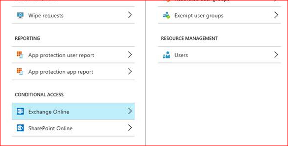

# Intune service administrator gets Access Denied when trying to configure MAM

This article fixes the **Access Denied** error when an administrator configures Intune App Protection **Conditional Access**.

_Original product version:_ &nbsp; Microsoft Intune  
_Original KB number:_ &nbsp; 4025997

## Symptoms

Assume that an administrator isn't in the Global administrator role but is in the Intune service administrator role. When they try to configure Intune App Protection (MAM) **Conditional Access** (CA), an **Access Denied** error occurs.

## Cause

The Intune service administrator must be given explicit **Contributor** role permission to access MAM CA blades.

## Resolution

To fix this issue, grant the permission under **Intune App Protection** -> **Settings** -> **Exchange Online** -> **Resource Management** -> **Users**.

## Reference

For more information, see [Administrator role permissions in Azure Active Directory](/azure/active-directory/users-groups-roles/directory-assign-admin-roles).
