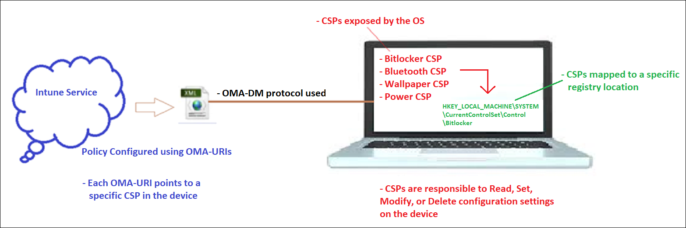
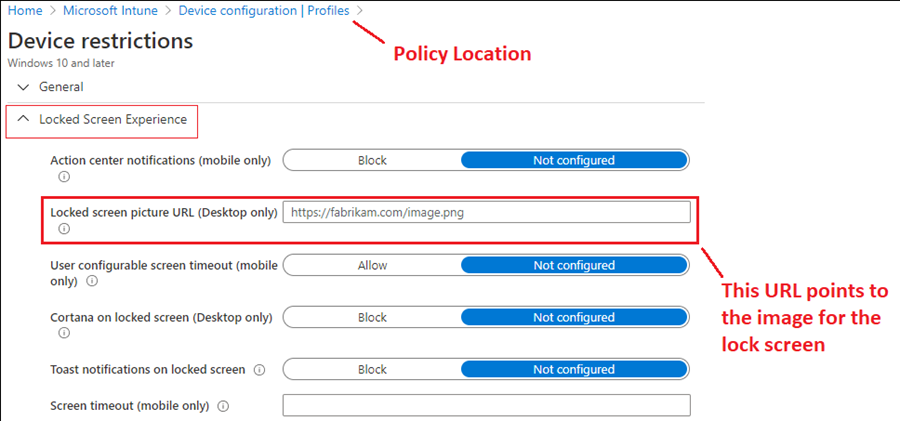
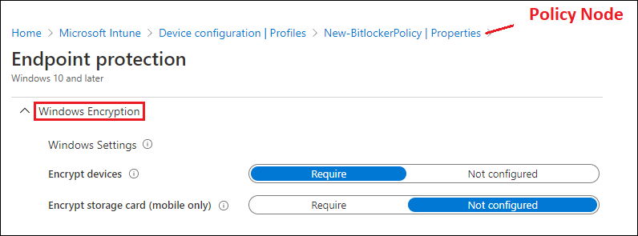
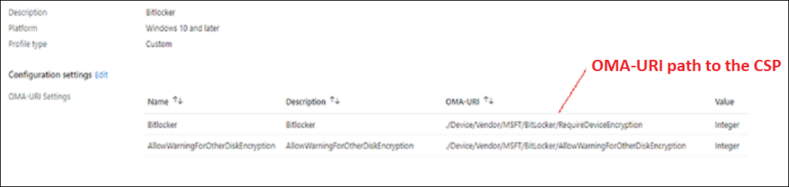
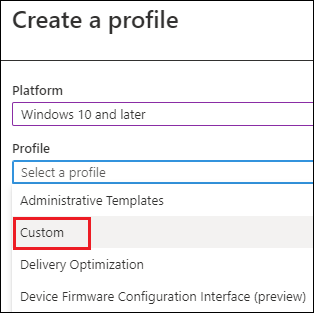
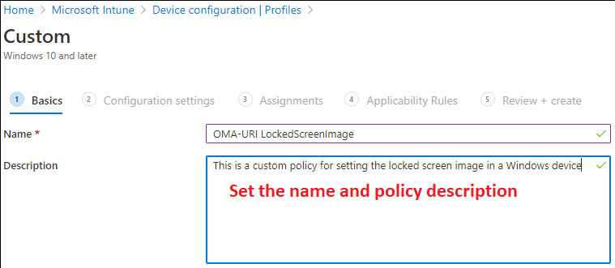
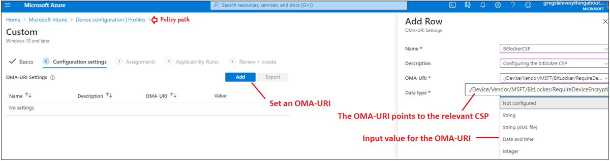
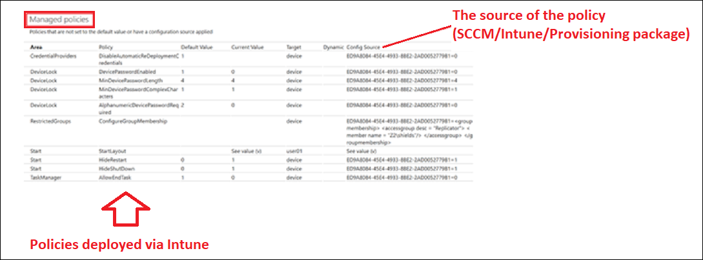
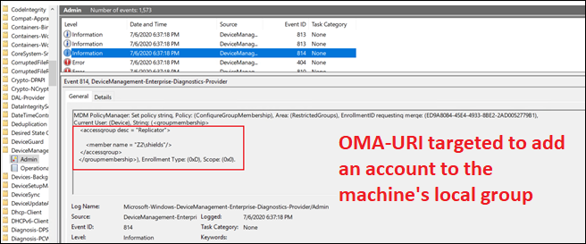

# Support tip - Deploy OMA-URIs to target a CSP through Intune, and a comparison to on-premises

This article describes the significance of CSPs, Open Mobile Alliance – Uniform Resources (OMA-URIs), and how custom MDM policies are delivered to a Windows 10-based device.

## Introduction

By using Microsoft Intune, you can provide a modern device experience to users, and you can better support their digital migration by focusing on an internet-first device connection. Policy-based configuration is the primary method for ensuring that devices have the appropriate settings, and that the policies that are deployed through Intune can be broadly categorized as either a mobile device management (MDM) policy (device management) or mobile app management MAM policy (app protection).

Intune provides a convenient and easy-to-use interface to configure these policies. However, not all settings are necessarily available within the Intune portal user interface (UI). Although  many settings can be potentially configured on a Windows device, it's not feasible to have all of them in the portal. Also, as advancements are made, it's not unusual to have a certain degree of lag before a new setting gets added. In these scenarios, deploying a custom OMA-URI profile that uses a Windows Configuration Service Provider (CSP) is the answer.

This topic explains the significance of these CSPs and Open Mobile Alliance–Uniform Resources (OMA-URIs), and also discusses how these custom MDM policies are delivered to Windows 10-based devices.

## Background

CSPs were introduced to the Windows 10 platform starting in Windows 10, version 1607. CSPs provide a mechanism that enables certain settings or features to be manipulated by delivering the right OMA-URI configuration to the client. CSPs are an interface that is used by MDM providers to read, set, modify, and delete configuration settings on the device. Typically, it is done through keys and values in the Windows Registry.

## CSP scope

CSP policies have a scope that defines the level at which a policy can be configured. It is similar to the policies that are available in the Intune portal UI. Some policies can be configured only at the device level. These policies apply regardless of who is logged in to the device. Other policies can be configured at the user level. These policies apply to only that user. The configuration level is dictated by the platform, not by the MDM provider. When you deploy a custom policy, [you can look here](/windows/client-management/mdm/policy-configuration-service-provider) to find the scope of the CSP that you want to use.

The scope of the CSP is important because it will dictate the syntax of the OMA-URI string that you should use. For example:

### User scope

./User/Vendor/MSFT/Policy/Config/AreaName/PolicyName to configure the policy.
./User/Vendor/MSFT/Policy/Result/AreaName/PolicyName to get the result.

### Device scope

./Device/Vendor/MSFT/Policy/Config/AreaName/PolicyName to configure the policy.
./Device/Vendor/MSFT/Policy/Result/AreaName/PolicyName to get the result.

## OMA-URIs

The OMA-URI is a path to a specific configuration setting that is supported by a CSP.

**The OMA-URI**: It is a string that represents custom configuration for a Windows 10-based device. The syntax is determined by the CSPs on the client. You can find [details about each CSP here](/windows/client-management/mdm/policy-configuration-service-provider).

**A custom policy**: It contains the OMA-URIs to deploy. It's configured in the Intune portal.

**Intune**: After a custom policy is created and assigned to client devices, Intune becomes the delivery mechanism that sends the OMA-URIs to those Windows clients. Intune uses the Open Mobile Alliance Device Management (OMA-DM) protocol to do this. It is a pre-defined standard that uses XML-based SyncML to push the information to the client.

**CSPs**: After the OMA-URIs reach the client, the CSP reads them and configures the Windows platform accordingly. Typically, it does this by adding, reading, or changing registry values.

To summarize: The OMA-URI is the payload, the custom policy is the container, Intune is the delivery mechanism for that container, OMA-DM is the protocol that's used for delivery, and the Windows CSP reads and applies the settings that are configured in the OMA-URI payload.

This is the same process that's used by Intune to deliver the standard device configuration policies that are already built into the UI. When OMA-URIs use the Intune UI, they are hidden behind user-friendly configuration interfaces. It makes the process easier and more intuitive for the administrator. Use the built-in policy settings whenever possible, and use custom OMA-URI policies only for options that are otherwise unavailable.

To demonstrate this process, you can use a built-in policy to set the lock screen image on a device. You can also deploy an OMA-URI and target the relevant CSP. Both methods achieve the same result.

### OMA-URIs from the portal

### Use a custom policy

The same setting can be set directly by using the following OMA-URI:

./Vendor/MSFT/Policy/Config/DeviceLock/EnforceLockScreenAndLogonImage

It is documented in the [Windows CSP reference](/windows/client-management/mdm/policy-csp-devicelock). After you determine the OMA-URI, create a custom policy for it.

No matter which method you use, the end result is identical.

Here's another example that uses BitLocker.

### Use a custom policy from the portal

### Using a custom policy

## Relate custom OMA-URIs to the on-premises world

For Windows, Group Policy provides very granular control for management. Windows Group Policy has existed since the days of Windows 2000 Server. It has evolved over the years, changing from ADM to ADMX.

In the new cloud-based world, you can achieve the same result through Intune over the internet. The approach is the same in that you evaluate which settings are necessary for your devices, and then you build your MDM policy configuration from there. You can use your existing Group Policy settings as a reference. If your organization wants to move to MDM to manage devices, we recommend that you prepare by analyzing the current Group Policy settings to see what is required to transition to MDM management.

The MDM Migration Analysis Tool (MMAT) determines which Group Policies have been set for a targeted user or computer. Then, it generates a report that lists the level of support for each policy setting in MDM equivalents.

[Download the MMAT](https://github.com/WindowsDeviceManagement/MMAT).

### Aspects of your Group Policy before and after you migrate to the cloud

The following table shows the different aspects of your Group Policy both before and after you migrate to the cloud using the MMAT.

|On-premises|Cloud|
|---|---|
|Group Policy|MDM|
|Domain Controllers|MDM server (Intune service)|
|Sysvol folder|Intune database/MSUs|
|Client-side Extension to process GPO|CSPs to process the MDM policy|
|SMB protocol used for communication|HTTPS protocol used for communication|
|`.pol` \| `.ini` file (it is usually the input)|SyncML is the input for the devices|

## Important notes on policy behavior

If the policy changes on the MDM server, the updated policy is pushed to the device, and the setting is configured to the new value. However, removing the assignment of the policy from the user or device may not revert the setting to the default value. There are a few profiles that are removed after the assignment is removed or the profile is deleted, such as Wi-Fi profiles, VPN profiles, certificate profiles, and email profiles. Because this behavior is controlled by each CSP, you should try to understand the behavior of the CSP to manage your settings correctly. For more information, see [Windows CSP reference](/windows/client-management/mdm/policy-configuration-service-provider).

## Put it all together

To deploy a custom OMA-URI to target a CSP on a Windows device, create a custom policy. The policy must contain the path to the OMA-URI path together with the value that you want to change in the CSP (enable, disable, modify, or delete).

After the policy is created, assign it to a security group so that it will take effect.

## Troubleshoot

When you troubleshoot custom policies, you'll find that most problems fit into the following categories:

- The custom policy did not reach the client device.
- The custom policy did reach the client device, but the expected behavior is not observed.

If you have a policy that is not working as expected, verify whether the policy even reached the client. There are two logs to check to verify its delivery.

### MDM diagnostic logs

### The Windows event log

Both logs should contain a reference to the custom policy or OMA-URI setting that you're trying to deploy. If you do not see this reference, it is likely that the policy was not delivered to the device. Verify that the policy is configured correctly and is targeted to the correct group.

If you verify that the policy is reaching the client, check the `DeviceManagement-Enterprise-Diagnostics-Provider > Admin Event log` on the client for errors. You may see an error entry that contains additional information about why the policy did not apply. The causes will vary, but there is frequently a problem in the syntax of the OMA-URI string that's configured in the custom policy. Double-check the CSP reference, and make sure that the syntax is correct.
