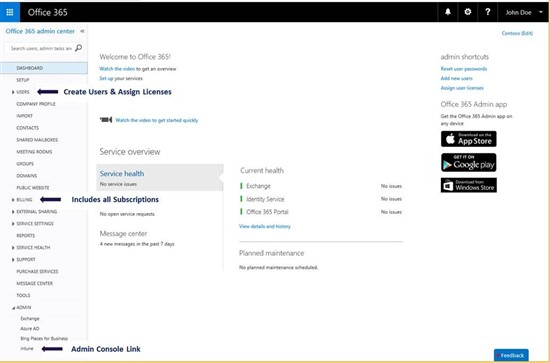

# Manage Intune and EMS subscriptions in the Office 365 portal

The Intune account portal was retired on September 28, 2015 and all functionalities were moved to the O365 portal at [https://portal.office.com](https://portal.office.com). Therefore, update your favorite from the Intune account portal to the [Office 365 management portal](https://portal.office.com).

_Original product version:_ &nbsp; Microsoft Intune  
_Original KB number:_ &nbsp; 3093591

## Manage Intune and EMS subscriptions in the Office 365 portal

We have received feedback from you asking for fewer portals to manage your Microsoft subscriptions. Based upon this feedback, we are merging the Microsoft Intune account portal with the [Office 365 management portal](https://portal.office.com/?WT.mc_id=Blog_Intune_Announce_PCIT) to simplify your user experience.

As an initial change, the Office 365 management portal now supports subscription management and license assignment for Intune and Enterprise Mobility Suite (EMS). Until late September, you can continue to use the Intune account portal while you update your workflows and bookmarks. Following this transition period, the Office 365 management portal will be where you will manage subscriptions and license assignments. We anticipate retiring the Intune portal on or after September 28, 2015 and an in-service banner will be added to remind you of this change.

For EMS customers who previously visited the Azure portal for user creation and license assignment, you can continue to use the Azure portal to take advantage of advanced features such as group license assignment. Alternatively, you can begin assigning licenses while already managing other subscriptions in the Office 365 management portal. There are no changes to the Azure portal or the Intune admin console as part of this migration.

## Frequently Asked Questions

Question: What functionality is now available in the Office 365 management portal?

Answer:

- Subscription activation, modification, renewal, cancellation, and invoicing
- Domain setup and modification
- User and license management, and admin role configuration
- Direct partner functionality, including sending offers and delegation invitations
- Service health status
- Service request ticketing

Question: As an existing Intune customer, what differences can I expect when using the Office 365 management portal?

Answer:

- User management has a new flow with more options and greater control when setting passwords.
- When setting up a new tenant, you'll find that subscription activation is a more guided experience and trial subscriptions no longer require a mailing address.
- Subscriptions with only a few users or recently created subscriptions can be canceled.
- The domain setup wizard provides registrar-specific guidance for creating the required DNS records.
- The purchase tab lists all offers available for both Intune and Office.

Question: Does this mean that Intune will become part of Office 365?

Answer: No, Intune is taking advantage of the Office management portal for managing subscriptions and assigning licenses but will remain a separate service.
