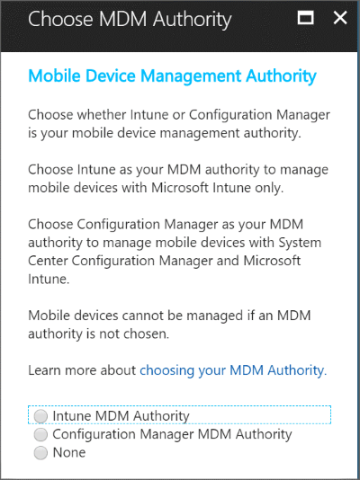

# Setting the Mobile Device Management authority in Microsoft Intune

The Mobile Device Management (MDM) authority determines where you will run mobile device management tasks. You can set the MDM authority to Microsoft Intune by using the Intune administrator portal.

_Original product version:_ &nbsp; Microsoft Intune  
_Original KB number:_ &nbsp; 3103996

## Possible configurations

- **Intune Standalone**: Cloud-only management that you configure by using the Azure portal. Includes the full set of capabilities that Intune offers. For more information, see [Set the MDM authority in the Intune console](/mem/intune/fundamentals/mdm-authority-set#set-mdm-authority-to-intune).
- **Intune co-management**: Integration of the Intune cloud solution with System Center Configuration Manager for Windows 10 devices. You configure Intune by using the Configuration Manager console. For more information, see [Configure auto-enrollment of devices in Intune](/configmgr/comanage/tutorial-co-manage-clients#configure-auto-enrollment-of-devices-to-intune).

  > [!IMPORTANT]
  > Onboarding of new hybrid MDM customers has been deprecated. For more information, see the [Move from Hybrid Mobile Device Management to Intune on Azure](https://techcommunity.microsoft.com/t5/Intune-Customer-Success/Move-from-Hybrid-Mobile-Device-Management-to-Intune-on-Azure/ba-p/280150) blog post.

- **Mobile Device Management for Office 365**: Integration of Office 365 with the Intune cloud solution. You configure Intune from your Microsoft 365 admin center. Includes a subset of the capabilities that are available in Intune Standalone. Set the MDM authority in Microsoft 365 admin center.

## Set MDM authority to Intune

If you haven't yet set the MDM authority, follow these steps.

> [!NOTE]
> To change from one MDM authority to another, see the [Change MDM authority to Office 365](#change-mdm-authority-to-office-365) section.

1. In the [Microsoft Endpoint Manager admin center](https://go.microsoft.com/fwlink/?linkid=2109431), select the orange banner to open the **Mobile Device Management Authority** setting. The orange banner is displayed only if you have not yet set the MDM authority.
2. Under **Mobile Device Management Authority**, select your MDM authority from the following options:

   - Intune MDM Authority
   - None

   

A message indicates that you have successfully set your MDM authority to Intune.

For complete details about how to manage mobile devices by using Microsoft Intune, see [Set the mobile device management authority](/mem/intune/fundamentals/mdm-authority-set).

## Change MDM authority to Office 365

To activate Office 365 MDM in addition to your existing Intune service, go to [https://protection.office.com](https://protection.office.com/), select **Data Loss Prevention** > **Device Security Policies** > **View list of Managed Devices** > **Let's get started**.

For more information, see [Set up Mobile Device Management (MDM) in Office 365](https://support.office.com/article/Set-up-Mobile-Device-Management-MDM-in-Office-365-dd892318-bc44-4eb1-af00-9db5430be3cd).

If you want users to be managed only by Office 365 MDM, remove any assigned Intune or EMS licenses after you activate Office 365 MDM.
