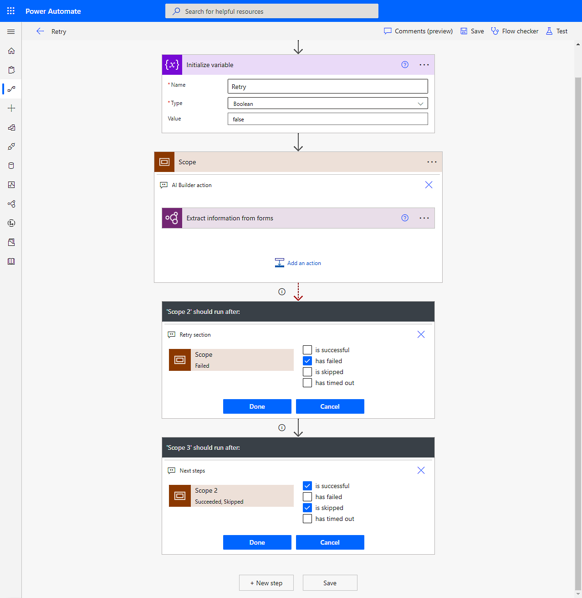
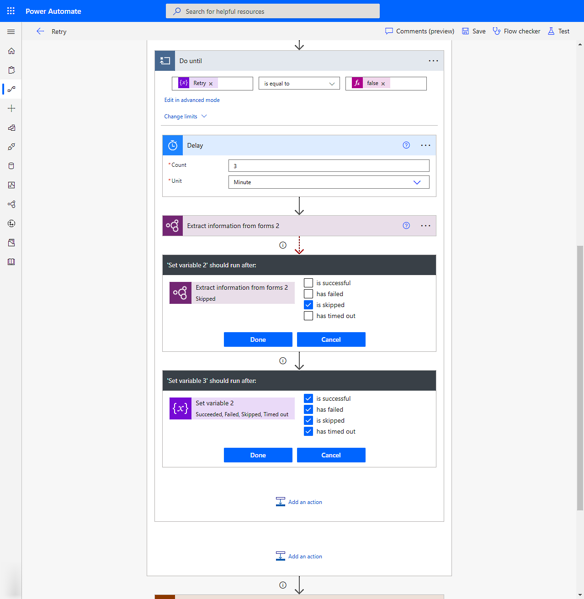

# Dependency Timeout error when using a form processing model in Power Automate

This article provides a solution to a dependency timeout error when using a form processing model in Microsoft Power Automate.

_Applies to:_ &nbsp; Power Automate

## Symptoms

You get the error, **Dependency Timeout error (408 – Dependency Timeout)**.

## Cause

When executing a form processing model in Power Automate, the file you're trying to process might have a high number of pages, or the file size is too large.

## Resolution

Here are some actions that can be done to improve this.

- If the file has multiple pages, reduce the document to just the pages you need to process. You can use the **Page range** input in Power Automate to only process the pages you need. 

    For more information, go to [page range](/ai-builder/form-processing-model-in-flow#page-range) in Power Automate.

- Reduce the size of the file.

- Retry after some time. You can configure an automatic retry in the flow after failure loop.

- Be sure to leave a certain time delay interval between each execution after a failure.

The following screenshots show an example on how to setup a retry logic in a cloud flow. Make sure you choose the appropriate settings for when your variable should run. To get to the settings, in your variable heading, select (**...**) > **Configure run after**, select when the variable should run, and then select **Done**.  

> [!div class="mx-imgBorder"]
> 

> [!div class="mx-imgBorder"]
> 

> [!div class="mx-imgBorder"]
> 

