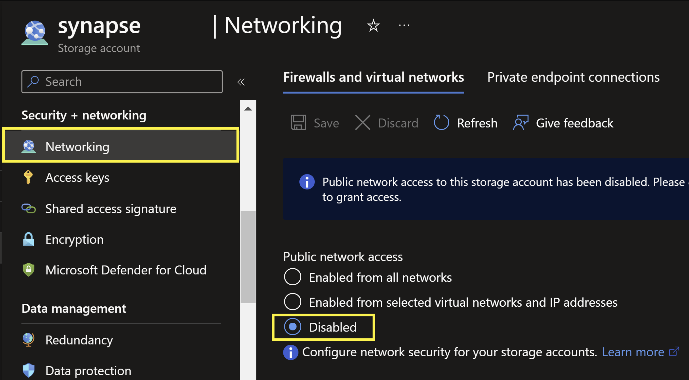
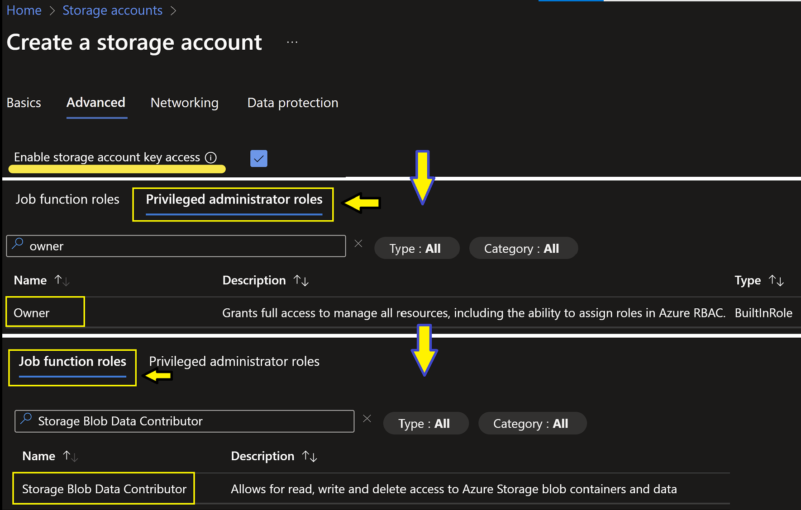
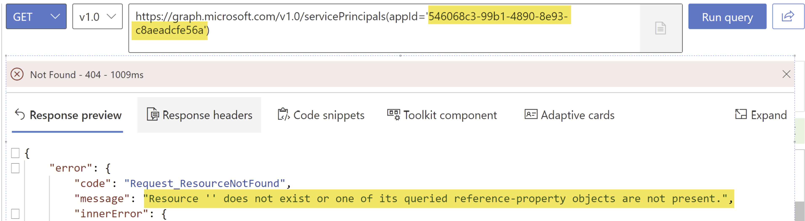

# Troubleshoot Synapse Link profile creation issues

This article provides detailed guidance for troubleshooting common issues encountered during the creation of Synapse Link profiles. The steps outlined address networking misconfigurations, permissions, regional mismatches, and other factors that may impact the setup process.

## Prerequisites

Before proceeding, ensure the following prerequisites are met:

- Verify that you have the required roles and permissions as described in the "Insufficient permissions" section below.
- Confirm that your Synapse workspace, storage account, and Power Apps environment are in the same Azure region.
- Review these prerequisite documents based on your profile type:
    - [Prerequisites for Azure Synapse Link profile with Azure Data Lake](https://learn.microsoft.com/power-apps/maker/data-platform/azure-synapse-link-data-lake#prerequisites)
    - [Prerequisites for Azure Synapse Link profile with your Azure Synapse Workspace](https://learn.microsoft.com/power-apps/maker/data-platform/azure-synapse-link-synapse#prerequisites)

## Potential quick workarounds

### Workaround: Resolve networking misconfigurations

1. Ensure public network access is enabled for the linked storage account.
2. Set the IP access rule to allowAll if linking to a Synapse Workspace.
3. If restricting public access, enable the managed identities feature for the linked storage account and workspace. Refer to [managed identities feature](https://learn.microsoft.com/power-apps/maker/data-platform/azure-synapse-link-msi) for detailed steps.

)

## Troubleshooting checklist

### Networking misconfiguration

**Cause:** Public network access is disabled or IP access rules are improperly configured for the storage account.

**Solution:**

1. Enable public network access for the linked storage account.
2. Set IP access rules to allowAll.
3. If restricting public access, configure managed identities as per the [documentation](https://learn.microsoft.com/power-apps/maker/data-platform/azure-synapse-link-msi).

### Insufficient permissions

**Cause:** Missing required roles and permissions for Synapse Workspace, storage account, or Dataverse environment.

**Solution:**

1. Ensure you have the following roles:
    - **Dataverse System Administrator** security role.
    - **Synapse Administrator** role for Synapse Workspace.
    - **Reader** role for the resource group containing the storage account and Synapse Workspace.
    - **Owner** and **Storage Blob Data Contributor** roles for the Azure Data Lake Storage Gen2 account.
2. Enable **Allow storage account key access** during initial setup.




### Azure region mismatch

**Cause:** Synapse Workspace, storage account, and Power Apps environment are not in the same Azure region.

**Solution:**

1. Verify that all resources are in the same region.
2. If necessary, move the storage account to the appropriate region using [this guide](https://learn.microsoft.com/azure/storage/common/storage-account-move).

### Track changes property not enabled

**Cause:** The tables intended for export do not have the Track changes property enabled.

**Solution:**

1. Enable the Track changes property for the desired tables by following the steps in [Enable change tracking to control data synchronization](https://learn.microsoft.com/power-platform/admin/enable-change-tracking-control-data-synchronization).

### Maximum number of Synapse Link profiles reached

**Cause:** The Dataverse environment has reached its limit for Synapse Link profiles.

**Solution:**

1. Review the current Synapse Link profiles in your environment.
2. If the maximum limit is reached, consider removing unused profiles to create new ones.

## Advanced troubleshooting and data collection

### Mitigation for UI stuck on "Fetching App..." status

**Cause:** The "Common Data Service - Azure Data Lake Storage" app (ID: 546068c3-99b1-4890-8e93-c8aeadcfe56a) is missing in your Azure AD tenant.

**Validation:**

1. Use [Graph Explorer](https://developer.microsoft.com/graph/graph-explorer) or the following PowerShell command to check if the app exists:
powershell
Get-AzADServicePrincipal -ApplicationId 546068c3-99b1-4890-8e93-c8aeadcfe56a
2. If a 404 error is returned, the app is missing.





**Solution:**

1. Ensure you have the necessary privileges (Application Administrator or Global Administrator).
2. Open PowerShell and run:

    ```powershell
    Connect-AzAccount
    ```
3. Add the missing service principal using:

    ```powershell
    New-AzADServicePrincipal -ApplicationId '546068c3-99b1-4890-8e93-c8aeadcfe56a'
    ```
4. After adding the principal, retry creating the Azure Synapse Link profile.