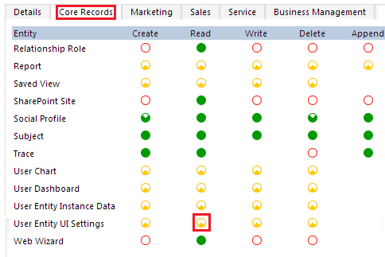

# Troubleshoot user access issues for different environments

This article helps administrators diagnose and resolve common user access issues in Power Platform environments. You'll learn how to use the built-in diagnostics tool to identify problems with permissions, licenses, security roles, and group memberships that prevent users from accessing environments and resources.

To access an environment, a user must meet the following criteria:

- Be enabled for sign-in in Microsoft Entra ID.
- Have a valid license that has a Dynamics 365 or Microsoft Power Platform recognized service plan, or the environment must have active per-app plans.
- Be a member of the environment's Microsoft Entra group (if one is associated with the environment).
- Have at least one Dataverse security role assigned directly to them or to a [group team](/power-platform/admin/manage-group-teams) they're a member of.

A user's level of access within the environment and to the resources (apps and data) in the environment is determined by the privileges defined in the security roles assigned to that user. Their access mode being [Administrative](/power-platform/admin/create-users#create-an-administrative-user-account) or [Read-Write](/power-platform/admin/create-users#create-a-read-write-user-account) also determines their level of access within an environment.

## Run user diagnostics

Administrators can use the **Run diagnostics** feature in the Power Platform admin center to assess user access to an environment and get details and mitigation suggestions about why a user can or can't access the environment.

Follow these steps to run user access diagnostics:

1. In the [Power Platform admin center](https://admin.powerplatform.microsoft.com), select an environment.

1. Select **Settings** > **Users + permissions** > **Users**.  

1. Select a user.

1. Select **Run diagnostics**.

1. Review the details for the user, and take any needed corrective actions.

> [!NOTE]
> The action of running or rerunning diagnostics forces the user information in Microsoft Entra ID to synchronize to the environment's Dataverse database to provide up-to-date status on the user's properties. If the diagnostic run doesn't eliminate the root cause of a user access issue and you need to create a support ticket, include the results of the diagnostic run in the support ticket. This information will help Microsoft Support engineers resolve your issue faster.

## Assign security roles to users

When a user encounters an error screen stating they have no roles, a system administrator needs to assign roles to the user. Assign roles directly to the user or to a group team that the user is part of. For information on how to assign Dataverse security roles to a user, see [Assign a security role to a user](/power-platform/admin/assign-security-roles).

## Troubleshoot record visibility issues

If a user has trouble accessing a record in Dataverse, check if they have the necessary privilege and access. For more information, see [How access to a record is determined](/power-platform/admin/how-record-access-determined).

## Troubleshoot license issues

1. Check if the user has a license. If the user doesn't have a license, assign one. For more information, see [Add a license to a user account](/power-platform/admin/assign-licenses).

1. After assigning a license, wait for the license change to sync to the environment. To trigger a sync for this user, the system administrator for the environment can re-add the user to the environment. For more information, see [Add users to an environment that has a Dataverse database](/power-platform/admin/add-users-to-environment#add-users-to-an-environment-that-has-a-dataverse-database).

## Verify environment association and group membership

1. As a system administrator of the environment, verify that the environment is associated with a Microsoft Entra group. For more information, see [Associate a security group with an environment](/power-platform/admin/control-user-access#associate-a-security-group-with-an-environment).

1. Make sure the user with the access problem is a member of the group associated with the environment. For more information, see [Create a security group and add members to the security group](/power-platform/admin/control-user-access#create-a-security-group-and-add-members-to-the-security-group).

1. After updating user membership in the environment's group, wait for the change to sync to the environment. To trigger a sync for this user, the system administrator for the environment can re-add the user to the environment. For more information, see [Add users to an environment that has a Dataverse database](/power-platform/admin/add-users-to-environment#add-users-to-an-environment-that-has-a-dataverse-database).

## Troubleshoot permission issues

If the user doesn't have sufficient permissions to access customer engagement apps (Dynamics 365 Sales, Dynamics 365 Customer Service, Dynamics 365 Field Service, Dynamics 365 Marketing, and Dynamics 365 Project Service Automation), a system administrator should complete the following steps.  
  
1. In the [Power Platform admin center](https://admin.powerplatform.microsoft.com), select an environment.

1. Select **Settings** > **Users + permissions** > **Users**.  
  
1. Open the user record.  
  
1. Select **More Commands** () > **Manage Roles**.  
  
1. Make note of the role assigned to the user. If appropriate, select a different security role. Close the **Manage Roles** dialog box.
  
1. Select **Security** > **Security Roles**.  
  
1. Select the security role from step 5.  
  
1. Select **Core Records**.  
  
1. Confirm that the **Read** permission for **User Entity UI Settings** is set to the User level (a yellow circle with a wedge-shaped segment).  
  
     If the security role is missing this permission, the system administrator needs to change this setting by selecting it.  
  
     

## Troubleshoot unaccounted user issues

In some cases, users aren't automatically provisioned into environments.

If a user meets all access requirements but is still missing from an environment, the user might fall into one of the following cases:

1. Users with only Office licenses (with Dataverse plan enabled) won't be pre-provisioned into environments.

1. Owners of Microsoft Entra groups that are associated with environments won't be pre-provisioned.

1. Members of Microsoft Entra groups that are part of a Group Team created for the Microsoft Entra group won't be pre-provisioned.

1. Users won't be pre-provisioned into Microsoft Dataverse for Teams environments. For more information, see [Users not added automatically in Dataverse](/power-platform/admin/create-users#categories-of-users-not-added-automatically-in-dataverse).

Although these users aren't pre-provisioned, you can add them [on demand](#troubleshoot-on-demand-user-management). To add or refresh users on demand, see the following section.

## Troubleshoot on demand user management

As mentioned earlier, there are some scenarios where users aren't provisioned automatically. Also, environments might experience delays in showing the users' latest status. In these situations, adding or refreshing specific users on demand can help.

You can use several methods to do this:

1. **Just-in-time (JIT) user provisioning**: When users access an environment URL, the system checks access requirements during sign-in and adds qualified users to the environment.

1. **User impersonation call**: An impersonation call triggers a JIT sync for the user. For more information, see [How to impersonate a user](/powerapps/developer/common-data-service/webapi/impersonate-another-user-web-api#how-to-impersonate-a-user).

1. **Add users**: Administrators can add or refresh users in the Power Platform admin center. For more information, see [Add users to an environment](/power-platform/admin/add-users-to-environment).

1. **PowerShell cmdlets**: See [PowerShell support for Power Apps](/power-platform/admin/powerapps-powershell#power-apps-cmdlets-for-administrators).

1. **Connectors**: See [Power Platform for Admins](/connectors/powerplatformforadmins/#force-sync-user).

1. **Power Automate template**: See [Force Sync Microsoft Entra Group members to specified CDS instance](https://us.flow.microsoft.com/galleries/public/templates/6e4162ca7afc48479e3ad1caadc6c1e6/force-sync-azure-active-directory-group-members-to-specified-cds-instance/).

## Known issue

The system currently checks only for security roles assigned directly to a user. It doesn't check for roles inherited through group team memberships.
