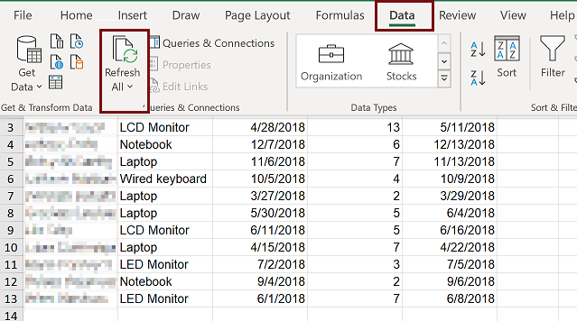

# Refresh All doesn't work after exporting app data to a dynamic worksheet

## Symptoms

After you use the [Export to Excel](/power-apps/user/export-excel-dynamic-worksheet) command to export a file to your local computer and open the file by selecting **Data** > **Refresh All**. The data disappears and workbook appears blank.

## Cause

This issue occurs when the data that you're accessing is password-protected and the Excel file can't submit passwords to external data sources. To resolve this issue, you must edit and save the web query.

## Resolution

1. In the Excel file, select the **Data** tab > **Queries and Connections**.

   > [!div class="mx-imgBorder"] 
   >  
   
3. The **Queries & Connections** pane opens on the right of the window. On the **Connections** tab, right-click to select the query and then select **Properties**.

   > [!div class="mx-imgBorder"] 
   > 
   
5. The **Connection Properties** window opens. On **Definition** tab, select **Edit Query**

   > [!div class="mx-imgBorder"] 
   > 

6. If prompted, enter username and password. Enter the same user and password that you use to sign in to your app.

7. On the **Edit Web Query** window, select **GO**. An error message will show: **Can't complete this action** 

   > [!div class="mx-imgBorder"] 
   > 

8. Close the **Edit Web Query** window.

   > [!div class="mx-imgBorder"] 
   > 

9. This should fix the issue. Refresh the data in the worksheet again by going to, **Data** > **Refresh All**. 

   > [!div class="mx-imgBorder"] 
   >  

### See also

[Export data to an Excel dynamic worksheet](/power-apps/user/export-excel-dynamic-worksheet)
