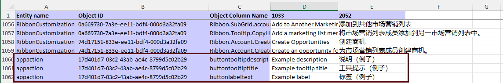

# A button on the command bar has the wrong label or translation

## Modern commands

You can customize labels and create translations for [modern commands](/power-apps/maker/model-driven-apps/use-command-designer) the same way as for forms and tables. If a modern command shows the wrong text, its label might not have been configured correctly.

### Check translations are present in the solution

[Export translations](/power-apps/maker/model-driven-apps/translate-localizable-text) for the [solution that contains the modern command](/power-apps/maker/model-driven-apps/manage-commands-in-solutions). Open the XML file and verify that the label has the correct translations.

The screenshot below shows a translation file opened in Excel. The last 3 rows are for a modern command's description, tooltip, and label. The last 2 columns show the text used for [LCIDs](/power-platform/admin/language-collations#language-and-associated-collation-used-with-dataverse) 1033 and 2052, which correspond to English (United States) and Simplified Chinese (China) respectively.

### Check solution layering

If the correct text is present in the translation file, there could be other solutions that are overriding it. [View the solution layers for the label](/power-apps/maker/data-platform/solution-layers#view-the-solution-layers-for-a-component) to check if there is text defined for the same label in a higher solution.

## Classic commands

You can [customize labels and create translations for classic commands](/power-apps/developer/model-driven-apps/use-localized-labels-ribbons) by adding them to the `<RibbonDiffXml>` element of a customization.xml file and [importing the XML file into a solution](/power-apps/developer/model-driven-apps/export-prepare-edit-import-ribbon).

### Check translations are present

1. [Enable Command checker and select the command button to inspect](ribbon-issues#use-commmand-checker).
1. The right pane shows 4 kinds of text that can be customized for a commmand button.
    
    * **Alt**: Label used by screen readers.
    * **LabelText**: Label displayed for the command button.
    * **ToolTipTitle**: Heading of the tooltip for the command button.
    * **ToolTipDescription**: Body text of the tooltip for the command button.

    For button label issues, the relevant property is **LabelText**.

2. Select "View label solution layers", at the bottom of the text property. This option won't appear if the text hasn't been customized.
    
    > [!NOTE]
    > Some label customizations for system commands do not use `<RibbonDiffXml>` and hence cannot be inspected in Command checker.
3. Solutions that have customized the text are listed. In this example, there's only one solution that has customized **LabelText**.
    
4. Select the solution to see all the [LocLabel](/power-apps/developer/model-driven-apps/use-localized-labels-ribbons#using-localized-labels) translations it contains. Verify that the correct text is present.
    

### Check solution layering

If the correct LocLabel is present in a solution, there could be other solutions that are overriding it. [View label solution layers](#check-translations-are-present) and check if a higher solution has defined the same LocLabel.