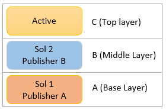
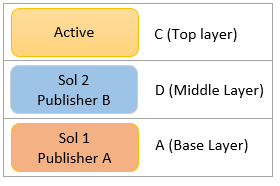
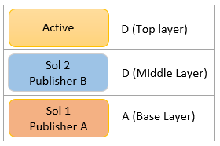

# Importing Solution but not effective

_Applies to:_ &nbsp; Power Platform, Solutions

This article provides a workaround for an issue that occurs when you perform update/upgrade of a solution in the target environment, but the runtime behavior does not behave as expected by the latest solution.

## Symptoms

When you try to Update/Upgrade to an existing solution but the runtime behavior is not consistent with the upgraded solution.

## Cause

This issue occurs when the solution updated is not the Current layer, which could be result of one of the two scenarios:

- There are unmanaged active customization on the top layer in the target environment.
- There are other layers from managed solution on the top.

## Workaround

### There are unmanaged active customization on the top layer in the target environment.
- Remove the active customization on the top in the target environment.
- Or upgrade the solution again with override customization. The override customization will copy the incoming value to the active layer. The active layer will still exist.

#### Example Scenarios:

The following example scenarios illustrate what happens to the solution layers in target when upgrade is done with active customization on the top layer.

##### Initial State of solution in target

##### Upgrade solution without Override Customization
Solution 2 which is below Active layer is upgraded from "B" to "D", the Active top layer still remains C. D is not effective even after upgrade.

##### Upgrade solution with Override Customization
Solution 2 which is below Active layer is upgraded from "B" to "D" with override customization. "B" is uprade to "D", and override customization copied the value to "D" to Active layer, making Active as "D".

### There is another layer from a managed solution on the top

- Go to the source environment of the top managed layer:
  - Make the required changes in the solution then export the new version of the solution and then import again in the target environment.
  - Or remove that component from the solution, then export the new version of the solution and then import as upgrade in the target environment.

#### Example Scenarios:

The following example scenarios illustrate what happens to the solution layers in target when upgrade is done with another managed layer on the top.

##### Initial State of solution in target
Here top layer is another managed layer.

##### Upgrade solution without Override Customization
Solution 2 which is below managed layer "C" is upgraded from "B" to "D", the top layer still remains managed layer "C". "D" is not effective  after upgrade.

##### Upgrade solution with Override Customization
Layer "B" from Solution 2 which is below managed layer "C" is upgraded from "B" to "D" with override customization. "B" is upraded to "D", but as there is no Active layer override customization does not help to update the top layer, "C" remains the top layer and "D" is not effective after upgrade.

##### Update the top managed layer with upgraded layer
Layer "B" from Solution 2 which is below layer "C" from Solution 3 layer "B" is not effective. Another way to make it effective is either by deleting the top layer "C" Or make changes in Solution 3 to have value as "D" and then export/import Solution 3.

