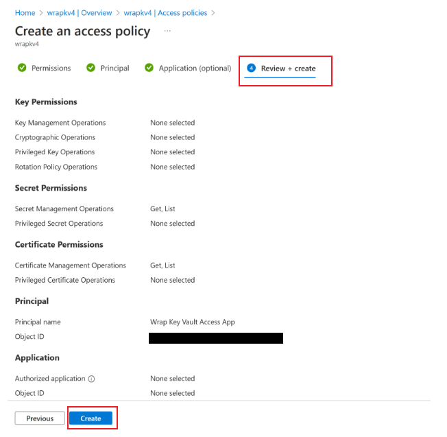

# Troubleshoot issues with the wrap feature in Power Apps

This article helps you resolve the most common issues with **wrap** feature in Microsoft Power Apps.

## Issue 1 - Wrap build is failing

If your wrap build fails, you can take the following steps to solve the issue.

#### Step 1: Verify that your images are in a PNG format

Ensure that the images you're using in wrap are in a PNG format. Using images in any format other than PNG in wrap will cause the build to fail. Use an image converter to save your images as .png files or ensure that your original image files are in a PNG format instead.

> [!IMPORTANT]
> Manually changing your image file extension from .jpeg or any other format to .png will not automatically reformat the image to a PNG format.

#### Step 2: Verify that your App Center is correctly configured

Your App Center link must be created as an app within an organization and not a standalone app. The following screenshot shows how to create a new organization.

   :::image type="content" source="media/wrap-issues/add-new-organization.png" alt-text="Screenshot of how to add a new organization in App Center.":::

Check that the access token you've created is correct.

- The correct way to check the access token: Select the app you created, and then select **Settings** > **App API Tokens**.
- The incorrect way to check the access token: **Account Settings** > **User API Tokens**.

Verify that the iOS or Android app you created has the right configurations.

- iOS: OS = Custom
- Android: OS = Android, Platform = React Native

For more information, see steps 8 and 9 in [Create an App Center container for your mobile app](/power-apps/maker/common/wrap/how-to#create-an-app-center-container-for-your-mobile-app).

#### Step 3: Verify that your key vault configuration is correct

Make sure that Azure Service Principal was created and the role was added correctly. For more information, see steps 1 and 2 in [Set up KeyVault for automated signing](/power-apps/maker/common/wrap/how-to#set-up-keyvault-for-automated-signing).

Ensure that your key vault contains all necessary certificates, secrets, and tags for iOS and/or Android:

- iOS: two tags, one certificate, and one secret
- Android: one tag and one certificate

For more information, see [Set up KeyVault for automated signing](/power-apps/maker/common/wrap/how-to#set-up-keyvault-for-automated-signing).

#### Step 4: Try again if you have all the proper configurations

If your wrap build still fails after you've verified that your wrap project has all the proper configurations, reach out to <pamobsup@microsoft.com>. For details, see the [Other issues in wrap](#other-issues-in-wrap) section of this article.

## Issue 2 - Wrap button is disabled for my app

You can only wrap apps you have edit permissions for. Make sure you have edit permissions for the app you want to wrap and try again.

## Issue 3 - Can't save my project or trigger a wrap build

To resolve this issue, you can:

- Update to the latest wrap solution version and try again.
- Ensure that no UI validation errors block the Save or Build submission.

## Issue 4 - Can't install a wrapped mobile app on a device

Make sure that you've signed the outputted application. You can sign it by configuring a key vault and providing it at build trigger time or manually signing. For more information on code signing, see:

- [Setup Keyvault for Automated Signing](/power-apps/maker/common/wrap/how-to#set-up-keyvault-for-automated-signing)
- [Code sign for iOS](/power-apps/maker/common/wrap/code-sign-ios)
- [Code sign for Android](/power-apps/maker/common/wrap/code-sign-android)

Verify that your mobile device meets these [minimum requirements](/power-apps/maker/common/wrap/overview#software-and-device-requirements).

## Issue 5 - Can't sign in to a wrapped mobile app or can't see data

If you can't sign in to your wrapped mobile app, verify that:

- Your Microsoft Azure Active Directory (AAD) app is properly configured.
- All API permissions for the app have been added correctly. For more information on how to see and configure API permissions for the app, see the below screenshot and [Configure API Permissions](/power-apps/maker/common/wrap/how-to#configure-api-permissions).

  :::image type="content" source="media/wrap-issues/api-permissions.png" alt-text="Screenshot of API permissions for the app." lightbox="media/wrap-issues/api-permissions.png":::

- The `Add-AdminAllowedThirdPartyApps` script was run successfully. For more information, see [Allow registered apps in your environment](/power-apps/maker/common/wrap/how-to#allow-registered-apps-in-your-environment).
- Your AAD app type is Multi-tenant. Under your AAD app's **Authentication** tab, supported account types should be **Accounts in any organizational directory (Any Azure AD directory – Multitenant)**.
- The proper Redirect URIs have been created for iOS and Android. For Android, check that the hash is provided correctly. For more information on Redirect URIs, see [these steps](/power-apps/maker/common/wrap/how-to#redirect-uri-format).

## Issue 6 - Errors in Azure key vault in wrap for Power Apps
The following Azure key vault errors might appear in wrap for Power Apps and can be rectified.

#### 1000118

| Error code      | Description          | 
| ------------- |:-------------:| 
|1000118    | Default subscription not found, or missing access permissions|

 - Make sure your Azure key vault is in the Default Subscription for your tenant. 

 - Run these commands in Power Shell as an admin: 

`Connect-AzureAD -TenantId <your tenant ID>`   
`New-AzureADServicePrincipal -AppId 4e1f8dc5-5a42-45ce-a096-700fa485ba20 -DisplayName "Wrap KeyVault Access App"`

- In your Default subscription's **Access Control (IAM)** on  Azure portal at [https://portal.azure.com](https://portal.azure.com), add a **Reader** role assignment to the **Service Principal** representing your app, e.g. **Wrap KeyVault Access App**. Make sure it is present in both **Subscription's IAM**, and the **Keyvault's IAM**.

   Go to **Access control (IAM)** tab and select **Add role assignment** option under **Add** menu button.

   > [!div class="mx-imgBorder"] 
   > 

  Select **Job fucntion roles** tab and make sure **Reader** role is selcetdd. Then click on **Members** tab in the top menu.
   
    > [!div class="mx-imgBorder"] 
   > 

   Search for **Wrap KeyVault Access App** on **Members** tab.
   
   > [!div class="mx-imgBorder"] 
   > 

   Select **Wrap KeyVault Access App** and click on **Review + assign** button on the bottom of the tab to assign **Reader** role to it.
  
   > [!div class="mx-imgBorder"] 
   > 
  

#### 1000119

| Error code      | Description          | 
| ------------- |:-------------:| 
|1000119    | Keyvault does not exist, or Keyvault is missing access privileges|

 - Verify that your Azure key vault is in the Default Subscription for your tenant. 

 - Make sure to to select **Vault access policy** option when creating your key vault.
   > [!div class="mx-imgBorder"] 
   > 

 - Run these commands in Power Shell as an admin: 

`Connect-AzureAD -TenantId <your tenant ID>`  
`New-AzureADServicePrincipal -AppId 4e1f8dc5-5a42-45ce-a096-700fa485ba20 -DisplayName "Wrap KeyVault Access App"`

- In your Default subscription's **Access Control (IAM)** on  Azure portal at [https://portal.azure.com](https://portal.azure.com), add a **Reader** role assignment to the **Service Principal** representing your app, e.g. **Wrap KeyVault Access App**. Make sure it is present in both **Subscription's IAM**, and the **Keyvault's IAM**.

   Go to **Access control (IAM)** tab and select **Add role assignment** option under **Add** menu button.

   > [!div class="mx-imgBorder"] 
   > 

  Select **Job fucntion roles** tab and make sure **Reader** role is selcetdd. Then click on **Members** tab in the top menu.
   
    > [!div class="mx-imgBorder"] 
   > 

   Search for **Wrap KeyVault Access App** on **Members** tab.
   
   > [!div class="mx-imgBorder"] 
   > 

   Select **Wrap KeyVault Access App** and click on **Review + assign** button on the bottom of the tab to assign **Reader** role to it.
  
   > [!div class="mx-imgBorder"] 
   > 

- Add access policies for your Azure key vault.
   > [!div class="mx-imgBorder"] 
   > 

   
   > [!div class="mx-imgBorder"] 
   > 

#### 1000120

| Error code      | Description          | 
| ------------- |:-------------:| 
|1000120   | No organization ID tags found on key vault|

- Go to [Power Platform admin center](https://admin.powerplatform.microsoft.com/environments) and click on the **Environment** where your wrap project is.
   > [!div class="mx-imgBorder"] 
   > 

- Copy the **Organization ID**.
   > [!div class="mx-imgBorder"] 
   > 

- In your keyvault at [Azure portal](https://portal.azure.com), go to **Tags** and add a new tag named **organization-id**  and add your **Organization ID** from previous step as a value for this tag.
   > [!div class="mx-imgBorder"] 
   > 

#### 1000121

| Error code      | Description          | 
| ------------- |:-------------:| 
|1000121    | Android keystore is not valid. Missing Tag and/or Certificate|

- Import your **Android Certificate**.

   > [!div class="mx-imgBorder"] 
   > 
   
   > [!div class="mx-imgBorder"] 
   > 

- Add a new **Tag** for your **Certificate**.
 1. The **Tag name** should be based on the **bundle id** that you used in your **wrap project**. For example, if the **bundle id** for your wrapped app is **com.testApp.wrap**, then the new **Tag name** should be  **com.testApp.wrap.keystore**.
 2. The **Tag value** should correspod to the name you chose for your **Certificate** when uploading a certificate file in the previous step. For example, if your **Cerfificate** is named  **AndroidWrapCertificate**, then the value for the **Tag value** should also be **AndroidWrapCertificate**.

   > [!div class="mx-imgBorder"] 
   > 
  

#### 1000122

| Error code      | Description          | 
| ------------- |:-------------:| 
|1000122    |  iOS certificate is not valid|

- Import your **iOS Certificate**.
  > [!div class="mx-imgBorder"] 
  > 

   > [!div class="mx-imgBorder"] 
   > 

- Add a new **Tag** for your **Certificate**.
 1. The **Tag name** should be based on the **bundle id** that you used in your **wrap project**. For example, if the **bundle id** for your wrapped app is **com.testApp.wrap**, then the new **Tag name** should be  **com.testApp.wrap.cert**.
 2. The **Tag value** should correspod to the name you chose for your **Certificate** when uploading a certificate file in the previous step. For example, if your **Cerfificate** is named  **iOSCertificate1**, then the value for the **Tag value** should also be **iOSCertificate1**.

   > [!div class="mx-imgBorder"] 
   > 

#### 1000123

| Error code      | Description          | 
| ------------- |:-------------:| 
|1000123    |   iOS profile is not valid|

- Import your **Provisioning Profile** as a **Secret** 
- Add a new **Tag** for your **Provisioning Profile**.
-  1. The **Tag name** should be based on the **bundle id** that you used in your **wrap project**. For example, if the **bundle id** for your wrapped app is **com.testApp.wrap**, then the new **Tag name** should be  **com.testApp.wrap.profile**.
 2. The **Tag value** should correspod to the name you chose for your **Secret** when uploading a povisioning profile in the previous step. For example, if your **Secret** is named  **iOSProvisioningProfileSecret**, then the value for the **Tag value** should also be **iOSProvisioningProfileSecret**.
  
    > [!div class="mx-imgBorder"] 
   > 

## Other issues in wrap

For all other issues, or if your issue persists after following these steps, reach out to <pamobsup@microsoft.com>. You need to provide a repro video and/or screenshots together with a session ID that can be acquired in the following ways:

- On the sign-in screen, go to the lower right to select the gear icon, and then select **Session Details**.
- In an opened app, shake your device, and then select **Session Details**.
