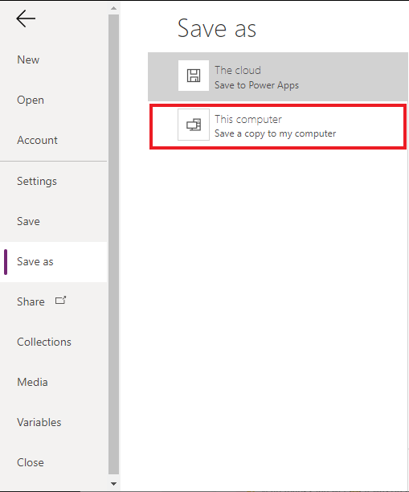
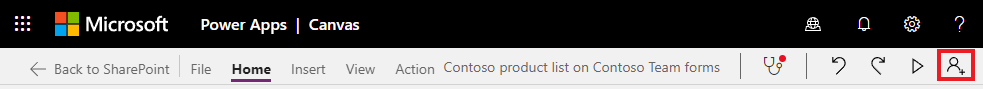
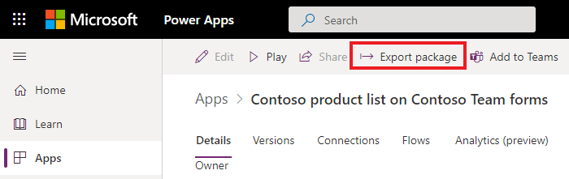
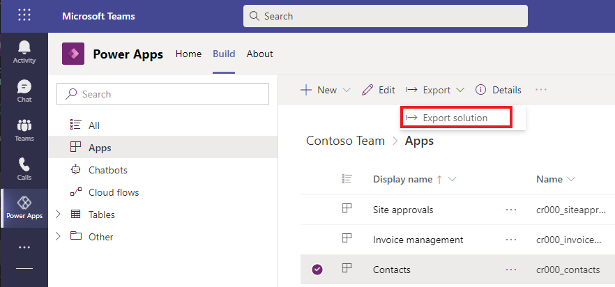

# Create a minimal repro canvas app

A minimal repro app is an app that contains the minimum amount of logic and controls to reproduce a problem. This makes it clear where the core issue lies: with the data source, formulas, or a particular configuration.

After creating a minimal repro app, you can download a copy of it and share it with others, like in the [Power Apps community forum](https://powerusers.microsoft.com/t5/Power-Apps-Community/ct-p/PowerApps1) or with Microsoft support.

## Steps

You can create a minimal repro app with either of these methods.

* Create a blank app and add just the necessary connections and controls to demonstrate the problem.
* Make a copy of the original app and progressively remove irrelevant screens/controls and simplify formulas until the essence of the issue remains.

### Power Apps website

1. Sign in to [Power Apps](https://make.powerapps.com/).
2. Open the app for editing.
3. Go to File > Save as > This computer.

The downloaded msapp file can be opened by others using File > Open.

### Microsoft Lists

1. Open the Microsoft List.
2. Select Integrate > Power Apps > Customize forms. The customized form will open in Power Apps.

3. Select the Share icon button in the menu bar. The details page will open, along with the Sharing panel.

4. Dismiss the Sharing panel.
5. Select **Export package** in the menu bar.

6. Give a name to the package. Review the exported content and select **Export**.

The downloaded zip file can be opened by others.

### Power Apps in Teams

1. In Microsoft Teams, go to the [Power Apps app list for your team](/power-apps/teams/manage-your-apps)
2. Select the desired app
3. Select the **Export solution** button in the menu bar

4. Review the exported content and select **Export as zip**

The (downloaded zip file can be imported)[/power-apps/maker/canvas-apps/export-import-app#importing-a-canvas-app-package] by other users.

### Custom pages

Only custom pages in [unmanaged solutions](/power-platform/alm/solution-concepts-alm#managed-and-unmanaged-solutions#managed-and-unmanaged-solutions) can be exported. If the custom page is in a managed solution, ask the publisher of the solution to create an unmanaged solution that contains the custom page. You can also create a new unmanaged solution and create a new custom page there.

You can [export custom pages in an unmanaged solution](/power-apps/maker/data-platform/export-solutions) just like any other solution component. The downloaded zip file can be imported into any environment by other users.

## Privacy and security

Unauthorized users won't be able to access data sources in exported apps but they can see how the data sources are used in them. They can also see the app's controls and formulas. If an entire solution zip file is provided, assets like images are also visible.

Before distributing your exported app, these steps can help limit privacy and security exposure:

* Do not include private and confidential information in the app. Check names of variables, controls, and other app elements that can inadvertently give away sensitive information.
* Create a new app from scratch instead of simplifying an existing production app. You won't have to worry about removing sensitive information.
* Distribute just the _msapp_ file instead of the zip file. The _msapp_ file can be found inside the zip package.

## Next steps

[Ask a question with the Power Apps community](https://powerusers.microsoft.com/t5/Power-Apps-Community/ct-p/PowerApps1)
[Get Microsoft support](https://powerapps.microsoft.com/support/)

### See also

[Debugging canvas apps with Monitor](/power-apps/maker/monitor-canvasapps)
[Debugging model-driven apps with Monitor](/power-apps/maker/monitor-modelapps)
