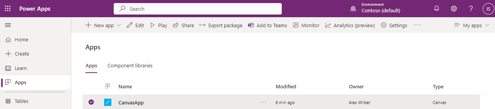
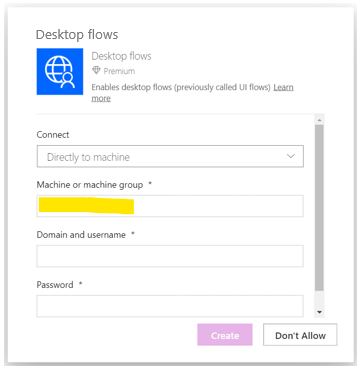
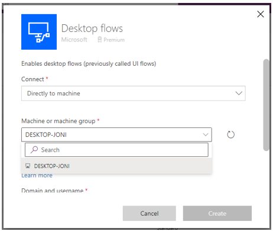
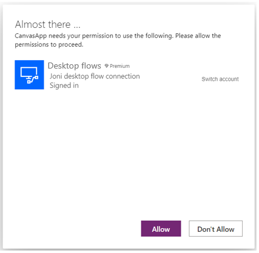

# Can't create desktop flows connection from a shared canvas app

This article provides a **workaround** for the flawed scenario where a **canvas app embedding a desktop flows connection is shared**. In this scenario, if the user to whom the app is shared doesn't already have a desktop flows connection already created, he will be asked to create a new one from an embbeded window in the canvas app which doesn't work properly.

_Applies to:_ &nbsp; Power Automate for desktop, Power Apps canvas
   

## Symptoms

Joni has been shared a Power Apps canvas app from Alex (the app embeds a desktop flows connection). It appears in her apps list : 

>***Side note :** whether the app was shared to Joni as user or co-owner makes no difference in this scenario*

  
When Joni runs the app :
 
- She is asked to provide her own desktop flows connection (as she has none already created in this environment) : 

- To do so, she clicks on sign in to create the new connection, the following form appears :

- On this form :   
   - The `Machine or machine group` field is malfunctioning as it should provide a list of user-available machines / machine groups.
   - Instead, the field behaves as a free text input, it is expecting a `machine group id` (which is not transcribed on the UI)

  
## Resolution

The workaround for this issue is to create a connection from connection page & re-open the app.

**Step-by-step workaround :**
- Close the shared app
- Open page `Connections`
- Click on `New connection`
- Select `Desktop flows`
- Create your connection (the `Machine or machine group` field is functional and provides a list of user-available devices) :
 

- Re-open the shared app, the previously created connection is auto-selected :

- Click on `Allow` : you now have access to the running canvas app
